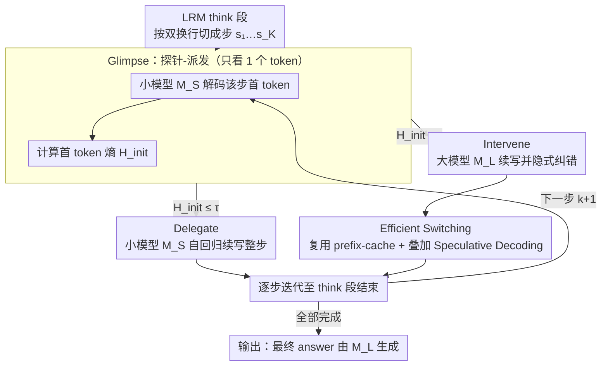

# GlimpRouter: Efficient Collaborative Inference by Glimpsing One Token of Thoughts

**会议**: ACL 2026 Findings  
**arXiv**: [2601.05110](https://arxiv.org/abs/2601.05110)  
**代码**: https://github.com/Zengwh02/GlimpRouter  
**领域**: 模型协同推理 / 大模型加速 / 推理效率  
**关键词**: 协同推理, 推测解码, step-wise routing, 初始 token 熵, Aha Moment

## 一句话总结
本文提出 **GlimpRouter**：在 step 级 LRM 协同推理中，先让小模型只解码每个推理步的"第一个 token"，用它的熵 $\mathbf{H}_{\text{init}}$ 估计该步难度，低则小模型续写、高则切换到大模型；training-free，无需大模型 verifier，在 AIME25 上比独立大模型准确率 +10.7% 同时延迟 −25.9%，且与 token-level Speculative Decoding 正交叠加。

## 研究背景与动机

**领域现状**：DeepSeek-R1、o1/o3 这类 LRM 用长 CoT 显式推理获得强性能，但每条 query 的延迟与算力代价巨大。社区试图用"协同推理"——多模型按难度分工——来缓解：token 级有 Speculative Decoding（小模型 draft、大模型 verify），step 级有 RSD（训练 PRM）、SpecCoT（小模型多候选 + 大模型 select）、SpecReason（小模型生成 + 大模型 judge）。

**现有痛点**：
- *token 级*：粒度太细，频繁切换；
- *step 级*：要么需要训练 reward model（RSD），要么必须先生成整步再判断好坏（SpecReason、SpecCoT），这就把"被拒绝的整步"变成 **sunk cost**——本想省时间结果省不了；
- *averaging 度量失效*：用 $\mathbf{H}_{\text{step}}$ 或 $\mathbf{PPL}_{\text{step}}$ 路由会被一长串确定性句法 token 稀释关键决策 token 的信号，分布单峰且窄。

**核心矛盾**：协同推理的根本难题是 *在生成之前* 就知道该步难不难；但目前所有 step 级方法都得 "Generate-then-Measure"，方法本身的开销抵消了协作的好处。

**本文目标**：找到一个可在 step 开始时就拿到的、计算近乎免费的、且对难度高度敏感的信号，用它做"Probe-then-Dispatch"。

**切入角度**：受 LRM 中"Aha Moment"现象启发——推理步起点常出现 "Wait/But/So" 这类 discourse cue，论文假设 *该步的难度信息集中在第一个 token*。基于 Qwen3-4B/32B、DeepSeek-R1-Distill-Qwen-32B 在 AIME/LiveCodeBench 上 10M+ token 的实证分析，作者发现 $\mathbf{H}_{\text{init}}$ 呈 *双峰 + 重尾* 分布，而 $\mathbf{H}_{\text{step}}$、$\mathbf{PPL}_{\text{step}}$ 都是窄单峰，LLM-as-Judge 离散且饱和，证明 $\mathbf{H}_{\text{init}}$ 才是天然的"high-sensitivity discriminator"。

**核心 idea**：只 glimpse 一个 token 的熵就够了——低熵步交给小模型，高熵步交给大模型；既绕开 sunk cost，也绕开 verifier 训练。

## 方法详解

### 整体框架
把 LRM 的 think 段切成 $\mathcal{T}=\{s_1,\dots,s_K\}$（按双换行切分），最终 answer 由 $M_L$ 生成。在每个 step $k$：(1) 用小模型 $M_S$ 在前文 $\mathbf{c}_k$ 上只解码第一个 token，得到 $\mathbf{H}_{\text{init}}(s_k)=\mathbf{H}(P_\theta(t_1|\mathbf{c}_k))$；(2) 若 $\mathbf{H}_{\text{init}}\leq\tau$ → Delegate，由 $M_S$ 自回归续写直至 step 分隔符；否则 → Intervene，把 $\mathbf{c}_k$ 交 $M_L$ 续写。所有协同动作 train-free，仅引入一个超参 $\tau$。

### 关键设计

**1. Glimpse：用 1 个 token 的代价做 Probe-then-Dispatch**

所有 step 级方法的通病是"Generate-then-Measure"——必须先把整步 draft 出来才能判断好坏，一旦被拒，那一整步的算力就成了 sunk cost，省时间的初衷反被开销吞掉。GlimpRouter 把这一步压缩到极致：在 step $k$ 起点只让小模型 $M_S$ 算一次首 token 分布 $P_\theta(t_1|\mathbf{c}_k)$，取其熵 $\mathbf{H}_{\text{init}}(s_k)=\mathbf{H}(P_\theta(t_1|\mathbf{c}_k))$ 与阈值 $\tau$ 比较即决定路由。即便随后切到 $M_L$、这一个 token 被丢弃，损失也只是单 token 级别，比 SpecReason 丢一整步小 1–2 个数量级。

之所以"只看第一个 token"就够，是因为作者用 BLEU-4 与 SBERT 量化了"小模型续写与大模型续写的对齐度"，发现它与 $\mathbf{H}_{\text{init}}$ *严格单调负相关*：低熵区两者输出几乎一致（小模型完全够用），高熵区急剧发散（必须换大模型）。这条单调曲线让 $\mathbf{H}_{\text{init}}$ 成为一个在生成前就能拿到的、可靠的难度代理。

**2. Intervene：高熵步交给大模型，顺带隐式纠错**

当 $\mathbf{H}_{\text{init}}>\tau$ 时，整段历史 $\mathbf{c}_k$ 被交给大模型自回归续写——而 LRM 本身具备 self-correction 能力，它在生成新 step 时会隐式 re-evaluate 前文、重写错误前提，而不只是机械地"接着写"。Appendix F.2 的 grid-path 例子很直观：小模型一路把"四次方向变化"误当成"四段直线"，大模型在 Step 4 被触发 intervene 后改写为"5 段直线"，把整条推理拉回正轨。

正是这种 implicit self-correction，解释了一个反直觉的结果——协同推理竟能超过独立大模型（AIME25 上 51.67% vs 46.67%）。高熵 step 恰好是历史逻辑出现漂移的"浮标"，大模型介入的时机正好赶上去把前文的错捡回来。

**3. Efficient Switching：与 Speculative Decoding 正交叠加**

step 级路由和 token 级 SD 的瓶颈本不相同——前者减少的是*调用大模型的次数*，后者降低的是*大模型每次调用的 per-token 成本*——因此二者可以复合而非互斥。切换模型时，GlimpRouter 复用 vLLM/SGLang 的 prefix-cache，把上下文重算变成可并行的 prefill 阶段，切换延迟≈几个 token 的解码；当大模型被调度时，再把小模型当作 SD 的 drafter（draft length $n=3$）并行猜测后续 token，由大模型一次性 verify。这套"Global Planner（GlimpRouter）+ Local Executor（SD）"的复合方案把 AIME25 延迟压到 130s，低于独立 LLM+SD 的 149s 和 SpecReason+SD 的 140s，是所有配置中最快的。

### 损失函数 / 训练策略
完全 training-free，无监督、无微调，仅有 1 个超参 $\tau$（推荐对应 intervention rate 20–30%）。所有推理在 vLLM、A100-80G 上做，max thinking budget 8192 tokens，temperature 0.6，top-p 0.95，结果 4-run 平均。

## 实验关键数据

### 主实验（SLM = Qwen3-4B，5 个基准）

| LLM | Method | AIME24 Acc/Lat | AIME25 Acc/Lat | GPQA Acc/Lat | LCBv5 Acc/Lat | LCBv6 Acc/Lat |
|-----|--------|----------------|----------------|--------------|---------------|---------------|
| DeepSeek-32B | LLM only | 57.50/197 | 46.67/220 | 61.62/176 | 52.40/219 | 46.86/214 |
| DeepSeek-32B | SpecReason | 57.50/158 | 49.17/169 | 63.76/213 | 53.59/185 | 47.57/189 |
| DeepSeek-32B | **GlimpRouter** | **60.83/143** | **51.67/163** | **64.02/129** | **54.64/160** | **48.29/160** |
| Qwen3-32B | LLM only | 60.00/220 | 48.33/231 | 61.87/194 | 52.69/249 | 47.43/241 |
| Qwen3-32B | **GlimpRouter** | **60.83/145** | **51.67/147** | **63.01/142** | **52.69/162** | **47.14/165** |

相对独立大模型，GlimpRouter 在所有数据集上延迟降低 25.2–27.4%；AIME25 上 **准确率 +10.7%、延迟 −25.9%**。GPQA 上 SpecReason 的延迟 213s 反而超过独立大模型 176s，验证 sunk cost 假说。

### 消融实验

| 实验 | 关键结果 | 说明 |
|------|----------|------|
| 度量选择（AIME25） | $\mathbf{H}_{\text{init}}$ 51.67/163 vs $\mathbf{H}_{\text{step}}$ 46.67/178 vs $\mathbf{PPL}_{\text{step}}$ 47.50/181 | "信号稀释"假说成立 |
| 异构模型对（SLM=DeepSeek-1.5B + LLM=DeepSeek-32B） | AIME25 39.17/166，仍优于 SpecReason 31.67/171 | "1-token 探针"性质独立于模型家族 |
| 阈值扫描（AIME25） | $\tau=1.8$→2% intervention，acc 45.83；$\tau=0.01$→83% intervention，acc 55.83 | $\tau$ 单调把 acc/lat 调到任意点 |
| 与 Speculative Decoding 叠加（AIME25） | GlimpRouter+SD=51.67/130，SpecReason+SD=49.17/140，LLM+SD=45.83/149 | 复合最低延迟 |

### 关键发现
- **第一 token 熵分布是 *双峰 + 重尾***：低熵峰对应 routine derivation（高 BLEU-4/SBERT 与大模型对齐），高熵尾对应 cognitive pivot（小模型与大模型输出剧烈分歧）；这是 step-level routing 想要的理想信号。
- **协同 *优于* 独立大模型**：AIME25 51.67% 协同 vs 46.67% 单大模型，作者用 LRM self-correction 解释——高熵 step 正是历史漂移的"红灯"，大模型在介入时顺便修正前文。
- **Sunk cost 是 step-level baselines 的真正瓶颈**：SpecReason 的 latency 随 intervention rate 超线性增长，GlimpRouter 是线性温和增长；同 acc 配置下 GlimpRouter 一致更快，等 acc=51.67 时 GlimpRouter 163s 而 SpecReason 249s（差 40%+）。
- **架构正交**：GlimpRouter 与 token-level SD 正交叠加，准确率不掉、延迟再降；对应"global planner（GlimpRouter）+ local executor（SD）"的设计哲学。
- **scalability**：从 SLM=Qwen3-4B 到 SLM=DeepSeek-1.5B、从 LLM=Qwen3-32B 到 DeepSeek-32B 都稳定收益，说明 $\mathbf{H}_{\text{init}}$ 是 LRM 的"内在性质"，不依赖特定模型族。

## 亮点与洞察
- **"1-token glimpse"是极简而锋利的设计**：把"决策成本"压缩到 1 个 token 的开销，是协同推理走向产品化的关键；与 SpecReason 这种 "draft-full-step then verify" 的对比让 sunk cost 第一次被量化分离出来。
- **"Aha Moment" 的工程化落地**：把 cognitive science 里的"决策起点信号集中"假设变成可测的 entropy 阈值机制，这种从认知现象→可执行 router 的转化思路对其他 LLM 自适应推理（early exit、speculative thinking、 budget allocation）都有借鉴。
- **协同推理可以超越大模型独立性能**：揭示 self-correction 与协同 routing 的耦合——并不是"小模型替代部分计算"那么简单，而是"切换瞬间提供 re-evaluate 机会"，这给 ensemble 推理打开新视角。
- **天然正交性**：作者明确指出 step-level routing 与 token-level SD 的瓶颈不同，可以复合而不冲突；这种 *分层加速* 思路在系统设计上比单一维度的"再快一点"更有结构化价值。

## 局限与展望
- **静态全局阈值 $\tau$**：跨任务、跨 query 一刀切；作者承认 adaptive/instance-aware threshold 是明显的下一步。
- **依赖结构化分隔符**：step 切分基于 double newline，对没有结构化 CoT 输出的模型不适用；语义分割（如基于句法或语义聚类）是开放问题。
- **路由错判风险**：对于 *中等难度* step，$\mathbf{H}_{\text{init}}$ 可能在阈值边缘抖动，导致频繁切换；论文未量化此类边界情况的成本。
- **未覆盖多 SLM/多 LLM 协同**：本文是 SLM-LLM 二元路由，可能拓展到 routing tree（3+ 模型）能进一步压缩成本，但未实验。
- **缺乏对解释性 trace 的研究**：附录 F 给了 2 个 case，但未做大规模分析"intervene 之后大模型究竟修正了什么类型的错"，self-correction 行为还需更系统的实证。

## 相关工作与启发
- **vs Speculative Decoding (Leviathan et al. 2023)**：token 级，验证粒度细但频繁，且无 step-level 语义；GlimpRouter step 级，与之正交，可叠加。
- **vs SpecCoT (Shi et al. 2025)**：小模型并行生成多候选 + 大模型 select，候选生成本身是巨大开销；GlimpRouter 只 1 token 探针。
- **vs SpecReason (Pan et al. 2025)**：小模型生成 + 大模型 verify，被拒后大模型 fallback 重生成 → 经典 sunk cost；GlimpRouter 预先决定避免该问题。
- **vs RSD (Liao et al. 2025)**：训练 PRM 给 step 打分；GlimpRouter training-free，且不需要 reward 标注。
- **vs entropy-based routing (Cui 2025, Zhang 2025)**：他们用 step-wise 平均熵或 PPL，被信号稀释；本文证明只看第一 token 熵更锋利。

## 评分
- 新颖性: ⭐⭐⭐⭐⭐ "把 step-level routing 信号压缩到 1 token"是极其优雅的设计；从分布分析到 self-correction 解读非常完整。
- 实验充分度: ⭐⭐⭐⭐⭐ 5 基准 × 多模型对 × 多阈值 × 与 SD 正交 × 跨度量消融 × case study，覆盖系统、效率、可解释多维度。
- 写作质量: ⭐⭐⭐⭐⭐ Probe-then-Dispatch、Glimpse of Thought、Aha Moment 等命名记忆点强；图 1 的分布对比、图 4 的 Pareto 曲线一目了然。
- 价值: ⭐⭐⭐⭐⭐ 给"如何在不训练新模型的前提下加速 LRM 推理"提供了显著超越 SpecReason/RSD 的实用方案，社区可立即复用。

<!-- RELATED:START -->

## 相关论文

- [\[ICML 2026\] Token Sparse Attention: Efficient Long-Context Inference with Interleaved Token Selection](../../ICML2026/model_compression/token_sparse_attention_efficient_long-context_inference_with_interleaved_token_s.md)
- [\[ACL 2026\] Adaptive Layer Selection for Layer-Wise Token Pruning in LLM Inference](adaptive_layer_selection_for_layer-wise_token_pruning_in_llm_inference.md)
- [\[ICML 2025\] OrthoRank: Token Selection via Sink Token Orthogonality for Efficient LLM Inference](../../ICML2025/model_compression/orthorank_token_selection_via_sink_token_orthogonality_for_efficient_llm_inferen.md)
- [\[ACL 2026\] Calibrated Speculative Decoding: Frequency-Guided Candidate Selection for Efficient Inference](calibrated_speculative_decoding_frequency-guided_candidate_selection_for_efficie.md)
- [\[AAAI 2026\] InfoCom: Kilobyte-Scale Communication-Efficient Collaborative Perception with Information-Aware Feature Compression](../../AAAI2026/model_compression/infocom_kilobyte-scale_communication-efficient_collaborative_perception_with_inf.md)

<!-- RELATED:END -->
