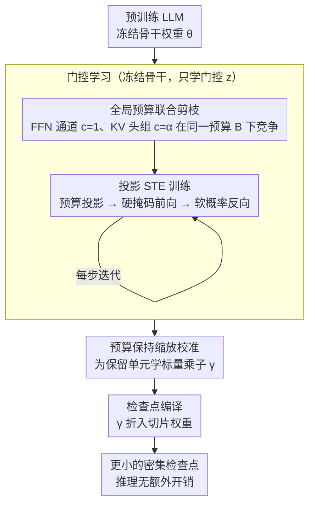

# GRASPrune: Global Gating for Budgeted Structured Pruning of Large Language Models

**会议**: ACL 2026  
**arXiv**: [2604.19398](https://arxiv.org/abs/2604.19398)  
**代码**: [GitHub](https://github.com/ZiY-Wang/GRASPrune)  
**领域**: 机器人  
**关键词**: 结构化剪枝, 全局预算, 门控学习, KV头剪枝, 投影STE

## 一句话总结
GRASPrune 提出了一种全局预算约束的结构化剪枝框架，通过投影直通估计器（Projected STE）在每步训练中强制满足硬掩码预算约束，联合剪枝 FFN 通道和 KV 头组，在 LLaMA-2-7B 上以 50% 参数保留达到 12.18 PPL，仅需单卡 A100 训练 6 分钟。

## 研究背景与动机

**领域现状**：LLM 的推理成本高昂——模型参数量、注意力计算和 KV 缓存都带来大量内存和延迟开销。结构化剪枝通过移除通道或头组产生更小的密集检查点，可直接用标准推理栈部署。

**现有痛点**：(1) FFN 通道和 KV 头组通常用不同标准分别剪枝，但它们共享同一部署预算和表示容量；(2) 许多方法预定义逐层保留率或深度依赖调度，硬编码了预算分配方式而非学习全局最优分配；(3) 现有管线先估计重要性分数再施加预算，训练时无约束、选择时才约束——分数学习与最终掩码脱节。

**核心矛盾**：不是缺少更好的显著性指标，而是分数学习方式与最终掩码选择方式之间存在错配——无约束学习的分数在有约束选择时可能产生次优分配。

**本文目标**：在优化循环内部强制预算可行性，使门控分数在与最终部署掩码相同的约束下学习。

**切入角度**：将结构化剪枝形式化为单一全局预算约束下的联合优化问题，FFN 通道和 KV 头组用不同单位成本在同一预算下竞争。

**核心 idea**：投影 STE 在每步训练中执行预算投影→硬掩码前向→软分数反向，配合后处理缩放校准，生成无额外推理开销的更小密集检查点。

## 方法详解

### 整体框架
三阶段：(1) 门控学习——冻结骨干权重，用投影 STE 优化标量门控分数，每步执行预算可行的硬掩码投影；(2) 缩放校准——冻结掩码，为保留单元学习标量乘子以缓解剪枝引起的尺度偏移；(3) 检查点编译——将缩放因子折入切片权重，输出更小的密集检查点。其中前两个关键设计都发生在门控学习阶段（预算建模 + 投影 STE 训练），第三个对应缩放校准，检查点编译则只是把结果导出的收尾步骤。

### 关键设计

**1. 全局预算联合剪枝：让 FFN 通道和 KV 头组在同一预算下竞争**

以往 FFN 通道和 KV 头组通常用各自的显著性标准分别剪枝，可它们本就共享同一份部署预算和表示容量，分开剪就没法在全局层面把容量分到最该留的地方。GRASPrune 把两类结构放进同一个预算约束里互相竞争：每个可剪枝单元 $i \in \mathcal{S}$ 有二元保留变量 $z_i$ 和单位成本 $c_i$——FFN 通道 $c_i=1$，KV 头组 $c_i=\alpha$（其中 $\alpha = \frac{(2G+2)d_h}{3}$ 是参数量近似比率），全局预算 $B = \rho \sum c_i$。优化目标为

$$\min_{\mathbf{z}} \mathcal{L}(\theta; \mathbf{z})\quad \text{s.t.}\quad \sum_i c_i z_i \leq B,$$

其中骨干权重 $\theta$ 固定、只学门控 $\mathbf{z}$。这样系统就能自动判断该在 FFN 还是 KV 上多保留容量，而不是由人预先写死逐层保留率。

**2. 投影直通估计器（Projected STE）：每一步训练都满足预算的可微优化**

掩码选择本质是离散的、不可导，而"先学分数再选掩码"的管线让分数在*无约束*下学习、约束只在选择时才施加，导致学到的分数与最终掩码脱节。Projected STE 把约束搬进每一步训练：先把连续门控概率 $\mathbf{p}$ 投影成预算可行的硬掩码 $\mathbf{m} = \text{Project}(\mathbf{p}, \mathbf{c}, B)$——按 $p_i$ 降序贪心选取直到预算耗尽；前向用硬掩码 $m_i$，反向走软概率的直通梯度

$$\tilde{z}_i = m_i + \big(p_i - \text{stopgrad}(p_i)\big).$$

一个关键细节是排序按 $p_i$ 而非 $p_i/c_i$：按成本归一化会把分配偏向便宜单元。看似违反直觉，但因为分数本就是在约束下学出来的，模型已经把成本差异内化进了 $p_i$，再除一次 $c_i$ 反而重复惩罚。

**3. 预算保持缩放校准：补回剪枝带来的尺度偏移**

注意力头被剪掉后输出尺度会发生偏移，直接部署会掉点，而完整微调又太贵。GRASPrune 在冻结硬掩码 $\mathbf{m}$ 后，只为每个保留单元引入一个标量乘子 $\gamma_i$，在同一校准集、冻结骨干权重的条件下优化——训练参数量仅 $O(|\mathcal{I}|)$、FLOP 不变。校准完成后把 $\gamma$ 折进切片权重，输出的是一个更小的密集检查点，推理时没有任何额外开销。

### 损失函数 / 训练策略
语言建模损失在校准集上优化门控分数。512 条无标签序列、4 个 epoch、单卡 A100 约 6 分钟。无需完整模型微调。

## 实验关键数据

### 主实验

| 参数比例 | 方法 | Wiki PPL↓ | 零样本平均Acc |
|---------|------|----------|-------------|
| 50% | LLM-Pruner | ~18 | 0.61 |
| 50% | SliceGPT | ~15 | - |
| 50% | **GRASPrune** | **12.18** | **竞争力强** |
| 40% | **GRASPrune** | **16.65** | - |

### 消融实验

| 配置 | 说明 |
|------|------|
| 按 $p_i/c_i$ 排序 | 分配偏向便宜单元，性能下降 |
| 无缩放校准 | PPL 上升 |
| 扰动 $\alpha$ | 对 $\alpha$ 适度不敏感 |
| 投影开销 | 排序时间仅占总训练时间 0.11% |

### 关键发现
- 50% 参数保留下 PPL 12.18 优于所有对比方法
- 按 $p_i$ 排序（而非 $p_i/c_i$）的效果更好——违反直觉但因分数在约束下学习所以合理
- 训练极高效——6 分钟单卡完成门控学习+校准
- KV 缓存削减带来实际推理加速

## 亮点与洞察
- **"在约束下学习"vs"学完再约束"**的洞察非常深刻——这是结构化剪枝中一个被广泛忽视的问题
- 联合 FFN+KV 剪枝用统一成本模型 $\alpha$ 优雅地处理了异构结构的公平竞争
- 极低的训练成本（6 分钟单卡）使方法具有很强的实用性

## 局限与展望
- 成本模型基于参数量近似，未直接优化延迟或吞吐量
- 仅在 LLaMA-2 系列评估，更新模型（LLaMA-3+）的适用性需验证
- 无后续微调阶段——对于极高压缩率（<30%）可能需要配合微调

## 相关工作与启发
- **vs LLM-Pruner**: LLM-Pruner 用 Taylor 分数+逐层调度，GRASPrune 用全局预算+投影 STE
- **vs ZipLM**: ZipLM 也做全局排序但忽略成本差异，GRASPrune 显式建模异构成本
- **vs DISP-LLM**: DISP-LLM 做维度独立的架构搜索，GRASPrune 更简洁且训练效率更高

## 评分
- 新颖性: ⭐⭐⭐⭐ 投影STE+预算内训练的思路新颖
- 实验充分度: ⭐⭐⭐⭐ 多压缩率+详细消融+效率分析
- 写作质量: ⭐⭐⭐⭐⭐ 问题分析精辟，方法推导严密
- 价值: ⭐⭐⭐⭐ 高效实用的LLM结构化剪枝方案

<!-- RELATED:START -->

## 相关论文

- [\[ICML 2025\] SlimLLM: Accurate Structured Pruning for Large Language Models](../../ICML2025/model_compression/slimllm_accurate_structured_pruning_for_large_language_models.md)
- [\[ICML 2025\] Olica: Efficient Structured Pruning of Large Language Models without Retraining](../../ICML2025/model_compression/olica_efficient_structured_pruning_of_large_language_models_without_retraining.md)
- [\[ACL 2026\] Two-Stage Regularization-Based Structured Pruning for LLMs](two-stage_regularization-based_structured_pruning_for_llms.md)
- [\[ACL 2026\] LightReasoner: Can Small Language Models Teach Large Language Models Reasoning?](lightreasoner_can_small_language_models_teach_large_language_models_reasoning.md)
- [\[ICML 2025\] Instruction-Following Pruning for Large Language Models](../../ICML2025/model_compression/instruction-following_pruning_for_large_language_models.md)

<!-- RELATED:END -->
