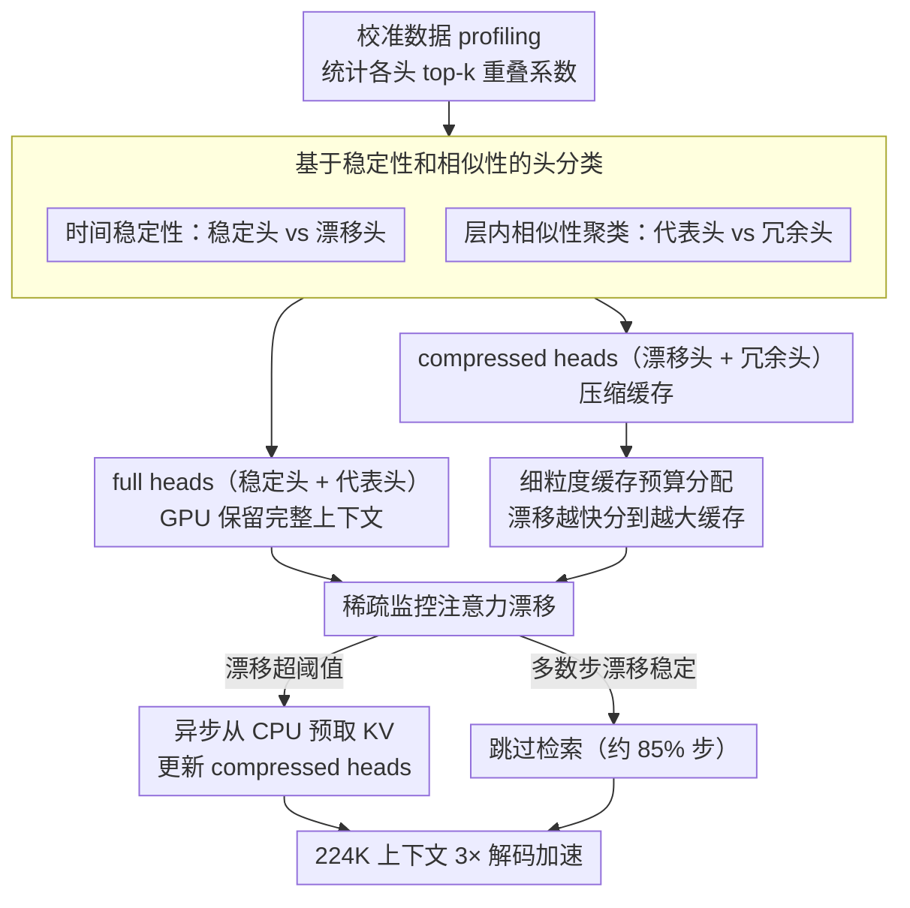

# HeteroCache: A Dynamic Retrieval Approach to Heterogeneous KV Cache Compression for Long-Context LLM Inference

**会议**: ACL 2026  
**arXiv**: [2601.13684](https://arxiv.org/abs/2601.13684)  
**代码**: [GitHub](https://github.com/ponytaill/HeteroCache)  
**领域**: 模型压缩  
**关键词**: KV缓存压缩, 注意力头异质性, 动态检索, 层内冗余, 异步预取

## 一句话总结

本文提出 HeteroCache，一种免训练的动态 KV 缓存压缩框架，基于注意力头的时间异质性（稳定头 vs 漂移头）和层内冗余性（相似头聚类），实施细粒度的角色分配策略——为漂移头分配更大缓存预算，用代表头稀疏监控注意力漂移触发异步按需检索，在 224K 上下文下实现 3 倍解码加速。

## 研究背景与动机

**领域现状**：Transformer 推理时 KV 缓存线性增长是长上下文的主要瓶颈。静态压缩方法（SnapKV、H2O）基于历史注意力分数永久淘汰不重要 token，但可能丢失后续关键信息。动态方法（ShadowKV、OmniKV）通过卸载到 CPU 并按需检索来保留完整上下文。

**现有痛点**：(1) 静态压缩的不可逆淘汰策略存在根本风险——因注意力漂移，早期不重要的信息后来可能变关键；(2) ShadowKV/OmniKV 使用粗粒度检索策略，忽略了层/头之间的异质性；(3) 每步都检索会引入不必要的 I/O 开销和潜在的精度下降。

**核心矛盾**：动态检索能避免信息丢失但 I/O 开销大，静态淘汰效率高但有信息损失风险——如何利用注意力头的内在特性来智能决定"何时检索"和"为谁检索"？

**本文目标**：设计一种利用注意力头异质性的细粒度动态压缩框架，最小化 I/O 开销同时保持高保真度。

**切入角度**：通过分析注意力头的两个维度——时间异质性（注意力模式随解码步变化的速度）和层内冗余性（同层内头之间的注意力模式相似度），将头分为不同角色并差异化管理。

**核心 idea**：将注意力头分为稳定头（保持一致关注）和漂移头（快速变化），以及代表头（独特模式）和冗余头（可由代表头近似）。用代表头监控注意力漂移，仅在检测到显著漂移时触发异步检索更新压缩头。

## 方法详解

### 整体框架

HeteroCache 分三步：(1) **头分类**——基于稳定性和相似性将头分为 full heads（保留完整上下文）和 compressed heads（压缩缓存）；(2) **细粒度缓存分配**——为 compressed heads 中的漂移头分配更大预算；(3) **稀疏监控+异步检索**——full heads 持续监控注意力漂移，显著漂移时异步从 CPU 预取数据更新 compressed heads。

### 关键设计

**1. 基于稳定性和相似性的头分类：先给每个注意力头定角色**

动态检索方法（ShadowKV、OmniKV）对所有头一视同仁地粗粒度检索，浪费了"不同头行为差异极大"这一结构性先验。HeteroCache 先用重叠系数（overlap coefficient，两组 top-k 重要 token 集的交集占比）从两个维度给头画像：时间稳定性 $S^{(h)}_{stable}$ 取解码阶段与预填充阶段 top-k 重叠的中位数，衡量一个头的注意力随解码步漂移得快不快；层内相似性则用同层头之间的重叠系数做聚类，找出哪些头能被代表头近似。据此把头分成两类——稳定头与代表头合为 full heads（在 GPU 上保留完整上下文），漂移头与冗余头合为 compressed heads（压缩缓存）。这样稳定头用最少资源即可，代表头还能替冗余头充当漂移的"哨兵"。

**2. 细粒度缓存预算分配：按漂移速度分预算，而非一刀切**

给所有 compressed heads 配同样大小的缓存必然两头不讨好——稳定头吃不完、漂移头又不够用。HeteroCache 让预算跟着漂移速度走：稳定性越低（漂移越快）的头分到越大的 token 缓存，确保注意力快速变化的头有足够容量装下动态信息，把有限的显存花在真正需要它的头上。

**3. 稀疏监控 + 异步按需检索：只在该检索时才检索**

每一步都从 CPU 检索完整 KV 会带来大量不必要的 I/O，但完全不检索又有静态淘汰的信息丢失风险。HeteroCache 让留在 GPU 上的 full heads 持续监控注意力漂移，只有当偏移超过阈值时，才异步从 CPU 预取完整 KV 来更新 compressed heads，且检索与计算重叠执行以隐藏 I/O 延迟。因为绝大多数解码步注意力其实很稳定，这一机制把检索频率压到约 15%——相比每步检索仅掉 0.3% 准确率，却省下大部分 I/O 开销，最终在 224K 上下文下拿到 3 倍解码加速。

### 损失函数 / 训练策略

完全免训练方法。使用小规模校准数据集进行一次性的头分类分析（profiling），之后直接应用于推理。

## 实验关键数据

### 主实验

**长上下文基准（Llama-3.1-8B-Instruct，224K 上下文）**

| 方法 | LongBench | LongBench v2 | InfiniteBench | 解码加速 |
|------|-----------|-------------|--------------|---------|
| 全量 KV | 基线 | 基线 | 基线 | 1× |
| SnapKV | -3.2% | -5.1% | -4.8% | 1.5× |
| ShadowKV | -1.8% | -2.3% | -2.5% | 2.0× |
| **HeteroCache** | **-0.5%** | **-0.8%** | **-1.0%** | **3.0×** |

### 消融实验

| 配置 | 准确率保持 | 检索频率 |
|------|----------|---------|
| 每步检索 | 99.5% | 100% |
| 固定间隔检索 | 98.2% | 50% |
| **漂移触发检索** | **99.2%** | **~15%** |

### 关键发现

- 稀疏监控将检索频率降至 ~15%，仅损失 0.3% 准确率——绝大多数解码步骤注意力模式稳定，无需检索
- 在 DeepSeek-R1-Distill-Llama-8B 推理模型上同样有效——CoT 推理场景的注意力漂移模式与普通推理一致
- 层内冗余率高达 50-60%——同层头之间存在大量信息重复，聚类压缩高效
- 与量化方法正交，可进一步组合降低内存

## 亮点与洞察

- 从"何时检索"的角度优化动态缓存是一个被忽视但关键的问题——大多数工作关注"保留什么"
- 稳定性/相似性的双维度头分类比单一维度更精确
- 异步预取的工程设计巧妙地隐藏了 I/O 延迟

## 局限与展望

- 头分类的 profiling 阶段需要少量校准数据，不完全零开销
- 漂移检测阈值是预设的，缺乏自适应调节
- 主要在 Transformer 标准架构上验证，对 MoE 等架构的适用性未知
- CPU-GPU 异步传输在某些硬件配置下可能受总线带宽限制

## 相关工作与启发

- **vs SnapKV/H2O**: 静态压缩永久淘汰 token；HeteroCache 动态检索避免信息丢失
- **vs ShadowKV**: 粗粒度每步检索+统一策略；HeteroCache 细粒度头级管理+稀疏监控
- **vs HERMES**: HERMES 针对视频流式场景；HeteroCache 针对文本长上下文推理

## 评分

- 新颖性: ⭐⭐⭐⭐ 头异质性分析和稀疏监控触发检索的设计新颖
- 实验充分度: ⭐⭐⭐⭐ 多模型多基准+推理模型验证+效率分析
- 写作质量: ⭐⭐⭐⭐ 观察-方法-实验的逻辑链清晰
- 价值: ⭐⭐⭐⭐ 3 倍加速对长上下文推理部署有直接价值

<!-- RELATED:START -->

## 相关论文

- [\[ACL 2026\] DASH-KV: Accelerating Long-Context LLM Inference via Asymmetric KV Cache Hashing](dash-kv_accelerating_long-context_llm_inference_via_asymmetric_kv_cache_hashing.md)
- [\[ICML 2025\] RocketKV: Accelerating Long-Context LLM Inference via Two-Stage KV Cache Compression](../../ICML2025/model_compression/rocketkv_accelerating_long-context_llm_inference_via_two-stage_kv_cache_compress.md)
- [\[ACL 2026\] FastKV: Decoupling of Context Reduction and KV Cache Compression for Prefill-Decoding Acceleration](fastkv_decoupling_of_context_reduction_and_kv_cache_compression_for_prefill-deco.md)
- [\[NeurIPS 2025\] ChunkKV: Semantic-Preserving KV Cache Compression for Efficient Long-Context LLM Inference](../../NeurIPS2025/model_compression/chunkkv_semanticpreserving_kv_cache_compression_for_efficien.md)
- [\[NeurIPS 2025\] Homogeneous Keys, Heterogeneous Values: Exploiting Local KV Cache Asymmetry for Long-Context LLMs](../../NeurIPS2025/model_compression/homogeneous_keys_heterogeneous_values_exploiting_local_kv_cache_asymmetry_for_lo.md)

<!-- RELATED:END -->
