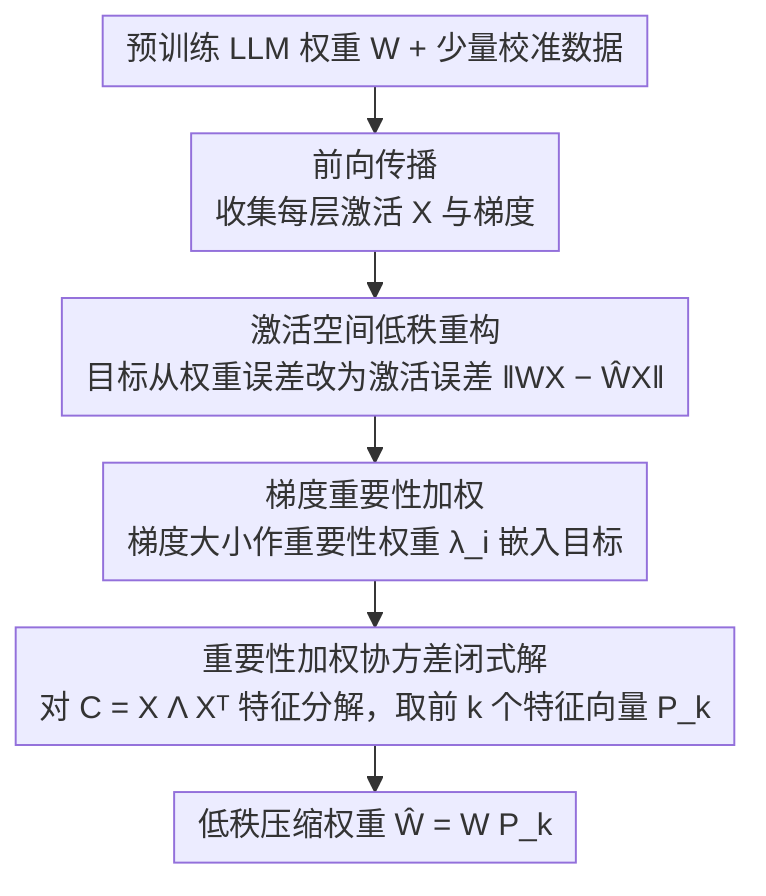

# IMPACT: Importance-Aware Activation Space Reconstruction

**会议**: ACL 2026  
**arXiv**: [2507.03828](https://arxiv.org/abs/2507.03828)  
**代码**: 无  
**领域**: 模型压缩  
**关键词**: 低秩压缩, 激活空间重构, 重要性感知, 梯度加权, 大语言模型

## 一句话总结

提出 IMPACT 框架，将 LLM 低秩压缩从最小化权重重构误差转向最小化重要性加权的激活重构误差，通过将梯度信息融入激活协方差矩阵推导出闭式最优解，实现在保持精度的同时最高减少 55.4% 的模型体积。

## 研究背景与动机

**领域现状**：大语言模型（LLM）在各种任务上表现优异，但由于参数规模庞大，在资源受限环境中部署十分困难。低秩压缩是一种常见的模型压缩手段，通过将权重矩阵分解为低秩近似来减少参数量和计算量。

**现有痛点**：传统低秩压缩方法（如基于 SVD 的权重分解）假设权重矩阵本身具有低秩结构，但实际上 LLM 的权重矩阵往往并不满足这一假设，导致压缩效果不理想。一些方法转向最小化激活重构误差（因为 LLM 的激活空间确实表现出更显著的低秩结构），但它们对所有激活维度一视同仁，忽略了不同维度对模型性能的贡献差异。

**核心矛盾**：仅从"重构误差最小化"角度优化压缩不够——压缩的最终目标是保持模型输出质量，而非重构误差本身。不同激活维度对最终预测的重要性天差地别，均匀对待会导致精度损失。

**本文目标**：设计一种压缩框架，将压缩优化与模型性能直接关联——让压缩后的模型重点保留对输出最重要的激活维度，而非追求全局重构误差最小。

**切入角度**：作者观察到 LLM 的激活空间比权重空间具有更明显的低秩结构，同时通过梯度信号可以度量每个激活维度对模型损失的敏感度。将两者结合，可以构建一种"面向精度保持"的压缩优化问题。

**核心 idea**：将梯度信息作为重要性权重嵌入激活协方差矩阵，推导出重要性加权的闭式最优压缩基，从而实现显式面向精度保持的低秩压缩。

## 方法详解

### 整体框架

IMPACT 想解决的是：低秩压缩到底该最小化什么。它的输入是预训练 LLM 的权重矩阵加上少量校准数据，输出是低秩压缩后的权重，整条流程只跑一遍——先用校准数据前向传播，顺手收集每层的激活和梯度；再把梯度当作重要性信号，揉进激活的协方差矩阵；最后对这个加权协方差做一次特征值分解，前 $k$ 个特征向量就是要保留的压缩基。整套方法没有迭代，压缩单层只需数秒，因为答案是闭式的。

### 关键设计

**1. 激活空间低秩重构：把优化目标从权重误差换成激活误差**

传统 SVD 方法直接对权重矩阵 $W$ 做分解 $W \approx UV$，背后默认 $W$ 本身就低秩——但 LLM 的权重往往并不满足这个假设，硬压就会伤精度。IMPACT 转而最小化激活输出误差 $\|WX - \hat{W}X\|$，其中 $X$ 是校准数据喂进来的真实激活输入。这一改让压缩基变成数据驱动的：它不再去逼近一个并不低秩的权重矩阵，而是去拟合模型在实际输入下真正用到的那部分子空间。之所以有效，是因为 LLM 的激活空间比权重空间表现出明显更清晰的低秩结构，盯着激活优化才算用对了这个先验。

**2. 梯度重要性加权：让秩预算优先花在对输出影响大的维度上**

光最小化激活重构误差还有个隐患——它对每个激活维度一视同仁，可能把宝贵的秩预算浪费在那些重构得再准也无关紧要的维度上。IMPACT 用校准数据算出每个激活维度的梯度大小作为重要性指标 $\lambda_i$，把目标从 $\|WX - \hat{W}X\|^2$ 改写成加权形式 $\sum_i \lambda_i \|w_i x - \hat{w}_i x\|^2$。梯度直接反映了一个维度对损失函数的敏感度，所以对输出影响越大的维度，在压缩时被保留得越完整。消融里去掉这一项，方法就退回到普通激活重构的水平，可见它才是精度保持的主要来源。

**3. 重要性加权协方差的闭式最优解：一次特征分解拿到全局最优基**

把上面的加权目标整理一下，它恰好等价于对一个重要性加权激活协方差矩阵 $C = X \Lambda X^T$（$\Lambda$ 是把各维度 $\lambda_i$ 放在对角线上的权重矩阵）求主子空间。于是只需对 $C$ 做特征值分解，取前 $k$ 个特征向量构成投影矩阵 $P_k$，压缩后的权重就是 $\hat{W} = WP_k$。这个解是全局最优的，不需要任何迭代，既省掉了迭代优化的开销，又在数学上保证了最优性——这也是 IMPACT 既高效又理论可靠的根本原因。

## 实验关键数据

### 主实验

| 模型 | 压缩率 | IMPACT 困惑度 | 基线 SOTA 困惑度 | 体积缩减优势 |
|------|--------|--------------|-----------------|-------------|
| LLaMA-2-7B | 20% | 与基线持平 | ASVD/SliceGPT | 更高压缩率下保持精度 |
| LLaMA-2-13B | 25% | 优于基线 | 权重SVD方法 | 55.4% 更大体积缩减 |
| OPT-6.7B | 20% | 优于基线 | 激活感知方法 | 显著降低困惑度 |
| LLaMA-3-8B | 30% | 与基线可比 | ASVD | 更激进压缩下保持性能 |

### 消融实验

| 配置 | 效果变化 | 说明 |
|------|---------|------|
| Full IMPACT | 最优 | 重要性加权 + 激活重构完整方案 |
| w/o 梯度加权（均匀权重） | 困惑度上升 | 证明重要性加权的关键贡献 |
| 权重空间重构（传统SVD） | 显著退化 | 证明激活空间优于权重空间 |
| 不同校准集大小 | 256样本即稳定 | 方法对校准数据量不敏感 |

### 关键发现

- 梯度重要性加权是性能提升的最大贡献者——去掉它后，方法退化到与普通激活重构相当的水平
- IMPACT 在高压缩率下优势更明显：压缩率越高（保留秩越低），重要性加权带来的精度保持效果越显著
- 方法对不同模型系列（LLaMA、OPT等）和不同模型规模都有效，泛化性好
- 闭式解使得压缩效率远高于需要迭代优化的方法，单层压缩仅需数秒

## 亮点与洞察

- **将压缩与性能解耦后再关联**的思路非常巧妙：不是直接最小化某个代理损失，而是通过梯度信号将压缩目标与最终任务性能关联，同时保持了闭式解的优雅
- **激活空间 vs 权重空间**的洞察具有普适性：LLM 的激活比权重更低秩的发现可以指导其他压缩/量化工作的设计
- **重要性加权协方差矩阵**的设计可以迁移到其他需要低秩近似的场景，如 LoRA 微调时选择重要子空间、知识蒸馏中的特征对齐等

## 局限与展望

- 论文主要在语言建模困惑度上评估，对下游任务（问答、推理等）的影响评估有限
- 梯度信息依赖校准数据分布，如果校准数据与实际使用场景差异大可能影响效果
- 目前是逐层独立压缩，未考虑层间交互——联合优化多层的压缩基可能进一步提升效果
- 与量化方法的结合（低秩+量化）是一个有前景的方向，但论文未深入探讨

## 相关工作与启发

- **vs ASVD**：ASVD 也利用激活信息做 SVD，但不考虑重要性加权，在高压缩率下精度损失大；IMPACT 通过梯度加权显著改善了这一问题
- **vs SliceGPT**：SliceGPT 通过正交变换移除参数，是一种结构化剪枝方法；IMPACT 则保持低秩分解框架但优化了基的选择，两者互补
- **vs GPTQ/AWQ**：这些是量化方法而非低秩分解，IMPACT 可与之结合使用实现更高的综合压缩比

## 评分

- 新颖性: ⭐⭐⭐⭐ 将梯度重要性融入激活协方差矩阵的闭式低秩压缩是一个干净优雅的创新
- 实验充分度: ⭐⭐⭐⭐ 多模型多压缩率对比充分，消融实验验证了各组件贡献
- 写作质量: ⭐⭐⭐⭐ 数学推导清晰，动机阐述逻辑链完整
- 价值: ⭐⭐⭐⭐ 提供了一种简洁高效的 LLM 压缩方法，实用性强且易于理解和实现

<!-- RELATED:START -->

## 相关论文

- [\[AAAI 2026\] KVmix: Gradient-Based Layer Importance-Aware Mixed-Precision Quantization for KV Cache](../../AAAI2026/model_compression/kvmix_gradient-based_layer_importance-aware_mixed-precision_.md)
- [\[ACL 2026\] Analytical FFN-to-MoE Restructuring via Activation Pattern Analysis](analytical_ffn-to-moe_restructuring_via_activation_pattern_analysis.md)
- [\[ACL 2026\] Enabling Agents to Communicate Entirely in Latent Space](enabling_agents_to_communicate_entirely_in_latent_space.md)
- [\[NeurIPS 2025\] DuoGPT: Training-free Dual Sparsity through Activation-aware Pruning in LLMs](../../NeurIPS2025/model_compression/duogpt_training-free_dual_sparsity_through_activation-aware_pruning_in_llms.md)
- [\[CVPR 2026\] Quant Experts: Token-aware Adaptive Error Reconstruction with Mixture of Experts for Large Vision-Language Models Quantization](../../CVPR2026/model_compression/quant_experts_token_aware_vlm_quantization.md)

<!-- RELATED:END -->
