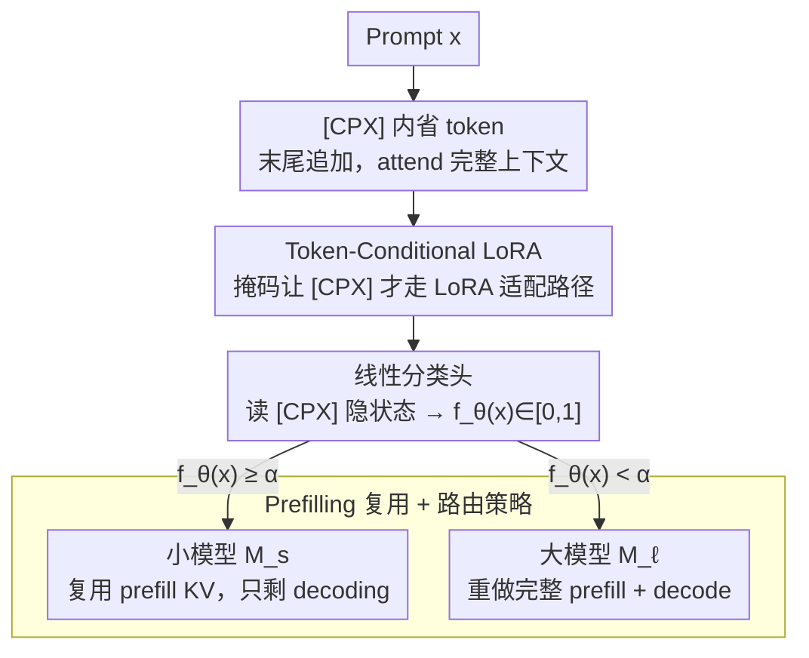

# IntroLM: Introspective Language Models via Prefilling-Time Self-Evaluation

**会议**: ACL 2026 Findings  
**arXiv**: [2601.03511](https://arxiv.org/abs/2601.03511)  
**代码**: https://github.com/hhosseini1377/LLM_routing (有)  
**领域**: LLM 推理 / 模型路由 / 内省自评  
**关键词**: 自评估, 复杂度预测, prefilling, token-conditional LoRA, LLM 路由

## 一句话总结
IntroLM 在 prompt 尾部追加特殊 `[CPX]` 内省 token，再通过"只对该 token 生效的 token-conditional LoRA"在 prefilling 阶段一次性算出"这个 prompt 我能不能答对"，整套自评不进 KV cache、不影响生成，在 HotpotQA 等长上下文 QA 上 ROC-AUC 比 DeBERTa-v3-Large 高 14 个点，用作模型路由能省下最多 50% 大模型调用、33% 端到端延迟。

## 研究背景与动机
**领域现状**：LLM 部署现在普遍用"小模型先试，复杂的再升大模型"的 routing 策略，关键是要在生成前就预测"这个 prompt 是否超出小模型能力"。主流做法是训一个独立的 BERT 风格分类器（DeBERTa、MiniLM 等）做 pre-routing。

**现有痛点**：(a) BERT 的上下文窗口被卡在 512 token，可现代 RAG / 长文档 QA 的 prefilling 输入动辄数千到数十万 token，BERT 根本"看不全"；(b) 用更强的独立大模型当评估器又抵消了 routing 本身省成本的初衷；(c) 一些后验确认类方案（FrugalGPT、AutoMix）要在生成完之后才能判断，延迟代价高昂；(d) 已有"confidence token"工作（如 Chuang 2025 的 `<CN>/<UN>`）是在 decoding 末尾生成 token，仍然要先生成再判断，慢。

**核心矛盾**：复杂度预测需要"足够强的语义建模 + 看得到完整长上下文"，但额外再跑一个大模型评估器又把成本扯回起点；同时修改主模型本身做评估又会破坏其生成行为。

**本文目标**：让因果 LLM **自己**在 prefilling 阶段顺便预测自己的输出质量，不引入新模型、不动 KV cache、不改生成分布。

**切入角度**：prefilling 时每个 token 都通过自注意力聚合了完整 prompt 的信息——只要在 prompt 末尾"挂"几个特殊 token 让它们读到全部上下文，再用一个小分类头读它们的隐状态，就能在零额外推理代价下完成自评。

**核心 idea**：用 `[CPX]` 内省 token + token-conditional LoRA（只对 `[CPX]` 生效的低秩适配）来分离"内省路径"与"生成路径"，前者用于复杂度估计、后者保持 base 模型行为完全不变。

## 方法详解

### 整体框架
给定 prompt $x$，IntroLM 在 $x$ 末尾追加若干 `[CPX]` token 一并送入 LLM 做 prefilling；每个 `[CPX]` 通过单向注意力读到完整的 $x$，其隐状态被一个轻量线性分类头映射到 $f_\theta(x)\in[0,1]$（小模型答对的概率）。关键的工程隔离：

- `[CPX]` 不写入 KV cache：保证 decoding 阶段后续 token 看不到 `[CPX]`，生成分布完全等同于 base 模型。
- decoding 从"原始 prompt 最后一个 token 的隐状态"启动：不从 `[CPX]` 启动，避免 prompt 表征被自评目标污染。
- backbone 参数全部冻结，可训练参数 = `[CPX]` token embedding + 分类头 + token-conditional LoRA（< 1% 模型大小）。

下游应用：把 $f_\theta(x)$ 与阈值 $\alpha$ 比较，决定路由到小模型 $M_s$ 还是大模型 $M_\ell$，且 $M_s$ 的 prefilling 状态可直接复用进 decoding，毫无浪费。

### 关键设计

**1. `[CPX]` 内省 token：在 prompt 末尾挂一个“复杂度专用阅读位”**

最直接的想法是拿 prompt 最后一个 token 的隐状态直接做分类，但消融里的 "Backbone only" 证明这条路效果差——那个 token 是为“生成下一个词”优化的，并不是为“判断这道题难不难”准备的。IntroLM 在 $x$ 末尾追加若干特殊 `[CPX]` token：因为是 decoder-only 且位于末尾，每个 `[CPX]` 在 prefilling 时都能 attend 到完整的 $x$，把整段 prompt 的语义聚合进自己的隐状态，再由一个轻量线性头读出二元分类 logit $f_\theta(x)\in[0,1]$。关键是这条内省路径与生成路径被彻底隔开：`[CPX]` 不写入 KV cache，后续 decoding 的 token 根本看不到它；而且 decoding 从原始 prompt 最后一个 token 的隐状态启动、不从 `[CPX]` 启动，于是生成分布和 base 模型完全一致，自评是“顺手”做掉的，不付额外推理代价。

**2. Token-Conditional LoRA：让低秩更新只对 `[CPX]` 生效，主任务零失真**

常规 LoRA 会改写所有 token 的表征，要给内省定制特征就必然顺带扰动生成——这正是“既要评估能力强又要不动生成”的核心矛盾。IntroLM 的解法是给 LoRA 加一个 token 级掩码：对任意线性层，标准输出 $HW$ 和 LoRA 增量 $H\Delta W$ 算完后，用二元 mask $M$（`[CPX]` 位置为 1、其余为 0）逐元素乘再相加，$HW + (H\Delta W)\odot M$。这相当于在同一组权重里为 `[CPX]` 分叉出一条并行计算路径：原始 prompt token 走的还是冻结 backbone，`[CPX]` 才吃到 LoRA 的适配。挂载位置也很讲究——只给 query 投影（`q_proj`）、output 投影（`o_proj`）和 FFN 的 gate/up/down 加适配，而 key、value 投影因为由 prompt token 产生、决定着整体注意力模式，必须保持冻结。这是全篇最聪明的工程细节，也是“鱼与熊掌兼得”的支点。

**3. Prefilling 复用 + 路由策略：把自评结果直接接进路由，顺势省掉一次 prefilling**

有了 $f_\theta(x)$，路由就是拿它和阈值 $\alpha$ 比：$f_\theta(x)\ge\alpha$ 判定小模型 $M_s$ 能答对，直接复用刚跑完的 prefilling KV cache 继续 decoding；否则升级到大模型 $M_\ell$ 重做完整 prefilling + decoding。妙处在于自评是在 $M_s$ 的 prefilling 里搭车产出的，所以“走小模型”这条路只剩 decoding 的成本，对应的预期延迟为 $T^\alpha_{\text{IntroLM}}(L)=\mathrm{TTFT}_{M_s}+(1-c_\ell)(L-1)\mathrm{TPOT}_{M_s}+c_\ell T_{M_\ell}(L)$。这和传统 BERT 路由器形成鲜明对比——后者在 $M_s$ 之前就决策，省的是“两个模型都不跑”的情况，但代价是再养一个 512 上下文的编码器；IntroLM 决策时小模型已经热好了 prefilling，于是 KV 复用通道被打开，端到端延迟才能再压下 33%。

### 损失函数 / 训练策略
- 损失：类别加权的二元交叉熵；标签由 LLM-as-judge（General QA 用 LLaMA-3.1-8B-Instruct，chat 用 Qwen2.5-32B-Instruct 评 0–10 分阈值 8）自动生成。
- LoRA 配置：rank 32, $\alpha=64$；batch size 64；context 2048；cosine LR + 10% warmup；max grad norm 0.3；weight decay 0.002；LR 在 $4\times 10^{-5}$ 到 $8\times 10^{-5}$ 之间。
- 数据：General QA = MMLU + MMLU-Pro + GSM8K（136K 题，21% 复杂样本）；HotpotQA（97K，14% 复杂）；LMSYS-Chat-1M（100K 英文 prompt，约 50% 复杂）。80/10/10 划分。

## 实验关键数据

### 主实验
复杂度预测性能（ROC-AUC / PR-AUC，越高越好）：

| 方法 | General QA ROC | General QA PR | HotpotQA ROC | HotpotQA PR | Chat ROC |
|---|---|---|---|---|---|
| DeBERTa-v3-Base (184M) | 74.3 | 44.3 | 69.4 | 24.3 | 82.6 |
| DeBERTa-v3-Large (435M) | 75.8 | 45.5 | 71.8 | 26.8 | 86.3 |
| Matrix Factorization | 69.2 | 39.8 | 52.1 | 14.0 | 76.1 |
| **IntroLM (Qwen3-8B)** | **89.1** | **63.4** | **86.3** | **46.7** | **90.1** |

HotpotQA 上 ROC-AUC 跨过 DeBERTa-Large 整整 14.5 个点（71.8 → 86.3），PR-AUC 几乎翻倍（26.8 → 46.7）——这正是 BERT 上下文窗口被卡死的长上下文场景。

路由端到端收益（vLLM + 2×H100，$M_s$=Qwen3-8B, $M_\ell$=Qwen3-32B）：

| 数据集 | 大模型调用率下降 | 延迟下降 |
|---|---|---|
| General QA | 最高 50%（均值 30%） | 最高 34%（均值 15%） |
| HotpotQA | 最高 49%（均值 41%） | 最高 30%（均值 18%） |

### 消融实验

`[CPX]` token 必要性（HotpotQA）：

| 配置 | ROC | PR | 说明 |
|---|---|---|---|
| Backbone only（最后 prompt token 隐状态做分类） | 81.0 | 35.8 | 用生成专用表征做自评 |
| **IntroLM (Qwen3-8B, 带 `[CPX]`)** | **86.3** | **46.7** | +5.3 ROC，+10.9 PR |

token-conditional LoRA target 消融（General QA, Qwen3-8B）：

| LoRA 目标 | ROC | PR |
|---|---|---|
| No LoRA（只训 `[CPX]` embedding + 头） | 85.7 | 56.4 |
| Attention only (q/o) | 88.5 | 61.0 |
| FFN only | 89.1 | 63.0 |
| Attention + FFN（默认） | 89.1 | 63.1 |

backbone 容量消融（General QA）：Qwen3-1.7B 上 IntroLM 84.2 vs DeBERTa-Large 75.7；Qwen3-8B 上 89.1 vs 75.8。模型越大内省信号越强。

### 关键发现
- token-conditional LoRA 是关键拐点：去掉后 ROC-AUC 直接掉 3.4 个点、PR-AUC 掉 6.7 个点，证明仅靠"软 prompt + 分类头"信息量不够，必须让 `[CPX]` 路径有可学习的表征通路。
- FFN-only LoRA 已经够：单独适配 FFN（89.1）与 attention+FFN 全适配（89.1）性能持平，可只挂 FFN-LoRA 进一步省参数。
- 长上下文是 BERT 的死穴：HotpotQA 上 IntroLM 把 PR-AUC 从 26.8 拉到 46.7，几乎翻倍，验证"prefilling 看完整上下文"是相对 BERT 的根本性优势。
- 中间层即可读出内省信号：Qwen3-8B 只用前 24/36 层就能达 87.9 ROC（vs 全模型 89.1），说明可以在 prefilling 中途就 early-exit 做路由决策。
- 前缀截断 vs 中间层：HotpotQA 上只读前 512 token 让 IntroLM 从 86.3 掉到 77.8（仍超 DeBERTa 但损失明显），证明早决策更应该走"中间层 + 全上下文"而非"全层 + 截断上下文"。
- 跨模型预测可行：用 Qwen3-8B 的 IntroLM 预测 Qwen3-1.7B 的成功率，ROC 83.8 ≈ 用 Qwen3-1.7B 自评的 84.2，且远超 DeBERTa 的 75.7，说明 `[CPX]` 表征对其他候选模型也有迁移力，可扩展到多模型路由。

## 亮点与洞察
- **生成无副作用的内省**：这套"`[CPX]` 不进 KV cache + token-conditional LoRA"组合是论文最精巧的工程细节，几乎做到了"鱼与熊掌"——既能动用 backbone 全部表示能力做评估，又能保证生成分布与 base 完全等同。这种"主任务零失真"约束在 LLM 适配领域有极强可迁移性（如 alignment、安全监控）。
- **延迟换算的双赢**：把 routing 决策从"前置 BERT"挪到"小模型 prefilling 后"，看似只是位置后移，实际打开了 KV cache 复用通道——走小模型路径几乎无附加成本，这是延迟下降 33% 的真正来源。
- **复杂度信号的"层级提前"**：中间层就能读出可靠内省信号，意味着可在 prefilling 进行到一半时就 early-exit 升级，对超长上下文（如 RAG over 100k token）有巨大潜力。
- **跨模型迁移的预言**：Qwen3-8B 能近乎完美预测 Qwen3-1.7B 的成败，暗示 `[CPX]` 学到的不是某个模型独有的"我会不会"，而是更普适的"prompt 难度"特征，多 head 一挂就能扩到多模型路由。

## 局限与展望
- 作者承认：(a) 实验集中在 QA 和 chat，对创意写作、多轮对话、代码生成等任务尚未验证；(b) 训练成本明显高于 BERT 分类器（毕竟要在 8B 主模型上跑 LoRA）；(c) 标签依赖 LLM-as-judge，引入了 judge 模型自身的偏差。
- 自己发现：(d) ROC-AUC 漂亮不代表实际 routing 不会"高置信地错"，论文没报告 calibration 误差或可靠图；(e) `[CPX]` 数量、位置等超参未做系统扫；(f) Chat 集上对 BERT 的优势从 14 点缩到 4 点，说明对短上下文 prompt，"内省"的差异化优势会迅速被吃掉，应用域要警惕"短 prompt 不值得"。
- 改进思路：把 `[CPX]` 做成"多 head 多模型路由器"+"早退中间层"组合，配合 calibration loss 直接输出 reliability bound，做成线上服务级的自适应 router。

## 相关工作与启发
- **vs FrugalGPT / AutoMix**：他们在生成后再判断质量，要付 decoding 代价；IntroLM 在 prefilling 阶段就给答案，省一整轮 decoding。
- **vs RouteLLM / HybridLLM / BEST-Route**：BERT-style 编码器路由，上下文窗口 512 是硬天花板；IntroLM 用 LLM 主干天然支持任意长度。
- **vs Chuang 2025 confidence tokens (`<CN>/<UN>`)**：他们在 decoding 末尾生成 token 报告 confidence，必须先解码；IntroLM 把 confidence 提到 prefilling 阶段，且不动生成轨迹，是该思路的"前置 + 隔离"升级版。

## 评分
- 新颖性: ⭐⭐⭐⭐⭐ "token-conditional LoRA + 不进 KV cache 的内省 token"组合是真正干净的新设计，在不改生成的前提下做 self-evaluation 几乎是范式级思路。
- 实验充分度: ⭐⭐⭐⭐ 三种数据集 × 多 backbone × 多种消融（LoRA target / 层数 / 前缀截断 / 跨模型）很扎实；但缺少 calibration 与生产级负载实测。
- 写作质量: ⭐⭐⭐⭐ 公式清晰，方法图 1-3 直观，工程细节交代到位。
- 价值: ⭐⭐⭐⭐⭐ 直接落地价值高——能省 33% 延迟和一半大模型调用对任何 LLM serving 都是真金白银，且代码开源。

<!-- RELATED:START -->

## 相关论文

- [\[ACL 2026\] Training-Free Test-Time Contrastive Learning for Large Language Models](training-free_test-time_contrastive_learning_for_large_language_models.md)
- [\[ICLR 2026\] BeyondBench: Contamination-Resistant Evaluation of Reasoning in Language Models](../../ICLR2026/model_compression/beyondbench_contamination-resistant_evaluation_of_reasoning_in_language_models.md)
- [\[ACL 2026\] LightReasoner: Can Small Language Models Teach Large Language Models Reasoning?](lightreasoner_can_small_language_models_teach_large_language_models_reasoning.md)
- [\[ACL 2026\] JudgeMeNot: Personalizing Large Language Models to Emulate Judicial Reasoning in Hebrew](judgemenot_personalizing_large_language_models_to_emulate_judicial_reasoning_in_.md)
- [\[NeurIPS 2025\] Learning to Better Search with Language Models via Guided Reinforced Self-Training](../../NeurIPS2025/model_compression/learning_to_better_search_with_language_models_via_guided_reinforced_self-traini.md)

<!-- RELATED:END -->
