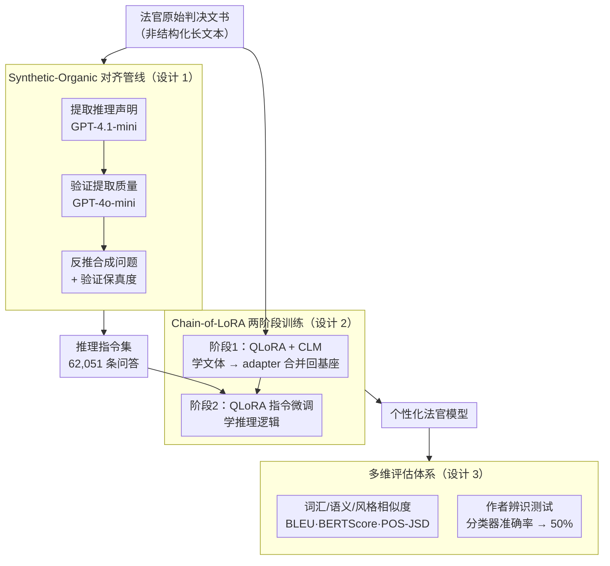

# JudgeMeNot: Personalizing Large Language Models to Emulate Judicial Reasoning in Hebrew

**会议**: ACL 2026 Findings  
**arXiv**: [2604.18041](https://arxiv.org/abs/2604.18041)  
**代码**: [GitHub](https://github.com/Socially-Embedded-Lab/JudgeMeNot)  
**领域**: 模型压缩  
**关键词**: LLM个性化, 司法推理, 低资源语言, 参数高效微调, 合成指令数据

## 一句话总结
提出了一个 synthetic-organic 监督管线，将法官的原始判决文书转化为推理指令微调数据，通过 CLM→指令微调的 Chain-of-LoRA 策略实现对个体法官推理风格的高保真模拟，在希伯来语低资源场景下生成内容与真实法官不可区分。

## 研究背景与动机

**领域现状**：LLM 的个性化研究近年增长迅速，但大多聚焦于用户偏好（风格、推荐），而非对特定决策者推理过程的建模。法律领域中，法官的判决不仅仅是法律条文的机械应用，而是反映了个体特有的推理模式、论证重点和修辞结构。

**现有痛点**：(1) 原始判决文书是非结构化的长文本，推理内容与程序性模板、事实陈述交织在一起，难以直接用于训练；(2) 法官的推理决策在文本中是"无提示"的——没有显式的触发问题；(3) 单个法官的数据量有限，如何在计算高效的前提下让模型学到足够强的个体信号是核心挑战。

**核心矛盾**：个性化需要足够的推理监督信号，但法律判决的推理信号被大量非推理文本稀释。直接在原始文本上做因果语言建模（CLM）效率低下。

**本文目标**：设计一个无需人工标注、可扩展到大量法官的个性化框架，使 LLM 能够忠实模拟特定法官的推理风格和内容。

**切入角度**：法律领域天然提供了大量可分解的推理 trace——法官定期处理复杂决策并撰写详细论证。通过将判决分解为细粒度的推理声明（而非只看最终裁决），可以获得丰富的推理训练信号。

**核心 idea**：用 agentic workflow 从判决中自动提取推理声明并生成合成问题，构造推理指令集，然后通过 CLM→指令微调的两阶段 Chain-of-LoRA 实现高效个性化。

## 方法详解

### 整体框架

这篇论文要解决的是"如何让 LLM 忠实模仿某个法官怎么想、怎么写"，而原始素材只有一堆非结构化的判决文书。整条流水线因此拆成两段：先把判决文书"提纯"成可训练的推理监督信号，再用一套轻量的两阶段 LoRA 把这些信号灌进模型。前一段是用多个 LLM agent 把判决里散落的推理逐句抽出来、再为每句反推一个合成问题，得到问答形式的推理指令集；后一段是先在法官全部判决上学文体、再在推理指令集上学逻辑，最后用多维指标（含作者辨识测试）验收个性化是否到位。

### 关键设计

**1. Synthetic-Organic 对齐管线：把判决文书提纯成问答式推理监督**

直接拿原始判决做因果语言建模有个致命问题——真正反映法官推理的句子被程序性模板、事实陈述大量稀释，信号太弱；而靠人工标注又完全没法扩展到大量法官。这条管线用一组分工明确的 LLM agent 走多轮 agentic workflow 来解决：GPT-4.1-mini（temperature=0.3）负责从判决里提取推理声明，GPT-4o-mini（temperature=0.1）负责验证提取质量，再为每条声明生成一个合成问题、并验证问题与原推理的保真度，最终产出 62,051 个推理句及配套的合成问题。这里"合成问题"是关键巧思：判决文本里法官的推理是"无提示"的——没有显式的触发问题，而模型最终要以问答形式被使用，所以反向补出一个问题，把"陈述式推理"改写成"问答式推理"，让训练分布对齐使用分布。

**2. Chain-of-LoRA (CoLA) 两阶段训练：把"怎么写"和"怎么想"分开学**

一个法官的数据量本就有限，想在计算高效的前提下学到足够强的个体信号，就得让有限算力各司其职。CoLA 借鉴 Chain of LoRA 的思想拆成两步：第一步用 QLoRA 在该法官的全部原始判决上做 CLM，让模型吃透其词汇、句法和修辞这些文体特征，然后把这个 adapter 的权重**合并回基座**；第二步在前面提纯出的合成推理指令集上再做一轮 QLoRA 微调，专门学推理逻辑。之所以要分两阶段而不是混在一起，是因为"模仿文风"和"模仿推理"是两种不同性质的目标——前者关心表面分布、后者关心论证结构，串成链先写后想，让每一阶段的梯度都聚焦单一目标，避免互相干扰。

**3. 多维评估体系：用四类指标分别量化风格层与推理层**

个性化质量本身是多层面的，单一指标会漏掉一半真相——表面文风像不像和深层推理像不像，需要分开衡量。于是评估同时覆盖词汇相似度（BLEU、ROUGE）、语义相似度（BERTScore）、风格相似度（用 POS 词性分布之间的 JSD 散度刻画），以及最硬核的作者辨识测试：训练一个二分类器去区分"这段是真法官写的还是模型生成的"，分类器准确率越接近随机猜测的 50%，说明生成越不可区分、个性化越成功。正是这套体系后来暴露出 RAG 与参数微调的分工——RAG 在 POS-JSD 这类表面风格上不差，却在语义指标上落后，反过来印证了"推理层必须靠参数适应才能真正捕获"。

### 损失函数 / 训练策略
使用 Gemma 3 (4B) 作为基座，QLoRA 配置（rank=8），每个法官单独训练一个 LoRA adapter、基座权重全程冻结。CLM 阶段用标准因果语言建模损失，指令微调阶段用标准 SFT 损失。

## 实验关键数据

### 主实验（问答任务，CoLA 相对各基线的提升差值）

| 方法 | BLEU↑ | BS-F↑ | R-L↑ | POS-JSD↓ |
|------|-------|-------|------|----------|
| Vanilla-Gemma (基线) | 0 | 0 | 0 | 0 |
| Gemini-3-Pro RAG | -3.22 | -0.09 | -0.12 | +0.02 |
| Pers-CLM | -0.25 | -0.03 | -0.01 | +0.02 |
| Pers-IT | -7.02 | -0.09 | -0.15 | +0.02 |
| **CoLA (本文)** | **最优** | **最优** | **最优** | **最优** |

### 作者辨识测试

| 方法 | 准确率 | 说明 |
|------|--------|------|
| 随机猜测 | 50.0% | 基线 |
| 真人 vs 真人 | 84.3% | 法官间确有差异 |
| Vanilla-Gemma | 70.3% | 容易被识破 |
| CLM-only | 56.2% | 仍可区分 |
| **CoLA** | **49.8%** | 与随机无异，不可区分 |
| **IT-only** | **49.6%** | 与随机无异 |

### 关键发现
- **CoLA 生成的文本与真实法官不可区分**：作者辨识分类器准确率降到随机水平（49.8%），说明生成质量极高
- **数据量比模型大小更重要**：消融显示数据翻倍带来 +2.68 BLEU 提升，而 LoRA rank 翻倍仅提升 +0.77 BLEU
- **CLM+IT 的组合效果优于单独使用**：跨法官特异性测试确认个性化效果是法官特定的，而非通用提升
- **RAG 擅长表面风格但弱于推理**：RAG 在 POS-JSD 上表现好，但语义指标落后，说明参数适应才能真正捕获推理

## 亮点与洞察
- **"persona = 风格层 + 推理层"** 的分解很有洞察力：RAG 能捕获表面风格但不能捕获推理，参数微调相反。这提示个性化可能需要两条路径的结合
- **合成监督管线**的设计非常实用：从非结构化文档中用多 agent 提取推理+生成问题的模式，可以迁移到医学、教育等任何需要从专家文档中提取决策推理的领域
- **在 4B 参数模型上实现高保真个性化**挑战了"推理需要大模型大数据"的观念——关键在于监督信号的结构化

## 局限与展望
- 只关注细粒度推理声明，未建模案件级别的整体推理链
- 不考虑法官推理风格随时间的漂移
- 只在希伯来语单一法律体系下验证，跨语言/跨司法体系的泛化未知
- 刻意不释放模型权重（防止滥用），但限制了可复现性
- 未来可以探索显式建模推理链依赖关系，以及结合事实接地的推理增强

## 相关工作与启发
- **vs OnePeFTPerUser**: 后者结合 PEFT 和检索做用户个性化，但针对标签化任务（分类/标签），未涉及推理建模
- **vs DRAFT**: DRAFT 通过试错改进工具文档，思路类似本文的合成数据管线，但目标不同（工具使用 vs 推理模拟）
- **vs 通用推理模型（如 o3）**: 推理模型通常需要可验证的步骤（数学/代码），而法律推理缺乏这种客观验证信号，本文用模拟保真度替代正确性作为优化目标

## 评分
- 新颖性: ⭐⭐⭐⭐ 合成-有机管线和 CoLA 训练策略有新意，但各组件相对成熟
- 实验充分度: ⭐⭐⭐⭐⭐ 三个任务、多个基线、消融研究、跨法官验证、鲁棒性检测，非常全面
- 写作质量: ⭐⭐⭐⭐⭐ 结构清晰，伦理讨论充分，motivation 推导流畅
- 价值: ⭐⭐⭐⭐ 对 LLM 个性化推理有重要启示，但应用场景较窄

<!-- RELATED:START -->

## 相关论文

- [\[ACL 2026\] LightReasoner: Can Small Language Models Teach Large Language Models Reasoning?](lightreasoner_can_small_language_models_teach_large_language_models_reasoning.md)
- [\[AAAI 2026\] Efficient Reasoning for Large Reasoning Language Models via Certainty-Guided Reflection Suppression](../../AAAI2026/model_compression/efficient_reasoning_for_large_reasoning_language_models_via_certainty-guided_ref.md)
- [\[ICLR 2026\] Landscape of Thoughts: Visualizing the Reasoning Process of Large Language Models](../../ICLR2026/model_compression/landscape_of_thoughts_visualizing_the_reasoning_process_of_large_language_models.md)
- [\[ACL 2026\] Training-Free Test-Time Contrastive Learning for Large Language Models](training-free_test-time_contrastive_learning_for_large_language_models.md)
- [\[ACL 2026\] TalkLoRA: Communication-Aware Mixture of Low-Rank Adaptation for Large Language Models](talklora_communication-aware_mixture_of_low-rank_adaptation_for_large_language_m.md)

<!-- RELATED:END -->
