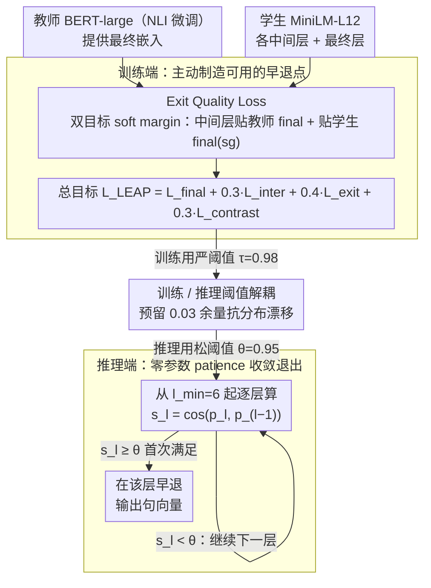

# LEAP: Layer-wise Exit-Aware Pretraining for Efficient Transformer Inference

**会议**: ACL 2026 (Industry Track · Emerging)  
**arXiv**: [2605.01058](https://arxiv.org/abs/2605.01058)  
**代码**: 待确认  
**领域**: 模型压缩 / 早退推理 / 知识蒸馏 / 句向量  
**关键词**: 早退推理, 层级蒸馏, MiniLM, 句向量, 推理加速

## 一句话总结
首先在理论 + 实证上指出"逐层对齐蒸馏"与"基于收敛的早退"在标准部署下**系统性不兼容**——蒸馏模型每一层都在干活、没有冗余可早退，然后提出 LEAP 这种零额外参数的辅助训练目标，让中间层提前逼近最终层表示，在 MiniLM-L12 上拿到 1.61× 实测墙钟加速（batch=1，91.9% 样本在 L7 退出）。

## 研究背景与动机

**领域现状**：稠密文本嵌入是现代检索 / 语义搜索 / RAG / 推荐系统的核心。两条主流加速路线被分别打磨多年——(a) **知识蒸馏**：MiniLM、DistilBERT、TinyBERT 用层级对齐目标把大教师压成小学生；(b) **早退推理**：DeeBERT / FastBERT / PABEE / BERxiT / CALM 等观测中间层表示是否"收敛"，提前出口。直觉上这两条路应该可以组合："先蒸再退"获得双重加速。

**现有痛点**：作者发现工业实践中真实情况是——把早退基础设施挂到 MiniLM 这种蒸馏模型上，**收敛阈值确实在中间层被触发**，但**实测墙钟时间不降反升**，因为逐层做相似度监测的开销没有对应的早终止收益。也就是"早退看似生效但其实从未真退"。

**核心矛盾**：层级对齐蒸馏（$\mathcal{L}_{\text{distill}}=\sum_l \text{KL}(\mathbf{h}_s^{(l)} \| \mathbf{h}_t^{(\pi(l))})$）把教师容量**均匀**摊到学生每一层，这是把"每层都重要"作为优化目标；而早退恰恰要求"后面的层做的事越来越少"以便提前停止。两个目标**互相对立**。结果蒸馏模型的层间相似度曲线 $\cos(\mathbf{e}_l, \mathbf{e}_L)$ 在前 11 层一直 < 0.3，到 L12 才突然跳到 1.0——没有任何天然出口。

**本文目标**：(1) 把这个"距离-退出不兼容"现象形式化、给出可测的诊断量；(2) 设计一个**不改架构、不加 inference 参数**的训练目标，让蒸馏模型同时保留压缩收益与早退能力；(3) 给从业者一套可操作的部署指南（阈值、墙钟、回退条件）。

**切入角度**：作者观察到，要让早退真正起作用，本质是要让"中间层表示 ≈ 最终层表示"。那就在蒸馏 loss 之外**显式加一个**逼近约束——强迫中间层既匹配教师最终层，又匹配学生自己最终层，且用 soft margin + sigmoid 形成"渐进式"压力。

**核心 idea**：在标准蒸馏 + final 对齐之外，加一个"Exit Quality Loss"$\mathcal{L}_{\text{exit}}$（双目标：teacher final + student final with stop-gradient），用 sigmoid soft margin 让中间层尽早跨过 $\tau=0.98$ 这条相似度线，从而**主动制造**早退点。推理时用 patience-based 收敛准则（$\cos(\mathbf{p}_l, \mathbf{p}_{l-k}) \geq \theta=0.95$）即可零参数早退。

## 方法详解

### 整体框架

LEAP 是**只改训练 loss，不改架构、不加 inference 参数**的方案：

- 训练阶段：教师 BERT-large（NLI 微调） → 学生 MiniLM-L12，目标函数 $\mathcal{L}_{\text{LEAP}} = \mathcal{L}_{\text{final}} + \alpha \mathcal{L}_{\text{inter}} + \beta \mathcal{L}_{\text{exit}} + \delta \mathcal{L}_{\text{contrast}}$，其中 $\alpha=0.3, \beta=0.4, \delta=0.3$。
- 推理阶段：从 $l_{\min}=6$ 开始，每层算 $s_l = \cos(\mathbf{p}_l, \mathbf{p}_{l-k})$（patience $k=1$），首次 $s_l \geq \theta=0.95$ 就退出，零额外可学习参数。
- 训练阈值 $\tau=0.98$ 比推理阈值 $\theta=0.95$ 严格一截，留出分布漂移 headroom。

### 关键设计

**1. Exit Quality Loss $\mathcal{L}_{\text{exit}}$（双目标 soft margin）：在训练端主动制造可用的早退点**

这是整个方法的核心，附录 C.5 的消融显示去掉它 LEAP 就直接失效。它针对的痛点很具体——蒸馏把教师容量均匀摊到学生每层，导致中间层根本不像最终层、没有天然出口。LEAP 的对策是给每个中间层 $l$ 同时压两条逼近损失。**Teacher 端**逼中间层去贴教师的最终嵌入：

$$\mathcal{L}_{\text{exit}}^{(t)} = \frac{1}{L_s}\sum_l w_l \cdot \sigma\!\big(10\cdot(\tau - \cos(\mathbf{e}_s^{(l)}, \mathbf{e}_t^{(L_t)}))\big),$$

**Student 端**则用 stop-gradient 让中间层去贴学生自己的最终输出：

$$\mathcal{L}_{\text{exit}}^{(s)} = \frac{1}{L_s-1}\sum_l w_l \cdot \sigma\!\big(10\cdot(\tau - \cos(\mathbf{e}_s^{(l)}, \text{sg}(\mathbf{e}_s^{(L_s)})))\big),$$

合起来是 $\mathcal{L}_{\text{exit}} = \mathcal{L}_{\text{exit}}^{(t)} + 0.7\mathcal{L}_{\text{exit}}^{(s)}$。这里 sigmoid 配系数 10 把损失做成"过了 $\tau$ 线就饱和"的 soft margin，对已经达标的层不再施加无效梯度，把优化压力都留给还没收敛的层。之所以非要两个目标：单靠教师 final 会和中间层蒸馏目标 $\mathcal{L}_{\text{inter}}$ 打架（两者其实指向不同的教师层级）；补上带 stop-gradient 的学生 final，是因为部署时早退用的就是学生自己的中间表示，得让中间层在推理意义上**自洽地等价于**学生最终输出。0.7 的配比让 teacher 主导"质量"、student 主导"自洽"。

**2. 训练 / 推理阈值解耦：$\tau=0.98$ vs $\theta=0.95$**

早退落地最大的工程风险，是"训练分布上能触发、生产分布上却一直够不到阈值"。LEAP 把训练时的严格度和推理时的激进度做成两个正交旋钮来缓冲：训练时强迫中间层往 $\tau=0.98$ 这条高线靠拢，推理时 patience 准则只要求 $\theta=0.95$ 就放行，等于预留 0.03 的余量去吸收真实分布的扰动。这套解耦还有个部署上的好处——$\theta$ 成了生产端唯一需要调的旋钮，且很安全：Pareto 曲线显示在 $\theta\in[0.93,0.97]$ 区间 STS-B 几乎不动（0.753–0.762），而平均退出层从 4.6 一路涨到 8.9，质量和速度可以放心权衡。

**3. 零参数 patience-based 收敛退出：推理端不挂任何可学习模块**

DeeBERT 给每层挂分类头、PABEE 学退出 head，这类做法在句向量场景行不通——没有下游标签可供每个任务单独 fine-tune（作者实测 DeeBERT 在 MiniLM-L12 上 STS-B Spearman 只有 0.26，而 LEAP 是 0.76）。LEAP 干脆纯靠几何判定：从 $l_{\min}=6$ 起，每过一层算一次 $s_l=\cos(\mathbf{p}_l, \mathbf{p}_{l-k})$（patience $k=1$，即和前一层比相似度），首次 $s_l \geq \theta$ 就退出。整个判定只需一次 mean-pool 加一次余弦，远轻于跑一个分类头。Parameter-free 加 task-agnostic，正是这套方案能无缝塞进任何工业 embedding 服务的关键——而这一切之所以成立，全靠设计 1 在训练端已经把中间层推到了"几乎等于最终层"。

### 损失函数 / 训练策略

总目标 $\mathcal{L}_{\text{LEAP}} = \mathcal{L}_{\text{final}} + 0.3\mathcal{L}_{\text{inter}} + 0.4\mathcal{L}_{\text{exit}} + 0.3\mathcal{L}_{\text{contrast}}$。其中 $\mathcal{L}_{\text{final}}=1-\cos(\mathbf{e}_s^{(L_s)},\mathbf{e}_t^{(L_t)})$；$\mathcal{L}_{\text{inter}}$ 是层级 cosine 对齐；$\mathcal{L}_{\text{contrast}}$ 用 batch 相似度矩阵的 KL 对齐结构。AllNLI 1.5M 句对、10 epoch、batch 64、lr $5\times 10^{-5}$、训练总耗 $\sim$14h（4×L4）。

## 实验关键数据

### 主实验

在 STS-B 句向量任务上对比同架构 MiniLM-L12（无 $\mathcal{L}_{\text{exit}}$）与 LEAP-MiniLM-L12：

| 模型 | STS-B $\rho$ | 层减比 | 墙钟加速 | $\mathbb{E}[\text{layer}]$ | Exit@L7 |
|------|--------------|--------|----------|----------------------------|---------|
| Published MiniLM-L12-v2 | 0.831 | 1.00× | 1.00× | 12.0 | 0% |
| MiniLM-L12 (baseline, 同 pipeline) | 0.777 | 1.00× | 1.00× | 12.0 | 0% |
| **LEAP-MiniLM-L12** | **0.760 ±0.006** | **1.80×** | **1.61×** | **6.7** | **91.9%** |

仅以 2.2% STS-B 的质量代价换来 1.61× 墙钟加速；公布版 MiniLM 即便用 LEAP 推理协议也是 0% 退出（L7 相似度仅 0.29 vs LEAP 0.96），从外部验证不兼容性是**蒸馏目标内禀**的，而非训练管线问题。

**跨蒸馏方法兼容性验证**（最大早退率）：

| 模型 | 蒸馏类型 | Max Exit Rate |
|------|----------|---------------|
| TinyBERT-6 | 层级对齐（MSE on hidden）| 0.0% |
| MiniLM-L6-v2 | 层级对齐（KL on attention）| 0.7% |
| DistilBERT-6 | 仅输出蒸馏 | **71.5%** |

只有不做层级对齐的 DistilBERT 才天然保留早退能力——直接锁定"层级对齐"是病根。

### 消融 / 关键发现

**层级相似度对比**（核心机理）：

| Layer | MiniLM (baseline) Sim | MiniLM Exit% | LEAP Sim | LEAP Exit% |
|-------|-----------------------|--------------|----------|------------|
| 6 | 0.162 | 0.0% | 0.945 | 38.9% |
| 7 | 0.215 | 0.0% | 0.963 | 91.9% |
| 8 | 0.285 | 0.0% | 0.968 | 97.6% |
| 10 | 0.547 | 0.0% | 0.975 | 99.5% |
| 12 | 1.000 | 100% | 1.000 | 100% |

LEAP 让中间层相似度从 L6 起就 >0.9，baseline 到 L11 还只有 0.86。

**Pareto 曲线**（$\theta$ vs 质量/速度）：

| $\theta$ | STS-B | 层减比 | $\mathbb{E}[\text{layer}]$ |
|----------|-------|--------|---------------------------|
| 0.90 | 0.756 | 2.58× | 4.6 |
| 0.95 (recommended) | 0.763 | 1.80× | 6.7 |
| 0.99 | 0.762 | 1.08× | 11.1 |

质量在 0.753–0.762 之间高度稳定，说明 LEAP 真正把"提早出口"的代价压平了。

**墙钟 vs batch size**（NVIDIA L4）：

| Batch | Full (ms) | EE (ms) | 加速 |
|-------|-----------|---------|------|
| 1 | 8.46 | 5.25 | 1.61× |
| 8 | 11.51 | 8.75 | 1.32× |
| 32 | 13.14 | 10.61 | 1.24× |

**BEIR 检索验证**（NDCG@10）：LEAP 全推理在 3/5 任务上比 baseline 高（+3.3% 平均），说明 $\mathcal{L}_{\text{exit}}$ 对句向量质量**几乎无成本**。早退在 ArguAna 上掉 24.7%（需要深层语义组合），但 NFCorpus/FiQA 几乎持平——说明 早退代价是**任务相关**的。

### 关键发现
- **罪魁祸首是"逐层对齐"而非蒸馏本身**：DistilBERT 只在最后输出做 KD 就能天然支持早退；TinyBERT/MiniLM 把每一层都用 KL/MSE 锁死才把早退路径杀死。这给后续工业蒸馏方案选型一个明确分水岭。
- **早退收益强烈依赖 batch=1**：batch 越大 GPU 并行已经摊平了 per-layer 成本，1.61× → 1.24×。说明 LEAP 是**实时低延迟场景**的胜利，不是吞吐场景的胜利。
- **训练 / 推理阈值解耦提供分布漂移鲁棒**：训练时按 $\tau=0.98$ 训，推理用 $\theta=0.95$，留了 0.03 的余量后整条 Pareto 曲线在 STS-B 上几乎平。
- **早退代价是任务相关的**：BEIR 上 ArguAna 掉 24.7% 但 NFCorpus 平，说明部署前必须用目标语料做 viability 验证（作者还给了三个诊断量：flat similarity curve / zero exit rate / monitoring overhead）。
- **可证伪性**：作者明确给出"falsifiable prediction"——任何保持中间层向最终层单调收敛的蒸馏模型不需要 LEAP 也能用早退。这是工业论文里少见的科学态度。

## 亮点与洞察
- **"显式让中间层 ≈ 最终层"是教科书级的简单干预**：很多早退工作（DeeBERT/PABEE/BERxiT）都在 inference 端复杂化（学退出 head、patience 计数），LEAP 反其道而行——**在训练端制造退出条件**，inference 端零参数。这个"训练端制造空间，推理端零成本利用"的设计哲学可以迁移到 token-level early exit、speculative decoding 等场景。
- **"双目标 + stop-gradient"是稳定 self-distillation 的优雅写法**：teacher 目标保质量，student 目标保 inference 自洽，stop-gradient 防止学生 final 被中间层污染。这种小心翼翼的梯度路径设计很适合迁移到自蒸馏、self-consistency 训练等需要避免"目标 collapse"的场景。
- **"指出根本不兼容性"本身就是高价值贡献**：很多团队踩过"蒸馏 + 早退"的坑但归因到 hyperparameter，本文用 $\gamma_l$ 收缩率给出形式化解释 + 用三个诊断量给出可操作的判定，把暗坑变明坑。Industry Track 的"Emerging"分类极合适。
- **"FALSIFIABLE PREDICTION"段落值得学习**：作者主动给出可被证伪的边界条件（"如果蒸馏模型保持单调收敛，则无需 LEAP"），这是把工程经验变成可验证科学的好习惯。

## 局限与展望
- **仅在 12 层 MiniLM 上验证**：未扩展到更深的 Sentence-BERT、SimCSE-large、E5-large 这些当代 sentence embedding SOTA，未验证 multilingual / cross-encoder 等变体。
- **只针对 sentence embedding 任务**：未触及 token-level 早退（机器翻译、文本生成），这些场景早退要逐 token 决策、更复杂。
- **训练成本 +20%**：对小公司或频繁迭代场景仍是非平凡代价，尤其大模型时代每多 20% pretraining 都是真金白银。
- **退出层固定下限 $l_{\min}=6$**：所有样本至少要跑前 6 层，对极简单输入（如重复 query）仍有浪费空间；可探索动态 $l_{\min}$ 或基于输入难度的预测。
- **任务相关的退出代价**：BEIR 上 ArguAna 掉 24.7%，但作者只是用"任务相关"概括，未给出可预测的难度信号；理想情况下应能在 inference 时**预先**判断"这个 query 别早退"。
- **改进思路**：(a) 把 LEAP 与 Matryoshka 表示组合（深度 × 宽度双维度自适应）；(b) 把 $\mathcal{L}_{\text{exit}}$ 推广到 generative LLM 的 KV cache compression；(c) 用难度预测器替代固定 $\theta$，做 input-conditional 阈值。

## 相关工作与启发
- **vs DeeBERT / PABEE / BERxiT**: 这些方法靠学习型 exit head 或 patience 计数器在**inference 端**适配；LEAP 在**训练端**消除根因，inference 端零参数。LEAP 直接证明它们在蒸馏模型上失效（DeeBERT 在 MiniLM 上只有 0.26 STS-B vs LEAP 0.76）。
- **vs MiniLM / TinyBERT / DistilBERT**: 同样做蒸馏，但 LEAP 把"中间层冗余"作为显式优化目标而非副产品。是对标准蒸馏的**正交**增强（保留所有原始蒸馏组件，加一个 loss）。
- **vs Matryoshka Representations**: Matryoshka 做"宽度自适应"（嵌入维度），LEAP 做"深度自适应"（层数）。两者完全正交，组合可获得乘性收益——这是论文明确指出的未来方向。
- **vs LayerDrop / Pruning**: LayerDrop 训练时随机丢层，得到固定深度的小模型；LEAP 保留所有层但**按样本难度**动态退出。前者是"静态压缩"，后者是"动态自适应推理"，目标互补。
- **vs CALM (Schuster et al., 2022)**: CALM 在 generative 场景做 token-level 早退，需要学退出分类器；LEAP 在 sentence-level 用纯几何收敛准则，开销更低但场景较窄。两者可视作"训练端制造 vs 推理端检测"两条思路的代表。

## 评分
- 新颖性: ⭐⭐⭐⭐ "指出不兼容 + 设计零参数训练干预"的组合洞察很扎实，但 $\mathcal{L}_{\text{exit}}$ 的具体形式是已有 cosine + sigmoid 的工程组合
- 实验充分度: ⭐⭐⭐⭐ STS-B + BEIR + cross-distillation + 墙钟 × batch + 三诊断量 + Pareto 曲线，覆盖训练 / 推理 / 部署全链路；但仅限 MiniLM 一种 backbone
- 写作质量: ⭐⭐⭐⭐⭐ Industry Track 风格典范——问题陈述清晰、机理解释直接、诊断框架可立刻照搬、还给出 falsifiable prediction
- 价值: ⭐⭐⭐⭐⭐ 对任何在生产环境用 MiniLM/DistilBERT 做检索/RAG 的团队都有直接 ROI；揭示的"层级对齐 vs 早退"原理对未来蒸馏方法设计有长期影响

<!-- RELATED:START -->

## 相关论文

- [\[ACL 2026\] Adaptive Layer Selection for Layer-Wise Token Pruning in LLM Inference](adaptive_layer_selection_for_layer-wise_token_pruning_in_llm_inference.md)
- [\[ACL 2026\] TELL-TALE: Task Efficient LLMs with Task Aware Layer Elimination](tell-tale_task_efficient_llms_with_task_aware_layer_elimination.md)
- [\[ACL 2026\] A Layer-wise Analysis of Supervised Fine-Tuning](a_layer-wise_analysis_of_supervised_fine-tuning.md)
- [\[ICML 2026\] ReSpinQuant: Efficient Layer-Wise LLM Quantization via Subspace Residual Rotation Approximation](../../ICML2026/model_compression/respinquant_efficient_layer-wise_llm_quantization_via_subspace_residual_rotation.md)
- [\[CVPR 2026\] One Layer's Trash is Another Layer's Treasure: Adaptive Layer-wise Visual Token Selection in LVLMs](../../CVPR2026/model_compression/one_layers_trash_is_another_layers_treasure_adaptive_layer-wise_visual_token_sel.md)

<!-- RELATED:END -->
