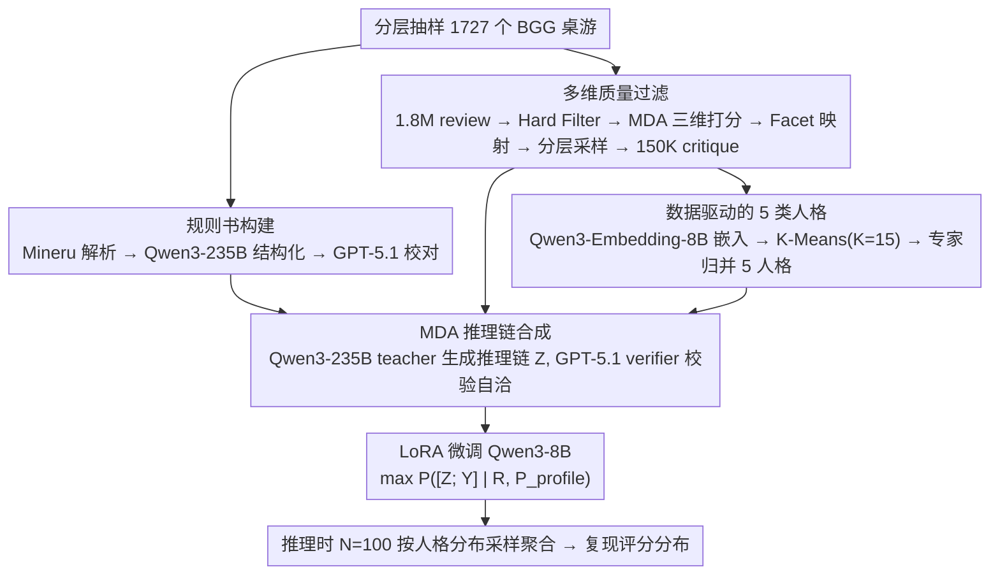

# MeepleLM: A Virtual Playtester Simulating Diverse Subjective Experiences

**会议**: ACL 2026  
**arXiv**: [2601.07251](https://arxiv.org/abs/2601.07251)  
**代码**: https://github.com/leroy9472/MeepleLM  
**领域**: 人机协作 / LLM 仿真 / 桌游设计  
**关键词**: 虚拟玩家测试, MDA 推理, 人格仿真, board game, persona-conditional fine-tuning

## 一句话总结
为桌游设计师做"虚拟玩家测试"——把官方规则书 + 5 类玩家人格送给一个微调过的 Qwen3-8B (MeepleLM)，让它先沿 Mechanics→Dynamics→Aesthetics (MDA) 三步推理再生成 rating + review，最终在 207 个游戏上超越 GPT-5.1 / Gemini3-Pro 在社区分布对齐 (Wasserstein 0.22 vs GPT-5.1 0.95)、内容多样性 (Div 4.34 vs 4.26) 和 Opinion Recovery (69.77 vs 63.44) 三项，并在盲测 A/B 中拿到 70%+ 用户偏好。

## 研究背景与动机
**领域现状**：LLM 已经被用于桌游领域的各种任务——下棋 agent、角色扮演、社交模拟、机制生成、规则代码合成 (Code World Models)。但当作为"co-designer"时，目前没有任何系统能给设计师**基于真实玩家体验**的反馈，只能做规则有效性检查或参考玩家 LLM 自对弈做平衡 (RuleSmith 等)。

**现有痛点**：(1) 把规则书喂给通用 LLM (GPT-5.1, Gemini3) 让它写 review，会出现严重的 **central tendency bias** —— 所有游戏都给 7-8 分均分，根本捕捉不到玩家社群的两极分化；(2) 通用 LLM 的 review 听起来像营销文案 (cite "social WD-40" 这种空话)，缺玩家社群里的实际行话 (alpha gamer / variant rules / roll-and-move hell)；(3) 现有玩家仿真要么训分类器学客观特征 (DeBERTa 失败案例：把 "house rules" 自动归为 System Purist 但其实是 Thrill Seeker 在调高方差)，要么用 forward-model playtest (需要每个游戏单独建游戏引擎，无法 scale)。

**核心矛盾**：(a) **静态规则 ↔ 涌现体验**：rulebook 是"代码"，但玩起来好不好玩是 runtime 才会涌现的因果链，LLM 没有 game engine 无法执行规则；(b) **平均共识 ↔ 主观异质性**：同一个 mechanic 在不同玩家眼里反应完全相反 (高随机度让 Socializer 兴奋但让 Strategist 抓狂)，"一刀切"的评价对设计无用。

**本文目标**：(1) 构造覆盖广度+质量都好的 1,727 个规则书 + 150K 高质量 review 数据集；(2) 用 MDA (Mechanics-Dynamics-Aesthetics) 经典游戏设计理论把"规则→体验"的因果链显式化为 CoT；(3) 数据驱动地从 1.8M raw review 里聚类出 5 类玩家人格；(4) 用 persona-conditional instruction tuning 让 Qwen3-8B 内化人格特异性推理。

**切入角度**：作者注意到 MDA 框架 (Hunicke 2004) 本来就是"机制如何引发动态、动态如何产生美学体验"的因果模型，把它当 CoT 模板正好能把 LLM 的隐式推理外化为可验证的三步。

**核心 idea**：`[Rule, Persona] -- MDA CoT --> Critique`，其中 persona 不是 label 而是完整的语义画像写进 system prompt，强制模型把 persona 当 contextual prior 调控 Dynamics→Aesthetics 转换。

## 方法详解

### 整体框架

MeepleLM 想回答一个很具体的问题：给定一本规则书，真实玩家社群会打出怎样的评分**分布**、写出怎样的评论，而且要把"同一款游戏在不同人格玩家眼里冷热不均"的两极分化保留下来，而不是塌成一个安全的平均分。由于 LLM 没有 game engine 去真正"玩"一遍，作者的策略是先用大模型造出高质量训练数据，再把"规则→体验"的因果推理蒸进一个 8B 的学生模型。

整条 pipeline 分四步。前三步都在造数据：先分层抽 1,727 个 BGG 桌游，用 Mineru 解析 PDF、Qwen3-235B 结构化、GPT-5.1 校对得到干净的 standard rulebook，同时爬 1.8M 条原始 review 经多任务过滤后保留 150K 条高密度 critique；再用 Qwen3-Embedding-8B 把 review 嵌入、K-Means 聚类后由专家归并出 5 类玩家人格；最后用 Qwen3-235B 作 teacher，为每个 (rule, persona, review) 三元组合成一条 MDA 推理链 Z，并用 GPT-5.1 verifier 校验它是否和真实 rating 自洽。第四步才是训练：LoRA 微调 Qwen3-8B，让它最大化 $P([Z; Y] \mid R, P_{profile})$ 的联合似然，把"先沿 MDA 推理、再下评分"这一行为内化进权重。

### 关键设计

**1. 多维质量过滤 + 立场分布保真：从 1.8M 噪声里筛出 150K 既有用又不偏移基线的 critique**

原始 review 大量是太短、跑题、或 rating 和正文自相矛盾的噪声，直接拿来训练会把模型带偏。过滤分四道：先用 Hard Filter 去掉明显垃圾；再做 **MDA Scoring**，沿三个 1-5 维度——mechanism_anchoring（有没有点到具体规则名）、causal_attribution（有没有给因果解释）、constructiveness（对设计有没有用）——打分，且用 few-shot prompt 强制三维 decoupling 以避免 halo effect；接着 Facet Identification 把每条 review 映射到 8 个语义 topic（Rule Clarity、Cognitive Load、Luck vs Strategy 等）；最后用 coverage-max stratified sampling 在保住 rating 分布（与原始分布 Pearson $r=0.92$）的同时最大化 facet 多样性。

两个保真目标缺一不可：过滤后 review 平均长度是未过滤极端 rating review 的 1.24×，说明留下来的确实是信息密度更高的内容；而强约束保住原 rating 分布，则保证模型学到的评分基线不会偏离真实社区——否则模型可能学会"盲猜大众平均分"压低 MAE，却完全失去设计参考价值。这一步同时为后续两个设计供料：清洗后带 logic score 与 facets 的 critique，既是人格聚类的特征来源，也是 MDA 推理链合成的素材。

**2. 数据驱动的 5 类人格 + 把完整语义画像写进 system prompt：用 commonsense 插值替代符号 label**

桌游评价的核心矛盾是主观异质性——同一个高随机度机制能让 Social Lubricator 兴奋却让 Strategist 抓狂，"平均玩家"的一刀切评分对设计师毫无用处。作者先走 Cluster-then-Refine：用 Qwen3-Embedding-8B 把 review（拼接文本 + logic score + facets）嵌入后做 K-Means（K=15），让数据自己说"存在哪些群体"，再由 GPT-5.1 profile 中心样本、人专家归并成 5 个稳定人格（System Purist / Efficiency Essentialist / Narrative Architect / Social Lubricator / Thrill Seeker），最后用 GPT-5.1 三次多数投票给全量数据打人格标签。

真正的关键决策在训练这一步：人格 $P$ 不是一个 label token，而是把每个人格的完整画像（核心价值观、交互偏好、痛点喜好）整段写进 system instruction，让模型把 $P$ 当 contextual prior 而非 categorical feature。作者实测过 DeBERTa-v3-large 分类器，它会把"house rules + balance"误判成 System Purist，可实际上那是 Thrill Seeker 在故意调高方差——说明人格是细微 cognitive attribution 的产物，符号 label 根本编码不住。改成语义画像后，LLM 能用自身 commonsense 在人格维度上插值，从而泛化到训练集外那些微妙的偏好组合。推理时则按某游戏真实 review 的人格分布采样 N=100 次再聚合，复现出整条评分分布而非一个点估计。

**3. MDA-Guided Reasoning：把"规则→体验"的语义鸿沟拆成三步可验证的因果链**

通用 LLM 直接从规则书 $R$ 一步跳到评论 $Y$ 时会偷懒，只输出表面情感，于是所有游戏都打 7-8 分（central tendency bias），根本捕捉不到社群的冷热分化。作者借用游戏设计学的经典 MDA 理论（Mechanics 客观规则 → Dynamics 运行时交互 → Aesthetics 主观情绪）当生成模板，把这条隐式因果链显式写成 CoT：Step 1 只允许引用 review 真正提到的规则组件做 grounding，Step 2 推断这些规则在运行时会触发什么系统行为或玩家交互，Step 3 才合成情感反应，且必须由人格 $P$ 调制，整体形式化为 $[R, P] \xrightarrow{Z_{MDA}} Y$。

这样做的好处是每一步都可独立验证：GPT-5.1 verifier 检查推理链 $Z$ 的情感倾向是否和 ground-truth rating 一致，矛盾就打回重生，最终 200 条人工 audit 全部 pass。本质上这是"把领域理论翻译成 prompt 模板"——MDA 既提供推理结构，又顺手给出了可机检的中间监督信号，迫使模型先 ground 规则、再推因果、最后才表态，而不是一上来就拍脑袋给情感。

### 一个完整示例：模型如何给一款新游戏生成评分分布

以一款主打"高随机抽卡 + 玩家互坑"的新桌游为例，走一遍推理流程：

1. **输入**：把这款游戏的 standard rulebook $R$，连同某一个人格的完整画像 $P_{profile}$（比如 Thrill Seeker：偏爱高方差、戏剧性反转，讨厌冗长的最优解计算）一起塞进 system prompt。
2. **MDA 推理**：模型先沿 Mechanics 列出规则里实际写到的"每回合翻 3 张事件卡、可弃牌攻击对手"；再到 Dynamics 推断这会带来"局势频繁逆转、leader 容易被集火"；最后到 Aesthetics，在 Thrill Seeker 这个人格 prior 下输出"刺激、有赌徒快感"的正面情绪 → 给出偏高的 rating + 一段带玩家行话的 review。
3. **换人格重采**：换成 Efficiency Essentialist（追求最优策略），同一条 Dynamics 会被解读成"随机性淹没了决策，努力得不到回报"，于是给出偏低 rating。
4. **聚合成分布**：按这款游戏真实 review 的人格构成采样 N=100 次（比如 Thrill Seeker 占比高就多采几次），把 100 个 (rating, review) 聚合，得到一条**两极分化**的评分分布，而不是一个被压平的均值。

这一步把抽象的"persona 作为 contextual prior 调控 Dynamics→Aesthetics"具象化了：换的不是标签，而是一整套价值观，导致同一条客观 Dynamics 被推向相反的情绪结论。

### 损失函数 / 训练策略
LoRA on all linear layers via LLaMA-Factory，目标是最大化 $L = -\sum_{t=1}^{|S|} \log P(s_t | s_{<t}, R, P_{profile})$，其中 $S = [Z; Y]$ 是 MDA reasoning chain 后接 critique (rating + review) 的拼接序列。Teacher: Qwen3-235B；Student: Qwen3-8B；推理时 N=100 次按真实 persona 分布采样后聚合。

## 实验关键数据

### 主实验：207 个 held-out 游戏，对齐 / 质量 / 实用性三块（节选自 Table 2）

| 模型 | MAE ↓ | Wasserstein ↓ | Kendall τ ↑ | Fact. ↑ | Dist-2 ↑ | Div. ↑ | Op-Rec ↑ |
|---|---|---|---|---|---|---|---|
| GPT-5.1 | 0.987 | 0.950 | 0.256 | **99.46** | 0.693 | 4.26 | 63.44 |
| Gemini3-Pro | 1.428 | 0.509 | 0.247 | 98.28 | 0.648 | 3.98 | 57.74 |
| Qwen3-235B | 1.229 | 0.635 | 0.145 | 98.95 | 0.657 | 3.56 | 54.27 |
| Qwen3-8B (backbone, no tune) | 0.891 | 1.012 | 0.049 | 97.88 | 0.594 | 1.58 | 11.39 |
| **MeepleLM (Ours)** | **0.658** | **0.221** | **0.282** | 98.86 | **0.712** | **4.34** | **69.77** |

**最关键的对比是 Wasserstein 0.22 vs GPT-5.1 0.95 (4.3×)** —— GPT-5.1 给所有游戏打安全的 7-8 分聚集 (mode collapse)，MeepleLM 真实复现了社群两极分布；user study (N=10) 在 familiar 游戏上 MeepleLM 78.3% win rate (83.3% 用户认为"更真实")，unfamiliar 74.2% (86.7% 觉得"更敢点出设计缺陷而不像广告")。

### 消融：三大模块各自的贡献

| 配置 | MAE ↓ | WD ↓ | τ ↑ | Fact. ↑ | Div. ↑ | Op-Rec ↑ |
|---|---|---|---|---|---|---|
| **Full MeepleLM** | 0.658 | 0.221 | 0.282 | 98.86 | 4.34 | 69.77 |
| w/o MDA (无 CoT) | 0.740 | 0.415 | 0.227 | 91.56 | 3.70 | 55.35 |
| w/o Persona (用 generic prompt) | 0.789 | 0.363 | 0.135 | 92.13 | 3.56 | 53.84 |
| w/o Rulebook (盲生成) | 0.704 | 0.550 | 0.003 | **59.87** | 3.30 | 9.99 |

### 关键发现
- **Rulebook 是 factual grounding 的命脉**：去掉规则书 Fact. 从 98.86 → 59.87，但 MAE 反而略好 (0.704)，说明"盲猜大众平均分"能压低 MAE 却完全无设计价值；这强烈证明评估必须**同时**看 MAE 和 Wasserstein/Op-Rec。
- **Persona 是 Kendall τ 的关键**：去掉 persona τ 从 0.282 → 0.135 (跌 52%)，因为没有人格异质性时不同游戏在不同人群里的相对排序差异被抹平，整体 ranking 退化为均值估计。
- **MDA 是 Op-Rec 的关键**：去掉 MDA CoT，Op-Rec 从 69.77 → 55.35 (跌 21%)，说明显式因果推理让模型能 surface 更多 distinct viewpoint。
- **对 high-variance persona 的鲁棒性**：在 Social Lubricator / Thrill Seeker 这两类靠"vibes"而非纯逻辑的人格上 MeepleLM 表现尤其好，说明人格画像注入让模型确实建模了"非逻辑性"主观体验，而不是只学到了硬规则。
- **temporal robustness**：去掉 2024-2025 新游戏 (34 个) 后所有模型性能基本不变，说明 LLM 知识截止不是主要瓶颈，规则书 grounding 足够。

## 亮点与洞察
- **MDA 框架作为 CoT 模板的迁移**：把游戏设计学界的经典三层理论 (Mechanics 客观 → Dynamics 运行时 → Aesthetics 主观) 反向用作 LLM 生成模板，是个非常优雅的 domain-theory-as-prompt 范式，可以推广到任何"规则系统 → 用户体验"的领域 (UI/UX 评估、教学方法评估、API 设计评估)。
- **"central tendency bias"作为 LLM 评价者的系统性病灶**：作者用 Wasserstein 距离直接量化这个常被忽视的问题，给"LLM-as-judge"研究敲了警钟——光看 MAE/accuracy 会严重高估通用 LLM 的评价能力，分布对齐才是真实指标。
- **Cluster-then-Refine 的人格发现 pipeline**：纯算法聚类 vs 纯专家定义都有缺陷，先 K-Means 让数据说话再人专家归并，且最终把 persona 作为完整语义 prompt 而非 label，是个值得复制的"数据驱动 + 专家增强"范式。
- **"完整 persona profile 写进 system prompt"vs"persona embedding/label"的设计取舍**：作者证明前者远好，启示我们在 user simulation 场景里，**用 LLM 自身的 in-context reasoning 处理软标签** 比给 model head 加 categorical embedding 效果更好，因为人格本质上是 commonsense 语义而非可标签化属性。

## 局限与展望
- 作者承认：(1) 只处理文本，没用规则书里的卡牌图、棋盘 iconography 等视觉信号；(2) 5 个 persona 是粗粒度，缺真实个体差异。计划加视觉 encoder + 个体级历史数据。
- 我看到的额外限制：(1) verifier 用 GPT-5.1 既当 verifier 又当 baseline 比较对象，存在自评偏差；(2) 5 个 persona 是否覆盖完整玩家空间未验证 (没和 BGG 用户调研对照)；(3) 没和 forward-model playtest (de Mesentier Silva, Goodman) 做横向对比，所以 "LLM-based vs engine-based" 哪种更适合什么类型的反馈仍开放；(4) Wasserstein 0.22 仍非零，说明分布对齐还有空间，可能需要更多 persona granularity；(5) user study N=10 偏小。
- 改进方向：把人格泛化到 individual user model (类似 generative agents 的 long-term memory)；引入 multimodal grounding；和 forward-model playtest 互补 (前者发现 balance bug，后者发现 emotional reactions)；把同样的范式迁移到电子游戏、教育材料、UI 设计评估。

## 相关工作与启发
- **vs LLM-as-judge 通用工作 (G-Eval, Yang & Jin 2025)**：他们多处理静态文本质量，本文处理 interactive system 的涌现体验，因此引入了 MDA 因果中介；这种"runtime simulation"思路可反哺其它 LLM-as-judge 任务。
- **vs Forward-Model Playtest (de Mesentier Silva 2017, Goodman 2025, RuleSmith 2026)**：他们用 MCTS / RL agent 在游戏引擎里 self-play 发现 balance bug，本文不需要 game engine，直接从 rulebook 推 subjective experience，互补关系。
- **vs Persona Modeling (Park 2023 generative agents, Choi 2025 Proxona)**：他们多用 LLM 在对话历史上模拟 persona，本文用 review behavioral data 做 grounding，避免 stereotyping 风险。
- **vs Hong 2025 (LLM as game co-designer)** / Patrick & Khan 2025: 他们关注规则生成 / mechanic 创意，本文补足"生成后如何评测"这块缺失。

## 评分
- 新颖性: ⭐⭐⭐⭐☆ 第一个系统研究桌游 LLM-based 评测；MDA-CoT 把领域理论嵌入推理模板是个被低估的 prompt 设计思路；persona-as-prompt 也属创新。
- 实验充分度: ⭐⭐⭐⭐⭐ 207 个游戏 + 4 个对比 + 3 个消融 + temporal/persona 切分分析 + user study + binomial 显著性检验，且每个指标都有针对性 (MAE/WD/τ/Fact/Dist-2/Div/Op-Rec)。
- 写作质量: ⭐⭐⭐⭐☆ 故事线清晰 (动机→数据→方法→实验)，case study 表 (Table 3) 非常直观；限制部分稍有自夸但仍坦诚。
- 价值: ⭐⭐⭐⭐☆ 对桌游设计行业直接有用；方法学上的 MDA-CoT、persona-as-prompt、Wasserstein 评估范式都可迁移到 HCI / UX / 教育评估等更广的 interactive system 评测场景。

<!-- RELATED:START -->

## 相关论文

- [\[ICML 2026\] SPEED-Bench: A Unified and Diverse Benchmark for Speculative Decoding](../../ICML2026/model_compression/speed-bench_a_unified_and_diverse_benchmark_for_speculative_decoding.md)
- [\[ACL 2026\] UKP_Psycontrol at SemEval-2026 Task 2: Modeling Valence and Arousal Dynamics from Text](ukp_psycontrol_at_semeval-2026_task_2_modeling_valence_and_arousal_dynamics_from.md)
- [\[ACL 2026\] A BERTology View of LLM Orchestrations: Token- and Layer-Selective Probes for Efficient Single-Pass Classification](a_bertology_view_of_llm_orchestrations_token-_and_layer-selective_probes_for_eff.md)
- [\[ACL 2026\] LoRA on the Go: Instance-level Dynamic LoRA Selection and Merging](lora_on_the_go_instance-level_dynamic_lora_selection_and_merging.md)
- [\[ACL 2026\] LightReasoner: Can Small Language Models Teach Large Language Models Reasoning?](lightreasoner_can_small_language_models_teach_large_language_models_reasoning.md)

<!-- RELATED:END -->
