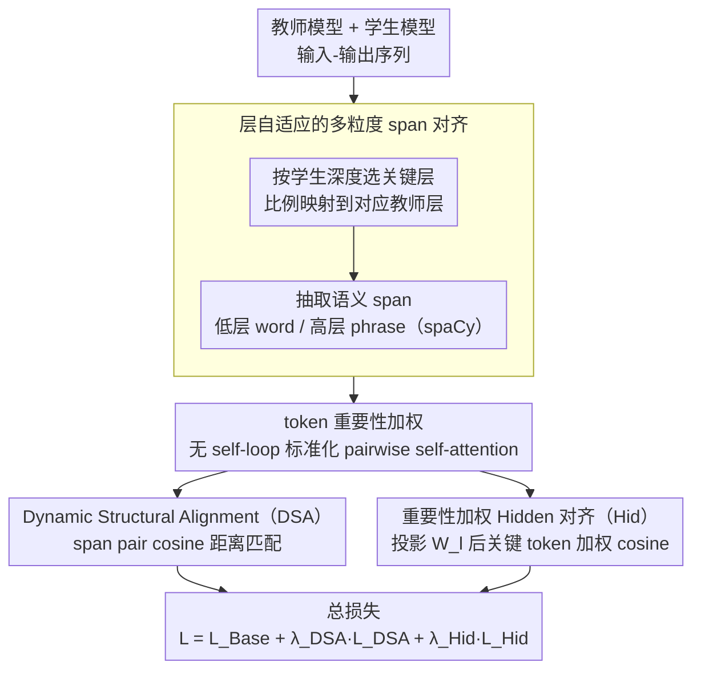

# MTA: Multi-Granular Trajectory Alignment for Large Language Model Distillation

**会议**: ACL2026  
**arXiv**: [2605.01374](https://arxiv.org/abs/2605.01374)  
**代码**: 无公开代码（论文未给出仓库链接）  
**领域**: 模型压缩  
**关键词**: 大语言模型蒸馏、轨迹对齐、层级语义、结构蒸馏、隐藏状态对齐

## 一句话总结
MTA 将 LLM 蒸馏从“对齐某几个静态层”推进到“按网络深度对齐表示演化轨迹”：低层对齐词级信息，高层对齐短语级关系几何，并作为插件稳定提升 FDD、DistiLLM、DistiLLM-2 在指令跟随任务上的 ROUGE-L 表现。

## 研究背景与动机
**领域现状**：LLM 压缩里，知识蒸馏仍是最常用路线之一。典型做法是让小模型学生匹配大模型教师的输出分布，例如 token-level KL；更进一步的方法会对齐中间 hidden states、attention maps 或层间 feature dynamics，让学生不只学最终答案，也学教师内部表征。

**现有痛点**：很多中间层蒸馏方法默认“所有层都用同一种对齐粒度”。它们通常在 token 级别做 hidden-state 对齐，或者把每个选中层映射到词表空间后对齐预测分布。这种处理简单，但忽略了 Transformer 层的功能分工：低层更像词汇与局部模式处理器，高层更偏向抽象语义与组合推理。

**核心矛盾**：学生模型需要继承教师的内部知识，但教师知识并不是一组彼此独立的层快照，而是随深度逐步演化的表征轨迹。如果用统一 token 目标强行约束全部层，低层的词汇基础、高层的短语组合关系都会被压成同一种监督信号，导致知识迁移不够精细。

**本文目标**：论文想解决三个具体问题：第一，如何让学生学习教师从词汇到语义组合的层级演化；第二，如何在不同参数规模、不同模型族之间选择少量关键层对齐；第三，如何把这种对齐作为模块接到已有蒸馏框架上，而不是重新设计整套 KD 流程。

**切入角度**：作者借用了语言的层级组合性和 Transformer 可解释性研究的结论：语言由词组成短语，模型低层偏词汇和事实记忆，高层偏抽象语义与复杂子任务。因此，蒸馏也应当随层深改变语义单元，而不是从头到尾只看 token。

**核心 idea**：用层自适应的多粒度 span 关系对齐，低层对齐 word spans，高层对齐 noun/verb phrase spans，让学生复制教师“表示几何如何随深度变化”的轨迹。

## 方法详解
MTA 是一个附加到现有 LLM 蒸馏方法上的模块。它并不替代原本的 logit KD、FDD 或 DistiLLM 目标，而是在这些基础损失之上加入两个额外约束：Dynamic Structural Alignment（DSA）负责对齐 span 之间的相对几何结构，Hidden Representation Alignment（Hid）负责把学生关键 token 的 hidden states 拉近教师 hidden states。

### 整体框架
给定一个教师模型和一个较小学生模型，MTA 先根据学生模型深度选择一组关键层，再用比例映射找到对应教师层。对于 GPT-2 120M，论文选择学生第 6 层做 word-level 对齐，第 9、12 层做 phrase-level 对齐；对于 Qwen1.5-0.5B 和 OPT-1.3B，则在更深层上选更多关键层。

在每个选中层，MTA 会先从输入-输出序列中抽取语义 span。低层 span 是完整单词，用来保留 lexical grounding；高层 span 是 noun phrase 和 verb phrase，用来表示更抽象的组合语义。论文使用 spaCy 等句法解析工具获得这些 span。

接着，MTA 为 token 计算重要性权重。由于自回归模型的因果注意力天然偏向早期 token，作者没有直接用原生 causal attention，而是用无 self-loop 的标准化 pairwise self-attention 重新估计“每个 token 被其他 token 关注的程度”。这些教师端 token 权重再用于 span 聚合和 pairwise span 权重。

最后，总训练目标是原有蒸馏损失加上两个 MTA 项：$L_{Total}=L_{Base}+\lambda_{DSA}L_{DSA}+\lambda_{Hid}L_{Hid}$。其中 $L_{Base}$ 可以来自 FDD、DistiLLM 或 DistiLLM-2，$\lambda_{DSA}$ 与 $\lambda_{Hid}$ 在实验中通常取 2/0.2 或 3/0.3。

### 关键设计

**1. 层自适应的多粒度 span 对齐：让监督粒度随网络深度切换，匹配 Transformer 的层级功能分工**

很多中间层蒸馏方法默认"所有层用同一种对齐粒度"，要么全程 token 级对齐，要么把每层都映射到词表空间对预测分布。但 Transformer 的层是有分工的：低层更像词汇与局部模式处理器，高层更偏抽象语义与组合推理，统一粒度会把这两种本质不同的知识压成同一种监督信号。MTA 把网络深度看成一条"从词汇基础到组合语义"的表示轨迹，于是让低层对齐完整 word span（保住 lexical grounding），高层对齐 noun phrase / verb phrase span（表示更抽象的组合语义），span 由 spaCy 等句法解析器抽取。

这样切换是有据可依的：低层若直接用短语对齐会丢掉细粒度词汇信息，高层若还只用词对齐则会过度约束本该抽象化的语义空间。消融里全 word、全 phrase 都不如 word+phrase 的混合策略，直接证明"粒度随层深切换"本身就是收益来源，而不是把语言学结论生搬硬套。

**2. Dynamic Structural Alignment（DSA）：对齐 span 之间的相对几何，而不是逐点复制某个表示**

学生和教师的 hidden dimension 往往不一致，硬把学生某个 span 的向量值拉到等于教师的，既难做到也不必要。DSA 改为对齐**关系结构**：在每个选中层，先把 span 内 token 的 hidden states 按重要性加权平均成 span 表示 $U_{k,l}$，再计算层内所有 span pair 的 cosine distance，最后最小化学生 span pair 距离与教师对应 span pair 距离的平方差，且每个 pair 的权重由教师端两个 span 的 salience 相乘得到。

相对几何比单个表示值更能刻画"教师如何组织语义单元之间的关系"。即便学生 hidden dimension 更小、绝对向量画不到一块去，只要它学到了类似的 span 关系结构，就能更好地保留教师的组合语义——这让 DSA 在不同宽度的 teacher-student 之间格外稳。

**3. 重要性加权的 Hidden Representation Alignment（Hid）：在结构之外，把关键 token 的特征值直接拉近**

DSA 管的是 span 之间的关系，但不约束具体特征值，所以还需要一个互补项把学生关键 token 的 hidden states 直接对齐到教师。由于维度不一致，MTA 为每个关键层学一个线性投影 $W_l$，把学生 hidden state 投到教师空间后再算加权 cosine distance，而且只对被抽取 span 覆盖的 token 集合计算，权重同样来自教师端 token importance，因此模型把注意力放在信息量高的 token 上，而不是平均对待停用词、padding 这类低语义贡献的 token。

DSA 管结构、Hid 管局部特征精度，两者是分工互补的关系。消融显示单独加入任一损失都有收益，而完整组合在多个 baseline 上都最好，说明"关系几何 + 特征重建"确实捕捉了两类不同的信息。

### 损失函数 / 训练策略
DSA 的核心是层内 pairwise distance matching。对于学生层 $l$ 和映射后的教师层 $\phi(l)$，每个 span pair $(i,j)$ 的损失形如 $w_{ij}^{sp}(d(U^S_{i,l},U^S_{j,l})-d(U^T_{i,\phi(l)},U^T_{j,\phi(l)}))^2$，其中 $d$ 是 cosine distance，$w_{ij}^{sp}$ 来自教师端 span 权重。

Hid 的核心是投影后的 token hidden-state cosine 对齐。学生表示 $H^S_{t,l}$ 经 $W_l$ 投到教师维度，再与 $H^T_{t,l}$ 做加权 cosine distance。权重来自教师端 token importance，因此模型更关注信息量高的 token，而不是平均处理停用词、padding 或低语义贡献 token。

训练上，作者在 Dolly-15k 上做蒸馏训练，并在 Dolly、SelfInst、VicunaEval、Super-Natural Instructions 上评估。GPT-2 和 Qwen1.5 使用全参数微调，OPT 使用 LoRA。生成评估用 5 个随机种子，报告平均 ROUGE-L。MTA 只增加训练阶段成本，推理阶段不需要句法解析或额外模块。

## 实验关键数据

### 主实验
论文把 MTA 接到 FDD、DistiLLM、DistiLLM-2 上，测试三组同族 teacher-student：GPT-2 1.5B → GPT-2 120M、Qwen1.5 1.8B → Qwen1.5 0.5B、OPT 6.7B → OPT 1.3B。指标是四个指令跟随数据集上的 ROUGE-L 平均值。

| 模型对 | 基础方法 | Avg. ROUGE-L | 加 MTA 后 | 提升 |
|--------|----------|--------------|-----------|------|
| GPT-2 1.5B → 120M | FDD | 19.48 | 20.50 | +1.02 |
| GPT-2 1.5B → 120M | DistiLLM | 20.21 | 21.45 | +1.24 |
| GPT-2 1.5B → 120M | DistiLLM-2 | 18.59 | 19.94 | +1.35 |
| Qwen1.5 1.8B → 0.5B | FDD | 19.27 | 20.92 | +1.65 |
| Qwen1.5 1.8B → 0.5B | DistiLLM | 19.80 | 21.01 | +1.21 |
| Qwen1.5 1.8B → 0.5B | DistiLLM-2 | 23.39 | 24.73 | +1.34 |
| OPT 6.7B → 1.3B | FDD | 21.74 | 22.90 | +1.16 |
| OPT 6.7B → 1.3B | DistiLLM | 22.98 | 23.97 | +0.99 |
| OPT 6.7B → 1.3B | DistiLLM-2 | 22.96 | 23.22 | +0.26 |

从表中可以看出，MTA 对不同架构和不同蒸馏框架都基本稳定有效。收益最大的一些设置出现在小学生模型上，例如 Qwen1.5-0.5B + FDD 的平均分提升 1.65，说明内部轨迹监督对容量受限学生尤其有帮助。

### 消融实验
作者主要在 GPT-2 1.5B → GPT-2 120M 设置下做消融，分别验证 DSA、Hid、多粒度策略、span 权重和层数选择。

| 配置 | Dolly | SelfInst | Vicuna | S-NI | Avg. | 说明 |
|------|-------|----------|--------|------|------|------|
| DistiLLM | 25.65 | 13.39 | 16.50 | 25.28 | 20.21 | 原始 baseline |
| + Hid | 25.89 | 13.68 | 16.86 | 25.77 | 20.55 | 只加隐藏状态对齐 |
| + DSA | 25.77 | 14.24 | 16.27 | 27.40 | 20.92 | 只加结构几何对齐 |
| + Full MTA | 25.77 | 14.19 | 16.67 | 29.18 | 21.45 | 两个损失组合最好 |
| DistiLLM + 全 Word | 25.82 | 13.54 | 16.67 | 27.16 | 20.80 | 所有层都用 word spans |
| DistiLLM + 全 Phrase | 25.96 | 14.25 | 17.03 | 27.42 | 21.17 | 所有层都用 phrase spans |
| DistiLLM + MTA | 25.77 | 14.19 | 16.67 | 29.18 | 21.45 | 1 个 word 层 + 2 个 phrase 层 |
| DistiLLM + MTA w/o weight | 25.95 | 14.10 | 16.38 | 26.21 | 20.66 | 去掉重要性权重 |
| DistiLLM + MTA w/ weight | 25.77 | 14.19 | 16.67 | 29.18 | 21.45 | 保留教师端 span/token 权重 |

### 关键发现
- DSA 的贡献通常比 Hid 更大，尤其在 S-NI 上提升明显，说明保持 span 间关系结构比只拉近单点 hidden states 更能增强泛化。
- 完整 MTA 比单独 DSA 或 Hid 更好，说明“关系几何”和“特征重建”互补：前者管结构，后者管局部表示精度。
- 全 word 与全 phrase 都逊于层自适应策略。低层需要词汇 grounding，高层需要短语级组合语义，这个假设被 Table 3 和 Table 4 同时支持。
- span 权重不是装饰项。DistiLLM 设置下去掉权重后平均分从 21.45 降到 20.66，S-NI 从 29.18 降到 26.21，说明教师端 salience 对过滤低价值 token 很关键。
- 层数不是越多越好。GPT-2 设置中，中间层预算从 0 增至 3 会明显提升，但继续增到 4 或 5 出现收益递减甚至下降，论文将其归因于相邻层冗余。
- 计算开销集中在训练阶段。DistiLLM 单步约 0.26s，DistiLLM+MTA 优化后约 0.48s；FDD 单步约 0.49s，FDD+MTA 约 0.69s。推理阶段完全无额外成本。

## 亮点与洞察
- **从点对齐转向轨迹对齐**：论文没有只问“哪一层对哪一层”，而是问“学生是否沿着类似教师的词汇到语义演化路径前进”。这个视角比普通 hidden-state matching 更贴近 Transformer 的层级功能。
- **把 span 关系作为蒸馏对象**：DSA 对齐的是 span pair 的相对距离，而不是原始向量值。对于不同宽度的 teacher-student，这种关系级监督更稳，也更容易表达语义结构。
- **多粒度不是人工复杂化，而是和层功能绑定**：低层 word、高层 phrase 的分工解释清楚，消融也支持。它给后续压缩方法一个可复用思路：中间层监督应随深度改变目标粒度。
- **作为插件而不是替代框架**：MTA 可以接到 FDD、DistiLLM、DistiLLM-2 上，说明它更像一种额外的 representation regularizer。对已有蒸馏 pipeline 来说，集成门槛相对低。
- **训练效率分析比较诚实**：论文承认 spaCy span extraction 带来额外训练耗时，并做了 time-matched baseline 对比，证明收益不是简单来自更多训练时间。

## 局限与展望
- **依赖外部句法解析器**：MTA 需要抽取 noun phrase 和 verb phrase，训练时会引入 spaCy 等工具链成本；对于多语言、代码、数学文本或 parser 质量较差的领域，span 质量可能影响蒸馏效果。
- **实验任务主要是指令跟随生成**：评估集中在 ROUGE-L 和 LLM-as-a-judge，缺少更广泛的推理、事实性、长上下文、多轮对话和安全性评估。MTA 是否能稳定改善这些能力仍需验证。
- **teacher-student 共享 tokenizer 的限制较明显**：论文的 baseline 选择强调同 tokenizer 设置。若 teacher 和 student tokenizer 不同，word/phrase span 与 token hidden states 的映射会更复杂，需要额外对齐机制。
- **层选择仍是经验规则**：虽然作者使用 strided top-down 规则并做了敏感性分析，但 word/phrase 层分配仍依赖模型深度和实验经验。未来可以考虑自动选择关键层或动态调整粒度。
- **结构对齐的计算复杂度可能随 span 数增长**：DSA 需要计算 span pair 距离，长序列或 span 很多时成本会上升。可改进方向包括采样 span pair、低秩近似关系矩阵或用轻量 learned parser 替代外部解析器。

## 相关工作与启发
- **vs FDD**: FDD 把 Transformer 深度看成动态系统，主要对齐中间层预测轨迹和有限差分变化。MTA 继承“轨迹”思想，但不只看 LM-head 后的预测分布，而是对齐 span 表示的关系几何，更强调层级语义结构。
- **vs DistiLLM / DistiLLM-2**: DistiLLM 系列主要改进 KL 形式、off-policy/on-policy 数据和 contrastive distillation，解决输出分布蒸馏的稳定性与数据效率。MTA 与它们互补，在这些 base loss 之外增加内部表示轨迹约束。
- **vs TinyBERT / MiniLM 等中间层蒸馏**: 传统 Transformer 蒸馏往往对齐 hidden states 或 attention maps，监督粒度相对固定。MTA 的区别在于用 word/phrase span 替代统一 token 对齐，并且显式对齐 span 间关系结构。
- **vs 语言学/可解释性研究**: Tenney、Rogers、Clark 等工作说明 Transformer 层有从表层到语义的层级功能。MTA 的启发在于把这种分析性结论转成可训练损失，用来指导模型压缩。
- **对后续工作的启发**: 多粒度轨迹对齐可以迁移到多模态蒸馏，例如视觉低层 patch/edge 对齐、高层 object/region 对齐；也可以用于 MoE 蒸馏，让学生对齐不同专家路由下的语义单元关系。

## 评分
- 新颖性: ⭐⭐⭐⭐☆ 将语言层级结构和 feature trajectory distillation 结合得较自然，DSA 的 span 关系几何对齐有辨识度，但整体仍建立在已有中间层蒸馏框架之上。
- 实验充分度: ⭐⭐⭐⭐☆ 覆盖三组 teacher-student、三类 strong baseline、多项消融和效率分析；不足是任务类型偏指令跟随，评价维度还不够多样。
- 写作质量: ⭐⭐⭐⭐☆ 动机、方法和消融逻辑清晰，公式完整；但表格在 arXiv HTML 中可读性一般，部分实现细节如 parser 错误处理和长序列成本还可以更展开。
- 价值: ⭐⭐⭐⭐☆ 对 LLM 蒸馏很有实用启发，尤其适合作为现有 KD 框架的训练期增强模块；最大实际障碍是外部 span 抽取和训练开销。

<!-- RELATED:START -->

## 相关论文

- [\[ACL 2026\] SRA: Span Representation Alignment for Large Language Model Distillation](sra_span_representation_alignment_for_large_language_model_distillation.md)
- [\[ACL 2026\] Alignment Tuning for Large Language Models: A Data-Centric Lens on Alignment Data Pipelines](alignment_tuning_for_large_language_models_a_data-centric_lens_on_alignment_data.md)
- [\[CVPR 2025\] Multi-modal Knowledge Distillation-based Human Trajectory Forecasting](../../CVPR2025/model_compression/multi-modal_knowledge_distillation-based_human_trajectory_forecasting.md)
- [\[ACL 2025\] Quantification of Large Language Model Distillation](../../ACL2025/model_compression/quantification_of_large_language_model_distillation.md)
- [\[CVPR 2026\] Beyond Loss Values: Robust Dynamic Pruning via Loss Trajectory Alignment](../../CVPR2026/model_compression/beyond_loss_values_robust_dynamic_pruning_via_loss_trajectory_alignment.md)

<!-- RELATED:END -->
