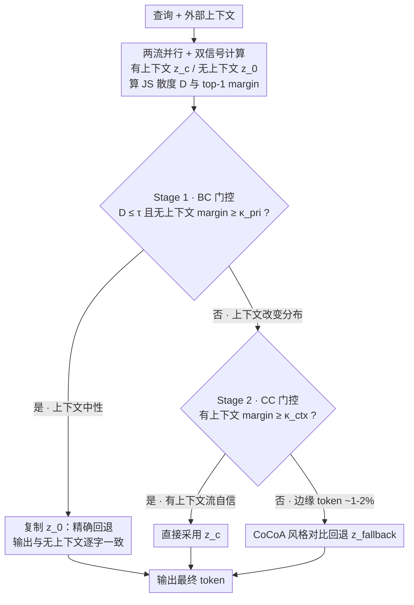

# No-Worse Context-Aware Decoding: Preventing Neutral Regression in Context-Conditioned Generation

**会议**: ACL 2026 Findings  
**arXiv**: [2604.16686](https://arxiv.org/abs/2604.16686)  
**代码**: [GitHub](https://github.com/CastGryff/NWCAD)  
**领域**: 模型压缩/解码策略  
**关键词**: 上下文感知解码, 中性退化, 检索增强生成, 两阶段门控, 解码时适配器

## 一句话总结

提出 NWCAD，一种解码时适配器，通过两阶段门控机制在上下文无信息时精确回退到无上下文解码（防止中性退化），在上下文有帮助时利用上下文进行修正，兼顾"无害"与"有效"两个目标。

## 研究背景与动机

**领域现状**：大语言模型在检索增强生成（RAG）等场景中，需要根据外部上下文（如检索到的段落）生成回答。现有的上下文感知解码方法（如 CAD、AdaCAD、CoCoA）通过对比有/无上下文的 token 分布来增强上下文利用，在冲突场景下表现不错。

**现有痛点**：这些连续 logit 倾斜方法存在"中性退化"（neutral regression）问题——即使上下文实际上没有提供有用信息，模型也会因为微小的分布差异改变原本正确的答案。这种退化在聚合准确率中难以发现，因为正确和错误的变化会相互抵消。

**核心矛盾**：do-no-harm（无害性）与 context utilization（上下文利用）之间存在根本的 trade-off。当上下文无信息时，解码器应保留无上下文的输出；当上下文有信息时，解码器应利用上下文修正答案。连续的 logit 倾斜方法无法在两者间做出明确选择，因为它们总是在扰动 logits。

**本文目标**：设计一种解码时适配器，能够 (1) 在上下文无信息时精确回退到无上下文解码，保证不退化；(2) 在上下文有信息时有效利用上下文修正答案。

**切入角度**：作者观察到大多数上下文感知解码实际上可以归结为"在无上下文流和有上下文流之间做选择"，真正需要对比混合的步骤非常少（仅约 1-2% 的 token）。这意味着一个显式的路由/门控机制比连续混合更合适。

**核心 idea**：用两阶段门控替代连续 logit 倾斜——Stage 1 判断是否回退到无上下文流（防止中性退化），Stage 2 在有上下文流和 CAD 风格回退解码器之间选择（利用上下文）。

## 方法详解

### 整体框架

NWCAD 维护两个并行前向传播（有上下文 vs 无上下文），在每个解码步骤通过两阶段门控选择使用哪个流的 logits。输入是查询和可选的外部上下文，输出是最终生成的文本。整个过程是三路路由：无上下文解码 / 有上下文解码 / CAD 风格回退解码。

### 关键设计

**1. 两流并行 + 双信号计算：为门控决策提供"上下文有没有用、模型有没有把握"两把尺子**

要判断该不该用上下文，先得有可量化的依据。NWCAD 在每个解码步 $t$ 同时跑两路前向，分别得到有上下文 logits $z_c^t$ 和无上下文 logits $z_0^t$，对应分布 $p_c^t$ 与 $p_0^t$，再从中抽出两个信号。第一个是 JS 散度 $D^t = \text{JS}(p_c^t \| p_0^t)$（用 top-50 token 近似全词表），衡量上下文到底有没有实质改变分布；第二个是 top-1 margin，即最高概率与次高概率之差，衡量模型对当前这一步有多"果断"。

两个信号合起来才能精确识别"安全回退"场景：$D^t$ 低说明上下文是中性的、没带来新信息，margin 高说明无上下文流自己就很有把握——只有同时满足，才敢断定"这一步用不用上下文都一样，那就别动它"。这正是后面门控判断的输入。

**2. Stage 1 — BC 门控（Baseline-Correct Gate）：上下文没用时，完全不倾斜、精确回退**

CAD 这类连续 logit 倾斜方法的通病是"中性退化"——哪怕上下文毫无帮助，微小的分布差异也会把原本正确的答案改错，而且这种退化在聚合准确率里会被对错相消掩盖掉。NWCAD 的对策是显式回退：当 $D^t \leq \tau$（两分布一致）且无上下文流 margin $\geq \kappa_{\text{pri}}$（无上下文流足够自信）时，直接复制无上下文 logits，即 $z'^t = z_0^t$。

这与 CAD"减弱倾斜强度"有本质区别——它是**完全不倾斜**。在贪婪解码下，复制 logits 保证输出 token 与无上下文流逐字一致，于是"do-no-harm"成了可证明的硬保证，而连续扰动永远做不到这点。阈值 $\tau$ 直接控制保守程度：调小就更倾向回退、更不容易被无关上下文带偏。

**3. Stage 2 — CC 门控（Context-Confident Gate）：上下文有用时，在直接采信与对比回退之间二选一**

当 Stage 1 没触发（说明上下文确实改变了分布），还要决定怎么用它。NWCAD 检查有上下文流的 margin：若 $\geq \kappa_{\text{ctx}}$（有上下文流足够自信），就直接采用 $z_c^t$；否则才退到一个 CAD 风格的对比解码器 $z_{\text{fallback}}^t$（默认 CoCoA）去做有/无上下文的对比混合。

关键观察是：大多数时候有上下文流本身就够自信，根本不需要昂贵的对比混合，真正落到 fallback 的只有约 1-2% 的 token。这把"每步都混合"的假设彻底翻转成"绝大多数步骤只是在两条单流之间路由，只有极少数边缘步骤才需要对比"，既省算力又避免了无谓扰动。而且这个 fallback 是可插拔的——CAD / AdaCAD / CoCoA 都能接，NWCAD 相当于套在它们外面的一层路由器。

### 一个完整示例：三个 token 各走一条路

设阈值为 $\tau$、$\kappa_{\text{pri}}$、$\kappa_{\text{ctx}}$（下列数值仅为示意），回答 "谁写了《哈姆雷特》？"，检索到一段关于莎士比亚的上下文：

1. **回退到无上下文流（Stage 1 命中）**：生成定冠词、虚词这类 token 时，有/无上下文分布几乎重合，$D^t$ 很低 $\leq \tau$，且无上下文流 margin 很高 $\geq \kappa_{\text{pri}}$ → BC 门控触发，直接 $z'^t = z_0^t$，输出与无上下文逐字相同，**零退化风险**。
2. **直接采信有上下文流（Stage 2，CC 命中）**：到了关键实体 token，上下文把"莎士比亚"的概率显著抬高，$D^t > \tau$ 进入 Stage 2，而有上下文流 margin $\geq \kappa_{\text{ctx}}$ 很果断 → 直接用 $z_c^t$，吃到上下文带来的修正。
3. **对比回退（Stage 2，落到 fallback）**：偶尔遇到上下文确实改变了分布、但有上下文流自己也犹豫（margin $< \kappa_{\text{ctx}}$）的边缘 token，才调用 CoCoA 做有/无上下文对比混合 $z_{\text{fallback}}^t$。

整段生成里，绝大多数 token 走第 1、2 条单流路径，只有约 1-2% 落到第 3 条，所以延迟反而和基础解码器相当甚至更快——这把"路由决策本身贡献了大部分增益、对比混合只是兜底"这件事变得很直观。

### 损失函数 / 训练策略

NWCAD 是纯解码时方法，无需训练。三个超参数（$\tau$, $\kappa_{\text{pri}}$, $\kappa_{\text{ctx}}$）在 Llama-3.1-8B 的受控数据集上调优后直接迁移到其他模型，无需重新调参。

## 实验关键数据

### 主实验

在受控的 Augmented NQ-open 上评估（分为 Restated/Distractor/Helpful 三个子集）：

| 方法 | Restated (↑) | Distractor (↑) | Helpful (↑) | 加权平均 |
|------|-------------|----------------|-------------|---------|
| No-context | 100% | 100% | 0% (by design) | — |
| With-context | ~95% | ~85% | ~65% | — |
| CAD | 退化严重 | 退化严重 | 中等 | 低 |
| CoCoA | 退化严重 | 退化严重 | 中等 | 低 |
| NWCAD | ~99% | ~97% | ~62% | **最佳** |

在 12 个全切片 QA 基准 + 2 个非 QA 任务（ToFuEval、ExpertQA）上全面领先。

### 消融实验

| 配置 | Restate-hard | Distractor-hard | Helpful | NQ-SWAP |
|------|-------------|----------------|---------|---------|
| No-context | 48% | 50% | 8% | 0% |
| With-context | 83% | 29% | 64% | 52% |
| NWCAD_BC (Stage 1 only) | 80% | 31% | 52% | 52% |
| No-fallback | 85% | 31% | 62% | 52% |
| NWCAD (full) | 85% | 31% | 62% | 51% |

### 关键发现

- Stage 2 平均提升 5.2%，主要贡献在 Helpful 场景，说明 CC 门控有效利用了上下文
- 回退解码器仅在 1-2% 的 token 上被调用，说明大多数增益来自路由决策本身而非对比混合
- NWCAD 作为适配器可以叠加在 CAD/AdaCAD/CoCoA 之上，一致提升 7-40 个百分点
- 延迟与基础解码器相当甚至更快（路由到单流时跳过对比计算），比率在 0.88-1.01 之间

## 亮点与洞察

- **"大多数上下文感知解码归结为路由选择"的洞察**非常深刻——实验证明仅 1-2% 的 token 需要对比混合，这挑战了 CAD 系列方法"每步都混合"的基本假设
- **精确回退的设计思路可迁移**——任何涉及"两种策略间切换"的场景（如多模态融合、多专家路由）都可以借鉴这种"先判断是否需要，再选择如何做"的两阶段门控
- **受控评估方法论**值得学习——将中性/有帮助场景分开评估，避免聚合指标掩盖退化问题

## 局限与展望

- 仅支持贪婪解码，未扩展到采样解码（sampling-based generation），限制了在创意生成等场景的应用
- 需要访问 token 级 logits，不适用于黑盒 API 模型（如 GPT 系列）
- 超参数在单一模型上调优后迁移，对新模型/新领域可能不够最优
- 长文本生成（如摘要、长回答）中的效果需要进一步验证

## 相关工作与启发

- **vs CAD/AdaCAD/CoCoA**: 这些方法连续倾斜 logits，无法保证无退化；NWCAD 通过显式门控实现精确回退，本质上是从"如何混合"转向"是否混合"
- **vs 选择性回答/弃权方法**: 弃权方法在响应级别决策，NWCAD 在 token 级别决策，粒度更细且不需要额外模型

## 评分

- 新颖性: ⭐⭐⭐⭐ 两阶段门控思路简洁有效，但核心组件（JS散度、margin）都是现成工具
- 实验充分度: ⭐⭐⭐⭐⭐ 受控评估设计精良，消融全面，跨模型/跨任务验证充分
- 写作质量: ⭐⭐⭐⭐⭐ 问题定义清晰，受控实验设计逻辑自洽，图表信息密度高
- 价值: ⭐⭐⭐⭐ 对 RAG 系统的可靠性有实际意义，但局限于贪婪解码降低了通用性

<!-- RELATED:START -->

## 相关论文

- [\[ACL 2026\] FastKV: Decoupling of Context Reduction and KV Cache Compression for Prefill-Decoding Acceleration](fastkv_decoupling_of_context_reduction_and_kv_cache_compression_for_prefill-deco.md)
- [\[ICML 2025\] Core Context Aware Transformers for Long Context Language Modeling](../../ICML2025/model_compression/core_context_aware_transformers_for_long_context_language_modeling.md)
- [\[ICML 2025\] Context Tuning for In-Context Optimization](../../ICML2025/model_compression/context_tuning_for_in-context_optimization.md)
- [\[ACL 2026\] DASH-KV: Accelerating Long-Context LLM Inference via Asymmetric KV Cache Hashing](dash-kv_accelerating_long-context_llm_inference_via_asymmetric_kv_cache_hashing.md)
- [\[ACL 2026\] Latent-Condensed Transformer for Efficient Long Context Modeling](latent-condensed_transformer_for_efficient_long_context_modeling.md)

<!-- RELATED:END -->
