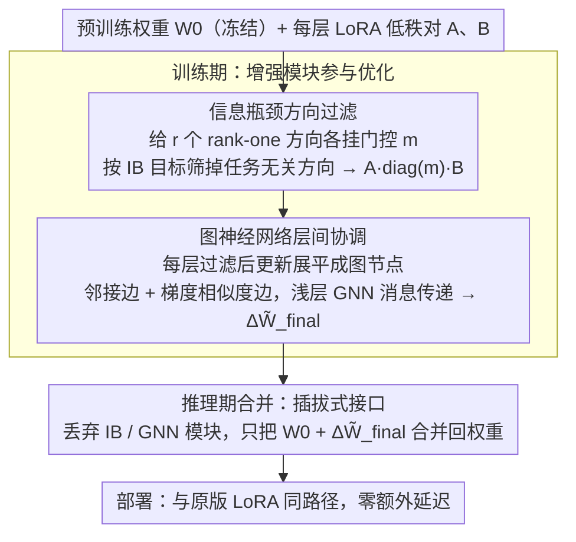

# Not All Directions Matter: Towards Structured and Task-Aware Low-Rank Model Adaptation

**会议**: ACL 2026  
**arXiv**: [2603.14228](https://arxiv.org/abs/2603.14228)  
**代码**: https://xixiaouab.github.io/StructLoRA/  
**领域**: 模型压缩 / 参数高效微调 / LoRA / 结构化适配  
**关键词**: LoRA, 参数高效微调, 信息瓶颈, 图神经网络, 层间协调

## 一句话总结
本文提出 StructLoRA：先用信息瓶颈过滤掉低秩更新里与任务无关的方向，再用训练期图神经网络协调不同层的 LoRA 更新，在语言、视觉和多模态任务上稳定超过 LoRA / AdaLoRA / DoRA / Sensitivity-LoRA，同时保持推理零额外开销。

## 研究背景与动机

**领域现状**：大模型微调的主流工程路线已经从 full fine-tuning 转向 PEFT。LoRA 是其中最常用的一类方法：冻结预训练权重 $W_0$，只学习一个低秩增量 $\Delta W = AB$，训练后把 $AB$ 合并回原权重，因此部署时没有额外延迟。围绕 LoRA 的改进很多，例如 QLoRA 通过量化节省显存，AdaLoRA / DyLoRA / Sensitivity-LoRA 动态分配 rank，DoRA 把权重幅度和方向解耦，LoRA-Dropout / LoRAPrune 用稀疏化控制过拟合或冗余。

**现有痛点**：这些方法大多仍默认两个前提。第一，给定 rank 里的每个方向都值得被同等训练；第二，不同 Transformer 层可以各自独立学习自己的 LoRA 更新。作者认为这两个前提在低 rank、少数据和复杂多模态任务中尤其危险：低秩子空间里会混入噪声方向，层间更新也可能互相不协调，导致有限参数预算被花在无效甚至有害的方向上。

**核心矛盾**：LoRA 表面上是在压缩参数量，真正决定性能的却是“更新信息质量”。当 rank 很小的时候，模型不仅要问“给每层多少 rank”，还要问“哪些 rank-one 方向真的服务于任务”；当模型很深的时候，还要问“相邻层的更新是否沿着一致的语义轨迹移动”。论文把这两个问题概括为 **semantic drift** 和 **structural incoherence**：前者来自无差别地保留低秩方向，后者来自逐层独立适配。

**本文目标**：作者试图在不改变 LoRA 推理接口的前提下，同时解决方向选择和层间协调两个问题。具体目标包括：(1) 在 rank 维度上保留任务相关方向、抑制噪声方向；(2) 在层维度上让更新轨迹更平滑、更一致；(3) 保持训练开销小、推理开销为零；(4) 在 LLM、VLM 和 ViT 上验证方法不是只适用于单一架构。

**切入角度**：作者的观察很直接：低秩更新不是一个不可分割的整体，而是若干个 rank-one 方向的组合；深度网络的每层更新也不是孤立点，而可以看成沿模型深度排列的一条信号。于是 StructLoRA 把 LoRA 更新拆成两个可控维度：在每层内部，用信息瓶颈筛方向；在层与层之间，用图消息传递对筛过的更新做协调。

**核心 idea**：把 LoRA 从“固定低秩参数压缩”推进到“任务感知的信息筛选 + 结构感知的层间协同”：只让有用方向留下来，并让这些方向在模型深度上以更一致的方式共同适配。

## 方法详解

### 整体框架

StructLoRA 保留标准 LoRA 的基本接口。对预训练权重 $W_0 \in \mathbb{R}^{d\times k}$，LoRA 学习 $A \in \mathbb{R}^{d\times r}$ 与 $B \in \mathbb{R}^{r\times k}$，前向为 $y=(W_0+\alpha AB)x$。StructLoRA 不改变这一部署形式，而是在训练期把 $AB$ 替换成更“干净”和更“协调”的更新。

整个流程可以分成两步。第一步是每层内部的方向过滤：对 rank 维度引入门控向量 $m\in[0,1]^r$，把更新写成 $\Delta\tilde{W}=A\operatorname{diag}(m)B$，让每个 rank-one 方向都有一个可学习的重要性。第二步是跨层协调：把每一层过滤后的 $\Delta\tilde{W}_\ell$ 展平成节点特征，按照层邻接关系和梯度相似度构造图，再用浅层 GNN 做消息传递，得到最终更新 $\Delta\tilde{W}^{\text{final}}_\ell$。

训练时，IB 过滤器和 GNN 协调器都参与优化；推理时，这两个模块被丢弃，只把最终低秩更新合并进 $W_0$。因此 StructLoRA 的推理路径与 LoRA 一样，不需要额外前向、额外分类头或额外路由器。

### 关键设计

**1. 信息瓶颈驱动的低秩方向过滤：在 rank 维度上只留下服务任务的方向**

标准 LoRA 把 $AB$ 里的 $r$ 个 rank-one 方向一视同仁，但在 $r\leq 8$ 这种紧预算下，混进来的噪声方向会直接挤占本就稀缺的容量，也就是作者说的 semantic drift。StructLoRA 给每个方向挂一个门控 $m_j\in[0,1]$，把更新改写成 $A\operatorname{diag}(m)B$，让“这个方向值不值得训练”变成可学习的量。门控不是靠范数大小或随机 dropout 决定的——“更新幅度大”并不等于“对任务有语义贡献”——而是用信息瓶颈目标 $\mathcal{L}_{\text{IB}}=\mathcal{L}_{\text{task}}+\beta I(\Delta\tilde{W};X)-\gamma I(\Delta\tilde{W};Y)$ 来学：$\beta$ 那一项惩罚更新对输入中无关变化的依赖，$\gamma$ 那一项奖励更新保留与标签有关的信息。

实现上，连续情形用 variational IB 的 KL 上界当可训练正则；需要硬选择时用 Gumbel-Softmax 做可微近似。这样方向选择就从启发式稀疏化升级成了和任务目标直接绑定的选择，少数据时尤其能挡住对噪声方向的过拟合。

**2. 图神经网络式的层间更新协调：让相邻层的更新沿一致的语义轨迹移动**

逐层独立适配的第二个隐患是 structural incoherence——实测下相邻层 LoRA 梯度的余弦相似度只有 0.27-0.41，说明各层的更新轨迹是碎片化的，彼此不借力。StructLoRA 把每一层当成图的一个节点，节点特征取过滤后更新的展平向量 $h_\ell^{(0)}=\operatorname{vec}(\Delta\tilde{W}_\ell)$；边既包含相邻层的结构边，也可加入由 batch 平均梯度余弦相似度构造的语义边。随后一个浅层 GCN / GAT 用残差消息传递更新节点：

$$h_\ell^{(t+1)}=h_\ell^{(t)}+\sigma\Big(\sum_{j\in\mathcal{N}(\ell)\cup\{\ell\}}\tfrac{1}{\sqrt{d_\ell d_j}}h_j^{(t)}\Theta^{(t)}\Big)$$

传递完再映射回参数空间，得到 $\Delta\tilde{W}^{\text{final}}_\ell$。和固定的 cosine / Laplacian 正则不同，GNN 是根据层间结构和训练数据动态学习“哪些层该互相借力”，耦合强度不再写死。附录给了一个等价视角：这相当于做 Laplacian smoothing，压低层间漂移能量 $\sum_\ell\|u_{\ell+1}-u_\ell\|_2^2$，把相邻层余弦从约 0.34 提到约 0.62。

**3. 训练期增强、推理期合并的插拔式接口：复杂度只留在训练，部署仍是零延迟 LoRA**

很多 PEFT 改进一旦引入动态路由、额外 adapter 或多分支推理，就会损失 LoRA 最大的工程优势——可合并、零额外延迟。StructLoRA 刻意把 IB 门控和 GNN 协调器都限制在训练阶段：最终落到模型里的只是 $W_0+\Delta\tilde{W}^{\text{final}}$，两个辅助模块在推理时整个丢弃，所以推理路径和原版 LoRA 完全一样，不需要额外前向、分类头或路由器。

落地时论文默认在 attention 的 $W_q$、$W_v$ 上插 PEFT 模块，rank 和缩放沿用 LoRA 设置（如 $r=8,\alpha=16$）。因为复杂度只在训练期，StructLoRA 还能叠在 QLoRA、LoRA-FA、VeRA、AdapterFusion 之上当“增强层”，而不是互斥替代品，特别契合“离线微调一次、之后大规模部署多个任务适配器”的场景。

### 损失函数 / 训练策略

总目标可以理解为任务损失加 IB 门控正则：$\mathcal{L}_{\text{total}}=\mathcal{L}_{\text{task}}(Y,f(X;W_0+\Delta\tilde{W}^{\text{final}}))+\lambda_{\text{IB}}\mathcal{L}_{\text{IB}}(m)$。其中 $\Delta\tilde{W}^{\text{final}}$ 是经过方向过滤和图协调后的低秩更新。

实验中，所有 backbone 权重冻结，只训练 PEFT 参数及训练期辅助模块。论文使用 PyTorch 2.2 和 A100 80GB，优化器为 AdamW，$\beta_1=0.9, \beta_2=0.999$，weight decay 为 0.01，学习率从 $\{1\times10^{-4},2\times10^{-4},5\times10^{-4}\}$ 中选择，batch size 从 $\{16,32,64\}$ 中选择，warmup ratio 为 0.06。大多数实验 rank 固定为 8，结果取 3 个随机种子平均，并用 paired two-sided t-test 检验相对 LoRA 的显著性。

## 实验关键数据

### 主实验

论文的主表覆盖语言推理、视觉分类、图像描述和 VQA，所有 PEFT 方法控制在约 0.5%-1% 可训练参数预算。StructLoRA 在每个任务上都超过最强 LoRA 变体，并接近 full fine-tuning。

| 方法 | BoolQ Acc | PIQA Acc | CIFAR-100 Acc | ImageNet Acc | COCO CIDEr | VQAv2 Acc |
|------|-----------|----------|---------------|--------------|------------|-----------|
| Full Fine-tuning | 82.6 | 85.3 | 85.9 | 78.8 | 123.5 | 76.2 |
| LoRA | 79.1 | 82.4 | 81.5 | 76.2 | 116.2 | 73.5 |
| QLoRA | 80.0 | 83.1 | 82.7 | 76.9 | 119.1 | 74.2 |
| DoRA | 80.6 | 83.7 | 83.2 | 77.3 | 120.3 | 75.0 |
| Sensitivity-LoRA | 80.9 | 84.0 | 83.5 | 77.5 | 120.8 | 75.2 |
| **StructLoRA** | **82.1** | **84.9** | **85.1** | **78.6** | **122.9** | **75.9** |

在 GLUE 的 RoBERTa-base 受控对比中，StructLoRA 平均分 86.5，比 Sensitivity-LoRA 高 0.5，比 LoRA 高 1.4。这个实验很关键，因为它把对比聚焦到动态 rank 分配方法：如果只改“每层给多少 rank”，仍然不如同时处理“方向是否相关”和“层间是否协调”。

| 方法 | MNLI | SST-2 | MRPC | CoLA | QNLI | QQP | RTE | STS-B | Avg. |
|------|------|-------|------|------|------|-----|-----|-------|------|
| LoRA | 87.3 | 93.5 | 87.1 | 58.8 | 93.0 | 90.5 | 79.4 | 91.0 | 85.1 |
| AdaLoRA | 87.3 | 93.6 | 87.3 | 59.0 | 93.1 | 90.6 | 79.6 | 91.2 | 85.2 |
| DyLoRA | 87.2 | 93.7 | 87.3 | 59.0 | 93.0 | 90.6 | 79.6 | 91.2 | 85.2 |
| Sensitivity-LoRA | 87.6 | 94.6 | 87.7 | 60.2 | 93.6 | 90.7 | 81.8 | 91.3 | 86.0 |
| **StructLoRA** | **88.1** | **95.0** | **88.5** | **61.5** | **94.1** | **91.0** | **82.3** | **91.5** | **86.5** |

低 rank 实验说明，StructLoRA 的收益在预算最紧时最明显。尤其 COCO Caption 在 $r=8$ 时从 116.2 提到 122.4，说明 IB 过滤和层间协调不仅是小修小补，而是在有限 rank 下显著改变了容量使用方式。

| Rank | 参数比例 | BoolQ LoRA | BoolQ StructLoRA | CIFAR LoRA | CIFAR StructLoRA | COCO LoRA | COCO StructLoRA |
|------|----------|------------|------------------|------------|------------------|-----------|-----------------|
| 2 | 0.12% | 75.1 | 77.4 (+2.3) | 78.3 | 80.1 (+1.8) | 111.2 | 114.3 (+3.1) |
| 4 | 0.24% | 77.6 | 79.9 (+2.3) | 79.7 | 82.2 (+2.5) | 113.8 | 117.0 (+3.2) |
| 8 | 0.48% | 79.1 | 81.3 (+2.2) | 81.5 | 84.1 (+2.6) | 116.2 | 122.4 (+6.2) |
| 16 | 0.95% | 80.3 | 81.7 (+1.4) | 82.8 | 84.3 (+1.5) | 118.1 | 123.6 (+5.5) |
| 32 | 1.90% | 81.0 | 81.9 (+0.9) | 83.4 | 84.5 (+1.1) | 119.0 | 123.9 (+4.9) |

少数据实验也支持同一结论：数据越少，噪声方向越容易被过拟合，StructLoRA 的任务感知过滤越有用。

| 数据集 / 指标 | 方法 | 10% 数据 | 25% 数据 | 50% 数据 | 100% 数据 |
|---------------|------|----------|----------|----------|-----------|
| BoolQ Acc | LoRA | 68.5 | 73.2 | 76.4 | 79.1 |
| BoolQ Acc | StructLoRA | 71.2 (+2.7) | 76.3 (+3.1) | 78.9 (+2.5) | 81.3 (+2.2) |
| CIFAR-100 Acc | LoRA | 73.6 | 78.0 | 80.5 | 81.5 |
| CIFAR-100 Acc | StructLoRA | 76.3 (+2.7) | 80.5 (+2.5) | 82.4 (+1.9) | 84.1 (+2.6) |
| COCO CIDEr | LoRA | 100.2 | 108.3 | 114.0 | 116.2 |
| COCO CIDEr | StructLoRA | 103.7 (+3.5) | 112.4 (+4.1) | 117.9 (+3.9) | 122.4 (+6.2) |

### 消融实验

核心组件消融显示，IB 过滤器的贡献最大，但 GNN 协调也稳定有效；两者同时移除就退化为标准 LoRA。

| 配置 | BoolQ Acc | CIFAR-100 Acc | COCO CIDEr | 说明 |
|------|-----------|---------------|------------|------|
| StructLoRA Full | 81.3 | 84.1 | 122.4 | 完整方法 |
| w/o IB Filter | 79.4 (-1.9) | 81.9 (-2.2) | 117.8 (-4.6) | 不再按任务过滤低秩方向 |
| w/o GNN Coordination | 80.1 (-1.2) | 82.6 (-1.5) | 119.4 (-3.0) | 不做层间消息传递 |
| w/o Both / LoRA | 79.1 (-2.2) | 81.5 (-2.6) | 116.2 (-6.2) | 标准 LoRA |

GNN 设计消融说明，协调不是“层数越深越好”。1-layer GNN 最优，2/3 层会过平滑；同时使用邻接边和相似度边优于单独使用其中一种。

| GNN 配置 | BoolQ Acc | 结论 |
|----------|-----------|------|
| StructLoRA 默认：1-layer + 混合图 | 81.3 | 最优配置 |
| 2-layer GNN | 80.4 | 更深后开始过平滑 |
| 3-layer GNN | 79.7 | 过平滑更明显 |
| Adjacency Only | 80.5 | 只利用深度邻接不足 |
| Similarity Only | 80.2 | 只利用语义相似度也不足 |

作者还比较了 IB 过滤与更简单的方向选择启发式。随机 masking 最差，Top-$k$ norm 略好但仍显著落后 IB，说明方向幅度不是语义相关性的可靠代理。

| 过滤策略 | 相对表现 | 主要解释 |
|----------|----------|----------|
| Random Masking | 最弱 | 随机保留方向，不知道哪些方向服务于任务 |
| Top-$k$ Norm | 中等 | 大范数方向不一定与标签相关，可能只是噪声或冗余 |
| IB-guided Filter | 最强 | 直接优化“压缩输入无关信息、保留标签相关信息”的目标 |

训练开销方面，StructLoRA 只在训练期增加轻量成本；在 LLaMA-7B、rank 8 设置下，每 epoch 时间约为 LoRA 的 1.06 倍，峰值显存从 16.8GB 增到 17.5GB。

| 方法 | Training Time / Epoch | Peak Memory | 推理额外开销 |
|------|-----------------------|-------------|--------------|
| LoRA | 1.00x | 16.8GB | 0 |
| StructLoRA | 1.06x | 17.5GB | 0 |

### 关键发现
- **IB 过滤比 rank 分配更细粒度**：AdaLoRA / Sensitivity-LoRA 主要决定每层分多少容量，StructLoRA 进一步决定层内哪些方向值得留下，因此低 rank 时优势最明显。
- **GNN 的价值不是简单正则可完全替代**：附录中 LoRA+Cos 与 LoRA+Laplacian 能降低漂移能量，但任务分数仍低于 StructLoRA；学习式消息传递能捕捉数据相关的层间耦合。
- **多模态收益尤其大**：COCO Caption 的增益在多个表中都很突出，说明跨视觉-语言对齐时，低秩更新的噪声方向和层间不一致更容易放大。
- **训练期复杂、推理期简单**：方法把额外计算集中在训练，适合离线 fine-tuning 后大规模部署适配器的场景。
- **结构一致性有可观测证据**：相邻层梯度余弦相似度从 LoRA 的约 0.27-0.41 提升到 StructLoRA 的约 0.55-0.69，平均从 0.34 提到 0.62；可视化中也出现更清晰的 block-diagonal 更新结构。

## 亮点与洞察
- **从“压缩多少参数”转向“更新信息质量”**：很多 LoRA 变体围绕 rank、量化、参数共享打转，本文直接问低秩方向是否有任务语义。这是对 PEFT 问题定义的一次有用升级。
- **IB + GNN 的组合很自然**：IB 管层内方向选择，GNN 管层间结构一致性，两个模块刚好对应 LoRA 的两个粒度。消融也显示二者有协同：IB 先产生更干净的更新信号，GNN 再把这些信号沿深度传播。
- **Laplacian smoothing 视角让方法不只是工程堆叠**：把层间更新看成图信号后，漂移能量和相邻层余弦都成为可测诊断量。这个视角可以迁移到 adapter、prefix tuning、视觉 prompt tuning 等其他 PEFT 方法。
- **训练期可丢弃模块符合真实部署逻辑**：许多方法在 benchmark 上涨点但推理系统难接入；StructLoRA 明确保持 LoRA 的合并式推理路径，工程吸引力强。
- **低数据场景的结果很有启发**：少数据时，过拟合往往发生在“方向选择错误”而不只是“参数太多”。IB 过滤为小样本 PEFT 提供了比 dropout 更有针对性的正则。

## 局限与展望
- **训练开销仍然存在**：1.06x 时间和 +0.7GB 显存在 LLaMA-7B 上不大，但论文也承认扩展到数百层模型或极端资源受限训练环境时，GNN 协调可能变成更明显成本。
- **信息瓶颈估计有调参复杂度**：$\beta$、$\gamma$、$\lambda_{\text{IB}}$、门控先验、Gumbel 温度和 MI 估计器都会影响结果。论文给了总体实现思路，但不同任务上这些超参如何稳定选择仍需要更多工程经验。
- **GNN 节点特征是展平后的更新矩阵**：这种表示直接但可能很高维，附录中提到需要共享投影或小 MLP 控制复杂度。对于超大层数、异构模块或 mixture-of-experts 结构，图构造和特征压缩还需要重新设计。
- **对生成式长输出任务的验证还不够细**：论文覆盖 NLG 数据集和 MT-Bench 示例，但主分析更集中在分类、Caption/VQA 和指令数据指标；对于长文本生成中的幻觉、事实性、风格迁移等细粒度质量，还缺少更深入评估。
- **代码可复现性取决于后续释放**：论文提供项目页，但正文没有直接给出 GitHub 仓库链接。StructLoRA 的优势涉及多个训练期细节，完整代码对复现实验很重要。
- **未来方向**：可以把 IB 过滤器推广到 token-level / head-level / expert-level 选择，把 GNN 协调拓展为跨模态模块图，也可以研究在 continual learning 中让门控随任务动态变化，避免多个 LoRA adapter 之间互相干扰。

## 相关工作与启发
- **vs LoRA**: LoRA 学低秩增量并合并到原权重，简单高效，但默认所有方向同等重要、各层独立适配。StructLoRA 保留 LoRA 的接口，同时在训练期显式选择方向并协调层间更新。
- **vs QLoRA / VeRA / Tied-LoRA**: 这些方法主要降低显存或参数占用，例如量化基座、共享随机矩阵或 tied 参数。StructLoRA 不直接追求更低存储，而是提升同等预算下的更新质量，因此可以与量化或共享类方法叠加。
- **vs AdaLoRA / DyLoRA / Sensitivity-LoRA**: 这些方法处理“rank 预算如何分配”，StructLoRA 处理“分到的方向是否有任务信息”。两者不是同一层面的优化；论文中 StructLoRA 在 GLUE 上超过 Sensitivity-LoRA，说明方向语义过滤和结构协调有额外价值。
- **vs DoRA**: DoRA 把权重更新拆成幅度和方向，改善 LoRA 的优化几何；StructLoRA 则在 rank 方向上做信息选择，并在深度维度上做消息传递。DoRA 更像权重分解改造，StructLoRA 更像训练期结构先验。
- **vs LoRA-Dropout / LoRAPrune**: 稀疏和剪枝方法也会移除部分更新，但通常依赖随机扰动、梯度或范数启发式。StructLoRA 的 IB 过滤用标签相关性约束方向选择，避免把“大但无用”的方向保留下来。
- **vs 静态 cosine / Laplacian 正则**: 静态正则可以强迫相邻层相似，但耦合强度固定。StructLoRA 的 GNN 根据图结构和训练信号学习消息传递，附录显示在任务分数、漂移能量和相邻层余弦上都优于固定正则。

## 评分
- 新颖性: ⭐⭐⭐⭐ 把信息瓶颈方向过滤和图式层间协调放进 LoRA 很有辨识度；单个组件并非全新，但问题拆解和组合方式清晰有效
- 实验充分度: ⭐⭐⭐⭐⭐ 覆盖 LLaMA、Qwen、Gemma、ViT、LLaVA，含主结果、GLUE、低 rank、少数据、组件消融、GNN 设计、开销、可视化和附录扩展，证据链比较完整
- 写作质量: ⭐⭐⭐⭐ 动机和实验叙事清楚，semantic drift / structural incoherence 两个概念好记；但方法细节里 MI 估计和 GNN 投影的可复现描述还可以更具体
- 价值: ⭐⭐⭐⭐ 对低资源 PEFT 和多模态 LoRA 很有实用价值，尤其适合希望保持 LoRA 零延迟部署路径的团队；后续若代码成熟，可能成为 LoRA 增强层的一种通用范式

<!-- RELATED:START -->

## 相关论文

- [\[ACL 2026\] TLoRA: Task-aware Low Rank Adaptation of Large Language Models](tlora_task-aware_low_rank_adaptation_of_large_language_models.md)
- [\[ACL 2026\] TalkLoRA: Communication-Aware Mixture of Low-Rank Adaptation for Large Language Models](talklora_communication-aware_mixture_of_low-rank_adaptation_for_large_language_m.md)
- [\[ICML 2026\] Energy-Structured Low-Rank Adaptation for Continual Learning](../../ICML2026/model_compression/energy-structured_low-rank_adaptation_for_continual_learning.md)
- [\[AAAI 2026\] Group Orthogonal Low-Rank Adaptation for RGB-T Tracking](../../AAAI2026/model_compression/group_orthogonal_low-rank_adaptation_for_rgb-t_tracking.md)
- [\[ACL 2026\] Polynomial Expansion Rank Adaptation: Enhancing Low-Rank Fine-Tuning with High-Order Interactions](polynomial_expansion_rank_adaptation_enhancing_low-rank_fine-tuning_with_high-or.md)

<!-- RELATED:END -->
