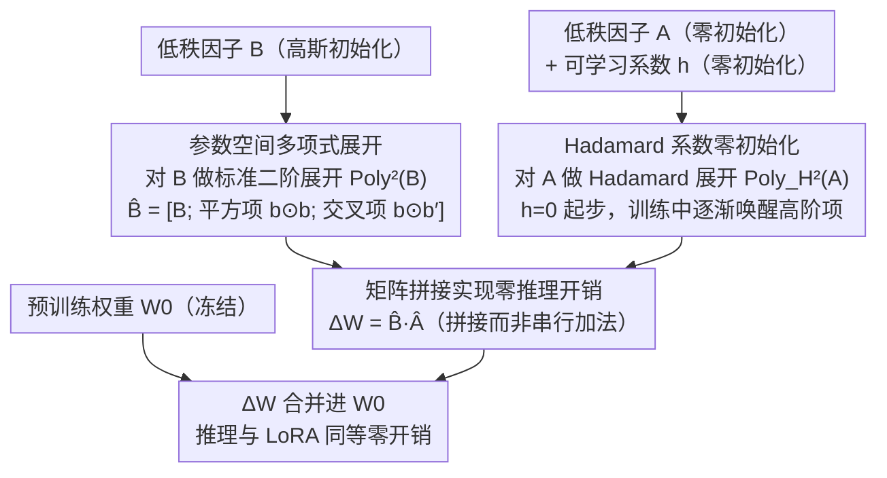

# Polynomial Expansion Rank Adaptation: Enhancing Low-Rank Fine-Tuning with High-Order Interactions

**会议**: ACL 2026 Findings  
**arXiv**: [2604.11841](https://arxiv.org/abs/2604.11841)  
**代码**: [https://github.com/zhangwenhao6/PERA](https://github.com/zhangwenhao6/PERA)  
**领域**: 参数高效微调/模型压缩  
**关键词**: 低秩适配, 多项式展开, 高阶特征交互, 参数高效微调, LoRA改进

## 一句话总结

本文提出 PERA（Polynomial Expansion Rank Adaptation），通过在低秩因子的参数空间中引入结构化多项式展开（平方项和交叉项），将 LoRA 的线性适配空间扩展为多项式流形，在不增加秩或推理开销的前提下显著提升权重更新的表达能力，在常识推理和 NLU 任务上一致优于 LoRA/DoRA/HiRA 等方法。

## 研究背景与动机

**领域现状**：参数高效微调（PEFT）已成为大语言模型适配的标准范式。其中 LoRA 通过将权重更新限制在低秩子空间 $\Delta W = BA$ 实现高效适配，但其严格双线性结构仅捕捉低秩因子之间的一阶线性依赖，限制了模型对非线性和高阶参数交互的建模能力。

**现有痛点**：(1) LoRA 的权重更新 $\Delta W = \sum_{i=1}^{r} \mathbf{b}_i \mathbf{a}_i^T$ 是秩一矩阵的线性组合，表达能力受限于秩 $r$；(2) DoRA 通过幅度-方向分解改进但仍是线性变换；(3) MoRA 通过压缩-变换-解压缩实现高秩适配但引入额外开销；(4) HiRA 通过与预训练权重的 Hadamard 调制丰富表示，但更新机制仍对可训练参数线性，且依赖外部权重耦合。

**核心矛盾**：从函数逼近角度看，一阶线性函数 $f(x) = c + c_1 x$ 与包含高阶项的多项式函数 $f(x) = c + c_1 x + c_2 x^2 + \cdots$ 在表达能力上存在本质差异。如果将 LoRA 视为权重更新的一阶线性逼近，其表达能力的局限性是根本性的。

**本文目标**：在不增加秩和推理成本的前提下，通过引入高阶特征交互来增强低秩适配的表达能力。

**切入角度**：从经典特征工程中的多项式特征展开技术获得灵感——将其应用于低秩因子的参数空间而非输入特征空间。

**核心 idea**：对低秩矩阵 $B$ 和 $A$ 分别进行多项式展开和基于 Hadamard 的多项式展开，生成平方项（$\mathbf{b}_i \odot \mathbf{b}_i$）和交叉项（$\mathbf{b}_i \odot \mathbf{b}_j$），通过矩阵拼接（而非加法）避免额外推理开销，同时将适配空间从线性子空间扩展为多项式流形。

## 方法详解

### 整体框架

PERA 沿用 LoRA 的分解框架，将权重更新分解为 $B \in \mathbb{R}^{m \times r}$ 和 $A \in \mathbb{R}^{r \times n}$。核心改进在于组合前对两个因子进行多项式展开：对 $B$ 进行标准二阶多项式展开 $\text{Poly}^2(B)$，对 $A$ 进行基于 Hadamard 的多项式展开 $\text{Poly}_H^2(A)$（带可学习系数 $\mathbf{h}$ 保证稳定性），最终更新为 $\Delta W = \text{Poly}^2(B) \cdot \text{Poly}_H^2(A)$。整套流程是一条"双路展开—拼接合并"的参数构造管线：$B$、$A$ 两条支路各自做多项式展开，拼接相乘得到 $\Delta W$，再合并进冻结的 $W_0$，全部发生在训练期的参数构造里，推理形态与 LoRA 完全一致。

### 关键设计

**1. 参数空间多项式展开：把低秩因子的列向量当“特征”做高阶交互**

LoRA 的天花板很硬：$\Delta W = \sum_{i=1}^{r}\mathbf{b}_i\mathbf{a}_i^T$ 只是 $r$ 个秩一矩阵的线性叠加，表达力被秩 $r$ 死死卡住，只能刻画低秩因子之间的一阶线性依赖。PERA 的切入点是把经典特征工程里的多项式展开从输入空间挪到参数空间——低秩因子的列向量本身就是一组“适配方向”，对它们做二阶展开就能捕捉方向之间的非线性耦合。具体地，对 $B=[\mathbf{b}_1,\ldots,\mathbf{b}_r]$ 做二阶展开得到 $\hat{B}=[B; B_{square}; B_{cross}]$，其中 $B_{square}=\{\mathbf{b}_i\odot\mathbf{b}_i\}$ 是 $r$ 个平方项，$B_{cross}=\{\mathbf{b}_i\odot\mathbf{b}_j\mid i<j\}$ 是 $C(r,2)$ 个交叉项；对 $A$ 做对应的 Hadamard 展开，维度因此从 $r$ 扩到 $2r+C(r,2)$。

合并后权重更新写成 $\Delta W = \sum_{i}\mathbf{b}_i\mathbf{a}_i^T + \sum_{i=j}h_{ij}(\mathbf{b}_i\odot\mathbf{b}_j)(\mathbf{a}_i^T\odot\mathbf{a}_j^T) + \sum_{i<j}h_{ij}(\mathbf{b}_i\odot\mathbf{b}_j)(\mathbf{a}_i^T\odot\mathbf{a}_j^T)$，第一项就是原来的 LoRA，后两项把适配空间从线性子空间撑成了多项式流形。从有效秩看，上界由 $r_0+r$ 抬到 $r_0+2r+C(r,2)$，这也解释了为什么 PERA 在极低秩下还能逼近高秩效果。

**2. Hadamard 系数的零初始化：让训练从 LoRA 起步，高阶项逐渐被唤醒**

直接把平方项和交叉项一股脑塞进去，训练初期很容易因为高阶项的不稳定梯度而崩。PERA 给 $A$ 一侧的展开配一组可学习系数 $\mathbf{h}=\{h_{ij}\}$ 并初始化为零，于是训练起点处所有高阶项贡献都是零，PERA 精确退化成标准 LoRA——这也正是“LoRA 是 PERA 的特例”这一统一关系的来源。

随着训练推进，模型自己学哪些 $h_{ij}$ 该被抬起来、哪些高阶交互对当前任务真的有益。这种“渐进式引入非线性”的做法既保住了优化早期的平滑性，又没有牺牲表达能力的上界，相当于用一个温和的退火把高阶项慢慢接进优化轨迹。

**3. 矩阵拼接实现零推理开销：高阶项靠拼接而非串行加法接入**

表达能力再强，如果推理时要多走一遍前向也很难落地。PERA 把高阶项做成对 $B$、$A$ 的列/行拼接而不是序列相加：展开后的 $\hat{B}\in\mathbb{R}^{m\times(2r+C(r,2))}$ 与 $\hat{A}\in\mathbb{R}^{(2r+C(r,2))\times n}$ 相乘，结果仍是一个 $\mathbb{R}^{m\times n}$ 的矩阵。

因此推理时 $\Delta W=\hat{B}\hat{A}$ 可以预计算并直接合并进 $W_0$，和原版 LoRA 一样不引入任何额外延迟或显存。换句话说，高阶交互全部发生在训练期的参数构造里，部署形态完全保持 LoRA 的零开销特性。

### 损失函数 / 训练策略

使用与 LoRA 相同的下一 token 预测损失。训练时仅优化低秩矩阵 $A$、$B$ 和 Hadamard 系数 $\mathbf{h}$，预训练权重 $W_0$ 保持冻结。学习率 $1 \times 10^{-4}$，其他超参数与 HiRA 基线保持一致。$A$ 初始化为零，$B$ 初始化为高斯分布。

## 实验关键数据

### 主实验

| 模型 | 方法 | 参数量(%) | 常识推理平均准确率 |
|------|------|----------|---------------|
| LLaMA2-7B | LoRA (r=32) | 0.83% | 77.61 |
| LLaMA2-7B | DoRA (r=32) | 0.83% | 79.69 |
| LLaMA2-7B | HiRA (r=32) | 0.83% | 81.42 |
| LLaMA2-7B | **PERA (r=16)** | **0.41%** | **82.61** |
| LLaMA3-8B | LoRA (r=16) | 0.35% | 82.80 |
| LLaMA3-8B | HiRA (r=16) | 0.35% | 86.08 |
| LLaMA3-8B | **PERA (r=16)** | **0.35%** | **87.38** |
| Qwen2.5-7B | LoRA (r=16) | 0.35% | 73.80 |
| Qwen2.5-7B | HiRA (r=16) | 0.35% | 85.40 |
| Qwen2.5-7B | **PERA (r=16)** | **0.35%** | **88.29** |

| 模型 | 方法 | 参数量 | GLUE 平均 |
|------|------|-------|----------|
| RoBERTa-base | LoRA | 0.3M | 83.40 |
| RoBERTa-base | DeLoRA | 0.3M | 84.60 |
| RoBERTa-base | **PERA** | 0.3M | **85.10** |
| RoBERTa-large | LoRA | 0.8M | 87.30 |
| RoBERTa-large | **PERA** | 0.8M | **88.13** |

### 消融实验

| 配置 | 权重更新公式 | 平均准确率 |
|------|-----------|----------|
| LoRA（仅一阶） | Eq.8 | 82.80 |
| LoRA + 仅平方项 | Eq.10 | 87.48 |
| LoRA + 仅交叉项 | Eq.11 | 86.83 |
| PERA（平方+交叉） | Eq.9 | 87.38 |

### 关键发现

- **高阶项带来显著提升**：PERA 在 LLaMA2-7B 上比 LoRA 高 5 个百分点（82.61% vs 77.61%），在 Qwen2.5-7B 上高 14.5 个百分点（88.29% vs 73.80%）。
- **平方项是最关键的高阶成分**：仅添加平方项（87.48%）的提升比仅添加交叉项（86.83%）更大，且接近完整 PERA（87.38%），说明同维度非线性交互比跨维度交互更重要。
- **极低秩下仍表现优异**：PERA 在 $r=2$ 时仍达 86.91%，$r=4$ 时达 87.01%，接近 $r=16$ 的最佳结果 87.38%。这归功于多项式展开将有效秩上界从 $r$ 提升到 $2r + C(r,2)$。
- **训练和推理开销接近 LoRA**：训练内存 19.12GB vs LoRA 18.70GB，推理内存 19.70GB vs 19.50GB，远优于 DoRA（22h07m 训练时间 vs PERA 13h30m）。
- **仅 10% 数据即超越 LoRA 满数据**：PERA 在 10% commonsense170K 上达 83.07%，超过 LoRA 在 100% 数据上的 82.80%，展现了卓越的数据效率。

## 亮点与洞察

- **从特征工程到参数工程的优雅迁移**：将多项式特征展开从传统 ML 的输入特征空间迁移到低秩适配的参数空间，概念简洁但效果显著，是一种新颖且富有洞察力的设计思路。
- **LoRA 是 PERA 的特例**：当 $\mathbf{h}=0$ 时 PERA 退化为 LoRA，这不仅提供了优美的理论统一，还确保了零初始化的渐进式引入策略。
- **秩上界的理论提升**：LoRA 的适配权重秩上界为 $r_0 + r$，PERA 提升为 $r_0 + 2r + C(r,2)$，对 $r=16$ 来说从 $r_0+16$ 提升到 $r_0+152$，理论表达能力提升近 10 倍。
- **Hessian 交互强度分析**：通过计算二阶偏导数的交互强度矩阵，直观展示了 PERA 比 LoRA 具有更强的全局特征交互建模能力。

## 局限与展望

- 仅在常识推理和 GLUE 上评估，未覆盖算术推理、代码生成、多模态生成等任务。
- 仅采用二阶多项式展开，更高阶展开（$k>2$）的效果未探索。
- 交叉项的贡献有限（87.38% vs 仅平方项 87.48%），可能存在冗余，需更细粒度的项选择策略。
- 未与最新的混合专家 LoRA（如 MELoRA）或自适应秩方法（如 AdaLoRA）进行比较。
- 多项式展开在大秩下可能导致维度爆炸（$C(r,2)$ 随 $r$ 二次增长），需要研究高秩场景下的可扩展性。

## 相关工作与启发

- **vs LoRA**: PERA 是 LoRA 的严格泛化，通过多项式展开引入高阶项。LoRA 对应 PERA 中 $\mathbf{h}=0$ 的特例。
- **vs HiRA**: HiRA 通过与预训练权重的 Hadamard 积引入非线性，依赖外部权重耦合；PERA 完全在可训练参数内部引入高阶交互，不依赖外部模块。
- **vs DoRA**: DoRA 分解幅度和方向但仍是线性变换，PERA 引入真正的非线性参数交互。
- **vs MoRA**: MoRA 通过高秩变换增加表达能力但引入额外推理开销，PERA 保持零推理开销。

## 评分

- 新颖性: ⭐⭐⭐⭐ 将多项式展开应用于低秩因子参数空间的思路新颖，理论分析清晰
- 实验充分度: ⭐⭐⭐⭐ 多模型多任务验证，秩/模块/数据量/组件消融全面
- 写作质量: ⭐⭐⭐⭐ 方法描述清晰，数学推导严谨，与 LoRA 的关系论证优雅
- 价值: ⭐⭐⭐⭐ 提供了一种简单有效的 LoRA 增强方案，实用性强

<!-- RELATED:START -->

## 相关论文

- [\[ICML 2026\] ScaLoRA: Optimally Scaled Low-Rank Adaptation for Efficient High-Rank Fine-Tuning](../../ICML2026/model_compression/scalora_optimally_scaled_low-rank_adaptation_for_efficient_high-rank_fine-tuning.md)
- [\[ICLR 2026\] LoFT: Low-Rank Adaptation That Behaves Like Full Fine-Tuning](../../ICLR2026/model_compression/loft_low-rank_adaptation_that_behaves_like_full_fine-tuning.md)
- [\[AAAI 2026\] Group Orthogonal Low-Rank Adaptation for RGB-T Tracking](../../AAAI2026/model_compression/group_orthogonal_low-rank_adaptation_for_rgb-t_tracking.md)
- [\[ACL 2026\] TLoRA: Task-aware Low Rank Adaptation of Large Language Models](tlora_task-aware_low_rank_adaptation_of_large_language_models.md)
- [\[ACL 2026\] TalkLoRA: Communication-Aware Mixture of Low-Rank Adaptation for Large Language Models](talklora_communication-aware_mixture_of_low-rank_adaptation_for_large_language_m.md)

<!-- RELATED:END -->
