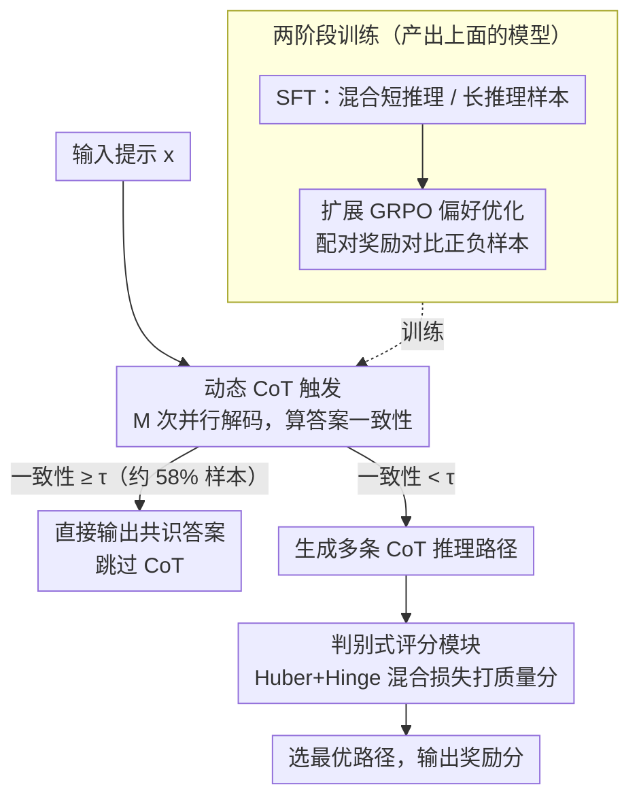

# Reason Only When Needed: Efficient Generative Reward Modeling via Model-Internal Uncertainty

**会议**: ACL 2026  
**arXiv**: [2604.10072](https://arxiv.org/abs/2604.10072)  
**代码**: 无  
**领域**: 模型压缩/LLM效率  
**关键词**: 生成式奖励模型, 动态CoT触发, 模型内部不确定性, 判别式评分, 推理效率

## 一句话总结

提出 E-GRM 框架，利用模型并行解码的收敛行为估计不确定性，仅在必要时触发 CoT 推理，并通过混合损失训练的判别式评分器精细评估推理路径质量，在多个奖励模型基准上实现 SOTA 同时降低 62% 推理延迟。

## 研究背景与动机

**领域现状**：生成式奖励模型（GRM）通过 CoT 提示增强 LLM 的推理评估能力，已在数学问题求解、多步决策等复杂任务中表现突出。

**现有痛点**：现有 GRM 存在两个核心问题。其一，CoT 推理被无差别应用于所有输入，不管问题难度如何，简单问题也要走完整 CoT 流程，造成大量不必要的计算开销。其二，现有方法主要依赖投票机制（voting）来聚合 CoT 输出的答案，这种评估方式粒度粗糙，无法精细区分推理路径的质量差异。

**核心矛盾**：效率与质量的双重瓶颈——一方面需要根据问题复杂度自适应分配推理资源，另一方面需要更精细的评分机制来区分推理质量。已有的自适应 CoT 方法（如 AdaCoT）依赖任务相关的启发式规则或手工特征，泛化能力受限。

**本文目标**：(1) 找到一种任务无关的信号来判断是否需要 CoT；(2) 设计比投票更精细的推理路径评估方法。

**切入角度**：作者观察到，对同一提示进行多次并行解码时，简单问题的输出会迅速收敛一致，而困难问题的输出则呈现高度发散——这种收敛行为本身就是问题复杂度的天然指标。

**核心 idea**：用模型自身并行生成的一致性（consensus）作为不确定性估计信号，动态决定是否触发 CoT，同时训练一个混合回归-排序损失的轻量判别式评分器来精细打分。

## 方法详解

### 整体框架

E-GRM 包含两个核心模块：(1) 基于模型内部不确定性的动态 CoT 触发机制；(2) 基于混合损失的判别式评分模块。训练分两阶段：先 SFT 让模型学会短推理/长推理两种模式，再通过扩展的 GRPO 进行偏好优化。推理时先快速判断是否需要 CoT，需要时再生成多条推理路径并用评分器选最优。

### 关键设计

**1. 动态 CoT 触发（Dynamic CoT Triggering）：用模型自己的"答案收敛速度"当复杂度探针，简单题直接跳过 CoT**

CoT 被无差别地套在所有输入上是效率黑洞——简单问题也要走完整推理。本文的判据完全来自模型自身行为：对输入 $x$ 做 $M$ 次并行解码（用不同温度/采样参数），统计答案一致性 $\text{Consensus}(x) = \max_y \text{Count}(y) / M$；若一致性 $\geq \tau$（默认 0.8）就直接输出共识答案，否则才触发完整 CoT 生成。实验里约 58% 的样本被判为"短推理"可直接跳过。

这个设计的巧处在于它不依赖任何外部特征或任务相关的启发式规则——像 AdaCoT 那样靠解题长度估计就难以跨域泛化，而"多次采样是否快速收敛"对任何任务都成立，于是自适应推理真正做到了任务无关。

**2. 判别式评分模块（Discriminative Scoring Module）：用回归+排序的混合损失替代粗糙的投票，精细区分推理路径质量**

纯投票机制只看多条 CoT 的答案是否一致，看不出推理过程谁好谁坏，粒度太粗。本文训练一个轻量评分模型 $\mathcal{S}_\phi$ 输出 $[0,1]$ 质量分，损失刻意揉了两种目标：Huber Loss 负责回归鲁棒性，对异常值从 L2 平滑过渡到 L1；Hinge Loss 负责排序判别性，强制高质量路径与低质量路径之间保持 margin $m$ 的分数差距。总损失为

$$\mathcal{L} = \alpha \cdot \ell_{\text{Huber}} + (1-\alpha) \cdot \ell_{\text{Hinge}}$$

之所以要混合，是因为评分器同时背着两个相互拉扯的任务——既要"绝对校准"（这条路径质量到底有多高），又要"相对排序"（两条很接近的路径谁更优）。单用 MSE 排序不稳，单用排序损失又丢了绝对刻度，两者相加才能兼顾。

**3. 扩展 GRPO 偏好优化（Coupled-GRPO）：把配对偏好里的正负对比直接喂进奖励信号**

标准 GRPO 在独立采样的组内算相对奖励，但当训练数据本身就是成对的正负样本时，这种结构信息被浪费了。本文在 RL 阶段引入配对奖励

$$R_{\text{pair}} = \mathcal{S}_\phi(x, r^+) - \mathcal{S}_\phi(x, r^-) + \beta \cdot \mathbb{I}(\text{Ans}(r^+) = y)$$

直接对比正负样本在评分器上的输出差，再加一项答案正确性的指示奖励。相比在随机组内估相对优势，配对结构天然携带"哪条更好"的方向信息，因此能提供更有针对性、噪声更小的梯度。

### 损失函数 / 训练策略

训练分两阶段：(1) SFT 阶段混合训练短推理样本（直接预测答案）和长推理样本（学习 CoT 序列），通过不确定性估计自动划分数据集；(2) GRPO 阶段使用配对偏好数据和判别式评分器进行对齐优化，加 KL 正则化防止偏离参考策略过远。

## 实验关键数据

### 主实验

| 基准 | 指标 | E-GRM (32B) | 之前SOTA | 提升 |
|--------|------|------|----------|------|
| RM-Bench | Avg | 79.2% | 76.4% (14B) | +2.8% |
| RMB | Overall | 0.743 | 0.738 (GPT-4o) | +0.005 |
| RewardBench | Overall | 91.5% | 90.0% (Self-taught-70B) | +1.5% |
| RewardBench | Reasoning | 95.4% | 88.4% (Self-taught-70B) | +7.0% |

### 消融实验

| 配置 | Acc (%) | FLOPs (T) | Latency (s) |
|------|---------|-----------|-------------|
| Full E-GRM | 78.4 | 15.7 | 2.2 |
| w/o Dynamic CoT | 75.2 | 23.4 | 3.4 |
| w/o Discrim. Scoring | 72.8 | 15.9 | 2.2 |
| Base CoT-GRM | 69.1 | 23.7 | 3.6 |

### 关键发现

- 判别式评分模块贡献最大：去掉后准确率下降 5.6%，说明精细评分对推理质量至关重要
- 动态 CoT 触发带来 49% FLOPs 下降和 55% 延迟降低，同时准确率反而提升 3.2%，证明不必要的 CoT 会引入错误传播
- 与 AdaCoT 等启发式方法对比，E-GRM 在无需任务相关先验的情况下取得更高准确率（78.4% vs 76.8%）和更低延迟（2.2s vs 2.9s）
- 扩展 GRPO 相比标准 GRPO 带来一致但温和的提升（MATH: 78.4% vs 76.9%）

## 亮点与洞察

- **并行解码一致性作为复杂度探针**：这是一个非常优雅的设计——利用模型自身的行为特征而非外部信号来判断推理需求，天然具备任务无关性和零额外参数成本。这个思路可迁移到任何需要自适应计算的场景（如 early exit、动态深度）
- **混合回归-排序损失**：Huber + Hinge 的组合巧妙解决了评分器需要同时做好"绝对校准"和"相对排序"两个目标的矛盾，比纯 MSE 或纯排序损失都更稳健
- 58% 样本被识别为不需要 CoT 的"简单问题"，这个比例本身就是一个重要发现——说明当前 GRM 在大量简单任务上存在严重的计算浪费

## 局限与展望

- 并行解码一致性估计本身需要 M 次前向传播（M=5），虽然开销小于完整 CoT，但并非零成本；极端低延迟场景下这个开销是否可接受需要验证
- 阈值 $\tau$ 和并行次数 $M$ 的选择目前是手动设定的，不同任务域可能需要不同设置
- 判别式评分器需要有标注的质量数据进行训练，数据获取成本可能限制在新领域的快速部署
- 可探索：将不确定性估计与 speculative decoding 结合，或用单次前向传播中的内部表示（如注意力熵）替代多次采样

## 相关工作与启发

- **vs DeepSeek-GRM**：DeepSeek-GRM 也是生成式奖励模型但无自适应推理机制，对所有输入统一使用 CoT；E-GRM 通过动态触发在同等甚至更高准确率下大幅降低计算成本
- **vs AdaCoT**：AdaCoT 使用基于解题长度估计的任务相关启发式判断是否需要 CoT；E-GRM 的并行一致性方法完全任务无关，且实验证明更优

## 评分

- 新颖性: ⭐⭐⭐⭐ 并行解码一致性作为不确定性信号是新颖的切入点，但混合损失和 GRPO 扩展偏增量
- 实验充分度: ⭐⭐⭐⭐⭐ 三个主流基准全面评测，消融完整，与 AdaCoT 的对比实验设计合理
- 写作质量: ⭐⭐⭐⭐ 结构清晰，方法描述详尽，但部分公式较冗长
- 价值: ⭐⭐⭐⭐ 解决了 GRM 效率痛点，62% 延迟降低在实际部署中价值很大

<!-- RELATED:START -->

## 相关论文

- [\[ACL 2026\] Latent-Condensed Transformer for Efficient Long Context Modeling](latent-condensed_transformer_for_efficient_long_context_modeling.md)
- [\[ICML 2026\] When Shared Knowledge Hurts: Spectral Over-Accumulation in Model Merging](../../ICML2026/model_compression/when_shared_knowledge_hurts_spectral_over-accumulation_in_model_merging.md)
- [\[ACL 2026\] Cognitive-Uncertainty Guided Knowledge Distillation for Accurate Classification of Student Misconceptions](cognitive-uncertainty_guided_knowledge_distillation_for_accurate_classification_.md)
- [\[ICML 2025\] Bring Reason to Vision: Understanding Perception and Reasoning through Model Merging](../../ICML2025/model_compression/bring_reason_to_vision_understanding_perception_and_reasoning_through_model_merg.md)
- [\[ACL 2026\] UKP_Psycontrol at SemEval-2026 Task 2: Modeling Valence and Arousal Dynamics from Text](ukp_psycontrol_at_semeval-2026_task_2_modeling_valence_and_arousal_dynamics_from.md)

<!-- RELATED:END -->
