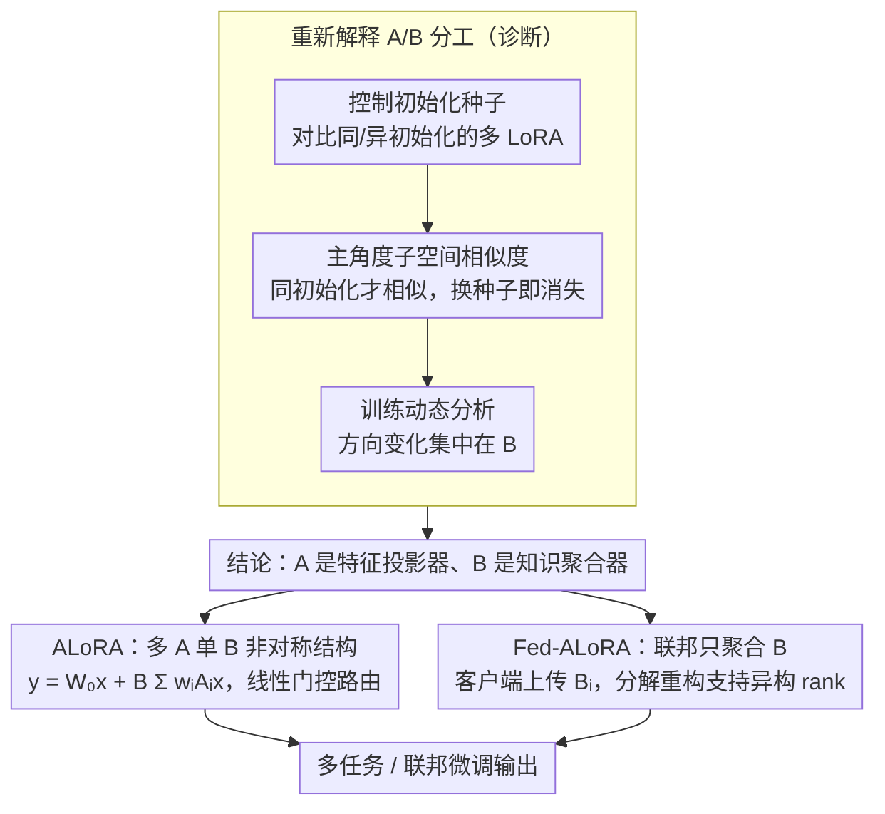

# Rethinking Parameter Sharing for LLM Fine-Tuning with Multiple LoRAs

**会议**: ACL2026 Findings  
**arXiv**: [2509.25414](https://arxiv.org/abs/2509.25414)  
**代码**: https://github.com/OptMN-Lab/ALoRA  
**领域**: 模型压缩 / 参数高效微调 / 联邦微调  
**关键词**: LoRA、参数共享、多任务微调、联邦学习、通信压缩

## 一句话总结
本文推翻了“多 LoRA 应共享 A 矩阵”的常见假设，证明 A 的相似性主要来自相同初始化而非共享知识，并提出共享 B 矩阵的 ALoRA / Fed-ALoRA，在多任务和联邦微调中兼顾性能、均衡性与通信效率。

## 研究背景与动机
**领域现状**：LLM 微调通常使用 LoRA 等参数高效方法，将权重增量写成低秩分解 $\Delta W=BA$，冻结原模型只训练 A 和 B。面对多任务、多领域或多客户端数据，一个 LoRA 往往容量不足，因此近年出现了多个 LoRA expert、LoRA MoE、联邦 LoRA 聚合等结构。

**现有痛点**：多 LoRA 虽然增强了适配能力，却带来额外参数、计算和通信开销。已有参数共享方法常观察到不同 LoRA 的 A 矩阵相似，于是让多个 expert 或客户端共享 A、保留各自的 B，例如 HydraLoRA 和 FedSA-LoRA。

**核心矛盾**：A 矩阵相似并不必然意味着 A 承载共享知识。如果这种相似只是因为相同随机初始化，那么共享 A 可能不仅无助于知识迁移，还会限制不同任务探索特征子空间；真正值得共享的参数可能是 B。

**本文目标**：作者首先重新检验 A/B 两个矩阵在训练中的相似性和变化模式；然后比较共享 A 与共享 B 的知识迁移效果；最后提出适用于多任务和联邦场景的共享 B 结构。

**切入角度**：论文没有从更复杂的 MoE 或路由器开始，而是回到 LoRA 的矩阵分解本身，问一个很基础的问题：多 LoRA 中到底哪个矩阵应该被共享？这个问题直接影响模型容量分配和联邦通信成本。

**核心 idea**：让多个 A 矩阵负责不同特征投影，让一个共享 B 矩阵负责聚合和迁移知识；在联邦微调中只通信 B，并用矩阵分解支持异构 rank。

## 方法详解

### 整体框架
论文分为“诊断”和“方法”两部分。诊断部分先在 LLaMA2-7B 等模型上控制 A 的初始化种子，发现 A 的高相似性只在同初始化下出现，而不同初始化时 A 不再相似；进一步分析训练前后矩阵的 magnitude 和 direction 变化，发现 B 承担了更多方向变化。方法部分据此提出 ALoRA，用多个 $A_i$ 和一个共享 $B$ 做多任务微调；再提出 Fed-ALoRA，在联邦微调中让客户端本地更新完整 LoRA，但只上传和聚合 B 相关参数。

### 关键设计

**1. 从初始化与训练动态重新解释 A/B 分工：A 的"相似"其实是初始化残留，真正承载知识的是 B**

很多工作看到不同 LoRA 的 A 矩阵彼此相似，就顺手让它们共享 A——但"相似"不等于"装着共享知识"。本文做了一个控制实验把这个假设拆穿：用 principal angle-based similarity 度量子空间相似度，比较相同任务/不同任务、相同初始化/不同初始化下的 LoRA 模块。结果很干净——同初始化时 A 高度相似，可一旦换初始化，即使任务相同 A 也不再相似；而训练动态分析显示 A 主要保持投影结构不变，magnitude 和 direction 的显著变化都集中在 B 上。

这组证据把 A 重新定位成 feature projector（特征投影器），把 B 定位成 domain/task knowledge aggregator（知识聚合器）。如果 A 的相似只是初始化的副产物，那"共享 A 能共享知识"的整套结构假设就站不住，真正值得共享的应该是 B。

**2. ALoRA：多 A 单 B 的非对称多任务 LoRA**

既然 B 才是知识载体，多任务结构就该反过来设计。ALoRA 的前向传播为

$$y = W_0 x + B \sum_i w_i A_i x$$

每个 $A_i$ 是一个 expert，各自探索不同的低秩特征子空间；唯一的共享 $B$ 把这些投影后的特征融合到输出空间。路由权重由线性门控 $w = \text{softmax}(W_g x)$ 给出，推理时可以按输入动态合并 adapter。

这样设计是因为共享 A 会让多个任务争抢同一套特征投影，导致更小的梯度和更多的梯度冲突；而保留多个 A 给了不同任务足够的探索空间，把共享集中在 B 上，恰好对应它"聚合知识"的角色分工。

**3. Fed-ALoRA：只聚合 B 的联邦微调，并支持异构 rank**

把共享 B 的思路搬到联邦场景，能同时压通信和促迁移。同构 rank 下，每个客户端本地训练完整的 $(A_i, B_i)$，但只上传 $B_i$，服务器聚合出全局 $B_0$ 再广播回去——单轮通信量从 full-LoRA 的 $(d_{in}+d_{out})r$ 降到 $d_{out}r$。异构场景里各客户端 rank $r_i$ 不同、$B_i$ 无法直接平均，作者把更新写成 $(B_{i0}+B_{i2}B_{i1})M_iA_i$，服务器先重构出同维度的 $B_{i2}B_{i1}$ 再聚合，并用一个 accumulator 保存历史全局更新。

相比之下，FedSA-LoRA 聚合 A 且只支持同构 rank，ZeroPadding/FLoRA 之类方法虽能处理异构却要把更新 padding 到最大 rank、通信代价高。Fed-ALoRA 用共享 B 的结构，把知识迁移和通信压缩统一在了一套机制里。

### 损失函数 / 训练策略
ALoRA 和 Fed-ALoRA 不改变下游任务损失，核心训练目标仍是对应数据上的语言建模或任务监督损失。多任务 ALoRA 训练路由器、多个 $A_i$ 和共享 $B$；联邦同构版本每轮本地优化 LoRA loss 后上传 $B_i$；异构版本本地优化 $(A_i,M_i,B_{i1},B_{i2})$，服务器对重构后的 B 更新做 FedAvg 类聚合。

## 实验关键数据

### 主实验
作者先做了一个直接对照：在 8 个 FLAN 任务客户端的联邦微调中，共享 B 明显优于共享 A。

| 设置 | 共享参数 | 平均 ROUGE-1 | 相对结论 |
|------|----------|--------------|----------|
| 同构 rank | A | 44.30 | 共享 A 知识迁移弱 |
| 同构 rank | B | 66.32 | 比共享 A 高 49.71% |
| 异构 rank | A | 40.76 | 异构下更难聚合 |
| 异构 rank | B | 50.30 | 比共享 A 高 23.41% |

在多任务微调中，ALoRA 在 commonsense reasoning 和跨领域 NLP 上都取得最均衡结果。$\Delta m\%$ 越低越好，表示相对单任务 baseline 的平均性能损失更小。

| Benchmark | 模型 | 方法 | Avg. | $\Delta m\%$ | 关键对比 |
|-----------|------|------|------|--------------|----------|
| Commonsense | LLaMA3-8B | HydraLoRA | 84.57 | 0.32 | 共享 A 的强 baseline |
| Commonsense | LLaMA3-8B | ALoRA | 84.81 | 0.04 | 平均更高且几乎无任务失衡 |
| Commonsense | Qwen2-7B | HydraLoRA | 86.09 | 1.32 | Qwen 上共享 A 不稳定 |
| Commonsense | Qwen2-7B | ALoRA | 86.47 | 0.91 | 平均和均衡性均更好 |
| Cross-domain NLP | LLaMA2-7B | HydraLoRA | 66.45 | -6.39 | 强多 LoRA baseline |
| Cross-domain NLP | LLaMA2-7B | ALoRA | 67.13 | -8.33 | 平均 +0.68，均衡性更强 |
| Cross-domain NLP | Qwen2-7B | HydraLoRA | 80.03 | -7.14 | 共享 A baseline |
| Cross-domain NLP | Qwen2-7B | ALoRA | 80.46 | -7.98 | 平均 +0.43 |

### 消融实验
联邦微调实验展示了 Fed-ALoRA 的通信优势。Params 表示每个客户端每轮平均通信参数量，单位为百万。

| 设置 | 模型 | 方法 | Avg. | $\Delta m\%$ | Params | 说明 |
|------|------|------|------|--------------|--------|------|
| 同构 | LLaMA2-7B | FedIT | 82.47 | -3.92 | 8.39 | full LoRA 聚合 |
| 同构 | LLaMA2-7B | FedSA-LoRA | 81.15 | -2.21 | 4.19 | 共享 A，通信低但性能弱 |
| 同构 | LLaMA2-7B | Fed-ALoRA | 82.51 | -4.29 | 4.19 | 与 FedIT 性能相当，通信减半 |
| 同构 | Qwen2-7B | FedIT | 82.80 | -0.05 | 6.42 | full LoRA 聚合 |
| 同构 | Qwen2-7B | Fed-ALoRA | 84.30 | -2.05 | 3.21 | 平均最高且通信减半 |
| 异构 | LLaMA2-7B | ZeroPadding | 82.29 | -0.91 | 49.28 | 需要 padding 到最大 rank |
| 异构 | LLaMA2-7B | Fed-ALoRA | 82.50 | -1.07 | 12.12 | 通信约减少 75% |
| 异构 | Qwen2-7B | ZeroPadding | 83.32 | 0.06 | 37.73 | 异构 full aggregation baseline |
| 异构 | Qwen2-7B | Fed-ALoRA | 84.13 | -1.02 | 9.23 | 性能和通信均更优 |

### 关键发现
- A 矩阵的高相似性不是共享知识的证据，而是初始化相同的副产物；不同初始化下 A 相似性快速消失。
- B 矩阵在训练中承担更多方向性变化，更像真正吸收任务和领域知识的部分。
- 共享 A 会带来更小梯度和更多梯度冲突，作者称为 lazy learning；共享 B 则让多个 A 保持特征子空间多样性。
- Fed-ALoRA 的价值不只在性能，而在同构通信减半、异构通信减少约 75%，同时还能提升平均分和任务均衡性。

## 亮点与洞察
- 这篇论文的核心亮点是“重新解释已有观察”。很多工作看到 A 相似就直接共享 A，而本文通过初始化控制实验指出这个解释可能站不住，这比单纯提出新结构更有启发性。
- ALoRA 的设计很简洁：多个 A、一个 B、一个轻量路由器，没有引入复杂 expert transformation，却能在多个 benchmark 上稳定提升。
- 异构 Fed-ALoRA 很实用。现实联邦设备常有不同算力和 rank 预算，能聚合不同尺寸 LoRA 更新比只支持同构设置更接近部署需求。
- 这项工作提醒 PEFT 研究不要只看参数数量，还要看参数在分解结构中的功能角色。低秩矩阵的左右因子并不是对称的。

## 局限与展望
- 论文主要在 LoRA 的 A/B 因子化框架内讨论，结论能否直接迁移到 DoRA、AdaLoRA、LoHa 或更复杂 adapter 结构仍需验证。
- 多任务实验覆盖 commonsense、math 和 FLAN 风格 NLP，但没有覆盖长上下文、代码、工具调用等更复杂 LLM 适配场景。
- 路由器采用较简单的线性 gating。更强路由器可能进一步提升 ALoRA，但也可能引入负载不均衡和训练不稳定。
- 联邦实验是离线 benchmark 构造，真实联邦系统中的客户端掉线、非 IID 程度变化、隐私预算和安全聚合开销还没有系统评估。

## 相关工作与启发
- **vs HydraLoRA**: HydraLoRA 共享 A、保留多个 B，假设 A 承载共享知识；ALoRA 反过来共享 B、保留多个 A，认为 B 更适合知识迁移，实验上平均分和均衡性更好。
- **vs FedSA-LoRA**: FedSA-LoRA 在联邦场景聚合 A 且只支持同构 rank；Fed-ALoRA 聚合 B，并通过分解支持异构 rank。
- **vs ZeroPadding / FLoRA**: 这些方法能处理异构 LoRA，但通信量大；Fed-ALoRA 用共享 B 的结构压低通信成本，同时保留或提升性能。
- **启发**: 后续 PEFT 可以系统研究不同参数子空间的功能角色，而不是把所有 trainable parameters 视作可交换的低秩块。

## 评分
- 新颖性: ⭐⭐⭐⭐☆ 不是全新 PEFT 范式，但对多 LoRA 参数共享方向给出了有力反转。
- 实验充分度: ⭐⭐⭐⭐☆ 覆盖多任务、跨领域、联邦同构和异构设置；真实大规模联邦部署实验仍可补强。
- 写作质量: ⭐⭐⭐⭐☆ 动机、诊断和方法连接自然，数学符号略密但整体清晰。
- 价值: ⭐⭐⭐⭐⭐ 对多 LoRA、联邦 PEFT 和通信高效微调都有直接工程价值。

<!-- RELATED:START -->

## 相关论文

- [\[ICML 2026\] Compress then Merge: From Multiple LoRAs into One Low-Rank Adapter](../../ICML2026/model_compression/compress_then_merge_from_multiple_loras_into_one_low-rank_adapter.md)
- [\[ACL 2025\] C3A: Parameter-Efficient Fine-Tuning via Circular Convolution](../../ACL2025/model_compression/parameter-efficient_fine-tuning_via_circular_convolution.md)
- [\[ICML 2025\] Parameter-Efficient Fine-Tuning of State Space Models](../../ICML2025/model_compression/parameter-efficient_fine-tuning_of_state_space_models.md)
- [\[CVPR 2026\] S2FT: Parameter-Efficient Fine-Tuning in Sparse Spectrum Domain](../../CVPR2026/model_compression/s2ft_parameter-efficient_fine-tuning_in_sparse_spectrum_domain.md)
- [\[ICLR 2026\] Memba: Membrane-driven Parameter-Efficient Fine-Tuning for Mamba](../../ICLR2026/model_compression/memba_membrane-driven_parameter-efficient_fine-tuning_for_mamba.md)

<!-- RELATED:END -->
