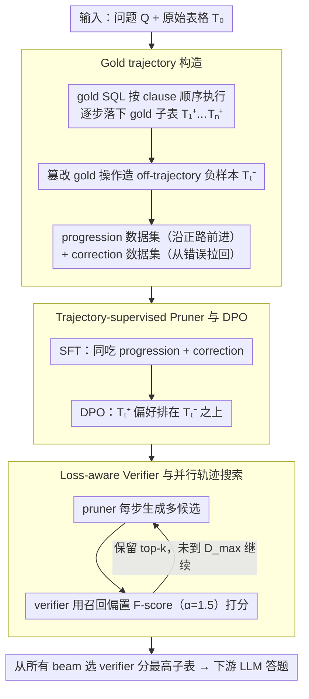

# Rethinking Table Pruning in TableQA: From Sequential Revisions to Gold Trajectory-Supervised Parallel Search

**会议**: ACL2026  
**arXiv**: [2601.03851](https://arxiv.org/abs/2601.03851)  
**代码**: 无  
**领域**: 表格问答 / 表格剪枝 / LLM推理  
**关键词**: TableQA, table pruning, gold trajectory, verifier, beam search

## 一句话总结
这篇论文提出 TabTrim，把表格剪枝从容易累积错误的单路径顺序修订改成“SQL 轨迹监督的剪枝器 + loss-aware verifier + 并行轨迹搜索”，在 WikiTQ、TabFact 和 TableBench 上把平均准确率提升到 73.5%，比最强基线高 3.2 个点。

## 研究背景与动机
**领域现状**：TableQA 和复杂表格推理常常要在大表中找少量相关行列。直接把原表序列化给 LLM 会带来大量噪声和长上下文成本，因此 table pruning 会先把冗余单元格删掉，只保留对问题有用的子表，再交给下游 reasoner 答题。

**现有痛点**：现有表格剪枝大致分为 program-based 和 LLM-based 两类。前者依赖 SQL/Python 等程序执行，后者依赖 CoT 或多代理规划。两者都会出现剪错关键行列的问题，而后续 critique 信号并不可靠：程序执行成功不代表语义正确，LLM-as-a-Judge 也可能为错误推理找理由，或者过度否定正确步骤。

**核心矛盾**：表格剪枝最怕过剪，因为 answer-critical cells 一旦被删掉，下游推理几乎无法恢复；但如果只保守地少剪，又会保留太多噪声。已有方法通常沿着单一轨迹顺序修订，早期错误会被锁死，缺少可回溯、可比较的候选分支。

**本文目标**：作者希望给表格剪枝提供可验证的中间监督，让模型知道每一步应该保留哪些关键单元格；同时在推理时探索多条剪枝轨迹，而不是把希望押在一次顺序修订上。

**切入角度**：Text-to-SQL 数据集中有 gold SQL。作者观察到 SQL 的 clause-level 执行过程会自然产生一串中间子表，这些子表由最终正确答案约束，可以作为无需人工标注的 gold pruning trajectory。

**核心 idea**：用 gold SQL 执行轨迹训练剪枝器和 verifier，再用 beam-search 式 parallel trajectory search 在推理时保留多个候选子表，避免单路径剪枝的局部最优。

## 方法详解

### 整体框架
TabTrim 想解决的是表格剪枝最致命的失败模式：沿单一轨迹顺序修订时，早期一旦把答案关键单元格删掉就再也回不来。它的做法是给剪枝过程补上「过程监督 + 并行搜索」。输入是问题 $Q$、原始表格 $T_0$ 和当前子表 $T_{t-1}$，输出是更紧凑的子表。训练时先把 Text-to-SQL 数据里的 gold SQL 按 clause-level 执行顺序拆开（行过滤、列投影等），逐步执行得到一串 gold 子表 $T_0, T_1^+, \dots, T_n^+$，并以此训练两个组件——pruner 学会从当前子表迈向下一步 gold 子表，verifier 学会给任意子表打一个对齐最终 gold 子表的质量分。推理时从原表出发，每一步让 pruner 生成多个候选、verifier 打分保留 top-$k$，最后从所有 beam 里挑分数最高的子表交给下游 LLM 答题。

### 关键设计

**1. Gold trajectory 构造：把 SQL 的执行中间态变成免标注的逐步剪枝监督**

痛点在于最终答案只能告诉模型「答对没答对」，却说不清剪枝在哪一步删错了关键行列。作者注意到 Text-to-SQL 数据里的 gold SQL 天然带有 clause-level 执行顺序，于是对每个样本 $(Q, SQL_{gold}, T_{raw})$ 把 SQL 按逻辑执行顺序拆成一连串操作，每执行一步就落下一个 gold sub-table $T_t^+$，由最终正确答案约束、不需要任何额外人工标注。

光有正路还不够：剪枝器在推理时迟早会走到偏离 gold 轨迹的状态。为此作者再通过篡改 gold 操作构造 off-trajectory 的 negative sub-tables $T_t^-$，把数据组织成 progression dataset（沿正路前进）和 correction dataset（从错误状态拉回）。这样 SQL 的执行中间态既提供了可对齐的过程监督，negative 轨迹又教会模型怎么从错误里恢复。

**2. Trajectory-supervised Pruner 与 DPO：既要会前进，也要会从偏离的子表纠偏**

如果只在 gold 路径上做模仿学习，剪枝器一旦在推理时遇到自己生成的、略微跑偏的子表就会束手无策。作者用两阶段训练把「前进」和「纠偏」一起灌进去：第一阶段 SFT 同时吃 progression 和 correction 两类样本，损失为

$$L_{SFT}=-\log P_\theta(T_t^+\mid Q,T_0,T_{t-1}^+)-\lambda\log P_\theta(T_t^+\mid Q,T_0,T_{t-1}^-)$$

第一项让模型从正确前序子表迈向 gold 下一步，第二项则要求即便前序是错误子表 $T_{t-1}^-$，也得指向正确的 $T_t^+$。第二阶段再用 DPO 把 gold next sub-table $T_t^+$ 偏好排在错误子表 $T_t^-$ 之上，进一步压低细粒度的语义剪错。两阶段叠加后，pruner 既能沿轨迹前进，又能在候选跑偏时把方向拉回来。

**3. Loss-aware Verifier 与并行轨迹搜索：用召回偏置的打分挑路径，并行抛弃早期错误分支**

生成概率高不代表子表质量好——尤其漏掉答案关键单元格这种致命错误，likelihood 几乎不会惩罚。作者把每个候选子表表示成 canonical cell set，计算它与最终 gold 子表 $T_n^+$ 的 precision 和 recall，再用一个带召回偏置的 $F$-score 作为质量分 $S(T_t)$，默认 $\alpha=1.5$ 让分数明显偏向「宁可多留也别删掉 answer-critical cells」。有了这个比生成概率更贴合剪枝风险的打分，推理时就能做 beam search：宽度 $k$、分支数 $b$、最大深度 $D_{max}$，每一步 generate-score-select，最后从所有 beam 中选 verifier 分最高的子表。这把剪枝从「修一条路、错了就锁死」变成「同时探多条路、随时丢掉早期烂分支」。

### 一个完整示例：beam search 怎么救回被误删的一行
设 $k=b=2$、$D_{max}=4$。原表 $T_0$ 有几十行，问题问某个条件下的聚合值。第 1 步 pruner 从 $T_0$ 生成 2 个分支候选，verifier 打分后保留 top-2 子表进 beam；其中一个分支因为列投影偏激，把答案需要的那一列削掉了，但它在 precision 上看起来还不错。第 2 步两个 beam 各再生成 2 个候选共 4 个，verifier 用 $\alpha=1.5$ 的召回偏置算分，那个误删关键列的分支因为 recall 骤降被压到低分、不再进入 top-2，而保留了关键列的分支继续收缩冗余行。如此走 3-4 步后，每个样本的 pruner/verifier 调用上界为 $O(k\cdot b\cdot D_{max})$，最终系统不是从「唯一一条已经删错的路」里硬挑，而是从一组并行候选里选出 recall 最高、最干净的子表交给下游答题——这正是顺序修订做不到的回溯能力。

### 损失函数 / 训练策略
TabTrim 用 WikiSQL 和 SQUALL 构造超过 80K 训练样本。pruner 使用 Qwen3-4B 和 Qwen3-8B 训练，verifier 使用 Qwen3-0.6B，默认 $\alpha=1.5$。推理时默认 $k=b=2$、$D_{max}=4$，每个样本的 pruner/verifier 调用上界为 $O(k\cdot b\cdot D_{max})$。最终答案生成使用 GPT-4o-mini，以保证和闭源/开源基线的下游 reasoner 设置尽量一致。

## 实验关键数据

### 主实验
| 方法 | WikiTQ | TabFact | TB-NR | TB-FC | TB-DA | Average |
|------|--------|---------|-------|-------|-------|---------|
| Direct QA: GPT-4o-mini | 54.3 | 77.4 | 65.5 | 76.0 | 25.1 | 59.8 |
| Binder | 54.8 | 83.3 | 66.8 | 67.7 | 26.8 | 59.9 |
| Chain-of-Table | 67.5 | 88.9 | 68.5 | 78.1 | 30.3 | 66.7 |
| TALON | 70.7 | 87.6 | 67.3 | 77.1 | 28.9 | 66.3 |
| Table-Critic | 72.6 | 90.6 | 73.0 | 81.3 | 33.8 | 70.3 |
| TabTrim-4B | 76.8 | 89.4 | 76.3 | 79.2 | 32.1 | 70.8 |
| TabTrim-8B | 79.4 | 91.2 | 78.8 | 83.3 | 34.7 | 73.5 |

### 消融实验
| 配置 | WikiTQ | TableBench | 说明 |
|------|--------|------------|------|
| TabTrim | 79.4 | 61.2 | 完整模型 |
| w/o DPO | 78.1 | 58.6 | 去掉偏好优化，细粒度错误更难纠正 |
| w/o Correction Samples | 74.8 | 55.4 | 不学 off-trajectory 恢复，鲁棒性明显下降 |
| w/o Training | 54.7 | 49.6 | 不做轨迹监督训练，基本退回普通基座能力 |
| Balanced score | 77.8 | 58.3 | 把 $\alpha$ 改为 1，减少 recall 偏置后下降 |
| Rank by Likelihood | 74.2 | 56.7 | 用生成概率排序不如 verifier score |
| Sequential Revisions | 72.9 | 55.1 | 禁用并行搜索后明显下降 |

### 关键发现
- TabTrim-8B 的平均准确率为 73.5%，比最强非 TabTrim 基线 Table-Critic 的 70.3% 高 3.2 个点；WikiTQ 上 79.4%，比 Table-Critic 高 6.8 个点。
- correction samples 是 pruner 训练中最关键的单项之一，去掉后 WikiTQ 下降 4.6 个点、TableBench 下降 5.8 个点，说明偏离 gold 轨迹后的恢复能力非常重要。
- 并行搜索和 verifier 排序都不可替代：顺序修订使 WikiTQ 下降 6.5 个点，用 likelihood 排序下降 5.2 个点。
- 作为 plug-and-play 前端，TabTrim 给 Qwen3 在 WikiTQ 上带来 +25.9 点、TableBench 上 +10.8 点；给 Table-R1 带来 +7.4 和 +8.8 点。
- Token 成本上，TabTrim 总 token 使用量约为 Table-Critic 的 0.56 倍到 0.66 倍，说明它不是靠更大上下文暴力取胜。

## 亮点与洞察
- 最巧妙的是把 gold SQL 执行过程转成剪枝轨迹监督。很多表格任务都有程序式标注或可执行查询，这类“执行中间态”可以变成过程监督，而不只是最终答案监督。
- Loss-aware verifier 明确把 recall 放在更重要的位置，符合表格剪枝的风险结构：保留冗余会增加噪声，但删掉答案关键单元格往往不可逆。
- Parallel trajectory search 把 table pruning 从“修一条路”变成“同时看多条路”，这和复杂推理中的 search/rerank 思路一致，适合迁移到文档压缩、证据选择和多跳检索。

## 局限与展望
- 作者承认实验受算力限制，只覆盖 4B 和 8B 级别的 pruner，没有验证更大模型下的 scaling law 和性能上限。
- Gold trajectory 来自 Text-to-SQL 的 SQL 执行过程，对没有程序标注的 TableQA 或开放表格推理任务，如何构造同等可靠的过程监督仍是问题。
- 当前 verifier 的质量分数依赖与 gold final sub-table 的 cell-set overlap，训练时很清楚，但真实任务中如果 gold 子表本身不唯一，可能会惩罚其他合理剪枝路径。
- 后续可以尝试更轻量的 verifier、动态搜索预算，以及把 TabTrim 接到不依赖 SQL 标注的弱监督轨迹生成方法上。

## 相关工作与启发
- **vs Binder / TabSQLify**: 这些 program-based 方法依赖可执行程序剪枝，容易把执行成功误当作语义正确；TabTrim 用 gold trajectory 和 verifier 直接监督子表质量。
- **vs Chain-of-Table / Dater**: LLM-based 方法通过多步推理剪表，但 critique 往往是主观的；TabTrim 的 critique 来自 SQL 轨迹和 cell overlap，更客观。
- **vs Table-Critic / TALON**: 它们也尝试 critique 或修订剪枝结果，但仍偏顺序修订；TabTrim 的关键差异是保留多条候选轨迹并用 verifier 搜索。
- **启发**: 对任何“先压缩上下文再推理”的系统，过程监督和搜索比单次压缩更可靠；尤其在答案证据稀疏、漏证据代价高的任务里，应优先优化 recall-aware 的压缩目标。

## 评分
- 新颖性: ⭐⭐⭐⭐⭐ SQL gold trajectory + loss-aware verifier + parallel search 的组合很完整，抓住了表格剪枝的根本问题。
- 实验充分度: ⭐⭐⭐⭐⭐ 主结果、消融、难度分层、scaling、plug-and-play 和成本分析都比较充分。
- 写作质量: ⭐⭐⭐⭐☆ 方法公式较多但主线清楚，表格组织能直接支持结论。
- 价值: ⭐⭐⭐⭐⭐ 对 TableQA、RAG 压缩和证据选择都有较强复用价值，是一篇可作为后续 baseline 的工作。

<!-- RELATED:START -->

## 相关论文

- [\[CVPR 2026\] Beyond Loss Values: Robust Dynamic Pruning via Loss Trajectory Alignment](../../CVPR2026/model_compression/beyond_loss_values_robust_dynamic_pruning_via_loss_trajectory_alignment.md)
- [\[ACL 2026\] MTA: Multi-Granular Trajectory Alignment for Large Language Model Distillation](mta_multi-granular_trajectory_alignment_for_large_language_model_distillation.md)
- [\[ACL 2026\] DeepPrune: Parallel Scaling without Inter-Trace Redundancy](deepprune_parallel_scaling_without_inter-trace_redundancy.md)
- [\[ACL 2026\] Rethinking Parameter Sharing for LLM Fine-Tuning with Multiple LoRAs](rethinking_parameter_sharing_for_llm_fine-tuning_with_multiple_loras.md)
- [\[ICLR 2026\] Parallel Token Prediction for Language Models](../../ICLR2026/model_compression/parallel_token_prediction_for_language_models.md)

<!-- RELATED:END -->
