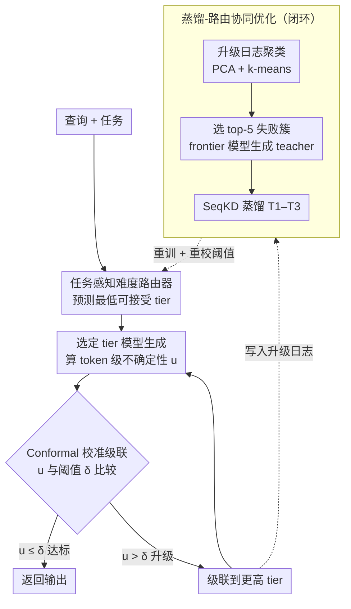

# RouteNLP: Closed-Loop LLM Routing with Conformal Cascading and Distillation Co-Optimization

**会议**: ACL2026  
**arXiv**: [2604.23577](https://arxiv.org/abs/2604.23577)  
**代码**: https://github.com/bettyguo/RouteNLP  
**领域**: 模型压缩 / LLM路由 / 高效部署  
**关键词**: LLM路由, conformal cascading, 知识蒸馏, 成本优化, 企业部署

## 一句话总结
RouteNLP 是一个闭环 LLM 路由与级联框架，用任务感知路由器、 conformal 校准级联和失败簇定向蒸馏共同优化模型组合，在六任务企业基准上以 0.971 质量比达到 0.159 成本比，并在 8 周客服试点中节省 58% 推理成本、保持 91% 响应可接受率。

## 研究背景与动机
**领域现状**：企业 NLP 服务通常同时拥有多个模型层级：轻量分类器、小型开源 LLM、中等 MoE 模型和昂贵 frontier API。不同请求难度差异巨大，很多 routine 查询并不需要最强模型，但关键业务请求又必须满足质量和延迟约束。

**现有痛点**：已有 LLM routing 和 cascading 方法多在单一 benchmark 上评估，较少考虑生产中的多任务、SLA、尾延迟和模型组合演化。更重要的是，它们通常把模型组合看成固定输入：路由器学会把请求分给已有模型，但不会根据路由失败反过来改造便宜模型。

**核心矛盾**：单纯路由只能在现有能力边界内省钱；如果便宜模型在某些高频失败簇上系统性不足，就会持续升级到昂贵模型。真正的成本优化应该闭环：发现升级失败模式，定向蒸馏便宜模型，再重新训练路由器和阈值。

**本文目标**：作者提出 RouteNLP，把 difficulty-aware router、confidence-calibrated cascading 和 distillation-routing co-optimization 整合为生产导向框架，目标是在每个任务质量约束下最小化成本和 SLA violation。

**切入角度**：论文来自实际企业场景：合作方推理成本超过每月 20 万美元，但 70% 以上查询是 routine task。作者利用这种 heavy-tailed difficulty distribution，把请求分配给最便宜且能满足质量阈值的模型，并让失败日志驱动后续蒸馏。

**核心 idea**：把 LLM serving 看作“路由 + 校准级联 + 组合改造”的闭环系统，而不是一次性训练一个 router；便宜模型通过 targeted distillation 逐步吸收高频失败簇，从而让更多请求留在低成本层级。

## 方法详解
RouteNLP 假设有按成本递增的模型组合 $M=\{m_1,\dots,m_K\}$，每个任务有质量阈值 $\tau_t$。系统要最小化处理请求所需的累计成本，同时保证最终输出质量达到任务要求。它通过三部分实现：先预测最便宜可用 tier，再用不确定性判断是否升级，最后把升级日志聚类成蒸馏数据来改进低 tier 模型。

### 整体框架
真正的关键是论文把「模型组合」本身也当成可优化对象，而不是只训一个 router 去分配请求。模型组合包含四层：T1 是 DistilBERT，每 1K token 成本约 0.01 美元；T2 是 Mistral-7B-Instruct，0.10 美元；T3 是 Mixtral-8x7B 量化版本，0.80 美元；T4 是 GPT-4-Turbo API，8.00 美元。一条请求先由路由器分配 tier，若该 tier 生成后的 token-level uncertainty 超过 conformal 阈值就级联到下一层；而所有升级日志又会被聚类成蒸馏数据，反过来改造便宜模型、再重训路由器——形成「路由 → 校准级联 → 组合改造」的闭环。训练标签由所有模型对所有查询的离线评估得到，质量指标随任务变化：结构化任务用 F1 或 accuracy，生成任务用 ROUGE-L 或 BERTScore。系统在六任务企业基准上评估，覆盖金融 NER/摘要、客服意图/回复、法律条款抽取/风险评估，总计 40,200 训练样本和 8,800 测试样本。

### 关键设计

**1. 任务感知难度路由器：预测一条查询所需的最低可接受 tier，而不是一刀切打给最强模型**

金融实体抽取、客服回复和法律风险判断的难度模式各不相同，用统一规则分配必然要么浪费算力、要么质量不达标。RouteNLP 用 DistilBERT-base 作为轻量 router，把 `[CLS]` 表示和一个 64 维任务 embedding 拼起来，再经任务投影头输出 4 个 tier logits。共享 encoder 复用语言表示，任务 embedding 则让路由器学到任务条件化的难度边界。训练损失由 tier 分类、成本项和质量约束 hinge penalty 三块组成，权重 $\lambda_c=0.3$、$\lambda_q=0.5$，从而在「尽量选便宜 tier」和「别选到质量不够的 tier」之间取得平衡。

**2. Conformal confidence-calibrated cascading：在路由器低估难度时兜底，避免不达标的低 tier 输出直接返回**

路由器给的是生成之前的先验判断，难免低估某些查询的难度，这时需要一个看「实际输出」的安全网。每个任务和 tier 用 500 个 calibration 样本估计不确定性阈值；某 tier 生成后计算 token-level uncertainty

$$u=\frac{1}{L}\sum_{i=1}^{L}\big(1-p(y_i\mid y_{<i},x)\big)$$

若 $u>\delta_{k,t}$ 就升级到下一层。阈值按 conformal risk control 设置，目标边际违规率 $\alpha=0.05$。作者也诚实地指出：conformal 只提供分布无关的、边际意义上的覆盖保证，一旦分布漂移这个假设就会被破坏（实测违规率会从 5% 恶化到 8.1%）。

**3. 失败簇驱动的蒸馏-路由协同优化：让便宜模型逐步吸收高频升级失败，而不是永远靠昂贵模型托底**

单纯路由只能在现有能力边界内省钱——如果便宜模型在某些高频失败簇上系统性不足，就会一直往上升级。RouteNLP 的闭环在这里：收集 escalation logs，提取 router 的 hidden representations，PCA 降到 128 维后按任务做 k-means 聚类；再按「簇大小 × 平均质量差」排序、选 top-5 簇，用 frontier model 为这些簇生成 teacher output，对 T1 到 T3 做 SeqKD，最后重训 router 并重新校准阈值。相比把数据平摊到已经能处理的样本上的随机蒸馏，定向锁定系统性短板能用同等数据量换来更大的成本下降。

### 一个完整示例：一条查询如何从 T1 走到闭环改造
一条客服意图分类请求进来，router 判断它是 routine task、打到最便宜的 T1（DistilBERT）。T1 生成后算 token-level uncertainty，发现 $u$ 超过该任务该 tier 的 conformal 阈值 $\delta_{k,t}$，于是级联升级到 T2（Mistral-7B）拿到达标输出返回。这次升级被写进 escalation log。一段时间后，大量类似的「带多轮引用的意图判断」失败被 k-means 聚成一个大簇且质量差明显，进入 top-5；系统用 T4 给这个簇生成 teacher output，把 T1 蒸馏得更强，再重训 router、重校阈值。下一轮，同类请求大多能直接被 T1 接住、不再升级——这就是为什么三轮 co-optimization 后 T1+T2 的承载比例从 68% 升到 81%、T4 占比从 11% 降到 5%、cost ratio 从 0.203 降到 0.159。

### 损失函数 / 训练策略
Router 损失为 $L=L_{route}+\lambda_c L_{cost}+\lambda_q L_{quality}$。$L_{route}$ 是 tier 分类交叉熵，标签来自全模型评估；$L_{cost}$ 鼓励选择低成本 tier；$L_{quality}$ 对预测 tier 低于任务质量阈值的情况施加 hinge penalty。蒸馏循环设收敛阈值 $\epsilon=0.005$，实践中 2-3 轮收敛。Router 约 67M 参数，A100 上训练约 45 分钟。

## 实验关键数据

### 主实验
RouteNLP 在主要成本-质量表中以接近 Hybrid LLM 的质量达到显著更低成本，并大幅降低 SLA violation。

| 系统 | Quality Ratio | Cost Ratio | p99 Latency | SLA Violation | 说明 |
|------|---------------|------------|-------------|---------------|------|
| Always-T4 | 1.000 | 1.000 | 1847 ms | 38.2% | 质量上界但成本和延迟最高 |
| Always-T2 | 0.891 | 0.013 | 142 ms | 0.1% | 成本低但质量不达标 |
| Random | 0.924 | 0.252 | 623 ms | 12.4% | 随机分配不可靠 |
| FrugalGPT | 0.967 | 0.284 | 986 ms | 21.3% | 级联能省钱但 SLA 较差 |
| Hybrid LLM | 0.972 | 0.312 | 874 ms | 18.7% | 质量接近但成本偏高 |
| RouteLLM | 0.969 | 0.246 | 841 ms | 17.2% | preference router 基线 |
| AutoMix | 0.958 | 0.231 | 1124 ms | 24.6% | POMDP 式混合模型 |
| RouteNLP | 0.971 | 0.159 | 387 ms | 2.3% | 成本最低且 SLA 违规显著降低 |

### 消融实验

| 配置 | Quality Ratio | Cost Ratio | T1+T2 Share | T4 Share | 说明 |
|------|---------------|------------|-------------|----------|------|
| Iter 0 初始 | 0.961 | 0.203 | 68% | 11% | 初始 router 与阈值 |
| Iter 1 | 0.964 | 0.178 | 74% | 8% | 定向蒸馏后更多请求进入低 tier |
| Iter 2 | 0.969 | 0.163 | 79% | 6% | 质量继续恢复，成本继续降 |
| Iter 3 最终 | 0.971 | 0.159 | 81% | 5% | 三轮后收敛 |

### 关键发现
- 去掉 cascade 会让质量下降 1.9 点，说明路由器后面的置信级联是必要安全网；去掉 co-optimization 成本增加 28%，说明单纯路由不能充分压低成本。
- 与随机蒸馏相比，targeted distillation 在相同数据量下把 cost ratio 从 0.203 降到 0.159，成本改善 21.7%；随机蒸馏只降到 0.184，改善 9.4%。
- 六个任务中，结构化任务成本下降 78-85%，质量保留 99% 左右；生成任务成本下降 40-47%，质量保留约 96%。
- 人工评估 400 个生成样本显示，74.5% 的 routed 输出与 T4 持平或更好；在较差样本中，约 68% 只是轻微变差，约 8-9% 全部查询存在显著退化风险。
- 8 周客服试点约 5K queries/day，实际成本降低 58%，覆盖违规率 4.8%，T4 使用比例 9.7%，与模拟预测的 62% 成本降低接近。

## 亮点与洞察
- 最大亮点是“把模型组合也当作可学习对象”。常见 router 只学习分配请求，RouteNLP 进一步用失败日志改造便宜模型，这更接近长期运行的企业系统。
- conformal calibration 写得比较诚实：作者明确说明保证是边际的、依赖 exchangeability，且 domain shift 会把 violation 推到 8.1%。这种边界说明对部署论文很重要。
- 试点部署结果增强了可信度。虽然是 shadow deployment 而非 A/B test，但 8 周、5K queries/day、质量审计和成本数据比纯模拟更接近真实生产。
- 失败模式分析有助于落地：多步推理、领域知识、难度歧义分别占 42%、31%、27%；试点中还发现 OCR artifacts 和多轮引用，这些更适合 escalation 而非蒸馏。

## 局限与展望
- 试点只覆盖客服场景，金融和法律结果主要来自基准模拟；跨行业真实部署仍需更多证据。
- co-optimization loop 在 benchmark 数据上运行，而不是生产失败日志；作者也承认试点中新失败模式与 benchmark 簇不完全一致。
- 试点是 shadow deployment，不是随机 A/B test，因此成本和投诉率变化的因果归因有限。
- Conformal 覆盖在 domain shift 下从目标 5% 恶化到 8.1%，说明需要在线阈值适配或漂移检测。
- 评估为英文场景，BERTScore 作为生成质量代理在分布外的 84-87% 人类一致性尚未验证。
- 一次 co-optimization 在该规模下约 2400 美元，低成本场景或小流量部署未必能摊销这笔开销。

## 相关工作与启发
- **vs FrugalGPT / Hybrid LLM**: 这些方法关注调用顺序或二元路由，RouteNLP 加入多任务、SLA、conformal calibration 和蒸馏闭环，更贴近企业多模型组合。
- **vs RouteLLM**: RouteLLM 用 preference data 学路由，但不评估 routed outputs 的真实业务质量，也不改造模型组合；RouteNLP 把输出质量、成本和路由失败闭环结合起来。
- **vs 模型压缩**: 传统蒸馏是一次性压缩模型，RouteNLP 是按路由失败簇持续定向蒸馏，目标不是得到一个万能小模型，而是让低 tier 覆盖高频业务短板。
- **启发**: 高效 LLM 部署的关键可能不是“选一个最优小模型”，而是建立持续学习的服务系统：监控失败、聚类失败、定向蒸馏、重校准阈值、再上线。

## 评分
- 新颖性: ⭐⭐⭐⭐☆ 路由、级联、conformal 和蒸馏都是已有模块，但闭环组合和生产验证有明显新意。
- 实验充分度: ⭐⭐⭐⭐☆ 六任务基准、消融、人评和 8 周试点很扎实；不足是非 A/B 试点和英文单语范围。
- 写作质量: ⭐⭐⭐⭐☆ 工程细节、成本模型和局限写得清楚，表格信息密集但服务于部署主线。
- 价值: ⭐⭐⭐⭐⭐ 对企业 LLM 成本优化、模型组合治理和低成本服务架构都有很高参考价值。

<!-- RELATED:START -->

## 相关论文

- [\[NeurIPS 2025\] Beyond Random: Automatic Inner-Loop Optimization in Dataset Distillation](../../NeurIPS2025/model_compression/beyond_random_automatic_inner-loop_optimization_in_dataset_distillation.md)
- [\[ACL 2026\] LLM Prompt Duel Optimizer: Efficient Label-Free Prompt Optimization](llm_prompt_duel_optimizer_efficient_label-free_prompt_optimization.md)
- [\[NeurIPS 2025\] ORPO-Distill: Mixed-Policy Preference Optimization for Cross-Architecture LLM Distillation](../../NeurIPS2025/model_compression/orpo-distill_mixed-policy_preference_optimization_for_cross-architecture_llm_dis.md)
- [\[CVPR 2026\] Teacher-Guided Routing for Sparse Vision Mixture-of-Experts](../../CVPR2026/model_compression/teacher-guided_routing_for_sparse_vision_mixture-of-experts.md)
- [\[AAAI 2026\] From Parameter to Representation: A Closed-Form Approach for Controllable Model Merging](../../AAAI2026/model_compression/from_parameter_to_representation_a_closed-form_approach_for_controllable_model_m.md)

<!-- RELATED:END -->
