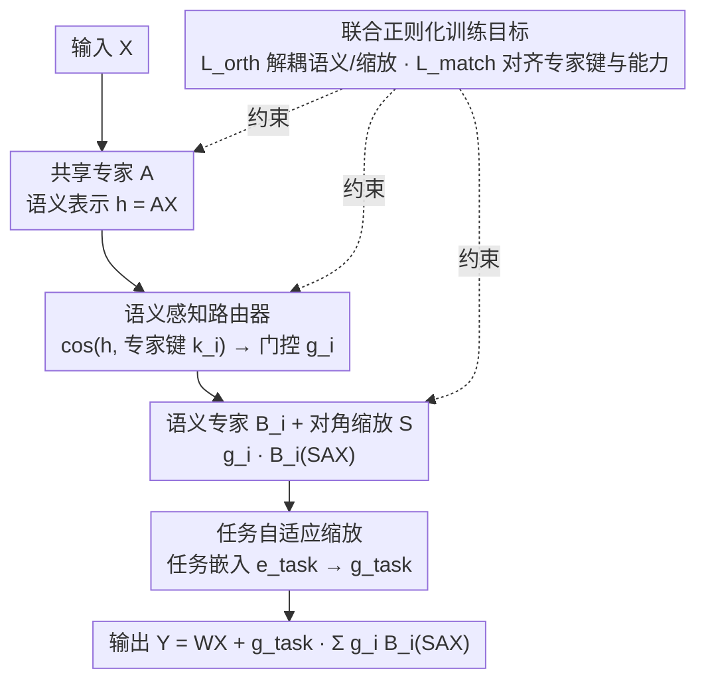

# SAMoRA: Semantic-Aware Mixture of LoRA Experts for Task-Adaptive Learning

**会议**: ACL 2026 Findings  
**arXiv**: [2604.19048](https://arxiv.org/abs/2604.19048)  
**代码**: [https://github.com/boyan-code/SAMoRA](https://github.com/boyan-code/SAMoRA)  
**领域**: 模型压缩/参数高效微调  
**关键词**: 混合专家, LoRA, 语义感知路由, 任务自适应, 多任务学习

## 一句话总结

SAMoRA 通过语义感知路由器和任务自适应缩放机制，解决了现有 MoE-LoRA 方法中路由不精确和权重融合缺乏灵活性的问题，在多任务基准上以最少可训练参数（0.15%）达到 SOTA。

## 研究背景与动机

**领域现状**：LoRA 作为参数高效微调的主流方案，在单任务上表现出色，但在复杂多任务场景下，单一参数集难以应对多样化的任务需求。近期 MoE-LoRA 方法（如 HydraLoRA、MTL-LoRA）将多个 LoRA 模块作为专家并引入路由机制，显著提升了模型容量。

**现有痛点**：两个核心问题未解决——(1) 现有 MLP 路由器基于学习到的数据分布而非实际专家能力进行分配，导致专家同质化，无法形成差异化的专门分工；(2) 标准 LoRA 使用全局固定的缩放因子，对所有任务施加统一的更新强度，忽略了不同任务的复杂度差异。

**核心矛盾**：路由决策与专家语义能力之间的脱节，以及"一刀切"的权重融合策略与多样化任务需求之间的冲突。

**本文目标**：(1) 实现基于语义匹配的精确路由；(2) 根据任务特性动态调整更新强度；(3) 在保持参数高效的同时提升多任务泛化能力。

**切入角度**：利用共享专家 A 作为语义编码器提取统一表示，在低秩空间中通过余弦相似度进行显式的语义-专家匹配，并引入 SVD 初始化的对角缩放矩阵和任务嵌入来动态调控更新幅度。

**核心 idea**：用语义感知的余弦相似度路由代替黑箱 MLP 路由，用任务驱动的动态缩放代替全局固定缩放，通过正交和语义匹配正则化保证专家分化。

## 方法详解

### 整体框架
SAMoRA 要解决的是现有 MoE-LoRA 的两个老毛病：MLP 路由器学的是数据分布而非专家真实能力、专家因此同质化；以及 LoRA 用全局固定缩放、对所有任务一视同仁。它采用非对称 MoE-LoRA 架构：单个共享专家 $A \in \mathbb{R}^{r \times d_{in}}$ 同时负责语义提取和路由，多个语义专家 $\{B_i\}_{i=1}^N$ 各自专注不同语义子空间。输入 $X$ 先经共享专家得到语义表示 $\mathbf{h} = AX$，由语义感知路由器在低秩空间里挑出合适的专家，再由任务自适应缩放机制调控融合强度，最终输出

$$Y = WX + g_{task}\sum_{i=1}^N g_i B_i(SAX)$$

整套设计围绕「让路由对齐专家真实能力、让缩放对齐任务复杂度」展开。

### 关键设计

**1. 语义感知路由器：用显式余弦相似度匹配代替黑箱 MLP 路由**

传统 MLP 路由器在隐式空间里学映射，并不知道每个专家到底擅长什么，结果就是专家彼此纠缠、分不出工。SAMoRA 给每个专家 $B_i$ 配一个可训练的专家键 $k_i \in \mathbb{R}^r$，当作该专家语义能力的锚点，路由分数直接由输入语义表示 $\mathbf{h}$ 与专家键的余弦相似度算出：

$$g_i = \frac{\exp(\cos(\mathbf{h}, k_i)/\tau)}{\sum_j \exp(\cos(\mathbf{h}, k_j)/\tau)}$$

其中温度 $\tau$ 控制匹配的严格程度。这种匹配发生在 $r$ 维低秩空间，既把路由的计算量从 $\mathcal{O}(Nd_{in})$ 压到 $\mathcal{O}(Nr)$，又让「输入语义 → 专家」的对齐变得可解释，而不是一个不可名状的隐式映射。

**2. 任务自适应缩放：让更新强度随任务复杂度变化，而非全局一个固定系数**

复杂任务需要大幅调整参数、简单任务只需微调，可标准 LoRA 对所有任务施加统一的缩放因子，这种「一刀切」必然顾此失彼。SAMoRA 用两件东西替代固定缩放：一是基于 SVD 初始化的对角缩放矩阵 $S = \text{diag}(\sigma_1, \dots, \sigma_r)$，用预训练权重的 top-$r$ 奇异值初始化，从而把适配方向对齐到原始权重的主语义方向、给训练一个稳定的结构起点；二是为每个任务分配可学习的任务嵌入 $e_{task}$，经非线性映射生成门控因子 $g_{task} = \sigma(W_{gate} e_{task} + b_{gate})$，动态控制这次更新该用多大比例。两者合起来，缩放就从静态常数变成了「随任务条件化」的可学习量。

**3. 联合正则化训练目标：用正交与语义匹配两道约束保证专家真的分化、路由键真的可信**

没有约束时会出两种麻烦：专家键可能与专家实际能力对不上，导致误路由；对角缩放也可能侵入方向学习，让语义变模糊。SAMoRA 用总损失

$$\mathcal{L}_{total} = \mathcal{L}_{task} + \lambda_{orth}\mathcal{L}_{orth} + \lambda_{match}\mathcal{L}_{match}$$

同时压住这两件事。正交正则化 $\mathcal{L}_{orth}$ 约束 $A$ 和各 $B_i$ 的行/列近似正交，把语义方向和缩放效应解耦；语义匹配正则化 $\mathcal{L}_{match}$ 则用 KL 散度最小化专家键 $k_i$ 与专家 $B_i$ 语义中心 $b_i$ 之间的分布差异，逼着路由键忠实反映专家的实际能力——这样第 1 个设计里的余弦路由才不会指错门。

### 损失函数 / 训练策略
总损失由标准多任务语言建模损失 $\mathcal{L}_{task}$ 加两个正则项组成。$\mathcal{L}_{orth}$ 强制 $A$ 和 $B_i$ 的正交性（$\|AA^\top - I\|_F^2 + \sum_i \|B_i^\top B_i - I\|_F^2$），$\mathcal{L}_{match}$ 通过 $D_{KL}(P_{Expert} \| P_{Key})$ 对齐专家键与专家表示。超参数 $\lambda_{orth}$ 和 $\lambda_{match}$ 控制正则化强度。

## 实验关键数据

### 主实验

**常识推理基准 (Llama3.1-8B, 9 个任务平均)**

| 方法 | 可训练参数% | BoolQ | PIQA | ARC-C | ARC-E | Avg. |
|------|-----------|-------|------|-------|-------|------|
| LoRA | 2.09 | 70.43 | 82.97 | 77.56 | 85.77 | 79.54 |
| HydraLoRA | 0.17 | 74.31 | 90.15 | 84.06 | 92.18 | 86.27 |
| MTL-LoRA | 0.16 | 74.34 | 89.90 | 84.55 | 93.81 | 86.77 |
| **SAMoRA** | **0.15** | **74.89** | **90.37** | **86.35** | **94.70** | **87.64** |

**常识推理基准 (Qwen3-8B, 9 个任务平均)**

| 方法 | Avg. |
|------|------|
| LoRA | 88.64 |
| MTL-LoRA | 90.98 |
| **SAMoRA** | **91.71** |

**GLUE 基准 (Qwen3-8B, 7 个任务平均)**

| 方法 | CoLA | MNLI | Avg. |
|------|------|------|------|
| LoRA | 64.06 | 91.84 | 88.41 |
| MTL-LoRA | 66.32 | 91.93 | 89.18 |
| **SAMoRA** | **69.75** | **91.96** | **89.98** |

### 消融实验

| 变体 | CoLA | GLUE Avg. |
|------|------|-----------|
| SAMoRA (完整) | 69.75 | 89.98 |
| w/o Router (替换为MLP) | 68.19 | 89.36 |
| w/o Scaling | 66.43 | 88.90 |
| w/o $\mathcal{L}_{orth}$ | 68.32 | 88.99 |
| w/o $\mathcal{L}_{match}$ | 68.73 | 89.02 |

### 关键发现

- 任务自适应缩放的消除导致最大性能下降（CoLA 下降 3.32%），说明动态缩放在缓解任务冲突和负迁移中至关重要
- PCA 可视化显示语义感知路由器使专家在特征空间中形成清晰分离的簇，而 MLP 路由器的专家高度纠缠
- SAMoRA 以最少的可训练参数（0.15%）超越所有基线，参数效率与性能的 trade-off 最优

## 亮点与洞察

- 将路由从隐式 MLP 映射转变为显式余弦相似度语义匹配，提高了路由的可解释性和精确性
- 非对称架构（共享 A + 多个 B）的巧妙设计：A 同时承担语义编码和路由的双重角色，消除了独立路由网络的额外开销
- SVD 初始化为任务自适应缩放提供了理论上合理的起点，将适配方向与预训练权重的主成分对齐

## 局限与展望

- 仅在 8B 规模模型上验证，未测试 70B 及更大模型的可扩展性
- 未探索多模态场景（如视觉指令微调、视觉问答）
- 未来可将方法扩展到大规模和多模态设置

## 相关工作与启发

- 与 HydraLoRA 共享非对称架构思想，但增加了显式语义路由和动态缩放
- SVD 初始化策略借鉴了 MoORE 的思路，但进一步引入了任务驱动的门控机制
- 为 MoE-LoRA 领域提供了新的设计范式：语义感知 + 任务自适应

## 评分

- 新颖性: ⭐⭐⭐⭐ 语义感知路由和任务自适应缩放的组合是有意义的创新，但各组件单独来看并不完全新颖
- 实验充分度: ⭐⭐⭐⭐ 覆盖两个基准、两个主干模型、完整消融和可视化分析，但缺少大规模模型验证
- 写作质量: ⭐⭐⭐⭐ 动机清晰、方法阐述完整，复杂度分析到位

<!-- RELATED:START -->

## 相关论文

- [\[ACL 2025\] MoRE: A Mixture of Low-Rank Experts for Adaptive Multi-Task Learning](../../ACL2025/model_compression/more_a_mixture_of_low-rank_experts_for_adaptive_multi-task_learning.md)
- [\[NeurIPS 2025\] Multi-Task Vehicle Routing Solver via Mixture of Specialized Experts under State-Decomposable MDP](../../NeurIPS2025/model_compression/multi-task_vehicle_routing_solver_via_mixture_of_specialized_experts_under_state.md)
- [\[ICLR 2026\] LD-MoLE: Learnable Dynamic Routing for Mixture of LoRA Experts](../../ICLR2026/model_compression/ld-mole_learnable_dynamic_routing_for_mixture_of_lora_experts.md)
- [\[ACL 2026\] TELL-TALE: Task Efficient LLMs with Task Aware Layer Elimination](tell-tale_task_efficient_llms_with_task_aware_layer_elimination.md)
- [\[ICML 2025\] Make LoRA Great Again: Boosting LoRA with Adaptive Singular Values and Mixture-of-Experts Optimization Alignment](../../ICML2025/model_compression/make_lora_great_again_boosting_lora_with_adaptive_singular_values_and_mixture-of.md)

<!-- RELATED:END -->
