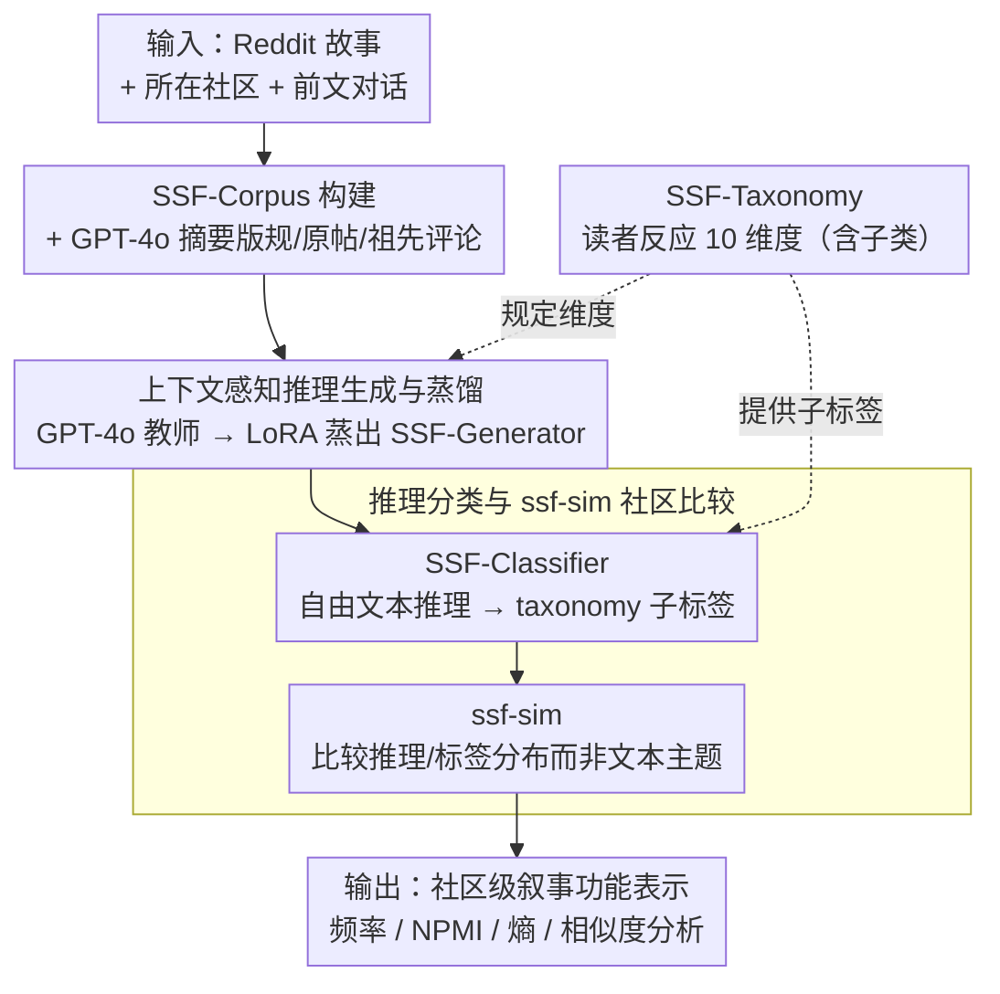

# Social Story Frames: Contextual Reasoning about Narrative Intent and Reception

**会议**: ACL2026  
**arXiv**: [2512.15925](https://arxiv.org/abs/2512.15925)  
**代码**: social-story-frames（论文给出项目名，未在正文中展开完整 URL）  
**领域**: NLP理解 / 计算社会科学 / 叙事推理  
**关键词**: 叙事理解、读者反应、社会媒体、上下文推理、模型蒸馏

## 一句话总结
这篇论文提出 SocialStoryFrames，用一个包含 10 个维度的读者反应 taxonomy 和两个蒸馏模型，把 Reddit 故事放回社区与对话上下文中推断其叙事意图、读者情感和价值判断，并在 6,140 条社交媒体故事上展示了比语义相似度更细的社区叙事实践分析。

## 研究背景与动机
**领域现状**：NLP 对故事的处理长期偏向故事内部内容，例如事件因果、角色心理、情节一致性或 suspense、curiosity 等局部读者反应。计算社会科学也会分析在线社区中的叙事，但常见做法要么是深入研究单一社区，要么是在大规模语料上统计故事数量、结构原型或主题分布。

**现有痛点**：这两类路线存在明显的深度和规模取舍。个案研究能解释某个社区中的权力、身份或情感协商，却难以横向比较几十个社区；大规模分析容易扩展，却常把故事简化成文本主题或 embedding 相似度，丢掉“作者为什么讲这个故事”和“读者可能怎样理解它”的社会语用层。

**核心矛盾**：社交媒体故事并不是孤立文本。一个人在 r/buildapc 讲产品故障故事，和在 r/MakeupAddiction 讲试用失败故事，表面主题完全不同，但都可能是在寻求建议、确认经验或获得情感支持。只看故事文本会错过这种“叙事功能”的相似性；只靠人工阐释又无法覆盖大量社区。

**本文目标**：作者希望构造一个既有理论解释力、又能被模型批量应用的形式化框架，用来回答三类问题：故事在特定社区和对话中被认为有什么意图；读者会产生哪些解释、预测、情感和价值判断；不同社区的叙事实践是否能在语义主题之外被比较。

**切入角度**：论文把 reader response theory、叙事理论、语用学和心理学中的概念落成一个 SocialStoryFrames taxonomy，再用 GPT-4o / GPT-4.1 生成参考推理并蒸馏到开放权重模型。这样既保留理论维度，又把昂贵的专家或闭源模型推理变成可复现的批量管线。

**核心 idea**：用“社区上下文 + 对话上下文 + 读者反应 taxonomy”替代单纯文本语义表示，建模故事在在线社区中的社会功能和接受方式。

## 方法详解
SocialStoryFrames 不是单一分类器，而是一套从理论 taxonomy、语料构建、上下文摘要、推理生成、推理分类到社区分析的完整 pipeline。它的输入是一条包含故事的 Reddit 评论、其所在社区信息以及前文对话；输出则是多个维度上的自由文本推理和 taxonomy 标签分布。

### 整体框架
整体流程可以分成四步。第一步从 ConvoKit 的 reddit-corpus-small 中筛选故事，构造 SSF-Corpus，并为每条故事保留社区和对话上下文。第二步用 GPT-4o 摘要 subreddit 目的、规范、初始帖子和祖先/同级评论，使模型推断时能看到读者实际可能拥有的上下文。第三步用 SSF-Generator 生成每个 taxonomy 维度上的读者反应推理，例如作者意图、因果解释、未来预测或审美感受。第四步用 SSF-Classifier 把自由文本推理映射到细粒度 taxonomy 子标签，从而得到可统计、可比较的社区级叙事表示。贯穿其中的是 SSF-Taxonomy：它既规定了第三步生成推理的 10 个维度，又提供了第四步分类落点的子标签。

### 关键设计

**1. SSF-Taxonomy 读者反应维度：把“读者怎么理解一个故事”拆成 10 个可操作维度**

只看故事文本，模型最多输出“这条评论很伤心”或“主题相似”，丢掉了“作者为什么讲”和“读者会怎么接收”的社会语用层。SSF-Taxonomy 不从数据里无监督聚类标签，而是从 reader response theory、叙事理论、语用学、情感心理学和价值理论里整理出 overall goal、narrative intent、author emotional response、causal explanation、prediction、character appraisal、moral、stance、narrative feeling、aesthetic feeling 共 10 个维度，并为每个维度设计子类——比如 narrative intent 下分身份表达、意义建构、情绪释放、娱乐、论证和寻求支持，moral 直接借用 Schwartz 价值理论的高层类别。

这样设计的好处是给社区比较提供了一套公共坐标系：模型输出不再停在自由文本，而能落到可解释的社会功能上，且不必为每个 subreddit 单独定义标签，这也比直接让 LLM 输出一大段解释更适合做跨社区统计。

**2. 上下文感知的推理生成与蒸馏：让读者反应推理依赖社区规范和对话前文，再把闭源大模型的能力迁到开源学生**

读者反应高度依赖语境，直接让小模型 zero-shot 处理容易浅化。作者先用 GPT-4o 作为 teacher，为 SSF-Split-Corpus 里的 story-dimension pair 生成最多 3 条独立推理，每条用维度特定模板约束格式、但内容自由填充；同时用 GPT-4o 摘要 subreddit 目的、规范、初始帖子和祖先/同级评论，让模型推断时能看到读者实际拥有的上下文。随后用 LoRA 把 Llama3.1-8B-Instruct 蒸馏成 SSF-Generator，把昂贵的闭源推理变成可批量、可复现的管线，并用人工 plausibility survey 检验这些推理是否被真人认为合理。

**3. 推理分类与 ssf-sim 社区比较：把自由文本推理压成标签分布，从而比较“主题不同但叙事功能相似”的社区**

自由文本推理信息密度高却不好统计。作者发现多标签 inference classification 在 zero-shot 下效果较差，于是用 GPT-4.1 的 k-shot prompting 产生分类参考，再蒸馏出 SSF-Classifier，把每条推理映射到 taxonomy 子标签。社区相似度 ssf-sim 不比较原始文本 embedding，而比较 SSF-Generator 的推理和 SSF-Classifier 的标签分布——标签分布便于在社区层面做频率、NPMI、entropy 和相似度分析。正因为比较的是“叙事功能”而不是“文本主题”，ssf-sim 才能发现 r/MakeupAddiction 和 r/buildapc 这类主题迥异却功能相近的社区对。

### 损失函数 / 训练策略
论文没有强调新的训练损失，核心训练策略是 teacher-student 蒸馏。生成端用 GPT-4o 产生参考推理，LoRA 微调 Llama3.1-8B-Instruct；分类端用 GPT-4.1 k-shot 输出作为参考，微调同系列开源模型做 zero-shot 多标签分类。数据划分上，SSF-Split-Corpus 有 1,778 条故事，训练/验证/测试约为 2/3、1/6、1/6，并保证验证和测试中有 10% 故事来自训练中未出现的 55 个 subreddit，以考察跨社区泛化。

## 实验关键数据

### 主实验

| 评估对象 | 设置 | 关键指标 | 结果 | 说明 |
|--------|------|----------|------|------|
| SSF-Corpus | Reddit 100 个 subreddit 筛选 | 故事数 | 6,140 | 每条含故事、前文对话和社区上下文 |
| SSF-Split-Corpus | 训练/验证/测试 | 故事数 | 1,778 | 验证和测试各含 10% unseen subreddit |
| GPT-4o 推理 plausibility | Prolific 人类评估 | 有效评分 | 4,239 ratings / 278 annotators | 代表性美国成人样本 |
| SSF-Generator 输出 plausibility | 人类评估 | plausible 比例 | >=94% | 大多数推理被认为上下文合理 |
| SSF-Generator 输出 likelihood | 人类评估 | somewhat/very likely 比例 | >=78% | 不只合理，也有较高可能性 |
| ssf-sim 构念效度 | 50 对故事对比较 | 与人类判断一致率 | 74% | Sentence-BERT baseline 为 52% |

### 消融实验

| 配置 | 关键指标 | 说明 |
|------|---------|------|
| Full context SSF-Generator | 与人类验证的 GPT-4o teacher 对齐最好 | 同时使用故事、社区和对话上下文 |
| 去掉社区上下文 | 对齐下降 | 社区规范和价值观会影响读者解释 |
| 去掉对话上下文 | 下降更明显 | 论文指出 conversational context 尤其关键 |
| Sentence-BERT semantic similarity | 52% human-aligned | 主题相似无法捕捉叙事功能相似 |
| ssf-sim | 74% human-aligned | 基于推理和 taxonomy 标签，更贴近语用功能 |

### 关键发现
- 叙事意图分布显示，最常见的 narrative intent 是 justify or challenge a belief，占 40%；clarification、emotional release 各占 14%，identity 和 entertainment 各占 10%。这说明在线故事经常承担论证和社会协商功能，而不只是娱乐。
- overall goal 中的 emotional support 与 narrative intent 中的 conveying a similar experience 有较强关联，NPMI 为 0.35，支持“用相似经历表达共情”这一在线支持机制。
- SSF-Classifier 在测试集上接近 GPT-4.1 k-shot。它在 7/10 个维度的 Micro F1 上超过、持平或距离 GPT-4.1 不超过 0.05，在所有维度上与 GPT-4.1 的差距都不超过 0.1。
- 社区比较发现，r/MakeupAddiction 和 r/buildapc 这类主题差异很大的社区可以有相似叙事功能，而 r/funny 与 r/news/r/politics 即便主题接近，叙事取向也可能完全不同。

## 亮点与洞察
- 把“故事理解”从文本内部推到社会语境中，是这篇论文最有价值的地方。它没有只问故事发生了什么，而是问故事在某个社区里被怎样使用、怎样接收。
- taxonomy 的设计很克制：它覆盖 10 个维度，足够宽，但又通过子标签保持可统计性。这个设计比直接让 LLM 输出长解释更适合做跨社区分析。
- ssf-sim 是一个很可迁移的想法。许多任务中的相似度都不应只比较内容，例如客服对话、医疗叙述、论坛求助或产品评论，都可以比较“交际功能”和“预期反应”。
- 论文把人类验证放在两个层面：先验证生成推理的 plausibility，再验证相似度指标的构念效度。这让方法不是单纯堆 LLM，而是有社会科学测量意识。

## 局限与展望
- 上下文摘要采用迭代式 summarization，可能产生信息级联丢失，尤其对短上下文或需要细节的故事不够稳。
- 当前模型和语料集中在英文 Reddit，且人类评估者主要是美国成人。把这些结果当成普遍读者反应可能造成文化、性别和意识形态偏差。
- taxonomy 不是穷尽性的。叙事吸收、复杂审美情绪、读者身份差异和维度之间的依赖关系都被简化了。
- 模型假设某个社区存在“常见读者反应”，但高极化、专业门槛高或反应高度个人化的社区可能不满足这个假设。
- 后续可以把维度建成联合结构模型，显式建模 intent、stance、emotion、moral 之间的依赖，而不是独立生成每个维度。

## 相关工作与启发
- **vs 传统 commonsense reasoning**: ATOMIC/COMET 类工作通常基于短事件做去语境化推理，本文则把故事嵌入社区和对话，推理读者接受和社会功能。
- **vs narrative schema / story understanding**: 既有叙事 NLP 多关注情节、角色心理或因果一致性，本文关注故事为什么被讲述以及如何被读者理解。
- **vs Sentence-BERT 语义相似度**: 语义相似度擅长找主题接近的文本，ssf-sim 能找功能接近但主题不同的社区叙事。
- **启发**: 这类“理论 taxonomy + LLM 蒸馏 + 人类构念验证”的路线，很适合用于高层社会语义任务，例如价值冲突识别、社区规范建模和多方对话中的立场/支持功能分析。

## 评分
- 新颖性: ⭐⭐⭐⭐ 社会叙事接受建模和 ssf-sim 很有新意，核心模型训练本身较常规。
- 实验充分度: ⭐⭐⭐⭐ 有人类 plausibility、专家标注和社区分析，但全局相似度验证规模仍偏小。
- 写作质量: ⭐⭐⭐⭐⭐ 理论动机、taxonomy、建模和社会科学分析连接得很顺。
- 价值: ⭐⭐⭐⭐ 对 NLP+CSS 很有启发，可复用性强，但跨平台和跨文化泛化仍需进一步验证。

<!-- RELATED:START -->

## 相关论文

- [\[ICLR 2026\] ACPBench Hard: Unrestrained Reasoning about Action, Change, and Planning](../../ICLR2026/model_compression/acpbench_hard_unrestrained_reasoning_about_action_change_and_planning.md)
- [\[CVPR 2025\] ECVC: Exploiting Non-Local Correlations in Multiple Frames for Contextual Video Compression](../../CVPR2025/model_compression/ecvc_exploiting_non-local_correlations_in_multiple_frames_for_contextual_video_c.md)
- [\[ACL 2026\] VecCISC: Improving Confidence-Informed Self-Consistency with Reasoning Trace Clustering and Candidate Answer Selection](veccisc_improving_confidence-informed_self-consistency_with_reasoning_trace_clus.md)
- [\[ACL 2026\] JudgeMeNot: Personalizing Large Language Models to Emulate Judicial Reasoning in Hebrew](judgemenot_personalizing_large_language_models_to_emulate_judicial_reasoning_in_.md)
- [\[ACL 2026\] LightReasoner: Can Small Language Models Teach Large Language Models Reasoning?](lightreasoner_can_small_language_models_teach_large_language_models_reasoning.md)

<!-- RELATED:END -->
