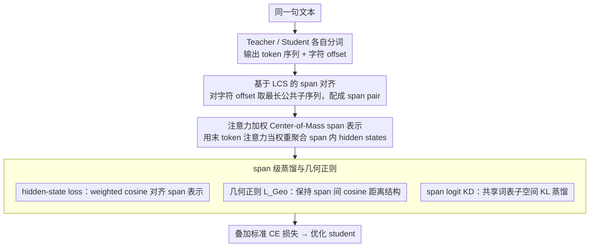

# SRA: Span Representation Alignment for Large Language Model Distillation

**会议**: ACL 2026  
**arXiv**: [2605.01205](https://arxiv.org/abs/2605.01205)  
**代码**: 论文未提供公开仓库  
**领域**: 模型压缩 / 知识蒸馏 / Cross-Tokenizer Distillation  
**关键词**: 跨分词器蒸馏、span alignment、center of mass、几何正则、LLM压缩

## 一句话总结
SRA 把跨分词器 LLM 蒸馏的基本对齐单元从易碎的 token 换成 tokenizer-agnostic 的文本 span，通过 LCS 字符偏移匹配、注意力加权 center-of-mass 表示、几何结构正则和共享词表 span logit 蒸馏，在多组 teacher-student 压缩实验中稳定超过 ULD、MinED、DSKD 和 MultiLevelOT。

## 研究背景与动机
**领域现状**：知识蒸馏是把大语言模型能力转移到小模型的常用压缩技术。传统 KD 往往假设 teacher 和 student 使用同一个 tokenizer，可以直接对齐 token 或 logit 分布；但真实部署中，不同模型家族常常使用不同词表和切分规则。

**现有痛点**：Cross-Tokenizer Knowledge Distillation 需要跨 tokenizer 对齐。已有方法要么用编辑距离、动态规划或 OT 处理 token 序列，要么把不同词表映射到统一空间，但 token 级别对齐容易受到分词粒度差异影响：同一段文本在 teacher 中可能是一个 token，在 student 中可能被切成多个 token。

**核心矛盾**：蒸馏想转移的是语义和表示动态，而 tokenizer mismatch 使 token 序列不再是一一对应的稳定单位。直接对齐 token 会把“分词差异”误当成“知识差异”。

**本文目标**：作者希望构造一个跨分词器也稳定的蒸馏单元，使 teacher 和 student 可以在相同文本 span 上对齐 hidden states、几何结构和预测分布。

**切入角度**：论文借用 Transformer 作为 Multi-Particle Dynamical System 的物理视角：token hidden states 像粒子位置，span 可以看作粒子簇，span 表示则是 attention-weighted center of mass。

**核心 idea**：先用字符偏移找到 teacher 和 student 都覆盖的文本 span，再用注意力加权聚合成 span 表示，并在 span 级别做 hidden-state、几何结构和 logit 蒸馏。

## 方法详解
SRA 的设计可以理解为“先找共同语义单位，再转移表示动态”。它避免直接在不同 tokenizer 的 token 序列之间硬匹配，而是回到原始字符串，用字符 offset 找到两边都能解释的 span。然后，SRA 不只让 student 的 span 向 teacher 的 span 靠近，还要求 span 与 span 之间的相对几何关系尽量保持。

### 整体框架
给定同一句文本，teacher tokenizer 和 student tokenizer 分别输出 token 序列和字符 offset。SRA 用 offset 序列的最长公共子序列构造对齐 span。对每个 span，模型从最后一层 hidden states 中通过注意力加权 pooling 得到 span representation。训练时，student 同时优化标准 CE、span hidden-state loss、几何结构正则和 span-level logit KD loss。

### 关键设计

**1. 基于 LCS 的 span mapping：在不同 tokenizer 之间建立可比的文本片段单位**

token-level 对齐在跨 tokenizer 场景下很脆弱：同一段文本在 teacher 里可能是一个 token，在 student 里被切成好几个，直接对齐会把“分词差异”误当成“知识差异”。SRA 因此回到原始字符串，对 teacher 和 student 的 token 字符 offset 序列计算最长公共子序列（LCS），把字符边界相同的片段配成 span pair，并忽略 offset 为 0 的特殊 token。这样得到的 span 覆盖两边都能解释的共同子片段，而不强迫 token 数一致——字符 span 是原始文本层面的稳定单位，更适合当知识转移的载体。

**2. 注意力加权 Center-of-Mass span 表示：把一个 span 内多个 token 的 hidden states 聚合成单个语义表示**

简单 mean pooling 会把关键信息稀释掉。SRA 借用 Transformer 作为多粒子动力系统的物理视角：token hidden states 像粒子位置，span 是一簇粒子，span 表示就是注意力加权的质心（center of mass）。具体做法是用最后 token 对各 token 的注意力作为 token 重要性 $w_t$，归一化后计算 span 的加权平均

$$C_i=\sum_{t=s_i}^{e_i} w_t H_t$$

其中 $w_t$ 来自最后层多头注意力的聚合。质量更大的粒子更能左右整体质心，对应到文本里就是更受关注的 token 对 span 表示贡献更大，关键信息因此不会被平均掉。

**3. span-level hidden/logit 蒸馏与几何正则：让 student 同时学到局部 span 表示、span 间相对结构和共享词表预测分布**

只对齐 span 表示的位置容易被线性投影扭曲，只对齐 hidden states 又缺了词汇预测知识。SRA 于是同时开三条监督通道：hidden-state loss 用 weighted cosine 对齐 teacher 与 student 的 span 表示，几何正则 $L_{Geo}$ 保持 span 之间的 cosine distance 不被破坏，logit loss 则把 teacher 和 student 的 span logits 投影到共享词表子空间 $V_T\cap V_S$ 后做 KL 蒸馏。几何正则保住了表示空间的相对结构，共享词表 logit loss 补上词汇预测监督，三类信号互补，缺一类在消融里都会掉点。

### 损失函数 / 训练策略
总目标为 $L_{overall}=\alpha L_{CE}+(1-\alpha)(L_{HS}^{Span}+L_{KD}^{Span})$。其中 $L_{HS}^{Span}$ 包含加权 cosine loss 和几何结构正则，$L_{KD}^{Span}$ 在共享词表空间对齐 span logits。训练数据使用 Databricks-Dolly-15k，评估覆盖 Dolly、VicunaEval、SelfInst、S-NI 和 DialogSum，指标为 ROUGE-L，并对结果取 5 个随机种子的平均值。

## 实验关键数据

### 主实验

| Teacher → Student | 最强非SRA基线 Avg | SRA Avg | 主要观察 |
|--------|------|------|------|
| Qwen1.5-1.8B → GPT-2 120M | DSKD 15.35 | 17.97 | 小学生模型上提升最明显 |
| Qwen1.5-1.8B → GPT-2 340M | DSKD 15.57 | 18.10 | S-NI 从 17.18 提到 24.49 |
| Qwen2.5-7B → GPT-2 1.5B | DSKD 19.27 | 20.99 | 大 teacher 到 GPT-2 仍有效 |
| Qwen2.5-7B → OPT-2.7B | DSKD 20.15 | 20.92 | OPT 学生上保持领先 |
| Mistral-7B → TinyLLaMA-1.1B | DSKD 21.33 | 22.52 | 跨架构、跨词表仍稳健 |
| GPT-2 1.5B → GPT-2 120M | AKL 17.03 | 19.24 | 同 tokenizer 场景也能受益 |

### 消融实验

| 配置 | Qwen1.5→GPT-2 340M Avg | Qwen1.5→GPT-2 120M Avg | 说明 |
|------|------|------|------|
| 仅 span logit KD | 17.36 | 17.10 | 共享词表蒸馏已有收益 |
| span logit KD + 几何正则 | 17.94 | 17.72 | 几何结构保持带来稳定增益 |
| span logit KD + cosine | 17.54 | 17.32 | 表示点对齐有帮助但不如几何充分 |
| cosine + 几何正则 | 17.48 | 16.04 | 缺少 logit KD 时不够稳 |
| 完整 SRA | 18.10 | 17.97 | 三类信号互补效果最好 |

| WSL / WSP 配置 | GPT-2 340M Avg | GPT-2 120M Avg | 说明 |
|------|------|------|------|
| 去掉 WSL 与 WSP | 16.99 | 14.85 | span 表示质量明显下降 |
| 仅 WSL | 17.11 | 15.77 | 加权损失有一定帮助 |
| 仅 WSP | 17.36 | 15.89 | 加权 pooling 比 mean pooling 更重要 |
| WSL + WSP | 18.10 | 17.97 | 显示 span 权重设计是核心组件 |

### 关键发现
- SRA 在所有 teacher-student 配置上都取得最高平均 ROUGE-L，说明 span-level 对齐对跨 tokenizer 蒸馏是稳定收益，而不是某个模型对的偶然现象。
- 几何正则和注意力加权不是装饰项：去掉 WSP 或 WSL 都会掉点，尤其在 GPT-2 120M 这类小学生模型上更明显。
- 训练效率表显示 SRA 单步时间为 0.2754s，快于 DSKD 0.3520s、MinED 0.4244s 和 ULD 0.4393s；代价是显存 21.96GB，略高于 MinED/ULD 的 19.63GB。

## 亮点与洞察
- 最巧妙的是把 tokenizer mismatch 从离散 token 对齐问题转成连续 span 表示问题。span 来自原始字符边界，天然比 token 更接近语义单位。
- Multi-Particle / Center-of-Mass 类比虽然听起来偏理论，但落到实现上就是“用注意力重要性做 span pooling + 保留相对几何结构”，可操作性很强。
- SRA 不只适用于不同 tokenizer，同 tokenizer 蒸馏也有收益，说明它捕捉的不只是词表重叠问题，还包括 teacher-student 表示空间结构差异。

## 局限与展望
- 当前 logit mapping 是静态的，只在共享词表子空间中对齐，可能忽略非共享词表中携带的细粒度知识。
- span 表示对齐需要在线 teacher inference，若想预计算所有 teacher span embeddings，存储成本会非常高。
- 实验受计算预算限制，主要集中在固定 benchmark 和 decoder-to-decoder 设置；embedding 模型、encoder-decoder 模型和更长上下文任务还需要验证。
- LCS 基于字符 offset，面对语言混排、复杂 Unicode 切分或高度形态变化语言时，span 匹配质量可能成为瓶颈。

## 相关工作与启发
- **vs ULD / MinED**: 这些方法更关注 token 或编辑距离层面的对齐，SRA 退回到文本 span 层面，减少 tokenizer 粒度差异带来的噪声。
- **vs DSKD**: DSKD 通过统一空间做分布对齐，SRA 同时对齐 hidden geometry 和 span logits，知识通道更丰富。
- **vs MultiLevelOT**: OT 方法能处理分布匹配但计算和对齐复杂度较高，SRA 的 LCS + span pooling 更轻量，实验中单步时间更短。
- **vs 同 tokenizer KD 方法**: SeqKD、RKL、JS、SKL、AKL 等假设词表一致，SRA 在同 tokenizer 下仍能提升，提示 span 几何蒸馏可以作为通用 KD 组件。

## 评分
- 新颖性: ⭐⭐⭐⭐☆ span-level CoM 表示和几何正则组合很有辨识度，物理视角也带来清晰设计动机。
- 实验充分度: ⭐⭐⭐⭐☆ teacher-student 组合、同/跨 tokenizer、消融和效率都覆盖较好；更大规模和更多任务还可扩展。
- 写作质量: ⭐⭐⭐⭐☆ 方法链条完整，公式较多但与实现对应清晰。
- 价值: ⭐⭐⭐⭐⭐ 对跨模型家族蒸馏和小模型部署非常实用，尤其适合 tokenizer 不一致的真实压缩场景。

<!-- RELATED:START -->

## 相关论文

- [\[ACL 2026\] MTA: Multi-Granular Trajectory Alignment for Large Language Model Distillation](mta_multi-granular_trajectory_alignment_for_large_language_model_distillation.md)
- [\[ACL 2026\] Alignment Tuning for Large Language Models: A Data-Centric Lens on Alignment Data Pipelines](alignment_tuning_for_large_language_models_a_data-centric_lens_on_alignment_data.md)
- [\[ACL 2025\] Quantification of Large Language Model Distillation](../../ACL2025/model_compression/quantification_of_large_language_model_distillation.md)
- [\[ICLR 2026\] Distillation of Large Language Models via Concrete Score Matching](../../ICLR2026/model_compression/distillation_of_large_language_models_via_concrete_score_matching.md)
- [\[ACL 2026\] LightReasoner: Can Small Language Models Teach Large Language Models Reasoning?](lightreasoner_can_small_language_models_teach_large_language_models_reasoning.md)

<!-- RELATED:END -->
