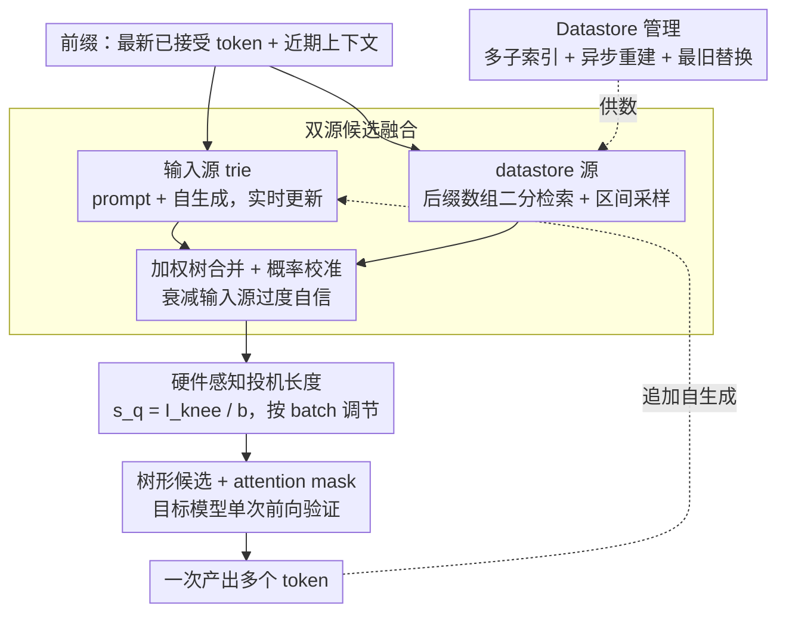

<!-- 由 src/gen_stubs.py 自动生成 -->
# SSSD: Simply-Scalable Speculative Decoding

**会议**: ACL2026
**arXiv**: [2411.05894](https://arxiv.org/abs/2411.05894)
**代码**: [GitHub](https://github.com/huawei-csl/sssd_speculator)
**领域**: model_compression
**关键词**: 推测解码, LLM推理加速, n-gram匹配, 无训练, 硬件感知

## 一句话总结

提出 SSSD，一种无需训练的推测解码方法，结合轻量级 n-gram 匹配与硬件感知投机长度调整，在无需任何草稿模型训练或部署的前提下，实现最高 2.9× 的推理加速，并在语言/领域迁移和长上下文场景中展现出优于训练式方法的鲁棒性。

## 研究背景与动机

推测解码（Speculative Decoding, SD）是加速 LLM 推理的热门技术，但现有方法面临两大实际部署瓶颈：(1) 基于训练的方法（如 EAGLE、Medusa）需要训练和部署额外的草稿模型，当目标模型或应用领域变化时需要重新训练，增加维护复杂度；(2) 现有无模型方法（如 Prompt Lookup Decoding、REST）投机质量有限，仅在特定任务上有效。在实际生产系统中，易于集成和成本效率与原始延迟改进同等重要。此外，先前工作表明训练式草稿模型在非英语语言上泛化差，造成推理速度的不公平性。SSSD 旨在填补"高性能且易部署"这一空白。

## 方法详解

### 整体框架

SSSD 将 prompt + 自生成文本视为统一的 n-gram 源，并与大型文本数据存储（datastore）集成。最终 token 的前缀在两个源中匹配，匹配到的续写经加权合并与概率校准后构建成树形候选集，再由硬件感知的投机长度决定提交多少候选给目标模型一次性验证。整个草稿生成在 CPU 上运行，不占用 GPU 资源。

### 关键设计

1. **双源候选融合**：将 prompt/self-output（存储在 trie 结构中，实时更新）与外部大型 datastore（基于后缀数组构建）的候选融合。两个源提供互补的候选——prompt 源对当前上下文敏感，datastore 源覆盖更广的语言模式。通过加权树合并，并对 prompt 源的过度自信概率进行衰减校准。
2. **Datastore 管理**：采用多子索引架构（每个子索引 512M token，≈4GB），支持异步重建和最旧替换策略。基于后缀数组的对数搜索保持检索延迟低且与 datastore 大小近似无关。支持冷启动——从空 datastore 开始也能获得 1.1-1.23× 加速。
3. **硬件感知投机长度**：基于 Roofline 模型动态选择最优投机长度 s_q = I_knee / b（I_knee 为峰值 FLOPS/带宽比，b 为 batch size）。在小 batch 下 s_q 较大（更多投机），大 batch 下 s_q 缩小，自动适配硬件资源利用率。

### 损失函数/训练策略

SSSD 完全无需训练。n-gram 模型的权重融合参数通过一次简单的网格搜索确定，且在不同模型和任务间可迁移。支持贪心解码和推测采样（speculative sampling）两种模式。

## 实验关键数据

### 主实验

在 SGLang 中集成，Llama-3.1-8B 上的端到端评估：

| 方法 | MT-Bench | MATH-500 | HumanEval | MT-Bench (德语) | 训练需求 |
|------|----------|----------|-----------|----------------|----------|
| Autoregressive | 1.00× | 1.00× | 1.00× | 1.00× | 无 |
| EAGLE-2 | ~1.6× | ~1.5× | ~1.5× | ~1.3× | 需训练 |
| EAGLE-3 | ~1.8× | ~1.6× | ~1.7× | ~1.4× | 需训练 |
| PLD | ~1.2× | ~1.1× | ~1.2× | ~1.1× | 无 |
| REST | ~1.4× | ~1.3× | ~1.3× | ~1.2× | 无 |
| **SSSD** | **~1.7×** | **~1.8×** | **~1.6×** | **~1.6×** | **无** |

长上下文（PG-19, 40k tokens）：

| 方法 | Llama-3.1-8B | Llama-3.3-70B |
|------|-------------|---------------|
| Lookahead | 1.08× | 1.15× |
| EAGLE-3 | 0.80× | 1.09× |
| **SSSD** | **1.23×** | **1.26×** |

DeepSeek-R1-Distill-Llama-8B (MATH-500): SSSD 达到 2.29× 加速（batch=1），大 batch 下唯一仍保持加速的方法。

### 消融实验

| 实验内容 | 关键发现 |
|----------|----------|
| 候选源分解 | prompt 源和 datastore 源的贡献近似完美叠加，验证互补性 |
| Datastore 冷启动 | 空 datastore 即可获得 1.1-1.23× 加速，1000 次对话后达到 1.6-1.8× |
| 模型生成 vs 数据集数据 | 模型自生成数据的正确 token 预测率高出 35% |
| 跨语言适配 | 英语 datastore 对新语言有初始增益，随数据积累收敛到单语性能 |
| 硬件感知 sq 调节 | 自动适配不同 batch size，无需人工调参 |

### 关键发现

- SSSD 在所有测试中一致超越所有 n-gram 方法和 EAGLE-2，在多数场景中接近或超越 EAGLE-3
- 在非英语语言上加速更显著（1.6-1.8× vs 英语 1.4×），有助于缓解 tokenizer 导致的跨语言延迟不公平
- 长上下文和 agentic 工作负载中，SSSD 优势更大（最高 1.9× 吞吐提升），因其草稿成本与上下文长度无关

## 亮点与洞察

- **部署友好性**：零训练、零额外 GPU 内存、零模型对齐需求，草稿在 CPU 运行，可即插即用到现有 serving 系统
- **冷启动能力**：从空 datastore 启动即有加速，随使用积累自适应改善，适合真实部署的渐进式场景
- **系统-算法联合优化**：将推理加速视为算法-系统联合问题，Roofline 模型指导的 s_q 选择是一个优雅的工程洞察
- **跨语言公平性**：无需语言特定训练，在低资源语言上加速更大，减少推理效率的语言偏差

## 局限与展望

- 在 MoE 模型上收益受限，因增加投机长度会激活更多 expert，增加内存加载开销
- MLA 注意力（如 DeepSeek-V2）使用计算密集型 FlashMLA 核心，与推测解码的兼容性较差
- 草稿阶段依赖 CPU 性能和主机内存，在 CPU 资源受限的部署环境中可能受限
- 使用历史输出作为候选来源存在隐私考量，虽然不引入额外信息泄露

## 相关工作与启发

- **EAGLE / EAGLE-3** (Li et al., 2024/2025)：训练式推测头，性能强但部署复杂度高
- **REST** (He et al., 2024)：基于外部语料的检索式推测，SSSD 在其 datastore 设计上做了多项改进（区间采样、无剪枝、多子索引）
- **Prompt Lookup Decoding** (Saxena, 2023)：仅利用 prompt 的简单 n-gram 匹配，SSSD 通过加入 datastore 大幅提升候选质量
- 启发：在推理加速领域，"足够好 + 极简部署"往往比"最优但复杂"更有实际价值

## 评分

| 维度 | 分值 (1-10) |
|------|------------|
| 创新性 | 7 |
| 实验充分度 | 9 |
| 表达清晰度 | 8 |
| 实用价值 | 9 |
| 总分 | 8.3 |

## 评分
- 新颖性: 待评
- 实验充分度: 待评
- 写作质量: 待评
- 价值: 待评

<!-- RELATED:START -->

## 相关论文

- [\[AAAI 2026\] Steering Pretrained Drafters during Speculative Decoding](../../AAAI2026/model_compression/steering_pretrained_drafters_during_speculative_decoding.md)
- [\[ACL 2026\] Calibrated Speculative Decoding: Frequency-Guided Candidate Selection for Efficient Inference](calibrated_speculative_decoding_frequency-guided_candidate_selection_for_efficie.md)
- [\[NeurIPS 2025\] Traversal Verification for Speculative Tree Decoding](../../NeurIPS2025/model_compression/traversal_verification_for_speculative_tree_decoding.md)
- [\[ICML 2026\] LK Losses: Direct Acceptance Rate Optimization for Speculative Decoding](../../ICML2026/model_compression/lk_losses_direct_acceptance_rate_optimization_for_speculative_decoding.md)
- [\[ICML 2026\] SPEED-Bench: A Unified and Diverse Benchmark for Speculative Decoding](../../ICML2026/model_compression/speed-bench_a_unified_and_diverse_benchmark_for_speculative_decoding.md)

<!-- RELATED:END -->
