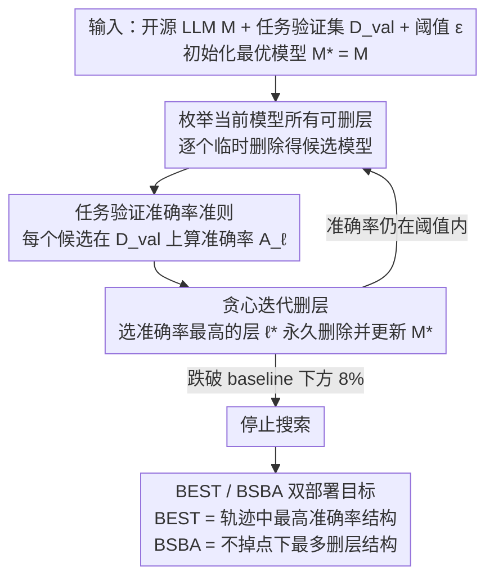

# TELL-TALE: Task Efficient LLMs with Task Aware Layer Elimination

**会议**: ACL 2026 Findings  
**arXiv**: [2510.22767](https://arxiv.org/abs/2510.22767)  
**代码**: https://github.com/omyokun/tale/  
**领域**: 模型压缩 / LLM 效率  
**关键词**: 任务感知剪枝、层删除、推理加速、验证集搜索、无需重训

## 一句话总结
TALE 用一个无需重训的贪心搜索过程，为每个下游任务直接删除“拖后腿”的 Transformer 层，在 5 个开源 LLM 和 9 个 benchmark 上同时提升任务准确率并减少推理成本。

## 研究背景与动机
**领域现状**：大语言模型通常以固定深度部署，不管下游任务是数学推理、常识问答还是知识型选择题，都会完整走过所有 Transformer 层。已有模型压缩方法可以删权重、删 head、删 block 或做 early exit，但大多以困惑度、表示相似度、重构误差等通用指标为准，目标主要是省算力。

**现有痛点**：通用剪枝指标不一定对应目标任务表现。某一层在语言建模困惑度上看似重要，但对特定任务可能反而引入噪声；相反，某些中间层在特定任务上已经足够好，继续经过后续层会降低准确率。另一方面，微调能提升任务表现，却不减少推理成本，还需要数据和训练预算。

**核心矛盾**：模型压缩通常默认“删层会损伤能力”，所以优化目标是尽量少掉点；但本文观察到，对某些任务来说，删掉不匹配的层本身就是一种任务适配，可能让模型更准、更快。

**本文目标**：作者希望提供一个实际可部署的方法：不改权重、不重训、不依赖硬件特定实现，只用一个小规模任务验证集，就能找到该任务的最佳删层结构和高效结构。

**切入角度**：论文先从残差流解释删层：删除第 $\ell$ 层相当于把该层的变换 $F_\ell$ 置零，让隐藏状态直接通过。作者进一步把中间层 hidden state 投到词表空间，发现许多任务上中间层预测已经优于最终层，说明“更深”不总是“更好”。

**核心 idea**：不要用任务无关 proxy 猜哪层冗余，而是在目标任务验证集上直接试删每一层，保留让验证准确率最高的删除操作。

## 方法详解
TALE 的方法很朴素，但正因为朴素才适合部署。给定一个开源 LLM 和一个任务验证集，它不训练任何参数，只做结构搜索：每一步枚举当前模型中所有还存在的层，临时删除其中一层，跑验证集得到准确率；选择准确率最高的候选模型，把那一层永久删除；然后在新的、更浅模型上重复这一过程。

论文输出两个模型概念。BEST 指搜索过程中任务准确率最高的删层模型，适合“准确率优先”的场景；BSBA 指 Best Speedup with at least Baseline Accuracy，也就是在不低于原模型准确率的前提下尽可能多删层，适合“速度优先但不能掉点”的场景。

### 整体框架
输入包括预训练或指令微调模型 $M$、验证集 $D_{val}$ 和阈值 $\epsilon$。TALE 初始化 $M^*=M$。在每轮迭代中，对当前模型的每个可删层 $\ell$ 构造候选模型 $M_{-\ell}$，计算 $A_\ell=Acc(M_{-\ell},D_{val})$，选择 $\ell^*=\arg\max_\ell A_\ell$。如果删掉这一层后的表现仍在允许范围内，就更新 $M^*\leftarrow M_{-\ell^*}$；否则停止。论文设置的停止阈值是 baseline accuracy 下方 8%，允许搜索短暂探索较低表现的结构，但作者实际没有观察到低于 baseline 后再恢复的情况。

评估时，作者使用 LM-Eval 和 Decoder Eval 两种协议。Decoder Eval 要求模型生成结构化答案，再抽取最终答案比对 ground truth；作者认为它更接近真实生成能力，因为多选概率式 LM-Eval 可能让弱模型因选项压缩而看起来更强。

### 关键设计
**1. 直接以任务验证准确率作为删层准则：让搜索目标和部署目标完全对齐**

SLEB、BlockPruner 这类方法靠表示相似度或 perplexity 这种任务无关 proxy 判断哪层冗余，结果常常删掉对任务有用的层、或保留对任务有害的层——proxy 和真实下游目标之间有缝隙。TALE 干脆把这条缝隙焊死：每一步都在同一个任务的验证集上逐个评估"删掉某层后的候选模型"，选准确率最高的那个。因为评估指标就是部署时要优化的指标，搜索能直接发现那些"负贡献层"——删掉反而更准的层，这正是 proxy 指标永远看不到的。

**2. 贪心迭代层删除：每轮只删一层、删完重评，捕捉删层之间的交互**

预设固定 pruning budget（一次砍掉 top-k 层）的麻烦在于，最佳删层数量本身因任务而异：有些任务删到第 $n$ 层最好，再多删一层就急剧掉点，固定预算很容易错过这个甜点。TALE 不一次性指定删几层，而是每轮枚举当前模型所有还在的层、临时删除、跑验证集，选准确率最高的候选 $\ell^*=\arg\max_\ell A_\ell$ 永久删除，再在更浅的新模型上重复。关键在于"删完重评"——删掉一层会改变后续层的相对重要性，逐轮重新评估才能顺着这种交互找到任务专用的浅层结构，而不是按一张静态重要性表一刀切。

**3. BEST / BSBA 双部署目标：同一条搜索轨迹同时喂饱"准确率优先"和"效率优先"两类需求**

真实系统未必只追最高分：多 agent、高并发、边缘部署更在乎吞吐和延迟，但又不能为了快而掉点。TALE 在同一次搜索里记录两个模型——BEST 是整条轨迹中任务准确率最高的删层结构，给准确率优先的场景；BSBA（Best Speedup with at least Baseline Accuracy）是在不低于原模型准确率的约束下尽可能多删层的结构，给"要快但不能掉点"的场景。一次搜索两份产出，用户按部署需求直接挑，不用为不同目标各跑一遍。

### 损失函数 / 训练策略
TALE 本身没有训练损失，因为它不更新模型权重。它的“优化目标”就是验证集准确率。计算成本近似为 $O(I\cdot L\cdot V\cdot T_{layer})$，其中 $I$ 是删层迭代次数，$L$ 是层数，$V$ 是验证集大小。对 LLaMA 3.1 8B，在 500 到 1500 个样本的验证集上，每个任务约需 1 到 2 个 A100 GPU 小时完成一次搜索。论文还在微调实验中使用 LoRA，但那是评估 TALE 与微调的交互，而不是 TALE 的必要步骤。

## 实验关键数据

### 主实验
TALE 在 5 个开源模型和 9 个任务上评估，包括 ARC-Challenge、ARC-Easy、MMLU、Winogrande、GSM8K-HARD、MATH500、CommonQA、BIG-Bench 和 BoolQ。下表摘取 LLaMA 3.1 8B 与 Qwen 2.5 7B 的零样本结果；#D 是删除层数。

| 模型 | 数据集 | Baseline | TALE BEST | #D | BSBA | 观察 |
|------|--------|----------|-----------|----|------|------|
| LLaMA 3.1 8B | ARC-Challenge | 79.4 | 80.6 | 4 | 77.6 | 知识/常识类提升较温和 |
| LLaMA 3.1 8B | MMLU | 48.8 | 53.8 | 1 | 50.2 | 只删 1 层就明显增益 |
| LLaMA 3.1 8B | GSM8K-HARD | 39.0 | 59.0 | 1 | 39.4 | 数学推理收益最大 |
| LLaMA 3.1 8B | MATH500 | 25.4 | 28.2 | 2 | 27.4 | 推理任务删早/中层有效 |
| Qwen 2.5 7B | ARC-Challenge | 86.55 | 92.00 | 2 | 86.55 | ARC-C 提升 5.45 点 |
| Qwen 2.5 7B | MMLU | 68.10 | 71.00 | 5 | 68.13 | 可删更多层仍保基线 |
| Qwen 2.5 7B | GSM8K-HARD | 43.80 | 61.80 | 2 | 43.99 | 数学推理提升 18 点 |
| Qwen 2.5 7B | MATH500 | 31.00 | 38.20 | 2 | 32.10 | 数学任务收益稳定 |

论文总结的整体趋势是：ARC-Challenge 上 LLaMA 提升较小（约 +1.6），Qwen 2.5 7B 更明显（约 +6.3）；MATH500 和 GSM8K 这类推理任务提升范围可达 23% 到 51%。这支持了作者的判断：一些层对推理任务并非中性冗余，而可能确实带来任务不匹配的表示扰动。

| Eval | 方法 | ARC-Easy | ARC-Challenge | Winogrande | 结论 |
|------|------|----------|---------------|------------|------|
| Decoder Eval | TALE | 76.7 | 54.3 | 73.1 | 三项均最好 |
| Decoder Eval | SLEB-ta | 61.0 | 38.0 | 66.5 | 即使任务感知化仍明显落后 |
| Decoder Eval | BlockPruner-ta | 64.6 | 39.6 | 65.59 | 不如直接 accuracy 搜索 |
| LM-Eval | BlockPruner-ta | 65 | 41 | 66 | 基线剪枝仍掉点明显 |
| LM-Eval | TALE | 81 | 55 | 78 | 同样保持领先 |

### 消融实验
论文没有传统意义上的模块消融，而是从鲁棒性、评价协议、验证集规模、微调交互几个角度验证 TALE。最关键的对照是：如果把 TALE 的目标从任务准确率换成表示相似度或 perplexity，效果会显著变差。例如在 ARC-Easy 上，用 cosine similarity 引导 TALE 会删 2 层，但 LLaMA accuracy 从 79.5 掉到 58.5，说明 proxy 目标和真实任务目标可以严重错位。

| 设置 | 代表结果 | 说明 |
|------|----------|------|
| 验证集大小 | 超过 500 样本后，ARC-Easy/MMLU/GSM8K 的删层集合趋于稳定 | TALE 不需要很大的任务验证集 |
| 随机种子 | LLaMA、Qwen、Lucie、Mistral 的 BEST 结果方差都很低 | 搜索不是靠偶然 seed 命中 |
| 推理效率 | 9/9 设置首 token latency 改善，macro avg. -14.3%；throughput 9/9 改善，macro avg. +17.9% | BEST 模型也能带来实际吞吐收益 |
| 搜索成本 | LLaMA 3.1 8B 每任务约 1-2 A100 小时 | 一次搜索成本可被长期推理摊销 |

微调交互也很有意思。TALE 不只是推理时剪枝，还能和 LoRA 微调互补。

| 模型 / 数据集 | Baseline | TALE only | FT only | TALE → FT | FT → TALE | (TALE → FT) → TALE |
|---------------|----------|-----------|---------|-----------|-----------|----------------------|
| LLaMA 3.1 8B / Winogrande | 53.83 | 56.67 (#D=4) | 85.00 | 87.06 (#D=4) | 86.74 (#D=7) | 87.37 (#D=8) |
| LLaMA 3.1 8B / MMLU | 54.87 | 59.90 (#D=1) | 63.62 | 63.49 (#D=1) | 64.21 (#D=2) | 64.01 (#D=2) |
| LLaMA 3.1 8B / GSM8K | 15.07 | 37.08 (#D=3) | 42.70 | 53.96 (#D=1) | 50.86 (#D=2) | 54.02 (#D=2) |
| Qwen 0.5B / MMLU | 31.48 | 39.98 (#D=2) | 44.87 | 43.76 (#D=2) | 45.53 (#D=2) | 45.58 (#D=3) |

### 关键发现
- 删层不是单纯压缩，它也可以是任务适配。尤其在数学推理任务上，删除 1 到 3 个早中层往往带来最大收益。
- 层重要性高度任务相关。常识/知识任务和数学推理任务依赖的层段不同，固定从顶层或底层删的策略很难泛化。
- TALE 对大模型和小模型都有效，但收益幅度不同。论文讨论 Lucie 7B 的收益尤其大，可能和其预训练 token 数较少、离性能上限更远有关。

## 亮点与洞察
- 最漂亮的点是把剪枝目标从“少掉点”改成“直接最大化任务分数”。这让压缩和适配统一起来，避免了很多 proxy metric 的绕路。
- 方法很工程友好：不改权重、不重训、硬件无关，产出的就是一个删层后的普通 Transformer，可以直接进入现有推理栈。
- TALE 也提供了一个解释视角：如果删除某层后任务分数上升，这层可能在该任务上引入了不必要的表示变换；逐层 ablation 曲线可以帮助定位任务能力在网络中的分布。

## 局限与展望
- TALE 当前只在整层粒度工作，简单透明但比较粗。attention head、MLP block、token-adaptive routing 等更细粒度结构可能带来更好折中。
- 它需要为每个任务单独搜索，产出的结构是任务专用的；如果部署场景要求一个模型同时处理大量异质任务，频繁切换结构会增加管理复杂度。
- 贪心搜索不能保证全局最优。删掉某一层后会改变后续层的重要性，局部最优路径可能错过需要组合删除才显现的结构。
- 搜索成本虽然不高，但仍需要目标任务验证集。对没有稳定验证集、评测噪声很大的开放式生成任务，TALE 的目标函数需要重新设计。

## 相关工作与启发
- **vs SLEB**: SLEB 基于层表示相似度和 perplexity 做训练免费删层，TALE 直接用目标任务 accuracy 搜索，因此更能识别任务有害层。
- **vs BlockPruner**: BlockPruner 分 block 并用通用指标剪枝，TALE 粒度更粗但目标更直接；实验中即使给 SLEB/BlockPruner 任务验证数据，仍不如 TALE。
- **vs SparseGPT / Wanda / SliceGPT**: 这些方法更偏权重或维度层面的通用压缩，TALE 则保留权重不动，只改变层级路径，部署与回滚更简单。
- **vs Early Exit**: Early exit 动态决定推理停止位置，TALE 离线搜索固定删层结构；前者更灵活，后者更容易和现有静态推理优化结合。

## 评分
- 新颖性: ⭐⭐⭐⭐ 思路朴素但角度很准，把任务准确率作为剪枝目标带来了强实证结果。
- 实验充分度: ⭐⭐⭐⭐⭐ 模型、任务、评价协议、随机种子、验证集大小、对比方法和微调交互都覆盖得很全。
- 写作质量: ⭐⭐⭐⭐ 主线清楚，附录数据充足；个别表格和速度指标排版较密，需要读者自行整理。
- 价值: ⭐⭐⭐⭐⭐ 对任务专用 LLM 部署非常实用，尤其适合多 agent 系统中为不同角色准备轻量专用模型。

<!-- RELATED:START -->

## 相关论文

- [\[ACL 2026\] SAMoRA: Semantic-Aware Mixture of LoRA Experts for Task-Adaptive Learning](samora_semantic-aware_mixture_of_lora_experts_for_task-adaptive_learning.md)
- [\[ACL 2026\] Task-Stratified Knowledge Scaling Laws for Post-Training Quantized LLMs](task-stratified_knowledge_scaling_laws_for_post-training_quantized_large_languag.md)
- [\[CVPR 2026\] Discovering Adaptive Task Dependencies for Efficient Multi-Task Representation Compression](../../CVPR2026/model_compression/discovering_adaptive_task_dependencies_for_efficient_multi-task_representation_c.md)
- [\[ACL 2026\] LEAP: Layer-wise Exit-Aware Pretraining for Efficient Transformer Inference](leap_layer-wise_exit-aware_pretraining_for_efficient_transformer_inference.md)
- [\[ACL 2026\] ProActor: Timing-Aware Reinforcement Learning for Proactive Task Scheduling Agents](proactor_timing-aware_reinforcement_learning_for_proactive_task_scheduling_agent.md)

<!-- RELATED:END -->
