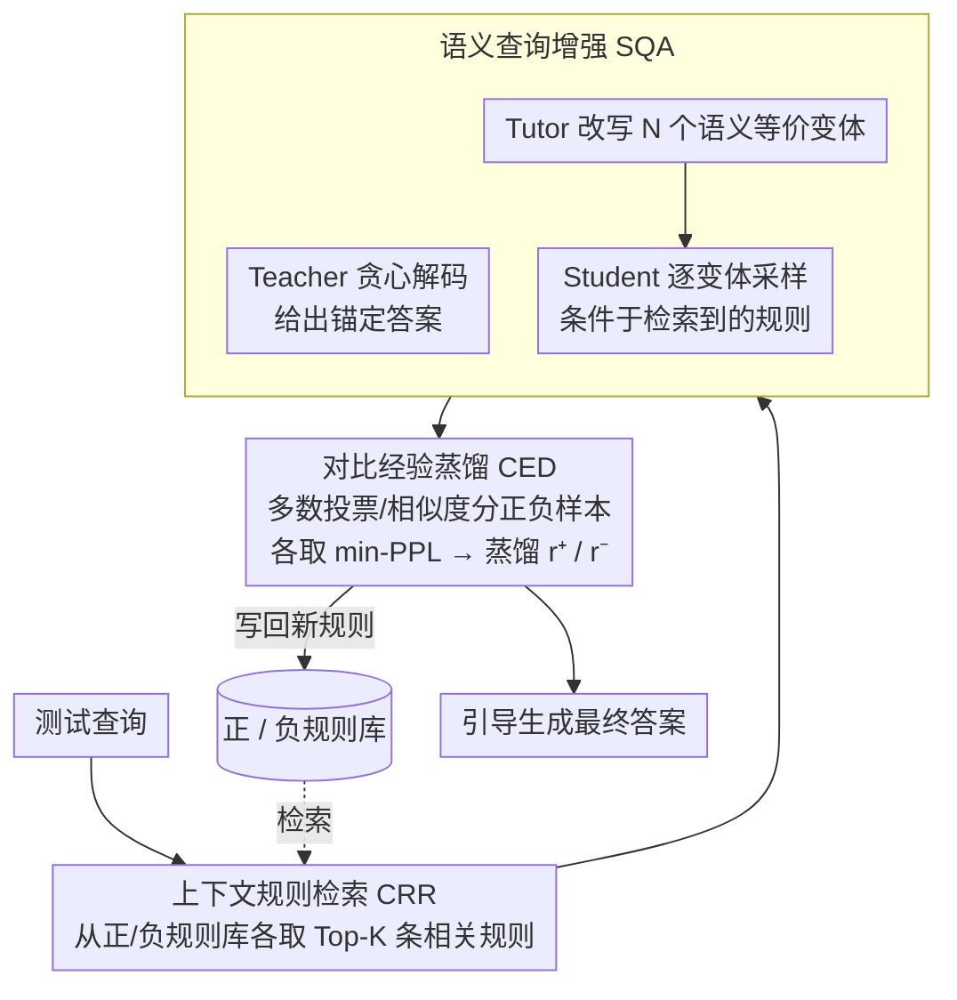

# Training-Free Test-Time Contrastive Learning for Large Language Models

**会议**: ACL 2026 Findings  
**arXiv**: [2604.13552](https://arxiv.org/abs/2604.13552)  
**代码**: [https://github.com/KevinSCUTer/TF-TTCL](https://github.com/KevinSCUTer/TF-TTCL)  
**领域**: 模型压缩/测试时适应  
**关键词**: 测试时适应, 对比学习, 无训练适应, 经验规则, 多智能体

## 一句话总结

本文提出 TF-TTCL，一种无需梯度更新的测试时对比学习框架，通过"探索-反思-引导"循环让冻结的 LLM 在线自我改进——用多智能体角色扮演生成多样推理轨迹，从正负样本对比中蒸馏文本规则存入记忆库，推理时检索相关规则引导生成。

## 研究背景与动机

**领域现状**：LLM 在部署时常面临分布偏移，测试时适应（TTA）旨在让模型在推理阶段在线适应新数据。现有 TTA 方法大多依赖梯度更新（需白盒访问），计算开销大且不适用于黑盒 API 场景。

**现有痛点**：(1) 基于梯度的 TTA（如 Tent、TTT、TTRL）需要模型参数访问，不适用于 API 部署；(2) 无训练方案中，静态提示（CoT）无法适应特定测试实例，动态方案（RAG）依赖外部知识库或ground-truth 验证器；(3) TTRL 需要多轮遍历测试数据后才评估，不符合真实的在线单通场景。

**核心矛盾**：如何在不更新参数、不依赖外部反馈的条件下，从冻结模型自身的输出中提取可靠的错误信号来指导在线改进？

**本文目标**：设计一个完全无训练、无需外部知识、严格在线的测试时自我改进框架。

**切入角度**：借鉴对比学习的核心思想——虽然没有 ground truth，但模型的优质输出和劣质输出之间的语义差距包含丰富的监督信息。将这种差距蒸馏为显式的文本规则，作为"语义梯度"替代参数梯度。

**核心 idea**：通过多智能体角色扮演生成多样推理路径，基于一致性和困惑度区分正负样本，从正负对比中蒸馏出"应该做什么"和"应该避免什么"的文本规则，在线积累到经验规则库中指导后续推理。

## 方法详解

### 整体框架

TF-TTCL 在每个测试样本到达时执行三步循环：(1) 语义查询增强（SQA）——用 Teacher/Tutor/Student 三个角色生成多样推理轨迹；(2) 对比经验蒸馏（CED）——将轨迹分为正负样本，从对比中蒸馏文本规则；(3) 上下文规则检索（CRR）——从规则库检索相关规则指导当前推理。所有角色共享同一冻结 LLM，仅用不同 system prompt 和解码配置。整个循环不更新任何参数，被"更新"的只有规则库这一上下文。

### 关键设计

**1. 语义查询增强（SQA）：用三角色分工探索模型自身的推理不确定性**

无标签场景下要做对比，先得有“正负样本”可比，而仅靠解码温度抖出来的几条轨迹语义太接近、暴露不了模型的真实脆弱点。SQA 用三个共享同一冻结 LLM、只换 system prompt 和解码配置的角色来制造有意义的多样性：Teacher 用贪心解码给出一个高置信度的锚定答案，充当稳定基准；Tutor 把原始查询改写成 $N$ 个风格不同但语义等价的变体，模拟真实的输入分布偏移；Student 再对每个变体采样生成答案。关键之处在于，三个角色的生成都条件于从规则库检索到的历史规则，使探索过程始终和已积累的知识保持一致。通过查询改写而非单纯的解码随机性来引入多样性，才能把模型“换个说法就答错”的推理脆弱性逼出来，为下一步的对比提供有信息量的素材。

**2. 对比经验蒸馏（CED）：从无标签响应里挑出正负样本，蒸馏成文本规则**

有了一堆候选响应，还得在没有 ground truth 的情况下判断谁对谁错。CED 对闭合题用多数投票分组——答案一致的归为正样本、不一致的归为负样本，若全部互不一致则直接跳过以免传播幻觉；对开放题则用与 Teacher 答案的嵌入相似度来分组。正负两侧都进一步挑困惑度最低的（min-PPL）：正样本取低困惑度是要“最自信的正确答案”，负样本取低困惑度则是刻意捕捉“最自信的错误”，也就是 hard negative。最后让 LLM 总结正负样本之间的推理差距，蒸馏出一条正规则 $r^+$（应该做什么）和一条负规则 $r^-$（应该避免什么）。这套设计的核心判断是：LLM 的自信幻觉才是最具信息量的负样本——纠正这些理直气壮的错误，远比纠正一眼可见的错误更有价值，而双规则又同时给出了正面引导和反面警告。

**3. 上下文规则检索（CRR）：把历史经验按相关性取回来指导当前推理**

蒸馏出的规则若不能被精准复用，在线学习就无从谈起。CRR 维护两个独立记忆库——正规则集 $\mathcal{R}_{pos}$ 和负规则集 $\mathcal{R}_{neg}$，每条规则以 (嵌入向量, 文本) 的键值对存储。新查询到来时，分别从两个库中用余弦相似度各检索 Top-$K$ 条最相关规则，一并喂给生成过程，既提供正面引导又给出负面警告。正负规则必须分库存取，是因为混在一起会让模型分不清哪条该照做、哪条该回避；而记忆库的在线增量更新，让系统能持续从历史错误里汲取经验，越往后处理样本质量越稳。

### 一个完整示例：一道 GSM8K 题如何被在线纠正

假设模型已处理过若干样本，规则库里攒下了若干条关于“多步算术要逐步列式、避免跳步心算”的正负规则。现在来了一道新的应用题：

1. **CRR 检索**：用题面嵌入分别从 $\mathcal{R}_{pos}$、$\mathcal{R}_{neg}$ 各取 Top-$K$ 条相关规则，比如正规则“先写出每一步的中间量再相加”、负规则“不要把单价和数量直接口算合并”。
2. **SQA 探索**：Teacher 贪心解码给出锚定答案（比如 42）；Tutor 把题面改写成 $N$ 个等价变体；Student 在每个变体下、并条件于上面检索到的规则各采样一个答案，得到一组候选 {42, 42, 36, 42, 30}。
3. **CED 蒸馏**：闭合题走多数投票——42 占多数归为正样本组，36 与 30 归为负样本组；正样本里挑 min-PPL 的那条最自信解作 $r^+$ 素材，负样本里挑 min-PPL 的 36（一个“自信的错误”）作 hard negative；LLM 对比两者，蒸馏出新规则，例如正规则“乘法结果要单独成行再进入加法”、负规则“避免在一步内同时做乘法和加法导致漏项”。
4. **写回**：新正负规则各自入库，下一道相关题就能检索到它们，形成“处理越多、规则越丰富、后续越准”的在线累积。

整个过程没有任何参数更新，模型权重始终冻结，被“更新”的只是它的上下文。

### 损失函数 / 训练策略

完全无训练。整个框架不涉及任何参数更新，"学习"完全通过文本规则的积累和检索实现。目标是最大化在线测试流的累积输出质量。

## 实验关键数据

### 主实验

| 方法 | GSM8K | MATH | ARC-C | HellaSwag |
|--------|------|------|----------|------|
| Zero-shot CoT | 基线 | 基线 | 基线 | 基线 |
| TTRL | 需多轮 | 需多轮 | - | - |
| TF-TTCL (本文) | 显著提升 | 显著提升 | 提升 | 提升 |

TF-TTCL 在闭合题推理任务和开放题评估任务上均一致优于 zero-shot 基线和现有 TTA 方法。

### 消融实验

| 配置 | 关键指标 | 说明 |
|------|---------|------|
| 完整 TF-TTCL | 最优 | 三模块协同 |
| w/o 规则检索 | 显著下降 | 验证经验积累的价值 |
| w/o 查询增强 | 下降 | 多样性对正负样本质量重要 |
| w/o 负规则 | 下降 | 仅有正面引导不够 |
| 随机检索 | 下降 | 规则检索的相关性匹配很重要 |

### 关键发现

- **在线累积效应**：随着处理更多测试样本，规则库不断丰富，后续样本的推理质量持续提升，展现真正的在线学习能力。
- **正负规则都不可缺**：消融实验显示去掉负规则（仅告诉模型"应该做什么"）会导致性能下降，"应该避免什么"的信息同样关键。
- **min-PPL 负样本选择优于其他策略**：选择最自信的错误作为负样本，比随机或 max-PPL 负样本提供更强的学习信号。
- **严格在线 vs 多轮**：与 TTRL 的多轮范式不同，TF-TTCL 在严格单通在线设置下仍能自我改进，更符合实际部署。

## 亮点与洞察

- **"语义梯度"概念**：将对比规则类比为梯度是非常巧妙的概念设计——参数梯度更新模型权重，文本规则"更新"模型的上下文，两者目标一致但路径完全不同。
- **黑盒友好**：完全不需要模型参数访问，适用于 API 部署场景。所有"学习"都通过 prompt 工程和记忆管理实现。
- **多智能体角色分工**：Teacher（稳定锚定）+ Tutor（多样化探索）+ Student（自由生成）的三角色设计优雅地解决了探索-利用的平衡问题。

## 局限与展望

- 每个测试样本需要 N+1 次 LLM 推理调用（1 Teacher + N Student），计算成本线性增加。
- 闭合题使用多数投票分组，当全部答案一致但都错误时无法识别（自确认偏差）。
- 规则库会持续增长，长期部署中可能需要规则压缩或淘汰机制。
- 开放题的正负分组基于与 Teacher 答案的相似度，Teacher 本身错误时分组也会出错。

## 相关工作与启发

- **vs TTRL**: TTRL 通过一致性伪奖励的强化学习更新参数，需多轮遍历。TF-TTCL 无需参数更新，严格在线，更适合实际部署。
- **vs ExpeL/AvaTaR**: 这些经验学习框架依赖外部环境奖励或 ground-truth，是离线框架。TF-TTCL 完全自监督在线。
- **vs Training-Free GRPO**: 依赖可验证的 ground-truth 奖励，无 ground-truth 时退化为多数投票。TF-TTCL 通过对比蒸馏提供更丰富的信号。

## 评分

- 新颖性: ⭐⭐⭐⭐ "语义梯度"概念和无训练在线对比学习框架设计新颖
- 实验充分度: ⭐⭐⭐⭐ 闭合题和开放题双基准验证，消融充分
- 写作质量: ⭐⭐⭐⭐ 框架描述清晰，与对比学习的类比恰当
- 价值: ⭐⭐⭐⭐ 为黑盒 LLM 的测试时自我改进提供了实用方案

<!-- RELATED:START -->

## 相关论文

- [\[CVPR 2026\] TALON: Test-time Adaptive Learning for On-the-Fly Category Discovery](../../CVPR2026/model_compression/talon_test-time_adaptive_learning_for_on-the-fly_category_discovery.md)
- [\[ACL 2026\] IntroLM: Introspective Language Models via Prefilling-Time Self-Evaluation](introlm_introspective_language_models_via_prefilling-time_self-evaluation.md)
- [\[CVPR 2026\] Test-time Sparsity for Extreme Fast Action Diffusion](../../CVPR2026/model_compression/test-time_sparsity_for_extreme_fast_action_diffusion.md)
- [\[ACL 2026\] JudgeMeNot: Personalizing Large Language Models to Emulate Judicial Reasoning in Hebrew](judgemenot_personalizing_large_language_models_to_emulate_judicial_reasoning_in_.md)
- [\[ACL 2026\] LightReasoner: Can Small Language Models Teach Large Language Models Reasoning?](lightreasoner_can_small_language_models_teach_large_language_models_reasoning.md)

<!-- RELATED:END -->
