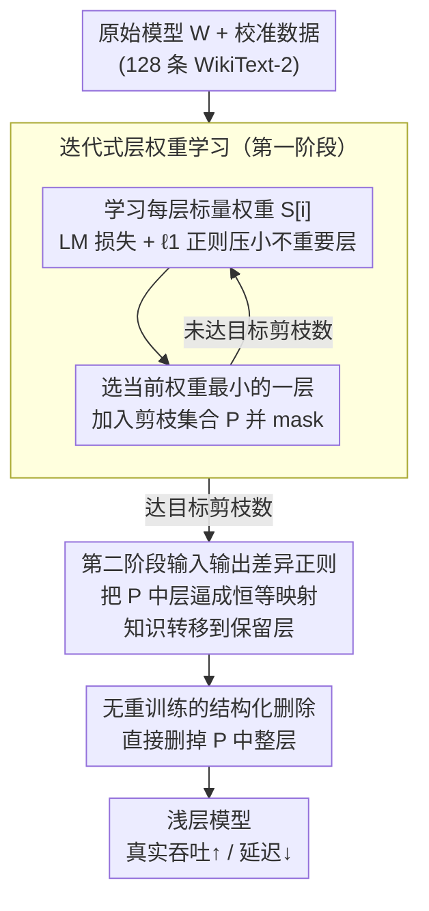

# Two-Stage Regularization-Based Structured Pruning for LLMs

**会议**: ACL2026  
**arXiv**: [2505.18232](https://arxiv.org/abs/2505.18232)  
**代码**: https://github.com/fmk345/TRSP  
**领域**: 模型压缩 / 结构化剪枝 / LLM效率  
**关键词**: 结构化剪枝, 层剪枝, 两阶段正则, LLM加速, 无重训练压缩

## 一句话总结
TRSP 用第一阶段正则学习每个 Transformer 层的重要性，再用第二阶段正则把待删层的输入输出拉近，让知识转移到保留层中，从而在无需重训练的情况下实现 LLM 层级结构化剪枝和实际推理加速。

## 研究背景与动机
**领域现状**：LLM 部署的瓶颈主要来自参数规模、显存占用和推理延迟。结构化剪枝比非结构化稀疏更适合真实加速，因为它直接删除层、头或通道，硬件上更容易得到吞吐提升。

**现有痛点**：已有层级剪枝方法大多先用某种重要性指标挑出“不重要”的层，然后直接删除。问题在于：被删层仍然可能保存局部知识，直接移除会造成明显性能损失；为了弥补损失，很多方法还需要额外 LoRA 或全量重训练，压缩成本被重新抬高。

**核心矛盾**：层剪枝想要“删得整齐”以换取速度，但 LLM 的知识分布并不整齐。某个层看似重要性低，并不意味着它包含的信息可以无损抛弃；如果不先让模型适应“这些层即将消失”，删除操作就会像突然断开一段计算链。

**本文目标**：在保持层级结构化剪枝硬件友好的同时，减少剪枝后的知识损失，并尽量避免昂贵的重训练。

**切入角度**：作者把“选择哪些层删”和“让这些层变得可删”拆成两个正则化阶段。第一阶段用可学习层权重识别待删层，第二阶段把待删层正则成接近恒等映射，使其对最终输出的独特贡献变小。

**核心 idea**：不要直接删除低重要性层，而是先通过正则让这些层少携带知识，再执行删除。

## 方法详解
TRSP 是一种 layer-wise structured pruning 方法。它只需要少量校准数据，例如从 WikiText-2 训练集中随机抽取 128 条长度为 2048 的序列。流程包括四步：准备数据、学习层权重、对待剪层做第二阶段正则、删除这些层。论文强调 TRSP 是 retraining-free：基线方法剪枝后用 1,000 条额外 WikiText-2 样本做 LoRA 重训练，而 TRSP 不需要这一步。

### 整体框架
给定原始模型 $\mathbf{W}$、剪枝比例 $p$ 和层数 $l$，TRSP 先为每个 Transformer 层设置可学习标量权重 $S[i]$，并在前向传播中用它缩放该层输出。第一阶段通过语言建模损失加 $\ell_1$ 层权重正则，让较不重要层的权重变小；每轮选择当前权重最小的一层加入剪枝集合 $P$ 并 mask 掉，重复直到达到目标剪枝数。第二阶段固定剪枝集合后，对这些层的输入输出差异 $\mathbf{X}_{out}^i-\mathbf{X}_{in}^i$ 做正则，使它们更接近恒等变换。最后直接删除集合 $P$ 中的层。

### 关键设计

**1. 迭代式层权重学习：用可学习权重一层一层挑出最该删的层**

要删层先得知道删谁，但一次性把所有低重要性层都选出来有个隐患——它们往往是连续的一段，而连续删除会直接切断网络深层的计算路径。TRSP 给每层挂一个可学习标量权重 $S[i]$，在前向时用它缩放该层输出，并优化

$$\mathcal{L}_{learn}=\mathcal{L}(\mathbf{W},\mathbf{X})+\lambda_1\sum_i\|S[i]\|_1$$

让不重要层的权重在 $\ell_1$ 正则下被压小。关键是采用 greedy 迭代：每一轮只挑当前权重最小的一层加入剪枝集合 $P$ 并 mask 掉，然后重新学习剩余层的权重，重复直到达到目标剪枝数。每删一层就重估一次剩余层的重要性，剪枝集合自然更分散，避开了 one-shot 选出连续层片段、把网络拦腰截断的问题。

**2. 第二阶段输入输出差异正则：删之前先把待删层逼成恒等映射**

直接删层会掉点，根源在于这些层即便“重要性低”，仍在实实在在地改变表示——突然抽走就像断开一段计算链。TRSP 的办法是在真正删除前，先对剪枝集合 $P$ 里的层施加一道正则，把它们的输出推向输入：

$$\mathcal{L}_{sum}=\mathcal{L}(\mathbf{W},\mathbf{X})+\lambda_2\sum_{i\in P}\|\mathbf{X}_{out}^i-\mathbf{X}_{in}^i\|$$

范数可取 $\ell_1$ 或 $\ell_2$。这一项越优化，待删层就越接近恒等变换、自身贡献越小，而它原本承载的知识会被迫转移到那些未被正则的保留层中。等到最后真正删除时，模型受到的扰动已经很小——这正是 TRSP 比“算个重要性指标就直接删”掉点更少的核心原因，也是消融里贡献最大的一环。

**3. 无重训练的结构化删除：让压缩直接兑现成真实的吞吐和延迟收益**

很多稀疏方法在指标上压低了参数量，却因为只是把权重置零、结构没变，在常规硬件上跑不出加速。TRSP 删的是完整的 Transformer 层，模型深度实打实地变浅，prompt processing 和 token generation 两端都能加快。层剪枝粒度虽粗，但换来的是直接的部署收益；再加上前两步已经把知识转移走，这种粗粒度删除不必再走昂贵的 LoRA 或全量重训练就能保住性能。

### 损失函数 / 训练策略
第一阶段使用语言建模损失加层权重 $\ell_1$ 正则。因为 $\ell_1$ 不可微，作者用等价约束形式把 $\|x\|_1$ 转成带辅助变量 $y$ 的可反向传播优化问题。第二阶段使用语言建模损失加待删层输入输出差异正则，$\lambda_1$ 和 $\lambda_2$ 通过网格搜索确定；在 LLaMA2-7B 上最优组合为 $\lambda_1=5\times10^{-3}$、$\lambda_2=10^{-3}$。实验默认剪枝比例为 25%，并以 $\ell_2$ 第二阶段正则作为后续主配置。

## 实验关键数据

### 主实验
主实验在 Phi-2、OPT、LLaMA2、LLaMA3 等模型上比较 TRSP 与 SLEB、ShortGPT、LaCo、Shortened LLaMA。指标包括 WikiText-2 perplexity 和 PIQA、WinoGrande、HellaSwag、ARC-e、ARC-c 五个 zero-shot benchmark 平均准确率。

| 模型 | 方法 | 剪枝率 | PPL↓ | Avg_Acc↑ | 相比最强基线的主要优势 |
|------|------|-------:|-----:|---------:|------------------------|
| Phi-2 | ShortGPT | 25% | 7.15 | 54.49 | 最强基线之一 |
| Phi-2 | TRSP-$\ell_2$ | 25% | 6.53 | 56.56 | PPL 更低，平均准确率 +2.07 |
| OPT-2.7B | ShortGPT | 25% | 14.96 | 49.56 | 最强基线之一 |
| OPT-2.7B | TRSP-$\ell_1$ | 25% | 13.12 | 51.27 | PPL 和平均准确率均最好 |
| LLaMA2-7B | ShortGPT | 25% | 8.89 | 57.10 | 最强基线 |
| LLaMA2-7B | TRSP-$\ell_2$ | 25% | 7.08 | 60.57 | PPL 约低 20%，平均准确率 +3.47 |
| LLaMA3-8B | ShortGPT | 25% | 9.26 | 66.17 | 最强基线 |
| LLaMA3-8B | TRSP-$\ell_2$ | 25% | 7.84 | 68.44 | 更低 PPL，更高平均准确率 |
| LLaMA2-13B | ShortGPT | 25% | 6.79 | 62.96 | 最强基线 |
| LLaMA2-13B | TRSP-$\ell_1$ | 25% | 5.89 | 65.18 | PPL 和平均准确率均最好 |

### 消融实验
TRSP 的分析实验主要回答三个问题：能否真正加速、两个阶段各自是否必要、迭代选层是否优于 one-shot。

| 实验 | 配置 | PPL↓ | Avg_Acc↑ / 加速 | 结论 |
|------|------|-----:|----------------:|------|
| 加速 | OPT-13B Dense | 10.12 | 1029 tokens/s，386.5 ms | 原始模型 |
| 加速 | OPT-13B TRSP 25% | 10.45 | 1348 tokens/s，286.3 ms | 吞吐 1.31×，延迟 1.35× |
| 加速 | LLaMA2-13B TRSP 25% | 5.82 | 1386 tokens/s，298.4 ms | 吞吐 1.30×，延迟 1.33× |
| 消融 | LLaMA2-7B TRSP | 7.08 | 60.57 | 完整方法 |
| 消融 | LLaMA2-7B w/o W | 9.26 | 56.19 | one-shot 学层权重，PPL +2.18 |
| 消融 | LLaMA2-7B w/o R | 10.15 | 54.36 | 去掉第二阶段正则，掉点最大 |
| 消融 | LLaMA2-13B TRSP | 5.82 | 65.11 | 完整方法 |
| 消融 | LLaMA2-13B w/o R | 9.47 | 56.25 | 正则移除后 Avg_Acc -8.86 |

### 关键发现
- 第二阶段正则贡献最大。LLaMA2-13B 去掉它后 PPL 从 5.82 升到 9.47，Avg_Acc 从 65.11 降到 56.25，说明“先让层变得可删”比单纯找低重要性层更关键。
- 迭代选层比 one-shot 稳定。one-shot 容易选择连续层，导致结构断裂；迭代方法每删一层重新评估重要性，剪枝集合更分散。
- $\ell_1$ 和 $\ell_2$ 第二阶段正则差别很小，说明 TRSP 的关键不在具体范数，而在输入输出差异正则这一机制。
- 速度收益是真实端到端收益：25% 层剪枝在 13B 模型上带来约 1.30× 吞吐提升和约 1.33-1.35× 延迟加速。

## 亮点与洞察
- 这篇论文的核心洞察很直接：与其问“哪层不重要”，不如先训练模型让某些层变得不重要。这个角度把剪枝从被动测量变成主动重分配知识。
- 两阶段设计很好地拆开了选择与适配。第一阶段解决“删谁”，第二阶段解决“删之前如何减少伤害”，比只改重要性指标更有解释力。
- 方法对部署友好。完整删除层意味着模型深度减少，收益能体现在 token/s 和 latency，而不是只停留在参数稀疏率。
- 实验对“低成本”这个卖点支撑较强。基线剪枝后还用 1,000 条数据 LoRA retraining，TRSP 用 128 条校准数据完成正则和剪枝，仍取得更好结果。

## 局限与展望
- 目前主要验证 autoregressive LLM，作者也承认尚未证明它能泛化到 CNN、encoder-only 模型或多模态模型。
- 层级剪枝粒度较粗，虽然加速直接，但可调空间有限；对于需要细粒度压缩比的场景，可能需要和 head / MLP channel 剪枝结合。
- 第二阶段正则需要访问中间层输入输出并做优化，虽然比重训练便宜，但在超大模型上仍有工程成本。
- 实验主要覆盖 WikiText-2 perplexity 和常见 zero-shot benchmark，缺少对长上下文、代码、数学和指令跟随任务的系统评估。

## 相关工作与启发
- **vs SLEB**: SLEB 也是层级剪枝，但更偏直接根据层重要性删除；TRSP 多了删除前的知识转移步骤，因此性能保持更好。
- **vs ShortGPT**: ShortGPT 用 block influence 判断冗余层，TRSP 用可学习层权重加正则迭代选择层，并避免 one-shot 连续删除。
- **vs LaCo**: LaCo 等方法依赖剪枝后恢复或校准，TRSP 更强调 retraining-free，适合希望快速得到可部署浅层模型的场景。
- **可迁移启发**: 这类“把待删模块正则成近似恒等，再删除”的思路也可以用于 MoE expert 裁剪、视觉 Transformer block 剪枝或 adapter 合并。

## 评分
- 新颖性: ⭐⭐⭐⭐☆ 两阶段正则的剪枝视角清晰有效，但仍属于层剪枝框架内的改进。
- 实验充分度: ⭐⭐⭐⭐⭐ 覆盖多模型、多基线、加速、剪枝率、数据依赖、消融和超参分析。
- 写作质量: ⭐⭐⭐⭐☆ 方法流程容易理解，个别表格编号和叙述存在轻微不一致，需要读者对照消融表理解。
- 价值: ⭐⭐⭐⭐☆ 对真实 LLM 部署压缩很有参考价值，尤其适合追求结构化加速而非稀疏率的场景。

<!-- RELATED:START -->

## 相关论文

- [\[ACL 2025\] CFSP: An Efficient Structured Pruning Framework for LLMs with Coarse-to-Fine Activation Information](../../ACL2025/model_compression/cfsp_an_efficient_structured_pruning_framework_for_llms_with_coarse-to-fine_acti.md)
- [\[ACL 2026\] GRASPrune: Global Gating for Budgeted Structured Pruning of Large Language Models](grasprune_global_gating_for_budgeted_structured_pruning_of_large_language_models.md)
- [\[ACL 2025\] STUN: Structured-Then-Unstructured Pruning for Scalable MoE Pruning](../../ACL2025/model_compression/stun_moe_pruning.md)
- [\[ICML 2025\] RocketKV: Accelerating Long-Context LLM Inference via Two-Stage KV Cache Compression](../../ICML2025/model_compression/rocketkv_accelerating_long-context_llm_inference_via_two-stage_kv_cache_compress.md)
- [\[ICML 2025\] SlimLLM: Accurate Structured Pruning for Large Language Models](../../ICML2025/model_compression/slimllm_accurate_structured_pruning_for_large_language_models.md)

<!-- RELATED:END -->
