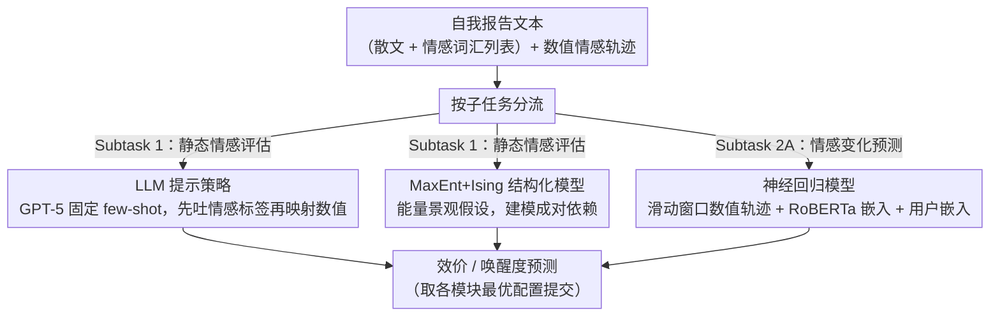

# UKP_Psycontrol at SemEval-2026 Task 2: Modeling Valence and Arousal Dynamics from Text

**会议**: ACL 2026  
**arXiv**: [2604.21534](https://arxiv.org/abs/2604.21534)  
**代码**: [GitHub](https://github.com/)  
**领域**: 情感计算 / 纵向情感建模  
**关键词**: 情感评估, 纵向分析, 效价-唤醒度, LLM提示, MaxEnt模型

## 一句话总结

UKP_Psycontrol 在 SemEval-2026 Task 2 上取得双项第一，通过结合 LLM 提示、Ising 交互的 MaxEnt 模型和神经回归模型，发现 LLM 擅长捕捉静态情感信号而短期情感变化更多由近期数值轨迹而非文本语义解释。

## 研究背景与动机

**领域现状**：计算情感分析中，情感通常用效价（valence，正负向）和唤醒度（arousal，激活程度）两个连续维度表示。大多数 NLP 研究使用社交媒体或评论数据，由外部评估者标注或通过情感代理近似，仅能间接获取内部情感状态。

**现有痛点**：SemEval-2026 Task 2 提出了新挑战——需要对时间序列排列的自我报告文本进行纵向情感评估和预测。数据来自美国服务业工人数年间的日志，包含自由散文和情感词汇列表，配合自评的效价和唤醒度。这要求模型不仅理解单个文本的情感，还要捕捉情感随时间的动态变化。

**核心矛盾**：文本语义与数值情感轨迹对情感预测的贡献可能不同——LLM 擅长理解文本含义，但短期情感波动可能更多反映个人的情感惯性而非新的文本信息。

**本文目标**：(1) 评估静态情感识别（Subtask 1）；(2) 预测未来情感变化（Subtask 2A）；(3) 理解文本语义 vs 数值轨迹在不同任务中的相对重要性。

**切入角度**：三种互补方法的组合——LLM 提示（利用语言理解）、MaxEnt+Ising（利用概率图模型的结构化依赖建模）、神经回归（利用数值轨迹和用户嵌入）。

**核心 idea**：静态情感评估靠 LLM 文本理解，动态情感预测靠数值轨迹的短期惯性，两者各有所长。

## 方法详解

### 整体框架

系统包含三个模块，并按子任务分工：静态情感评估（Subtask 1）走 LLM 提示与 MaxEnt+Ising 两路，动态情感变化预测（Subtask 2A）走神经回归。(1) LLM 提示模块——在用户感知和用户无关设置下用 GPT-5 预测效价和唤醒度；(2) MaxEnt+Ising 模块——用最大熵模型和 Ising 交互建模情感状态的结构化依赖；(3) 神经回归模块——用滑动窗口的近期情感轨迹 + RoBERTa 文本嵌入 + 可训练用户嵌入预测下一步情感变化。

### 关键设计

**1. LLM 提示策略：用语言理解抓静态情感，并躲开动态更新带来的误差累积**

静态情感识别（Subtask 1）的核心是把一段自我报告文本映射到效价和唤醒度，这正是 LLM 与人类评分高度相关的强项。作者用 GPT-5 在两种设置下提示：用户感知设置取同一用户的历史样本作为 few-shot，用户无关设置则取标签平衡的随机样本；散文和情感词汇列表分开处理，避免两种异质输入互相干扰。输出格式上，让模型先吐文本情感标签再映射到数值，比直接让它预测数字更稳定——因为自然语言描述更贴近 LLM 的预训练分布。一个反直觉的发现是，他们试过用滑动窗口（最近 $N=15$ 条）动态替换 few-shot 示例，希望示例随时间漂移，但预测误差会沿窗口累积传播、越滚越偏，最后固定一组示例反而更好。

**2. MaxEnt+Ising 结构化模型：把心理学的「能量景观」假设搬进概率图，建模情感状态之间的成对依赖**

单纯回归无法刻画情感各维度之间的耦合，而心理学理论恰好假设心理状态在一个潜在能量景观上演化、服从玻尔兹曼分布——这给了用 Ising 交互的最大熵模型一个理论出口。模型定义能量函数

$$E(\mathbf{x}) = -\mathbf{x}^\top \mathbf{h} - \frac{1}{2}\mathbf{x}^\top \mathbf{J}\mathbf{x},$$

其中 $\mathbf{h}$ 负责线性效应、$\mathbf{J}$ 捕捉变量间的成对交互。情感变量用 one-hot 编码，文本语义则先经自编码器压缩成二值向量再喂进来。由于状态空间有界，配分函数 $Z$ 可以精确算出，于是能直接做最大似然训练而不必近似采样；推理时通过条件期望解码，输出连续值，刚好对齐任务用相关系数评估的口径。

**3. 神经回归模型：赌「短期情感波动靠惯性而非新文本」，因此把近期数值轨迹和用户身份当主信号**

Subtask 2A 要预测下一步的情感变化，作者的核心假设是这种短期波动更多来自个人的情感惯性，而非当下文本带来的新信息。于是模型把滑动窗口（1–4 步）内的近期文本嵌入（RoBERTa mean-pooling）、当前效价/唤醒度、前一步的状态变化、以及一个可训练的用户嵌入一起输入，用用户嵌入显式吸收个体差异。为验证这个假设，他们刻意设置三种对照：(a) 无文本基线，只用数值特征加用户嵌入；(b) 文本增强；(c) 语义聚类表示——后面的实验正是靠 (a) 几乎追平 (b) 才坐实了「惯性主导」这一结论。

### 损失函数 / 训练策略

MaxEnt 模型用最大似然训练，神经回归模型用标准回归损失。LLM 提示无需训练。最终提交组合了各模块的最优配置。

## 实验关键数据

### 主实验

**Subtask 1（纵向情感评估）— 测试集**

| 方法 | Valence r_composite | Arousal r_composite |
|------|-------------------|-------------------|
| Baseline linear(BERT) | 0.557 | 0.299 |
| MaxEnt Ising | 0.589 | 0.327 |
| **LLM-based (提交)** | **0.667** | **0.554** |

**Subtask 2A（情感变化预测）— 测试集**

| 方法 | Valence r | Arousal r |
|------|-----------|-----------|
| Baseline linear(prev) | 0.520 | 0.609 |
| MaxEnt Ising | — | — |
| **Neural Regression (提交)** | **0.675** | **0.683** |

### 关键发现

- 用户感知提示仅比用户无关提示略好，表明标签平衡的随机示例已能近似大部分用户特异性信息
- 增加 shot 数改善效价相关性（10→20 shot: 0.617→0.661），但对唤醒度无类似效果
- 文本情感标签预测优于直接数值预测，说明自然语言描述更符合 LLM 预训练分布
- **关键发现**：在 Subtask 2A 中，无文本基线（仅数值轨迹+用户嵌入）的表现与文本增强模型相当，说明短期情感变化更多由近期数值状态而非文本语义解释
- 动态更新策略（滑动窗口替换）不如固定 shot，因为预测误差累积传播

## 亮点与洞察

- "短期情感变化由数值轨迹而非文本语义驱动"这一发现对情感计算领域有重要启示——可能意味着情感有自身的时间序列惯性，文本只是快照而非驱动力
- MaxEnt+Ising 模型将心理学理论（能量景观假说）引入 NLP 任务，提供了可解释的概率框架
- 三种方法的互补组合策略值得借鉴：LLM 处理语义理解，概率模型处理结构化依赖，神经网络处理数值序列

## 局限与展望

- 数据量较小（2764 条目，137 用户），限制了深度学习方法的潜力
- 数据质量问题突出：92% 用户仅参与一个时间段，部分用户效价/唤醒度始终不变
- MaxEnt 模型的二值化语义表示可能丢失情感细微差别
- 仅在英文服务业工人群体上验证，文化差异可能影响情感表达模式

## 相关工作与启发

- **vs 纯 LLM 方法**: LLM 在静态评估上强大但在动态预测上不够，需要数值轨迹建模的补充
- **vs 传统 BERT 基线**: 结合多种方法（LLM+MaxEnt+神经回归）的系统在两个子任务上均获第一

## 评分

- 新颖性: ⭐⭐⭐⭐ 三种方法的组合策略和 MaxEnt+Ising 的应用有新意，但各组件单独不算新颖
- 实验充分度: ⭐⭐⭐⭐ 详细的消融和对比，但受限于共享任务的数据规模
- 写作质量: ⭐⭐⭐⭐ 结构清晰，方法描述详细
- 价值: ⭐⭐⭐⭐ "文本 vs 数值轨迹"的发现对情感计算研究有重要启示

<!-- RELATED:START -->

## 相关论文

- [\[ACL 2026\] TELL-TALE: Task Efficient LLMs with Task Aware Layer Elimination](tell-tale_task_efficient_llms_with_task_aware_layer_elimination.md)
- [\[ACL 2026\] Why Steering Works: Toward a Unified View of Language Model Parameter Dynamics](why_steering_works_toward_a_unified_view_of_language_model_parameter_dynamics.md)
- [\[AAAI 2026\] Distillation Dynamics: Towards Understanding Feature-Based Distillation in Vision Transformers](../../AAAI2026/model_compression/distillation_dynamics_towards_understanding_feature-based_di.md)
- [\[ACL 2026\] Latent-Condensed Transformer for Efficient Long Context Modeling](latent-condensed_transformer_for_efficient_long_context_modeling.md)
- [\[ICLR 2026\] NerVE: Nonlinear Eigenspectrum Dynamics in LLM Feed-Forward Networks](../../ICLR2026/model_compression/nerve_nonlinear_eigenspectrum_dynamics_in_llm_feed-forward_networks.md)

<!-- RELATED:END -->
