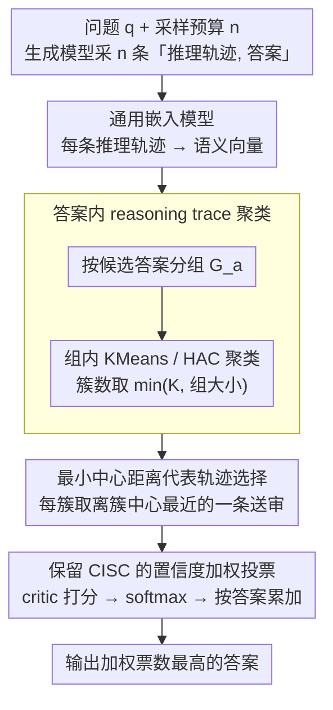

# VecCISC: Improving Confidence-Informed Self-Consistency with Reasoning Trace Clustering and Candidate Answer Selection

**会议**: ACL2026  
**arXiv**: [2605.08070](https://arxiv.org/abs/2605.08070)  
**代码**: 无  
**领域**: model_compression  
**关键词**: 推理时计算, 自一致性, 置信度加权投票, 轨迹聚类, 成本压缩  

## 一句话总结
VecCISC 在 CISC 的置信度加权自一致性之前加入“按答案分组的推理轨迹嵌入聚类”，只把每个语义簇的代表轨迹交给 critic 打分，从而在基本保持甚至略微提升准确率的同时显著减少 critic 调用和 token 成本。

## 研究背景与动机
**领域现状**：推理时扩展常见做法是对同一个问题采样多条 reasoning trace，然后用 Self-Consistency 选择出现次数最多的答案。后续的 Confidence-Informed Self-Consistency (CISC) 进一步让一个 critic LLM 给每条“推理轨迹 + 答案”打置信度分数，再做加权多数投票，通常比普通投票更稳。

**现有痛点**：CISC 的性能收益来自额外的“think twice”过程，但代价也在这里。每采样一条轨迹，就要把完整问题、推理过程和答案再次发给 critic，critic prompt 往往很长；如果采样预算是 20，CISC 基本把推理阶段的 LLM 调用翻倍。更糟的是，CISC 不区分高质量轨迹、重复轨迹和明显退化的幻觉轨迹，所有样本都同等进入 critic。

**核心矛盾**：自一致性希望用更多样本覆盖解空间，而置信度加权希望用 critic 精细评估每个样本；但很多样本在语义上其实重复，或只是同一个错误答案的微小变体。也就是说，生成端需要“多采样”，评估端却不一定需要“全评估”。

**本文目标**：作者希望把 CISC 中最贵的部分缩小：保留多样推理采样带来的答案覆盖率，但减少需要 critic 打分的 reasoning trace 数量；同时不能因为删掉轨迹而让加权投票退化成随机抽样。

**切入角度**：论文的观察是，reasoning trace 的语义嵌入可以反映“这条轨迹是否在讲同一种解法”。如果同一候选答案下面有多条语义近似的轨迹，critic 只看最具代表性的那几条就足够；如果某些轨迹偏离簇中心，它们往往更可能包含异常推理或冗余表达。

**核心 idea**：用推理轨迹嵌入聚类来筛掉同答案组内的冗余/异常样本，把 CISC 的 critic 评估从“每条轨迹都打分”改成“每个语义簇选代表轨迹打分”。

## 方法详解
VecCISC 不是替换 Self-Consistency 或 CISC 的完整推理框架，而是插在“生成多条推理轨迹”和“critic 置信度打分”之间的压缩层。它保留原始采样预算，让生成模型仍然可以探索多个答案；随后按答案把 reasoning trace 分组，再在每个答案内部做聚类，从每个簇选出代表轨迹。最终，critic 只评估这些代表轨迹，得到的置信度再用于加权多数投票。

### 整体框架
输入是问题 $q$、生成模型 $LLM_{gen}$、采样预算 $n$、critic 模型 $LLM_{critic}$，以及聚类簇数上限 $K$。第一步，系统从 $LLM_{gen}$ 采样 $n$ 个二元组 $(r_i, a_i)$，其中 $r_i$ 是 reasoning trace，$a_i$ 是最终答案。第二步，对每条 $r_i$ 用通用文本嵌入模型生成向量 $Emb(r_i)$。第三步，按照候选答案 $a$ 把样本分成若干组 $G_a$，保证不同答案不会在同一个聚类空间里互相吞并。第四步，在每个 $G_a$ 内做 KMeans 或 HAC 聚类，簇数为 $min(K, |G_a|)$。第五步，每个簇选择一个最接近簇中心的代表 reasoning trace，并把这些代表样本交给 critic 打置信度。最后，系统对置信度做 softmax 归一化，并按照候选答案累加置信度，输出加权票数最高的答案。

这个流程的关键在于“先按答案分组，再对轨迹聚类”。如果直接跨答案聚类，语义相似但答案不同的轨迹可能被压在一起，破坏候选答案集合；按答案分组则把 VecCISC 的作用限定为压缩每个答案内部的证据，而不是改写答案空间。

### 关键设计
**1. 答案内 reasoning trace 聚类：先按答案分组、再在组内语义聚类，把交给 critic 的轨迹数压下来又不动答案空间**

CISC 最贵的环节是 critic，而它要对许多语义重复的轨迹反复打分，边际收益很低。VecCISC 的做法是对每条 reasoning trace 生成嵌入向量，但聚类不是全局做，而是先按候选答案把样本切成若干组 $G_a$，再在每个 $G_a$ 内部跑 KMeans 或层次凝聚聚类（HAC），簇数取 $\min(K, |G_a|)$。这个「先分组再聚类」的顺序是关键：如果跨答案聚类，语义相近但答案不同的轨迹会被压进同一簇，少数派的正确答案可能就此被吞掉；限定在答案内聚类，VecCISC 就只压缩「同一答案的相似解释」，而不改写答案集合本身。论文特意没用 DBSCAN——它依赖距离阈值，在高维语言嵌入空间里阈值稍变簇结构就剧烈抖动，调参不稳。

**2. 最小中心距离代表轨迹选择：每个簇只挑最贴近语义中心的一条轨迹送审，省 token 又稳证据**

聚完类还要决定每个簇拿哪条轨迹去喂 critic。随机挑虽然也能减量，但容易抽到冗长、异常或幻觉的样本，反而给 critic 噪声。VecCISC 改为先算簇中心

$$u_i = \frac{1}{|C_i|}\sum_{e \in C_i} e,$$

再用 cosine 距离选出离中心最近的那条轨迹作为代表。用 cosine 而非欧氏距离，是因为它只看向量方向、不受模长影响，更契合高维语义空间的相似度判断。靠近中心的轨迹代表了簇内「多数推理模式」，既更短（省 token），也更可能给 critic 提供稳定、典型的证据——后面实验里 min-centroid 在大多数 (dataset, model) 组合上比随机选代表 token 更省，正源于此。

**3. 保留 CISC 的置信度加权投票接口：让 VecCISC 当一个轻量插件，而不是另起一套决策规则**

为了能直接接进已有的 think-twice pipeline，VecCISC 不碰最终的投票逻辑。critic 对每条代表轨迹输出 $0$ 到 $1$ 的置信度，经 softmax 温度 $T$ 归一化得到 $\hat{c}_j$，再按候选答案累加权重并取最高者：

$$A_{final}=\arg\max_a \sum_j \mathbb{1}[a_j=a]\,\hat{c}_j.$$

把贡献集中在「哪些样本值得评估」上、投票照搬 CISC，好处有二：结果能和 SC、CISC 做公平对比，落地时也几乎零改造地嵌进现有 LLM-as-judge 流程。

### 一个完整示例：一道题怎么从 20 条轨迹收缩到几条送审

假设采样预算 $n=20$、簇数上限 $K=3$。生成模型对同一道题采出 20 条 $(r_i, a_i)$，按最终答案分组后落成三个候选：答案 A 有 12 条轨迹、答案 B 有 6 条、答案 C 有 2 条。若是原始 CISC，这 20 条全都要逐条发给 critic 打分。VecCISC 则在每组内部聚类：A 组 12 条按语义聚成 3 个簇（$\min(3,12)=3$），B 组 6 条聚成 3 个簇，C 组只有 2 条、$\min(3,2)=2$ 个簇。每个簇用 min-centroid 各取 1 条代表，于是真正送进 critic 的从 20 条降到 $3+3+2=8$ 条。critic 对这 8 条代表打置信度、softmax 归一后按答案累加：A 组三条代表的权重之和最高，最终输出答案 A。整条链路里答案覆盖率没变（A/B/C 三个候选一个没少），但 critic 的输入量打了对折——而 critic 又占全流程约 77% 的 token，于是总成本接近腰斩。

### 损失函数 / 训练策略
VecCISC 是纯推理时方法，不训练生成模型或 critic。需要调的主要是聚类簇数 $K$ 和 softmax 温度 $T$。论文对每个数据集和模型组合使用 20% holdout 做网格搜索：KMeans 和 HAC 的 $K$ 在采样预算范围内搜索，$T$ 也在验证集上选择。实验中嵌入模型统一使用 OpenAI `text-embedding-3-small`，目标是证明通用嵌入已经能带来成本收益，而不是依赖领域特化 embedding。

## 实验关键数据

### 主实验
论文在 AQuA-RAT、CommonsenseQA、ARC-Challenging、MMLU-Pro、GPQA 五个数据集上评估，覆盖数学、常识、科学、综合学科和研究生级科学问答。模型包括 GPT-4o mini、Llama 3.1 8B、Llama 3.3 70B、Qwen2.5 7B、Mistral 7B。所有方法使用相同的采样问题集合，并对 KMeans/random 等非确定性方法运行 10 次。

| 指标 | VecCISC + KMeans | VecCISC + HAC | 说明 |
|------|------------------|---------------|------|
| critic 调用数减少 | 34.68% | 30.2% | 只统计 CISC critic 评估阶段 |
| 全流程 LLM 调用数减少 | 17.34% | 15.1% | 包含原始 SC 采样与 critic 阶段 |
| critic token 减少 | 36.2% | 31.69% | 来自表 3/4 的平均结果 |
| 全流程 token 减少 | 约 47% | 约 47% | critic 调用约占总 token 的 77%，压缩收益被放大 |
| 准确率趋势 | 多数数据集/模型保持或超过 CISC | 平均表现最稳定 | HAC 在绝大多数 `(dataset, model)` 上平均准确率最好 |

### 消融实验

| 配置 | 关键指标 | 说明 |
|------|---------|------|
| CISC | AQuA-RAT/GPT-4o mini 84.0，GPQA/Llama3.3 70B 61.7 | 全量 critic 打分，准确但成本最高 |
| VecCISC (random) | 多数组合显著低于 CISC，例如 CommonsenseQA/Llama3.1 8B 平均从 77.3 降到 54.7 | 只随机抽 $K$ 条轨迹，说明“少评估”本身不够，必须有语义选择 |
| VecCISC + KMeans | ARC-Challenging/GPT-4o mini 96.1，MMLU-Pro/Qwen2.5 7B 60.7 | 在保证准确率的同时减少更多 critic 调用，成本收益略强 |
| VecCISC + HAC | MMLU-Pro/Llama3.1 8B 57.8，GPQA/Llama3.1 8B 35.7 | 平均准确率最稳，论文认为是最一致的聚类版本 |

| 代表选择策略 | KMeans 上的表现 | HAC 上的表现 | 含义 |
|----------------|----------------|--------------|------|
| rand-trace | 在 10/25 个组合中 token 更低 | 在 8/25 个组合中 token 更低 | 随机选代表有时短，但不稳定 |
| min-centroid | 在 15/25 个组合中 token 更低 | 在 17/25 个组合中 token 更低 | 靠近簇中心的轨迹通常更紧凑、更少异常 |
| 整体结论 | critic token 平均减少 36.2% | critic token 平均减少 31.69% | 代表选择和聚类共同决定成本质量平衡 |

### 关键发现
- VecCISC 真正有效的不是简单减少 critic 调用，而是“按答案分组 + 语义聚类 + 中心代表选择”的组合；随机抽样明显掉点，说明 CISC 对样本质量很敏感。
- KMeans 的调用压缩更强，HAC 的平均准确率更稳定，二者形成成本与稳健性的取舍。
- critic 是整条 pipeline 中最 token-heavy 的环节，占总 token 的 77%，因此只要减少 critic 输入，就能对总成本产生接近一半的节省。
- 方法在 GPQA、MMLU-Pro 这种难题上仍能保持 CISC 水平，说明它不是只在简单多选题里删冗余，而是在复杂推理轨迹中也能找到代表性模式。

## 亮点与洞察
- 这篇论文把“自一致性采样越多越好”和“critic 评估越少越省”拆成两个不同阶段处理，很务实。生成端保持覆盖，评估端做语义去重，比直接早停或减少采样更不容易牺牲搜索空间。
- 按答案分组是一个小但关键的设计。如果不按答案分组，聚类会混淆“推理相似”和“答案相同”这两件事；本文把聚类限定在答案内部，避免把少数但正确的候选答案压没。
- min-centroid 代表选择提供了一个可迁移 trick：当多个 LLM 输出需要二次审查时，可以先用语义簇中心找“典型样本”，再让昂贵模型处理代表样本。这可以迁移到多轮 agent 轨迹审查、代码生成候选筛选和 RAG 答案一致性评估。

## 局限与展望
- 论文使用的是通用文本嵌入模型，虽然跨任务表现不错，但医学、代码、数学证明等领域可能需要更能区分细粒度推理差异的专用 embedding。
- $K$ 和 $T$ 依赖 holdout 网格搜索。真实部署时，很多任务没有类似验证集，如何自适应选择簇数和温度仍然是开放问题。
- 方法默认“靠近语义中心”的轨迹更可靠，但有些问题的正确解法可能是少数派或表达异常，过强的中心偏好可能压低这类稀有正确轨迹的影响。
- 代码只承诺公开但论文中没有给出明确仓库链接，因此复现实验需要等待作者发布或自行实现 pipeline。

## 相关工作与启发
- **vs Self-Consistency**: SC 只看答案频次，便宜但无法区分“多数错误”和“少数高质量推理”。VecCISC 仍从多样采样出发，但用 critic 置信度做加权，保留了 CISC 的精细判断。
- **vs CISC**: CISC 对每条 trace 都打分，准确但昂贵；VecCISC 的核心优势是在 CISC 前做语义压缩，用更少 critic 调用接近同等甚至更高准确率。
- **vs Semantic Self-Consistency**: 语义自一致性直接用 embedding 计算样本权重，容易依赖特定嵌入模型；VecCISC 只把 embedding 用作候选筛选，最终置信度仍由 critic 给出。
- **vs 早停/动态采样方法**: 早停减少生成样本数，可能损失答案覆盖；VecCISC 保留生成预算，只压缩评估预算，更适合需要探索多个推理路径的任务。

## 评分
- 新颖性: ⭐⭐⭐⭐☆ 把 reasoning trace 聚类接到 CISC critic 前，思路直接但击中了真实成本瓶颈。
- 实验充分度: ⭐⭐⭐⭐☆ 覆盖 5 个数据集和 5 个模型，并比较 KMeans/HAC/random，但缺少真实 API 成本和延迟分析。
- 写作质量: ⭐⭐⭐⭐☆ 方法流程清楚，表格信息充分；部分表格排版较密，读者需要自己总结平均趋势。
- 价值: ⭐⭐⭐⭐☆ 对推理时计算压缩很有实用价值，尤其适合已有 CISC/LLM-as-judge pipeline 的低改造部署。

<!-- RELATED:START -->

## 相关论文

- [\[ACL 2026\] Calibrated Speculative Decoding: Frequency-Guided Candidate Selection for Efficient Inference](calibrated_speculative_decoding_frequency-guided_candidate_selection_for_efficie.md)
- [\[ACL 2026\] CadLLM: Improving the Throughput of Diffusion-based LLMs via Training-Free Confidence-Aware Calibration](improving_the_throughput_of_diffusion-based_large_language_models_via_a_training.md)
- [\[ACL 2026\] DeepPrune: Parallel Scaling without Inter-Trace Redundancy](deepprune_parallel_scaling_without_inter-trace_redundancy.md)
- [\[NeurIPS 2025\] How to Build a Consistency Model: Learning Flow Maps via Self-Distillation](../../NeurIPS2025/model_compression/how_to_build_a_consistency_model_learning_flow_maps_via_self-distillation.md)
- [\[ACL 2026\] BaseCal: Unsupervised Confidence Calibration via Base Model Signals](basecal_unsupervised_confidence_calibration_via_base_model_signals.md)

<!-- RELATED:END -->
