# When Reviews Disagree: Fine-Grained Contradiction Analysis in Scientific Peer Reviews

**会议**: ACL2026  
**arXiv**: [2605.10171](https://arxiv.org/abs/2605.10171)  
**代码**: https://github.com/sandeep82945/Contradiction-Intensity.git  
**领域**: model_compression  
**关键词**: 同行评审、矛盾检测、强度评分、多智能体审议、知识蒸馏

## 一句话总结
这篇论文把审稿意见分歧从句对级二分类推进到完整 review 上的证据抽取与强度评分，并用 IMPACT 多智能体教师蒸馏出单次前向即可部署的 TIDE 小模型。

## 研究背景与动机
**领域现状**：科学同行评审中的分歧是 Area Chair 和编辑做决定时最耗时的部分。已有计算方法大多把 reviewer disagreement 转成自然语言推理或二分类矛盾检测，例如在两个句子之间判断 contradiction / non-contradiction。

**现有痛点**：审稿矛盾并不总是显式句对冲突。两个 reviewer 可能在 novelty、soundness、clarity、meaningful comparison 等方面给出不同判断，而且这些判断常常分散在完整 review 的多个段落里。二分类句对模型会丢失 review-level discourse，也无法告诉 AC 这个冲突到底轻微、中等还是严重。

**核心矛盾**：审稿辅助系统既要足够细，能给出矛盾证据、aspect 和强度；又要足够高效，不能每次都调用昂贵的多智能体审议。高质量推理和低延迟部署之间存在明显 trade-off。

**本文目标**：论文提出一个新的细粒度任务：给定两篇完整 peer reviews，输出矛盾证据对、所属评价维度、强度等级和解释。同时构建 RevCI 专家标注数据集，设计高质量多智能体框架 IMPACT，再把它蒸馏到更便宜的 TIDE 小模型。

**切入角度**：作者没有从“句子是否矛盾”入手，而是从 AC 的真实工作流出发：先按 aspect 找可能冲突的证据，再让多个 agent 对强度独立判断和辩论，最后由裁决器统一输出。这个角度把模型输出对齐到编辑实际需要的“证据 + 严重程度 + 理由”。

**核心 idea**：用任务定制的多智能体审议框架生成高质量、可解释的矛盾强度判断，再通过 teacher-student 蒸馏让小模型学习这种 evidence-grounded intensity reasoning，实现质量与部署成本的折中。

## 方法详解

### 整体框架
论文首先构建 RevCI 数据集。它基于 ContraSciView 使用的 ASAP-Review 来源，覆盖 ICLR 2017-2020 和 NeurIPS 2016-2019 的 8,582 篇论文 review。作者把同一篇论文的多份 review 两两配对，原始约 28K 对 review pair；由于明确矛盾比较稀有，先用 GPT-4o mini 做筛选，再交给专家重标注。最终 RevCI 有 800 对 review，其中 352 对包含至少一个矛盾，448 对作为无矛盾负例。

方法上有两层。第一层是 IMPACT，一个推理时运行的多智能体框架。它输入两篇完整 review，按 aspect 抽取候选证据，两个强度 agent 独立打分并解释。如果两者不一致，Disagreement Orchestrator 组织结构化讨论，Adjudication Agent 根据讨论轨迹裁决，最后 Contradiction Validity Gate 过滤无效矛盾。

第二层是 TIDE。IMPACT 质量高但慢，因此作者用 IMPACT-P 在额外约 2,000 对 ICLR 2021-2023 review 上生成 synthetic contradiction annotations，把完整 review pair 映射到结构化输出，再用 LoRA 微调 Meta-Llama-3-8B-Instruct。TIDE 在测试时只需一次前向，就能输出证据、强度和解释。

```mermaid
%%{init: {'flowchart': {'rankSpacing': 24, 'nodeSpacing': 28, 'padding': 6, 'wrappingWidth': 400, 'subGraphTitleMargin': {'top': 8, 'bottom': 16}}}}%%
flowchart TD
    IN["两篇完整 review"]
    subgraph IMPACT["IMPACT 多智能体审议（推理时，慢而准）"]
        direction TB
        ACEA["按 aspect 抽证据（ACEA）<br/>逐评价维度抽候选证据对"]
        DIA["强度审议（两个 DIA）<br/>独立打分 α∈0/1/2/3 + 解释"]
        DEC{"两 agent 一致?"}
        ADJ["锁分编排 + 裁决<br/>Orchestrator 守分讨论 → Adjudication 定强度"]
        CVG["有效性闸门（CVG）<br/>过滤无效矛盾"]
        ACEA --> DIA --> DEC
        DEC -->|一致| CVG
        DEC -->|不一致| ADJ --> CVG
    end
    IN --> ACEA
    CVG --> OUT["结构化输出：证据对 + 强度 + 解释"]
    OUT -->|IMPACT-P 在 ~2K 对 review 上造标注| DIS["教师→学生蒸馏<br/>LoRA 微调 Llama-3-8B"]
    DIS --> TIDE["TIDE 小模型（快而够用）<br/>单次前向出证据/强度/解释"]
```

### 关键设计
**1. Aspect-Conditioned Evidence Agent（ACEA）：把「找矛盾」拆成「按评价维度逐个找」，提高长 review 里隐含冲突的召回**

审稿矛盾常常不是显式句对冲突，而是散落在整篇 review 多个段落里的不同判断。如果让模型在长文本里宽泛地找冲突，要么漏掉隐含、分散的分歧，要么为了不漏而疯狂产假阳性。ACEA 的破法是给它一组评价维度——Motivation、Clarity、Soundness、Substance、Originality、Meaningful Comparison——逼它一次只盯一个维度，分别从两篇 review 抽候选证据 span 对：

$$\mathcal{E}_{a_m}^{(i,j)}=f_{ACEA}(r_i,r_j,a_m),$$

再把所有 review pair 的候选汇成 aspect-specific 的证据池。提醒模型「现在专门找 novelty 冲突」「现在专门找 clarity 冲突」，既显著拉高召回，又把后续的强度评分限定在更清晰的语义框架里。代价是召回上去了、假阳性也会变多，这个洞要靠后面的 validity gate 来补。

**2. Deliberative Intensity Agents + Disagreement Orchestrator：用「锁分审议」逼 agent 暴露分歧理由，而不是为了和气而趋同**

强度判断不是有无矛盾的二分类，而要给出由轻到重的等级。两个 DIA 各自独立给同一个证据对预测强度 $\alpha\in\{0,1,2,3\}$（0 = 无效矛盾，1–3 = 轻/中/重）并附解释；若两者一致就直接采纳。问题出在不一致时——普通的多智能体 debate 容易出现从众、为了达成共识而懒惰改票。Disagreement Orchestrator 的关键设计是 score-locking：讨论期间要求两个 agent 保持原始分数不变，只能补充证据、澄清评分细则、回应对方理由，但不许改票。这样审议的目标就从「协商出一个一致分」变成「把两种判断背后的证据都摊给裁决器看」，更契合强度评分这种本就允许合理分歧的任务。

**3. IMPACT 到 TIDE 的教师-学生蒸馏：把慢而准的多智能体审议压成单模型、单次前向的部署形态**

IMPACT 质量高但要跑多个 agent、多轮讨论，延迟和成本都扛不住日常批量预筛。于是用 IMPACT 当 teacher，在额外约 2,000 对 ICLR 2021–2023 的 review 上生成结构化标注 $c_j=(e_j,\alpha_j^*,\rho_j)$——每条含证据对、裁决后的强度和解释。学生模型 TIDE 用 SFT 学习从完整 review pair 到这组结构化输出的映射 $p_\theta(\{c_j\}|r_i,r_j)$，并通过 LoRA 只更新 adapter、冻结 base。结果是 TIDE 测试时只需一次前向就能吐出证据、强度和解释：高价值审查或离线标注交给「慢而准」的 IMPACT，大规模预筛交给「快而够用」的 TIDE，两条路各管各的场景。

### 一个完整示例：IMPACT 怎么处理一对意见冲突的 review

给定同一篇论文的两篇完整 review $r_i, r_j$。先由 ACEA 按维度扫一遍：在 Originality 维度上，它从 $r_i$ 抽出「本文方法是已有工作的直接组合，新意有限」，从 $r_j$ 抽出「据我所知这是首个把 X 与 Y 联合建模的工作」，配成一个候选证据对放进 Originality 证据池。接着两个 DIA 各自对这一对独立打分：DIA-1 判 $\alpha=3$（严重矛盾，一个说没新意、一个说全新），DIA-2 判 $\alpha=2$（认为只是侧重点不同）。两者不一致，Disagreement Orchestrator 启动结构化讨论——但 score-locking 生效：DIA-1 必须守住 3 分、只能补证据说明两人对「新颖性」的指代其实是同一处贡献，DIA-2 守住 2 分、解释为何认为存在 hedging。Adjudication Agent 读完讨论轨迹裁决出最终强度，最后 Contradiction Validity Gate 检查这条是否构成有效矛盾（而非各说各话的无交集评论），通过则输出 $(证据对,\ \alpha^*,\ 解释)$。整对 review 跑完，AC 拿到的不是一句「有矛盾」，而是按 aspect 归档的、带强度和理由的冲突清单。

### 损失函数 / 训练策略
IMPACT 不训练模型，而是在推理时固定 temperature 为 0，关闭 nucleus 和 top-k sampling，并用固定随机种子保证可复现；重复矛盾用 ROUGE-L 阈值 0.9 去重。TIDE 使用 Meta-Llama-3-8B-Instruct，LoRA 注入 attention projection 和 FFN projection 层，训练 5 epoch，AdamW，学习率 $5\times10^{-5}$，cosine schedule，warmup ratio 0.03，只更新 LoRA adapter，base model 冻结。

## 实验关键数据

### 主实验
评估指标包括 review-pair 级别的 FNR/FPR，以及匹配证据对上的 Cohen's $\kappa$、Spearman $\rho$、Kendall $\tau$。FNR/FPR 越低越好，强度一致性越高越好。证据匹配使用 ROUGE-L 和 Hungarian matching，避免简单计数无法处理变长证据集的问题。

| 类别 / 方法 | FNR ↓ | FPR ↓ | $\kappa$ ↑ | $\rho$ ↑ | $\tau$ ↑ | 说明 |
|--------|------|------|------|------|------|------|
| GPT-5.2 CoT | 0.2935 | 0.3012 | 0.2612 | 0.3679 | 0.3043 | 强单模型基线，但强度一致性有限 |
| CourtEval | 0.2520 | 0.2590 | 0.2860 | 0.4100 | 0.3490 | 最强通用多智能体基线 |
| IMPACT-OA | 0.2390 | 0.2287 | 0.3270 | 0.4783 | 0.4421 | 开源模型版本，已超过 CourtEval |
| IMPACT-P | 0.1901 | 0.1613 | 0.3862 | 0.6193 | 0.5826 | 效果最佳，说明任务定制审议很有用 |
| TIDE | 0.3771 | 0.3048 | 0.2202 | 0.3793 | 0.3549 | 单次前向，效率高，强度一致性超过部分大模型 |

### 消融实验
作者分别对 IMPACT 和 TIDE 做消融，验证 aspect conditioning、强度示例、强度评分、validity gate、多智能体讨论、微调和强度推理监督的作用。

| 配置 | 关键指标 | 说明 |
|------|---------|------|
| 无 ACEA / 无审议 | FNR 0.2969，FPR 0.3661 | 基础设置漏检较多，也有较多误报 |
| 只加 ACEA | FNR 0.1092，FPR 0.5120 | aspect conditioning 大幅降低漏检，但会引入更多候选误报 |
| IS + IEx | FNR 0.3293，FPR 0.3346，$\rho$ 0.5134 | 强度示例帮助模型理解 1-3 分 rubric |
| ACEA + IEx + IS + CVG | FNR 0.1953，FPR 0.2614 | validity gate 把 ACEA 带来的假阳性压回去 |
| 完整 IMPACT | FNR 0.1901，FPR 0.1613，$\rho$ 0.6193 | DO、DIA 和裁决器显著降低 FPR 并提高强度一致性 |
| TIDE full | FNR 0.3771，FPR 0.3048，$\rho$ 0.3793 | 微调 + 强度评分 + 强度解释联合训练效果最佳 |

### 关键发现
- IMPACT-P 相比最强通用多智能体基线 CourtEval，把平均检测错误降低 31.2%，平均一致性提升 52.0%；IMPACT-OA 也分别提升 8.5% 和 19.4%，说明收益不只是来自更强闭源模型。
- 讨论轮数不是越多越好。综合分从 1 轮的 0.3608 到 3 轮的 0.4068 提升明显，4 轮继续提升，但 5 轮后收益几乎饱和，6 轮还略降，因此 $D=4$ 是合理运行点。
- TIDE 不全面超越 IMPACT，但它把 evidence-grounded intensity reasoning 压到 8B 小模型和单次前向中，适合做大规模预筛或低成本编辑辅助。

## 亮点与洞察
- 任务定义贴近真实 AC 工作流。它不只输出“有无矛盾”，而是给出证据、aspect、强度和解释，让人类能快速判断哪些分歧值得进一步讨论。
- score-locking 的多智能体审议设计很巧妙。它避免 agent 在对话里为了达成共识而改口，把审议目标从“协商一致”改成“暴露分歧理由”，这对评估类任务很有迁移价值。
- TIDE 是很自然的模型压缩路线：用高质量、多步骤、可解释的 teacher 产出训练信号，再把能力蒸馏进小模型。这个范式可以迁移到审稿质量检查、申诉处理、长文档事实冲突检测等场景。

## 局限与展望
- RevCI 只有 800 对 review，虽然专家标注成本高可以理解，但数据规模仍限制模型泛化。尤其是 subtler contradiction 可能因为 LLM 预筛而被低估。
- 实验聚焦 ICLR/NeurIPS 计算机科学 review 和六个高频 aspect。不同学科的审稿风格、评价维度和冲突表达方式可能不同，跨领域泛化还需要验证。
- IMPACT 可通过更新 ACEA prompt 加新 aspect，但 TIDE 需要重新训练才能适配新 aspect。未来可以考虑 aspect 描述条件化训练，让小模型支持更开放的评价维度。

## 相关工作与启发
- **vs ContraSciView**: ContraSciView 把审稿分歧建模成孤立句对的二分类矛盾检测；本文处理完整 review，输出证据集和强度等级，更适合 AC 的实际决策需求。
- **vs 通用 NLI 模型**: NLI 模型擅长标准 premise-hypothesis 判断，但 peer review 里的矛盾常带有 hedging、技术假设和评价尺度差异；IMPACT 通过 aspect conditioning 和 full-context reasoning 更好地处理这些语用信息。
- **vs 通用多智能体评估框架**: Self-Refine、Debate、ChatEval、CourtEval 使用较通用的讨论/裁决流程；IMPACT 的优势在于为审稿矛盾任务设计了 ACEA、score-locking、CVG 和强度裁决，因此提升主要来自任务结构而非简单多 agent 数量。

## 评分
- 新颖性: ⭐⭐⭐⭐☆ 任务定义和 score-locking 审议很有新意，TIDE 蒸馏路线相对自然但实用。
- 实验充分度: ⭐⭐⭐⭐☆ 主实验、IMPACT/TIDE 消融、讨论轮数和人工错误分析较完整，但数据集规模和领域覆盖有限。
- 写作质量: ⭐⭐⭐⭐☆ 方法模块清楚，指标定义细致，部分表格较密但能支撑结论。
- 价值: ⭐⭐⭐⭐☆ 对审稿辅助和长文档矛盾检测很有应用价值，也提供了多智能体教师压缩到小模型的范式。

<!-- RELATED:START -->

## 相关论文

- [\[ACL 2026\] A Layer-wise Analysis of Supervised Fine-Tuning](a_layer-wise_analysis_of_supervised_fine-tuning.md)
- [\[CVPR 2026\] DAGE: Dual-Stream Architecture for Efficient and Fine-Grained Geometry Estimation](../../CVPR2026/model_compression/dage_dual-stream_architecture_for_efficient_and_fine-grained_geometry_estimation.md)
- [\[ACL 2025\] BlockPruner: Fine-grained Pruning for Large Language Models](../../ACL2025/model_compression/blockpruner_fine-grained_pruning_for_large_language_models.md)
- [\[ICLR 2026\] Paper Copilot: Tracking the Evolution of Peer Review in AI Conferences](../../ICLR2026/model_compression/paper_copilot_tracking_the_evolution_of_peer_review_in_ai_conferences.md)
- [\[ICML 2026\] FRISM: Fine-Grained Reasoning Injection via Subspace-Level Model Merging for Vision–Language Models](../../ICML2026/model_compression/frism_fine-grained_reasoning_injection_via_subspace-level_model_merging_for_visi.md)

<!-- RELATED:END -->
