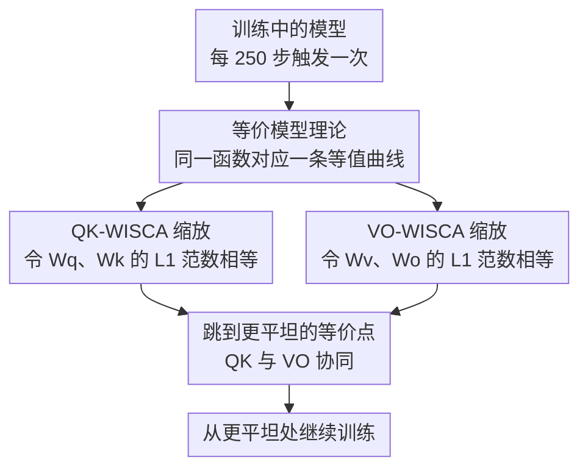

# WISCA: A Lightweight Model Transition Method to Improve LLM Training via Weight Scaling

**会议**: ACL 2026 Findings  
**arXiv**: [2508.16676](https://arxiv.org/abs/2508.16676)  
**代码**: 无  
**领域**: 模型压缩 / 训练优化  
**关键词**: 权重缩放, 等价模型, 损失景观, GQA优化, LoRA

## 一句话总结

本文提出等价模型理论和 WISCA 权重缩放策略，通过在训练中动态调整 Transformer 注意力层的 $W_q/W_k$ 和 $W_v/W_o$ 权重使其 L1 范数相等（保持模型输出不变），将优化引导至更平坦的损失最小值区域，在 GQA 架构上实现平均 5.6% 的零样本评估提升和 2.12% 的训练困惑度降低。

## 研究背景与动机

**领域现状**：Transformer 架构主导了 LLM 领域，训练优化主要集中在架构修改（如 GQA、MoE）和优化器调整（如 AdamW、学习率调度）。

**现有痛点**：(1) 现有方法缺乏对训练过程中权重模式（weight pattern）的系统优化——权重的分布和相对大小会影响损失景观的几何形态；(2) 尖锐最小值（sharp minima）导致泛化性差，模型对数据异常值更敏感；(3) SAM 等显式平坦化方法计算开销约为 2 倍，SWA 需要大量额外训练。

**核心矛盾**：从相同损失值出发，尖锐最小值和平坦最小值的泛化性差异显著，但一阶优化器（SGD、Adam）本身没有偏好平坦区域的机制。

**本文目标**：设计一种零计算开销的权重模式优化策略，在不改变模型输出的前提下将优化引导至损失景观更平坦的区域。

**切入角度**：作者观察到对于损失函数 $\mathcal{L}=(QK-1)^2$，当 $Q=K$ 时等值线间距最大（即最平坦），因此通过缩放 $W_q$ 和 $W_k$ 使二者范数相等来逼近这一最优点。

**核心 idea**：通过构造"等价模型"（输出完全相同但权重不同的模型），在训练中定期跳转到损失景观更平坦的等价点，从而间接优化训练轨迹。

## 方法详解

### 整体框架

WISCA 建立在“等价模型理论”之上：同一架构下，如果两组参数对所有输入产生相同输出但参数值不同，就互为等价模型。这些等价点在参数空间里连成一条等值曲线，曲线上不同位置对应的损失景观平坦程度并不一样。WISCA 的做法是通过缩放注意力权重在这条曲线上“跳”到更平坦的等价点——保持 $QK^T$ 和 $(attention\_score \cdot V) \cdot W_o$ 的值不变，只调整权重范数，让优化器从更平坦处继续出发。可以在初始化时做一次，也可以训练中每隔 N 步周期性应用。

### 关键设计

**1. 等价模型理论（Equivalent Model Theory）：在不改变任何输出的前提下，为权重调整找一条合法的“平移轨道”**

WISCA 要在不破坏模型功能的情况下动权重，就必须先说清楚“什么样的两组参数等价”。作者给出定义：参数 $\theta_1,\theta_2$ 若满足同一架构、对所有输入 $F(x;\theta_1)=F(x;\theta_2)$、且 $\theta_1 \neq \theta_2$，则互为等价模型。构造方式借助 ReLU 的正齐次性 $\text{ReLU}(\alpha z)=\alpha \text{ReLU}(z)$（$\alpha>0$）：相邻两层权重各乘一对互逆的缩放因子，输出完全不变。这样一来，等价模型集合在参数空间里就是一条等值曲线，曲线上各点函数相同但损失几何不同，于是“挑一个更平坦的点重新出发”成了可执行的操作，后续训练轨迹也随之改善。

**2. QK-WISCA 缩放：让 $W_q$ 与 $W_k$ 范数相等，把注意力分数的损失景观抹平**

注意力分数对应的损失 $\mathcal{L}=(QK-C)^2$ 在 $|Q|=|K|$ 时等值线间距最大、最平坦，但训练中 $W_q$、$W_k$ 的范数往往不相等，优化路径就落在更尖的地方。WISCA 直接令 $W_q' = W_q \cdot \sqrt{\|W_k\|_1 / \|W_q\|_1}$、$W_k' = W_k \cdot \sqrt{\|W_q\|_1 / \|W_k\|_1}$，缩放后 $\|W_q'\|_1 = \|W_k'\|_1$ 而 $Q'K'^T = QK^T$ 保持不变。梯度方向一致性分析也印证了 $|Q|=|K|$ 时梯度方向变化最小、收敛路径最稳。对 GQA 架构尤其划算：$g$ 个 query 头共享一组 key/value，$W_q$ 参数量是 $W_k$ 的 $g$ 倍，缩放比为 $\sqrt{1/g}$ 明显偏离 1，平坦化效果更显著。

**3. VO-WISCA 缩放：对 $W_v$ 与 $W_o$ 做同样处理，与 QK 缩放形成协同**

$W_v$ 和 $W_o$ 是另一对连续线性层，同样存在范数不平衡、损失景观偏尖的问题。WISCA 照搬同一招：$W_v' = W_v \cdot \sqrt{\|W_o\|_1 / \|W_v\|_1}$、$W_o' = W_o \cdot \sqrt{\|W_v\|_1 / \|W_o\|_1}$，保持最终输出 $(attention\_score \cdot V) \cdot W_o$ 不变。单独看 VO 缩放收益有限，但和 QK 缩放联合使用时两者产生协同——实验里组合后的提升远大于各自单用之和。

### 损失函数 / 训练策略

WISCA 本身不改变损失函数，与标准训练流程兼容。实验中每 250 步应用一次 WISCA 变换。支持 tensor-wise（全矩阵缩放）和 channel-wise（通道级缩放）两种粒度。

## 实验关键数据

### 主实验

**预训练收敛效果（TinyStories 数据集）**

| 模型 | 策略 | Train Loss | Test PPL |
|------|------|-----------|----------|
| TinyLlama | origin | 1.3193 | 3.78 |
| TinyLlama | QK+VO WISCA | **1.2749** | **3.62** |
| Qwen2-1.5B | origin | 1.355 | 3.96 |
| Qwen2-1.5B | QK+VO WISCA | **1.3336** | **3.88** |
| Qwen1.5-MoE | origin | 1.5497 | 4.76 |
| Qwen1.5-MoE | QK+VO WISCA | **1.5141** | **4.60** |

**零样本评估（Llama-1.1B，Wikipedia 1.4B tokens）**

| 策略 | BoolQ | ARC-c | PIQA | WinoG | 平均 |
|------|-------|-------|------|-------|------|
| origin | 0.384 | 0.174 | 0.529 | 0.500 | 0.397 |
| QK_TEN+VO_TEN | **0.521** | **0.187** | **0.541** | **0.498** | **0.437** |

### 消融实验

| 策略 | 平均零样本分数 | 提升 |
|------|--------------|------|
| origin | 0.397 | — |
| QK_TEN 单独 | 0.395 | -0.5% |
| VO_TEN 单独 | 0.403 | +1.6% |
| QK_TEN+VO_TEN | 0.437 | **+10.1%** |
| QK_ROW+VO_TEN | 0.422 | +6.2% |
| QK_TEN+VO_TEN(init only) | 0.421 | +6.0% |

### 关键发现

- QK 和 VO 的联合缩放产生显著的协同效应：单独使用效果有限（+1-2%），组合后提升 10.1%
- GQA 架构（如 Llama-MoE）上效果更大，因为 query 和 key 的参数量不对称使缩放比显著偏离 1
- 仅在初始化时使用 WISCA 可保留约 97% 的性能收益，适合资源受限场景
- LoRA 微调中 WISCA 同样有效（Alpaca loss: 0.8602→0.8532; MetaMath: 0.0779→0.0770）
- 在 EAGLE 推测解码中，WISCA 提升了 draft 模型的 token 接受率

## 亮点与洞察

- "等价模型"概念非常优雅——在不改变任何输出的前提下改善训练，这是一种"免费午餐"式的优化
- WISCA 的计算开销几乎为零（仅需一次范数计算和缩放），却能带来可观的训练提升，实用性极高
- 理论分析简洁有力：通过梯度方向一致性条件推导出 $|Q|=|K|$ 的最优条件，直觉清晰

## 局限与展望

- 理论分析基于简化的二元损失 $\mathcal{L}=(QK-C)^2$，真实 Transformer 的损失景观远更复杂
- 仅在 Transformer 注意力机制上验证，对 CNN、RNN 等架构的适用性未探索
- 实验规模主要在 1-5B 参数级别，对更大模型（70B+）的效果未知
- channel-wise WISCA 的粒度选择（按头 vs 按通道）缺乏系统的比较

## 相关工作与启发

- **vs SAM**: SAM 通过最大化扰动下的损失来显式追求平坦最小值，计算开销约 2 倍；WISCA 通过等价模型转换隐式平坦化，开销接近零
- **vs Weight Normalization**: 权重归一化改变了模型的函数映射，需要重新训练；WISCA 保持函数等价性，可即插即用
- **vs QK Normalization**: QKN 将 dot product 变为 cosine similarity，改变了注意力计算语义；WISCA 保持原始 $QK^T$ 不变

## 评分

- 新颖性: ⭐⭐⭐⭐ 等价模型理论视角新颖，将权重模式优化形式化
- 实验充分度: ⭐⭐⭐⭐ 覆盖预训练、微调（LoRA）、推测解码（EAGLE）多场景
- 写作质量: ⭐⭐⭐ 理论部分清晰但实验表格排版稍乱
- 价值: ⭐⭐⭐⭐ 零开销优化策略，实用价值高，可广泛应用

<!-- RELATED:START -->

## 相关论文

- [\[ICML 2026\] Decouple Searching from Training: Scaling Data Mixing via Model Merging for Large Language Model Pre-training](../../ICML2026/model_compression/decouple_searching_from_training_scaling_data_mixing_via_model_merging_for_large.md)
- [\[ACL 2026\] Task-Stratified Knowledge Scaling Laws for Post-Training Quantized LLMs](task-stratified_knowledge_scaling_laws_for_post-training_quantized_large_languag.md)
- [\[ACL 2026\] ArcLight: A Lightweight LLM Inference Architecture for Many-Core CPUs](arclight_a_lightweight_llm_inference_architecture_for_many-core_cpus.md)
- [\[ACL 2026\] DeepPrune: Parallel Scaling without Inter-Trace Redundancy](deepprune_parallel_scaling_without_inter-trace_redundancy.md)
- [\[ECCV 2024\] SpaceJAM: a Lightweight and Regularization-free Method for Fast Joint Alignment of Images](../../ECCV2024/model_compression/spacejam_a_lightweight_and_regularization-free_method_for_fast_joint_alignment_o.md)

<!-- RELATED:END -->
