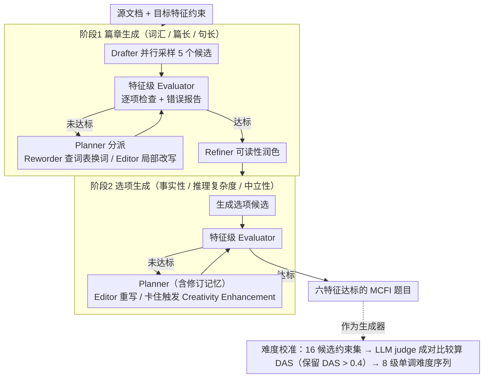

# A Multi-Agent Framework for Feature-Constrained Difficulty Control in Reading Comprehension Item Generation

**会议**: ACL2026  
**arXiv**: [2605.19316](https://arxiv.org/abs/2605.19316)  
**代码**: https://github.com/SeonjeongHwang/mafig  
**领域**: LLM Agent / 教育测评 / 可控生成  
**关键词**: 多智能体生成, 阅读理解题生成, 难度控制, 约束满足, LLM评估器

## 一句话总结
本文提出 MAFIG，一个用多智能体协作、特征级评估器和迭代修订来生成阅读理解选择题的框架，相比单轮提示能显著提高题目对词汇、篇幅、句长、推理复杂度、事实性和选项中立性等约束的满足率，并带来更稳定的难度递增。

## 研究背景与动机
**领域现状**：阅读理解题在语言教学、能力测评和机考系统中都很核心，而 LLM 已经可以零样本生成语言流畅、结构完整的题目。现有可控题目生成大致有两条路线：一类依赖 IRT 等心理测量模型，用学习者作答数据标定难度后训练生成模型；另一类直接通过提示词控制题目的 Bloom 认知层级、词汇难度、篇幅或其他可解释特征。

**现有痛点**：IRT 式方法需要大量学生响应数据，跨题型、跨语种和跨考试场景时扩展成本很高；提示式方法虽然轻量，但通常是单个 LLM 在一次生成里同时满足多个约束，很容易顾此失彼。例如题目可能篇幅符合要求，但词汇超出指定 CEFR 等级；选项可能事实性正确，但彼此之间存在蕴含或矛盾关系，导致题目质量和难度控制都不稳定。

**核心矛盾**：细粒度难度控制本质上不是“告诉模型生成 Level 5 题目”这么简单，而是要让题目在多个可解释特征上同时落入目标区间。抽象难度等级依赖模型内部启发式，缺少可验证的约束；而多维特征约束又需要外部词表、规则工具和语义判断共同参与，单轮提示很难可靠完成。

**本文目标**：作者要解决两个子问题。第一，如何生成严格满足多维特征约束的阅读理解多选题；第二，如何把这些特征约束组织成一个难度逐级上升的序列，使生成题目在相邻等级之间真的表现出可感知的难度差。

**切入角度**：论文把题目生成看作一个约束满足问题，而不是一次性文本生成问题。核心观察是：如果能把“生成、测量、诊断、修订”拆成多个角色，并让每个角色围绕明确的特征反馈迭代工作，那么 LLM 不需要一次命中所有条件，而是可以像人类命题专家一样逐轮修题。

**核心 idea**：用多智能体闭环修订替代单轮提示生成，并用难度校准后的特征约束序列替代抽象难度标签，从而把阅读理解题的难度控制落到可检查、可迭代优化的具体特征上。

## 方法详解
MAFIG 面向多选事实信息类阅读理解题（MCFI）：给定一个源文档和目标难度对应的特征约束，系统需要生成阅读篇章、题干和若干选项，题干形式类似 “According to the passage, which statement is true?”。题目被拆成两个阶段生成：先生成符合篇章级约束的 passage，再基于 passage 生成符合选项级约束的 options。每个阶段内部都不是一次生成结束，而是反复执行“生成候选 → 评估约束 → 规划修订 → 局部改写 → 再评估”的闭环，直到所有约束满足或达到最大轮数。

论文使用六类特征变量，其中四类主要控制认知负荷：词汇等级、篇章长度、平均句长、推理复杂度；两类保证题目有效性：事实性和选项中立性。连续特征被离散成类别，例如篇章长度分为 short/medium/long，平均句长分为 short/medium/long；词汇等级按 CEFR 划分为 A、B、C；推理复杂度则细分为单句词面匹配、单句转述、单句推理、多句推理和信息不足。这样做的好处是，难度不再是黑箱标签，而是一组可以被评估器逐项检查的目标状态。

### 整体框架
输入包括源文档和一组特征约束。第一阶段 Passage Generation 根据源文档生成阅读篇章，并主要处理词汇等级、篇章长度、平均句长等篇章级约束。第二阶段 Option Generation 在生成好的篇章上构造选项，并处理事实性、词汇等级、推理复杂度和选项中立性等选项级约束。两个阶段都使用同一类闭环机制：Evaluator 先检查当前草稿哪里违反约束；Planner 根据错误报告和历史修订记忆决定下一步改哪里、交给哪个智能体；Reworder 或 Editor 执行局部修订；最后 Refiner 对篇章做最小可读性润色。

在实验实现上，所有 MAFIG 智能体使用 Qwen3-32B 的非推理模式，top-p=0.8、top-k=20、temperature=0.7。初始草稿并行采样 5 个候选，篇章生成最多修订 20 轮，选项生成最多修订 100 轮；如果没有候选在轮数上限内完全满足约束，则返回最终候选池中的一个随机候选。

### 关键设计
**1. 特征级 Evaluator 与错误报告：把“题目难不难”拆成可逐项测量的特征，并给出可操作的诊断信号**

难度控制失败往往不是模型不会写题，而是它不知道自己哪里没满足约束。MAFIG 把“评价”从生成模型里单独拿出来：表层特征用规则或现成工具，例如 NLTK 统计篇章长度和句长，词汇等级查外部 CEFR 词表、以题目中最高词汇等级作判定依据；推理复杂度、事实性、中立性这类语义特征则用 LLM judge 配 CoT 与 self-consistency 评估（附录里 Evidence Scope 和 Transformation Level 两个推理复杂度子维度的 Macro F1 分别为 69.0 和 70.8）。Evaluator 输出的不是一个总分，而是逐特征的错误报告，让后续修订像“有靶子的编辑”而非盲猜重写。

**2. Planner + Reworder/Editor 的分工修订：不同性质的约束交给不同角色，避免一个模型同时干所有事的混乱**

词汇约束依赖外部标准、不能只靠 LLM 语感，而推理复杂度、中立性又需要语义级编辑，把它们塞进一个 prompt 很容易顾此失彼。MAFIG 按约束性质分工：Planner 拿着当前题目状态、错误报告和历史修订记忆制定策略并指派执行者，记忆的作用是避免重复无效的改动；Reworder 专管词汇等级，走 RAG 流程——先提上下文合适的替代表达，再用词表检索候选词等级，最后挑符合目标等级的替换项；Editor 处理词汇之外的约束，按 Planner 指令改篇章或选项，但刻意不向 Planner 回传自评，以免把不准的自我评估噪声带进下一轮。当某个约束连续若干轮卡住时，Creativity Enhancement Prompting 会推动 Planner 从小修转向激进策略，例如删掉问题片段后重新生成。

**3. 难度校准的特征约束序列：先按理论造候选，再用经验成对比较过滤出真正单调递增的 8 级难度**

即便题目满足了某些特征，也不保证学生或专家真觉得更难——“CEFR 更高、句子更长”不必然等于“更难”。作者因此分两步：先据教育测量理论构造 16 个候选约束集，用 MAFIG 为每个候选集生成题目；再让 LLM judge 对相邻候选等级做成对难度比较，算 Difficulty Alignment Score

$$DAS(Q_i,Q_j)=\frac{\sum_{n=1}^{N}x_f^{(n)}+\sum_{n=1}^{N}(-x_r^{(n)})}{2N}$$

其中正向和反向各采样 $N=4$ 次以缓解位置偏差，只有 DAS 超过阈值 $\rho=0.4$ 的相邻约束对才保留，最终筛出 8 级单调难度序列。这一步把“理论上更难”再经过经验验证，避免生成一个形式上递增、实际却难度不可区分的等级体系。

### 一个完整示例：生成一道高难度的 MCFI 题

以 Brown Corpus 里一篇 science fiction 源文档、目标约束为“词汇 B、篇章 medium、句长 medium、推理复杂度=多句推理、事实性正确、选项互相中立”为例走一遍：

- **篇章阶段**：Drafter 并行采样 5 个 passage 候选。Evaluator 给每个候选逐项体检——比如某候选篇章长度合格，但 NLTK 测出平均句长偏 long、CEFR 词表又查出含若干 C 级词。Planner 读到这两条错误报告，把“降句长”交给 Editor、把“降词汇等级”交给 Reworder；Reworder 用 RAG 把 C 级词替换成 B 级近义表达，Editor 拆长句。再评估若仍超标就继续修，篇章阶段通常 20 轮内有候选全部达标，Refiner 做一遍可读性润色定稿。
- **选项阶段**：基于定稿 passage 生成选项候选。这一阶段难得多——正确选项要事实正确、干扰项要落在多句推理层级上“看似可选”，同时四个选项彼此不能蕴含或矛盾（中立性）。Evaluator 可能报出“选项 B 与 D 存在蕴含关系”“干扰项 C 只需单句词面匹配即可排除、推理层级不够”，Planner 据此指派 Editor 重写干扰项；若某约束连续多轮卡死，Creativity Enhancement Prompting 触发更激进改写。选项阶段最多 100 轮，任一候选满足全部约束即提前终止。

走完两阶段，得到的就是一道在六个特征上都落入目标区间、且已被独立评估器逐项验证过的题目。

### 损失函数 / 训练策略
本文不是训练一个新模型，而是提出推理时的多智能体生成框架，因此没有传统监督学习损失函数。优化目标体现在约束满足闭环中：系统逐轮最大化所有目标特征同时满足的概率，并用 Success Ratio 和 Achievement Ratio 衡量整体成功。实验中的难度序列构造还引入了 LLM judge 的成对比较，使用 $\rho=0.4$ 作为筛选阈值，保留能稳定产生难度区分的相邻约束对。

训练/推理策略上有三个关键点。第一，初始 Drafter 并行生成 5 个候选，让不同草稿沿不同修订路径探索，任一候选满足全部约束即可提前终止。第二，篇章和选项分阶段生成，避免同时控制长文本和选项逻辑带来的搜索空间爆炸。第三，Planner 维护修订记忆，并在约束长期失败时触发更具创造性的改写策略，避免系统陷入只改表面词语却无法解决结构性问题的循环。

## 实验关键数据

### 主实验
实验使用 NLTK Brown Corpus 的 40 篇源文档，覆盖 news、editorial、reviews、lore、government、fiction、mystery、science fiction、adventure、romance 共 10 类，每篇只取前 50 句。最终生成规模为 40 篇源文档 × 8 个难度等级 = 320 道题。作者比较了两类基线：抽象等级控制的 Direct/Incremental Prompting，以及特征约束控制的 Direct Prompting；模型包括 Qwen3-32B 和 GPT-5，MAFIG 主结果使用 Qwen3-32B。

| 难度控制粒度 | 方法 | SR(%) | AR(%) | DAS | Validity | Coherence | Fluency |
|--------------|------|-------|-------|-----|----------|-----------|---------|
| Level-based | Direct Qwen3-32B | - | - | 0.1037 | 2.6371 | 0.9355 | 0.9280 |
| Level-based | Direct GPT-5 | - | - | 0.2949 | 2.9816 | 0.9332 | 0.9408 |
| Level-based | Incremental Qwen3-32B | - | - | 0.1804 | 2.5605 | 0.9332 | 0.9408 |
| Level-based | Incremental GPT-5 | - | - | 0.2750 | 2.9637 | 0.9348 | 0.9309 |
| Feature-based | Direct Qwen3-32B | 0.00 | 59.10 | 0.2759 | 2.6094 | 0.9368 | 0.9393 |
| Feature-based | Direct GPT-5 | 2.50 | 77.81 | 0.4952 | 2.9105 | 0.9094 | 0.9241 |
| Feature-based | MAFIG Qwen3-32B | 92.29 | 99.32 | 0.5226 | 2.9242 | 0.9518 | 0.9429 |

最关键的结论是：单轮特征提示并非完全无效，但很难同时满足所有约束。Direct Qwen3-32B 的 AR 仍有 59.10%，说明它平均能满足一半以上特征，但 SR 为 0.00%，没有一道题完全达标；Direct GPT-5 的 AR 升到 77.81%，但 SR 也只有 2.50%。MAFIG 的 SR 达到 92.29%、AR 达到 99.32%，说明迭代修订确实把“部分听指令”转化成了“整体满足约束”。

难度校准方面，抽象 Level-based 方法的 DAS 普遍偏低，Qwen3-32B Direct 只有 0.1037，GPT-5 Direct 也只有 0.2949。相比之下，即便是 Feature-based Direct Qwen3-32B，在 AR 只有 59.10% 时 DAS 也达到 0.2759，说明显式特征比抽象等级更有助于稳定难度；MAFIG 进一步把 DAS 推到 0.5226，支持作者关于“约束满足驱动难度对齐”的解释。

### 消融实验
论文没有给出完整数值表，而是用收敛曲线展示三类机制的消融：Planner’s Instruction、Reworder’s Message 和 Creativity Enhancement Prompting。结果表明，这些机制对篇章生成影响不大，因为篇章阶段主要是表层长度、句长和词汇控制；但在选项生成中非常重要，去掉 Planner 指令会显著放慢收敛，去掉 Reworder 反馈或创造性增强也会让系统更难处理推理复杂度和选项中立性。

| 分析项 | 关键现象 | 启示 |
|--------|----------|------|
| 多次单轮采样 | 从 1 次采样增至 5/10 次能提升 SR 和 AR，但 5 到 10 的收益明显变小 | 随机采样能提高碰巧命中的概率，但不能替代明确修订机制 |
| 并行修订 n=5 | 所有测试骨干模型在 n=5 时最终达到 100% 约束满足；篇章生成通常 5 轮内终止 | 多草稿带来的路径多样性比单个大模型反复修更有效 |
| 选项生成瓶颈 | n=1 时除 Qwen3-32B 外，其他模型在 100 轮内选项生成 SR 不超过 60% | 推理复杂度和选项中立性比表层特征难控制得多 |
| 计算成本 | 篇章阶段约 10 轮、20K 输出 token 可到约 90% SR；选项阶段约 100 轮、超过 130K token 才能到约 90% SR | 高可靠难度控制的代价是明显的延迟和 token 开销 |

### 人工评估
人工评估由 3 名具备 IELTS 教学或阅读理解命题经验的专家完成。作者从 3 种方法中抽取相邻难度等级题目对，每位标注者评估 126 对题目；65.9% 的题目对在“三位专家判断哪一道更难”这一问题上达成一致。

| 方法 | Human DAS | CAR(%) |
|------|-----------|--------|
| Direct Qwen3-32B | 0.2817 | 42.86 |
| Direct GPT-5 | 0.4722 | 57.14 |
| MAFIG Qwen3-32B | 0.6190 | 76.19 |

MAFIG 在人工评估中 Human DAS 达到 0.6190，CAR 达到 76.19%，明显高于 Direct GPT-5 的 0.4722 和 57.14%。这说明它生成的相邻等级题目不仅在 LLM judge 看来更有序，在人类专家看来也更容易形成可感知的难度差。作者还报告 LLM judge 与专家评分之间存在显著正相关，Spearman’s $\rho=0.34$，$p<0.001$。

### 关键发现
- 最有力的结果是约束满足率：MAFIG Qwen3-32B 的 SR 为 92.29%，而 Direct GPT-5 只有 2.50%，说明强模型单轮推理仍难以同时满足多维约束。
- 显式特征约束比抽象等级标签更可靠。Level-based GPT-5 Direct 的 DAS 为 0.2949，而 Feature-based GPT-5 Direct 提升到 0.4952。
- 人工评估支持自动评估趋势。MAFIG 的 Human DAS 为 0.6190、CAR 为 76.19%，相邻等级的难度差更容易被专家识别。
- 最大瓶颈在选项阶段，尤其是 neutrality 和 reasoning complexity。失败案例显示，逻辑高度连贯的 passage 会让构造彼此中立且推理层级合适的选项变得困难。
- 计算成本不可忽视。篇章生成相对快，选项生成可能需要 100 轮和超过 130K 输出 token 才能接近 90% SR。

## 亮点与洞察
- 把难度控制从“等级标签”落到“可评估特征”上，是这篇论文最重要的设计。这样不仅让生成目标更明确，也让失败原因更可诊断：到底是词汇超标、句长不对，还是选项之间不够中立。
- 多智能体分工不是为了堆概念，而是对应不同约束的不同性质。词汇等级需要外部词表和检索，事实性/推理复杂度需要语义判断，篇章流畅性需要轻量润色；这些角色确实承担了不同类型的编辑责任。
- 难度校准序列的构造很值得借鉴。作者没有假设“CEFR 更高、句子更长就一定更难”，而是先按理论构造候选，再用成对比较过滤出单调递增序列，这比纯经验或纯理论都更稳。
- 论文揭示了一个现实问题：LLM 的强推理能力不等于强约束满足能力。GPT-5 在单轮提示下 AR 高于 Qwen3-32B，但 SR 仍然极低，说明“几乎都满足”在高风险测评题生成里依然不够。
- 并行草稿的效果很有启发。与其让一个草稿被反复小修，不如让多个草稿沿不同路径探索；这对其他约束生成任务，如可控摘要、教学材料生成或安全合规文本生成，也可能有效。

## 局限与展望
- 题型范围较窄。实验只覆盖 MCFI 多选事实信息题，而阅读理解还包括主旨题、推断题、摘要题、作者态度题等。不同题型的难度因素并不相同，直接迁移 MAFIG 需要重新定义特征评估器，甚至改造 passage-option 两阶段结构。
- 难度没有经过真实学生作答验证。论文依赖专家和 LLM judge 评估题目难度顺序，没有用学生错误率、IRT 参数或作答模式验证绝对难度。因此它证明的是“先验特征意义上的难度对齐”，还不是心理测量意义上的完整标定。
- 计算成本较高。MAFIG 的可靠性来自迭代修订，但选项生成可能需要大量轮次和 token，实时生成或大规模低成本题库生产会受限。更现实的落地方式可能是离线命题、人工审核前预生成，或只对高风险题目启用完整闭环。
- 依赖特征定义和评估器质量。若词汇表覆盖不足、LLM judge 对推理复杂度或中立性判断有偏，系统会围绕错误信号优化，导致形式上满足约束但教育上不一定合理。
- 主题本身没有作为难度变量显式控制。附录失败案例显示，某些源文档主题天然更适合高阶理解题，不适合 MCFI 题型；未来可以把 passage topic、题型适配度和知识抽象度纳入约束序列。

## 相关工作与启发
- **vs IRT / 难度参数生成方法**: IRT 路线用学生响应数据标定难度，心理测量基础更扎实，但数据成本高、跨场景扩展困难；MAFIG 不需要作答数据，靠特征约束和专家/LLM 成对比较实现可解释控制，优势是轻量和可迁移，劣势是缺少真实考生层面的校准。
- **vs Bloom 等级提示**: Bloom-level prompting 用认知分类控制题目难度，但同一认知层级内部难度差异很大，而且高风险考试中大量题目处于 Remember/Understand 等低层级；MAFIG 改用词汇、句长、推理复杂度等更细粒度特征，能更直接地调节认知负荷。
- **vs Feature-based Direct Prompting**: 直接提示也给模型所有约束，但它缺少诊断和修订机制，只能一次性猜中。MAFIG 的优势在于把失败约束显式反馈给 Planner，并用专门智能体逐轮修复，因此从“平均满足多数约束”提升到“整体满足全部约束”。
- **vs 通用 LLM agent 约束满足框架**: 现有 agent 工作常用于摘要、图表生成或工具调用任务，MAFIG 把类似的多角色协作引入教育测评，把外部词表、规则评估和 LLM judge 组合进闭环，说明 agent 框架在可解释教育内容生成中有较强应用潜力。
- **对后续研究的启发**: 这套框架可以扩展到“生成后必须可测”的教育任务，例如分级阅读材料、分层练习题、自动反馈题和课程测验生成。关键不是简单增加智能体数量，而是为每个控制维度设计可靠评估器和可执行修订动作。

## 评分
- 新颖性: ⭐⭐⭐⭐☆ 从多智能体约束满足角度处理阅读理解难度控制，任务落点具体，难度校准序列也有清晰创新。
- 实验充分度: ⭐⭐⭐⭐☆ 自动评估、人工评估、消融、泛化和成本分析都覆盖到了，但缺少真实学习者作答数据验证。
- 写作质量: ⭐⭐⭐⭐☆ 方法结构清楚，指标定义和附录信息充分；不足是部分表格在正文中依赖图示曲线，具体数值不够完整。
- 价值: ⭐⭐⭐⭐☆ 对教育测评和可控生成都有实际参考价值，尤其适合需要高可靠题目生成的离线命题场景。

<!-- RELATED:START -->

## 相关论文

- [\[ACL 2026\] Memory-Augmented LLM-based Multi-Agent System for Automated Feature Generation on Tabular Data](memory-augmented_llm-based_multi-agent_system_for_automated_feature_generation_o.md)
- [\[ACL 2026\] PosterForest: Hierarchical Multi-Agent Collaboration for Scientific Poster Generation](posterforest_hierarchical_multi-agent_collaboration_for_scientific_poster_genera.md)
- [\[ACL 2026\] RoadMapper: A Multi-Agent System for Roadmap Generation of Solving Complex Research Problems](roadmapper_a_multi-agent_system_for_roadmap_generation_of_solving_complex_resear.md)
- [\[AAAI 2026\] FinRpt: Dataset, Evaluation System and LLM-based Multi-agent Framework for Equity Research Report Generation](../../AAAI2026/multi_agent/finrpt_dataset_evaluation_system_and_llm-based_multi-agent_framework_for_equity_.md)
- [\[ACL 2026\] EvoSci: A Bio-Inspired Multi-Agent Framework for the Evolution of Scientific Discovery](evosci_a_bio-inspired_multi-agent_framework_for_the_evolution_of_scientific_disc.md)

<!-- RELATED:END -->
