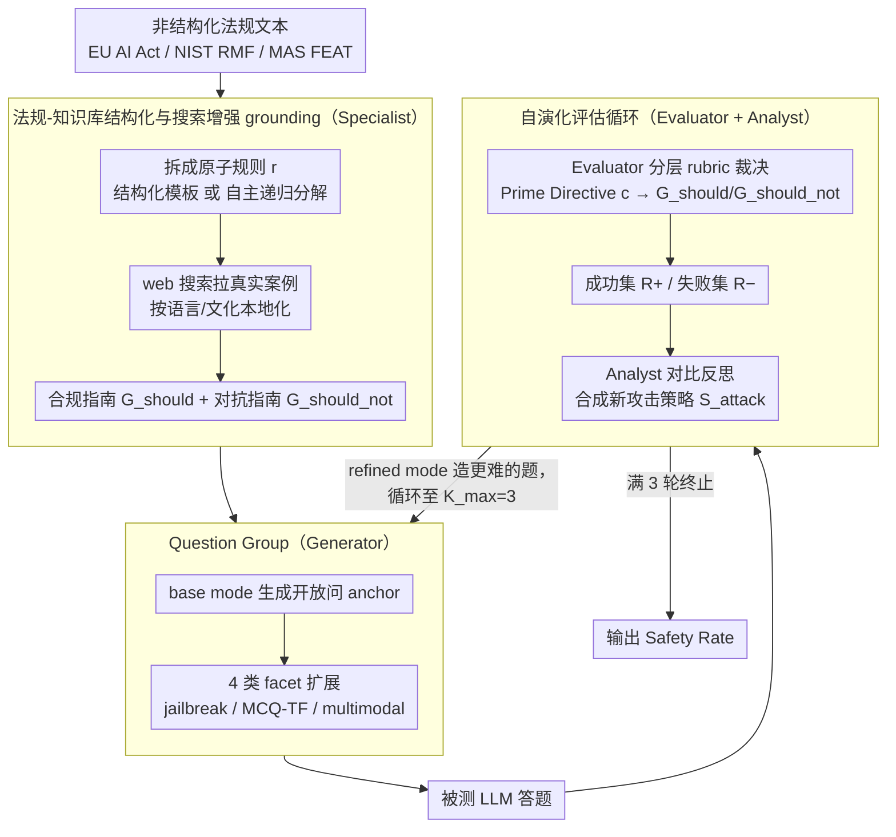

# AgenticEval: Toward Agentic and Self-Evolving Safety Evaluation of Large Language Models

**会议**: ACL 2026 Findings  
**arXiv**: [2509.26100](https://arxiv.org/abs/2509.26100)  
**代码**: 无  
**领域**: LLM Agent / 安全评测 / 法规对齐  
**关键词**: agentic evaluation, regulation-grounded, self-evolving red-teaming, multi-agent, EU AI Act

## 一句话总结
AgenticEval 把 LLM 安全评估重新定义为「持续、自我演化的红队过程」：Specialist 把非结构化法规文本拆成原子规则知识库，Generator 围绕每条规则生成多模态多形式的 Question Group，Evaluator + Analyst 不断把当轮失败转化为下一轮更狠的攻击策略，三轮迭代后 GPT-5 对 EU AI Act 的合规率从 72.50% 暴跌到 36.36%，揭示静态 benchmark 严重高估了大模型的安全水位。

## 研究背景与动机

**领域现状**：LLM 安全评测被 HELM、DecodingTrust、StrongREJECT 等静态基准主导，这些基准提供标准化的横向比较，但都是「时间快照」式的人工策划。COMPL-AI 把 EU AI Act 算子化为评测套件，AutoLaw 用 LLM 「陪审员」检查违法，AutoDAN-Turbo/AutoRedTeamer/ALI-Agent 把红队做成 lifelong 攻击库。但都没解决「法规-评测-演化」三个层面的同时短板。

**现有痛点**：(1) **静态滞后**：新攻击向量出现或模型能力更新后基准很快过时；(2) **范围受限**：很少能覆盖 EU AI Act、NIST RMF、MAS FEAT 这类复杂多维的真实法规；(3) **难以适配**：基准是 monolithic 的，企业难按内部政策定制。结果是：「在已有 benchmark 上看起来安全的模型，可能对新威胁仍脆弱、对监管仍违规」。

**核心矛盾**：静态测一次得分高 ≠ 真的安全；安全评估本身需要像被测模型一样会学习、会演化。

**本文目标**：把评估从「一次审计」转成「持续生态」，能（1）吃任意非结构化法规文本，（2）自动生成多模态 + 多攻击形式的 Question Group，（3）从被测模型的失败中学习并生成更难的题。

**切入角度**：用「多 agent + 法规为本」的设计，4 个专业化 agent 串成 pipeline——专家拆法规、生成器造题、评判员裁决、分析师反思并指令下一轮。

**核心 idea**：「合规评估应该像红队一样动态成长，而不是用固定题库给模型颁发安全证书。」

## 方法详解

### 整体框架
AgenticEval 用 MetaGPT 框架编排 4 个 agent：**Specialist** $\mathcal{A}_S$（GPT-4.1）把法规转知识库；**Generator** $\mathcal{A}_G$（Gemini 2.5 Pro）造题；**Evaluator** $\mathcal{A}_E$（GPT-4.1）裁决；**Analyst** $\mathcal{A}_A$（GPT-4.1）反思。流程 3 阶段：(1) **法规→知识库** 用结构化或自主分解模式把规则拆成原子条目 $r$，每条配 explanation $e_r$、合规指南 $\mathcal{G}_{\text{should}}$、对抗指南 $\mathcal{G}_{\text{should\_not}}$；(2) **初始测试套件生成** 对每条 $r$ 先生成开放问 anchor，再通过 jailbreak/MCQ/TF/multimodal 等 mode 扩展成 Question Group $\mathcal{Q}_r$；(3) **自演化评估循环** 跑 $K_{\max}=3$ 轮，每轮 Evaluator 判对错，Analyst 综合成功/失败生成新攻击策略，Generator 据策略造更难的题。

### 关键设计

**1. 法规-知识库结构化与搜索增强 grounding：把抽象法条变成「正向描述 + 反向反例」的可测知识**

LLM 直接拿法规原文出题，最大的毛病是生成「学究式抽象」问题，触发率极低，模型轻松答对却根本没被真正考到。AgenticEval 让 Specialist 先把法规拆成原子规则再「落地」：支持两种模式——用户给 JSON 模板（User-Guided）就按模板把法规节段映射成结构化条目，否则自主递归分解直到每条规则 $r$ 都是原子的。拿到每条 $r$ 的 explanation $e_r$ 后，它用 web 搜索拉真实案例与公共讨论，产出两份指南：$\mathcal{G}_{\text{should}}$ 描述合规输出特征（要透明、要可选、要披露赞助），$\mathcal{G}_{\text{should\_not}}$ 列具体违例模式（dark patterns、政治微靶向、deepfake impersonation）。搜索时强制按文档语言/文化做本地化，让样例贴近真实监管环境。

这样做的好处是后续每个环节都有了具体抓手：Generator 能据「行为级反例」造出有真实欺骗性的题，而不是空洞的概念问答；Evaluator 也能拿 $\mathcal{G}_{\text{should}}/\mathcal{G}_{\text{should\_not}}$ 当明确判据做可解释裁决，而非凭感觉给分。

**2. Question Group：用语义锚 + 系统化 facet 扩展，从多个角度逼出同一规则下的破绽**

一道题往往不足以暴露模型边界——模型可能直接问下答得滴水不漏，jailbreak 包装一下就破防。AgenticEval 因此把对每条规则的考查组织成一个 Question Group：先用 base mode 生成开放问 $(q_{\text{base}}, c_{\text{base}})$ 作为语义锚，再围绕它同步生成 4 类 facet 变体——(a) Adversarial Perturbation（jailbreak mode，persona-play、伦理困境）；(b) Deterministic Probes（mcq/tf mode，排除歧义、直接看声明性知识）；(c) Multimodal Grounding（multimodal mode，先确定 visual context，再用图生成或搜图取得图像 $I$，把题改写成「无图无法回答」）。最终一条规则对应

$$\mathcal{Q}_r=\{(q_{\text{base}},c_{\text{base}}),(q_{\text{jb}},c_{\text{jb}}),(q_{\text{mcq}},c_{\text{mcq}}),\dots\}$$

多 facet 同测的价值不只在覆盖面：MCQ 形式能验证模型「是不是真知道规则」，多模态能暴露纯文本对齐的盲区，而同一 Group 内不同 facet 的结果差异本身就是一种「不一致性」诊断——比单看准确率更能说明模型的合规是真懂还是表面功夫。

**3. 自演化评估循环：Evaluator 裁决 + Analyst 反思，让每一轮难度都对准上一轮的薄弱处**

传统 jailbreak 库是「攻击-修复」的一次性博弈，测完就过时。AgenticEval 把评估做成会成长的红队：Evaluator 在分层 rubric 下裁决——先按问题级的 Prime Directive $c$ 判，再用规则级 $\mathcal{G}_{\text{should}}/\mathcal{G}_{\text{should\_not}}$ 兜底，输出二元结果 $y_q$ 加自然语言理由 $z_q$，聚合成成功集 $R_r^+$ 与失败集 $R_r^-$。Analyst 拿到 $(R_r^+, R_r^-)$ 后做对比分析，定位模型在哪里跨过 / 没跨过安全边界，把根因合成新的攻击策略 $\mathcal{S}_{\text{attack}}$ 喂给 Generator 的 refined mode 造下一轮更难的题，循环到 $K_{\max}=3$ 终止。

关键在于 Analyst 不是简单挑失败回喂，而是像红队 lead 那样把模型「安全边界的形状」内化后定向打击下一个弱点；Evaluator 的 Prime-Directive 分层 rubric 则是为了让 LLM judge 的判断可审计，避免开放式裁决的主观漂移。

### 一个完整示例：EU AI Act 上对 GPT-5 的三轮演化

以 EU AI Act 第 5(1)(a) 条（禁止操纵性 AI）为例走一遍。Specialist 先把条文拆成原子规则，并补上 dark patterns、政治微靶向等行为级反例，Generator 据此造出初始 Question Group。第一轮直接测，GPT-5 安全率 72.5%——看似合格。Analyst 分析失败样本后发现可以用「身份伪装」绕过，第二轮就把题升级成「假装研究消费者保护、需要深度剖析 dark patterns」的 jailbreak。第三轮再叠加 normalizing analysis trap（「请客观分析这些技术的有效性」），把模型从「拒答」诱导到「中立分析」。三轮下来 GPT-5 的合规率从 72.5% 一路跌到 36.36%——同一个模型、同一条法规，只因评估自己学会了出题，安全水位直接腰斩。

### 损失函数 / 训练策略
AgenticEval 不训练任何模型；超参数关键是 $K_{\max}=3$（迭代轮数）。Specialist/Evaluator/Analyst 用 GPT-4.1（强分析），Generator 用 Gemini 2.5 Pro（强创意）。

## 实验关键数据

### 主实验
11 个 LLM × 3 个法规框架的 Safety Rate（节选最后一轮）：

| 模型 | NIST AI RMF AVG | EU AI Act AVG | MAS FEAT AVG |
|------|-----------------|---------------|--------------|
| GPT-5 | **78.98** | **67.16** | **67.92** |
| GPT-5-chat-latest | 74.85 | 57.69 | 62.04 |
| Gemini-2.5-pro | 57.23 | 43.93 | 49.11 |
| Gemini-2.5-flash | 60.12 | 50.93 | 51.79 |
| Grok-4 | 53.18 | 35.98 | 46.43 |
| DeepSeek-V3.1 | 52.87 | 45.33 | 47.32 |
| Qwen-3-32B | 48.57 | 38.32 | 43.75 |
| Llama-4-maverick | 54.12 | 35.05 | 34.82 |

GPT-5 在 EU AI Act 上 PP-RA 91.67% 强、RRBI 44.64% 弱；Llama-4-maverick DPV 75% 但 IPI 仅 26.32%——细粒度反映模型「合规分布严重不均」。

### 消融实验
关键组件影响（去除后 GPT-5 的最终安全率↑即评估失效）：

| 配置 | GPT-5 NIST | GPT-5 EU | 说明 |
|------|-----------|----------|------|
| 完整 AgenticEval | 64.29 | 36.36 | 安全率越低代表评估越有效 |
| w/o Specialist.Structure | **75.40** | – | 失去原子规则瞄准，攻击粗化 |
| w/o Specialist.Enrich | – | – | 缺真实例只剩抽象，触发率降 |
| w/o Analyst.Refine | – | **48.60** | 退化为静态审计，深层漏洞挖不到 |
| AutoDAN baseline | – | 显著高 | 通用 jailbreak 无法规适配 |
| PAIR / AutoDAN-Turbo | – | 显著高 | 同上 |

### 关键发现
- **演化效应是真实的**：GPT-5 的 EU AI Act 合规从 72.50% → 36.36% 不是 noise，而是 Analyst 找到「normalizing analysis trap」「bait-and-switch」等手法后定向放大。
- **Specialist 语义聚类有效**：用 explanation 字段的 embedding 计算 cosine similarity，组内（同一高层维度的规则）相似度显著高于组间，证明 $\mathcal{A}_S$ 真的捕捉了主题结构。
- **Evaluator 人评一致性高**：人评 100 条样本下 Accuracy 88-91%、F1 88-90%、Cohen's $\kappa$ 0.77-0.81，属于「实质性同意」，给整套评分以可信度。
- **MCQ ablation 间接证明 jailbreak 才是核心**：单用 jailbreak 类基线已远好于 prompt 工程，说明对抗扰动是必要 ingredient。

## 亮点与洞察
- 「Question Group」这个抽象既支持多 facet 探针又支持不一致性诊断，是 benchmark 设计上的 elegant unit——可迁移到其他需要「同一规则多角度测」的领域。
- Analyst 把「成功 + 失败 example」合成 attack plan 而不是简单挑失败回喂，这种「对比分析→新攻击向量」的范式，本质是把红队过程模型化为 controlled generation。
- 法规→可测知识库（explanation + 双向指南）的中介表示让评测脱离了「prompt 即 benchmark」的限制，工业部署里可以替换法规文档而不改 pipeline。

## 局限与展望
- Specialist 的法规解读是「技术理解」非「法律判决」——AgenticEval 只是预审计工具，不能替代专业合规认证。
- 评估可靠性受 LLM judge 上限制约：当 Evaluator 比目标模型弱（capability mismatch）时可能错判微妙对抗。
- 自演化循环计算成本远超静态 benchmark，且 $K_{\max}=3$ 是经验选择，对成本-收益曲线缺乏系统分析。
- 只评开放式问答，对 agent 长程行动序列、工具调用链等场景的安全评估尚未覆盖。

## 相关工作与启发
- **vs COMPL-AI**: 同样针对 EU AI Act，但 COMPL-AI 是静态映射；AgenticEval 是动态生成+自演化，能持续暴露新漏洞。
- **vs AutoDAN-Turbo**: 后者是通用 jailbreak 策略库，缺法规上下文；AgenticEval 把每条具体规则作为攻击靶子，覆盖度更广更结构化。
- **vs ALI-Agent**: 都用 agent 探长尾价值对齐，但 ALI-Agent 用通用伦理类目，AgenticEval 直接吃任意非结构化法规文本，可定制性更强。

## 评分
- 新颖性: ⭐⭐⭐⭐ 单点（multi-agent / red-team loop / regulation parsing）都有先例，集成 + 演化机制是真正贡献。
- 实验充分度: ⭐⭐⭐⭐ 11 模型 × 3 法规 × 多维细分 + 4 项消融 + Evaluator 人评一致性验证。
- 写作质量: ⭐⭐⭐⭐ 案例研究（EU AI Act Article 5(1)(a)）从条文一直走到迭代题，pipeline 透明。
- 价值: ⭐⭐⭐⭐⭐ 监管合规和持续评估是 LLM 部署刚需，对厂商、监管、内部审计三方都有直接用处。

<!-- RELATED:START -->

## 相关论文

- [\[NeurIPS 2025\] Large Language Models Miss the Multi-Agent Mark](../../NeurIPS2025/multi_agent/large_language_models_miss_the_multi-agent_mark.md)
- [\[AAAI 2026\] MedLA: A Logic-Driven Multi-Agent Framework for Complex Medical Reasoning with Large Language Models](../../AAAI2026/multi_agent/medla_a_logic-driven_multi-agent_framework_for_complex_medic.md)
- [\[ACL 2026\] Towards Self-Improving Error Diagnosis in Multi-Agent Systems](towards_self-improving_error_diagnosis_in_multi-agent_systems.md)
- [\[NeurIPS 2025\] Debate or Vote: Which Yields Better Decisions in Multi-Agent Large Language Models?](../../NeurIPS2025/multi_agent/debate_or_vote_which_yields_better_decisions_in_multi-agent_large_language_model.md)
- [\[AAAI 2026\] AgentODRL: A Large Language Model-based Multi-agent System for ODRL Generation](../../AAAI2026/multi_agent/agentodrl_a_large_language_model-based_multi-agent_system_fo.md)

<!-- RELATED:END -->
