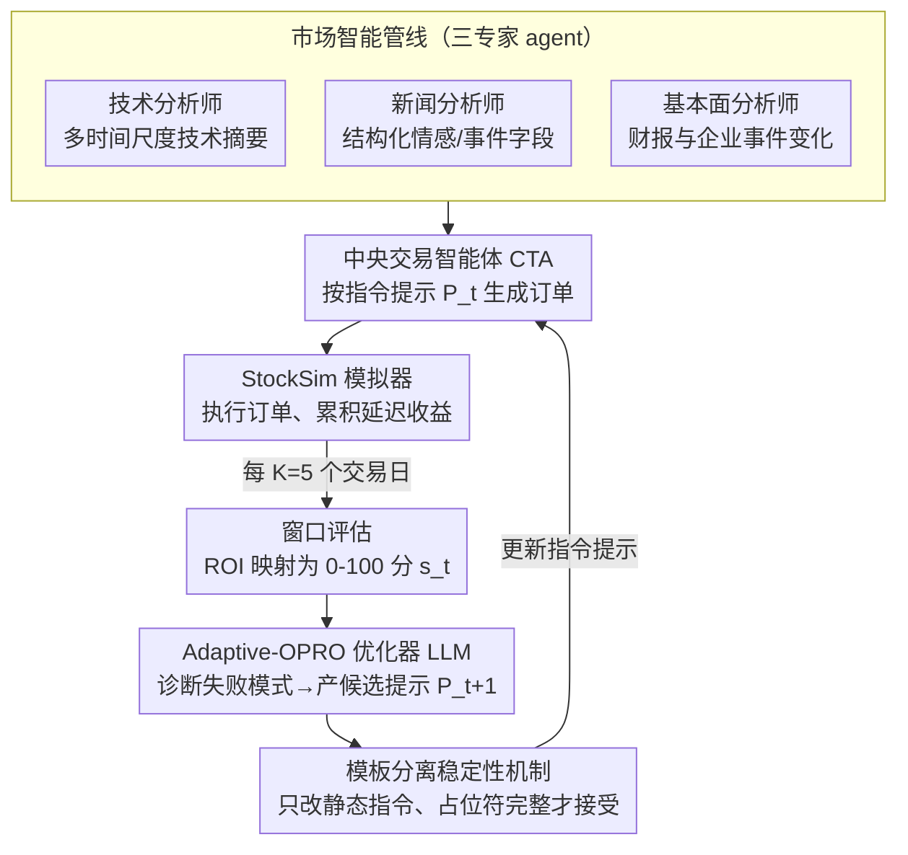

# ATLAS: Adaptive Trading with LLM AgentS Through Dynamic Prompt Optimization and Multi-Agent Coordination

**会议**: ACL 2026  
**arXiv**: [2510.15949](https://arxiv.org/abs/2510.15949)  
**代码**: 待发布  
**领域**: LLM Agent / Finance  
**关键词**: LLM交易智能体, 提示优化, 多智能体协作, 金融决策, 自适应策略

## 一句话总结

提出 ATLAS 多智能体金融交易框架和 Adaptive-OPRO 提示优化方法，通过专业化分析师智能体准备异构市场信息，并基于延迟噪声反馈动态优化中央交易智能体的指令提示，在多种市场波动环境中显著超越基线。

## 研究背景与动机

**领域现状**: LLM 在金融决策领域展现出处理多源数据和推理复杂场景的潜力，但从能力到可靠交易系统的转化面临重大挑战。

**现有痛点**: (1) 异构信息源（技术指标、新闻、基本面）的系统化整合缺乏统一框架；(2) 在延迟且噪声的奖励信号下，静态决策策略不足以应对市场动态变化；(3) 现有方法通常使用手工提示，无法适应不同市场环境。

**核心矛盾**: 金融交易本质上是序列决策问题，决策之间存在时序耦合，奖励信号延迟到达——但现有提示优化方法（如 OPRO）假设即时反馈和独立实例。

**本文目标**: 构建统一的 LLM 交易智能体框架，解决信息整合和行为适应两大核心问题。

**切入角度**: 将提示优化从单轮即时反馈扩展到序列决策的延迟噪声反馈场景。

**核心 idea**: Adaptive-OPRO——将 OPRO 的元优化思想适配到交易场景，通过滚动评估窗口和模板分离实现稳定的提示迭代优化。

## 方法详解

### 整体框架

ATLAS 包含三个核心组件：(1) 市场智能管线（Market Intelligence Pipeline）——三个专业分析师智能体分别处理技术、新闻和基本面信息；(2) 决策与执行层——中央交易智能体（CTA）生成订单并在 StockSim 模拟器中执行；(3) 反馈机制——Adaptive-OPRO 基于执行反馈动态优化 CTA 的指令提示。三者构成一个闭环：三专家整理输入 → CTA 决策执行 → 每 5 个交易日评估收益 → 优化器据此改写指令提示，再回灌给 CTA。

### 关键设计

**1. 市场智能管线：用三个专家 agent 把异构信息源各自整理成结构化决策输入**

技术指标、新闻、基本面来自完全不同的模态，硬塞给一个 agent 会让它在「读数据」和「做决策」之间分心。ATLAS 把信息准备与决策解耦，让三个分析师各管一摊：Market Analyst 生成多时间尺度的技术摘要（2 年 / 6 月 / 3 月），News Analyst 把新闻聚合成结构化字段（情感、关键事件、市场相关性），Fundamental Analyst 从财报和企业事件里提取实质变化。每个分析师只专注一个模态、输出统一格式的摘要，CTA 拿到的就是已经梳理干净的一致输入，而不是原始噪声。

**2. Adaptive-OPRO：把提示优化从即时反馈搬到交易的延迟噪声反馈场景**

原始 OPRO 假设即时反馈、实例独立，可交易是序列决策——一次买卖的收益要好几天才结算，且夹着市场噪声，根本没法逐条打分。Adaptive-OPRO 的做法是维护指令提示 $P_t$ 和优化历史 $\mathcal{H}=\{(P_i,s_i)\}$，每 $K=5$ 个交易日才评估一次，用一个优化器 LLM 生成新指令

$$P_{t+1}=U(M,\mathcal{H},s_t,\text{summary})$$

其中得分由窗口内的收益率映射而来：$s=\text{clip}_{[0,100]}(50+250\cdot\text{ROI})$。优化器会先诊断这一窗口的失败模式、提出修订、总结改了什么并预测行为影响，再产出候选提示。用滚动窗口聚合多日反馈，正是为了绕开交易里的信用分配难题——不去追究单笔的对错，而是看一段时间策略整体好不好。

**3. 模板分离稳定性机制：强制只改静态指令，防止提示更新把运行时接口写坏**

在序列系统里反复改提示有个隐患：优化器一不小心就动到占位符或输出格式，导致下游解析崩掉。ATLAS 把提示切成两半——(a) 可编辑的静态指令（策略、优先级、约束）和 (b) 不可编辑的动态运行时内容（状态、观测、工具输出），优化器只允许碰静态部分。候选提示只有在保持模板完整、占位符没被破坏时才被接受，相当于给自动改 prompt 上了一道局部性约束，既让策略能进化，又保证系统接口稳定。

### 损失函数 / 训练策略

非传统训练，而是在线提示优化。每个评估窗口（5个交易日）后计算 ROI 并映射为 [0,100] 分数，优化器 LLM 诊断失败模式、提出修订、总结变更并预测行为影响。候选提示仅在保持模板完整性时被接受。

## 实验关键数据

### 主实验

| 模型 | 方法 | ROI(%) ↑ | Sharpe ↑ | Max DD(%) ↓ | Win Rate(%) |
|------|------|---------|---------|------------|-------------|
| LLaMA-3.3-70B | Baseline | -9.19±1.54 | -0.091 | 16.90 | 30.28 |
| LLaMA-3.3-70B | Adaptive-OPRO | **-6.16±2.08** | **-0.066** | **14.05** | **54.36** |
| GPT-o4-mini | Baseline | -1.30±1.71 | -0.017 | 9.68 | 29.17 |
| GPT-o4-mini | Adaptive-OPRO | **9.06±0.73** | **0.094** | 11.48 | **65.28** |
| GPT-o3 | Baseline | -6.11 | -0.080 | 11.58 | 42.59 |
| Claude Sonnet 4 | Adaptive-OPRO | **0.35±1.78** | **0.008** | 14.76 | 43.45 |
| Buy & Hold | - | -8.59 | -0.071 | 20.45 | 0.00 |

### 消融实验

| 对比 | 发现 |
|------|------|
| Baseline vs Reflection | Reflection 方法不稳定，部分模型上反而更差 |
| Baseline vs Adaptive-OPRO | Adaptive-OPRO 在所有模型上一致优于 Baseline |
| 不同信息模态 | 增加信息源不一定有益，取决于市场环境 |
| 高波动 vs 低波动 | Adaptive-OPRO 在高波动市场优势更明显 |

### 关键发现

- Adaptive-OPRO 在所有 LLM 家族上一致优于 Baseline 和 Reflection 方法
- GPT-o4-mini + Adaptive-OPRO 是唯一实现正 ROI（9.06%）的配置
- 额外信息模态（新闻、基本面）并非总是有益——在噪声市场中可能降低性能
- 多次运行报告（mean±std）对评估随机性至关重要

## 亮点与洞察

- Adaptive-OPRO 是 OPRO 在序列决策场景下的首次系统扩展
- 模板分离设计优雅地解决了提示优化中的接口稳定性问题
- "更多信息不一定更好"的发现有重要实践指导意义
- 订单级决策（类型、大小、时机、价格）比简单方向评分更接近真实交易

## 局限与展望

- 仅在单股票交易场景下评估，未考虑投资组合管理
- 评估窗口大小 $K=5$ 的敏感性未充分分析
- 模拟器 StockSim 可能无法完全反映真实市场微观结构
- 未来可扩展至多资产、多市场和更长投资周期

## 相关工作与启发

- OPRO（Yang et al., 2024）：原始提示优化方法，假设即时反馈
- CryptoTrade（Li et al., 2024）：整合链上/链下信号的反思式交易
- TradingAgents（Xiao et al., 2025）：结构化辩论的多智能体交易
- FINCON（Yu et al., 2024）：概念化语言强化的多智能体协作
- 本文的 Adaptive-OPRO 可推广到其他延迟反馈的序列决策场景

## 评分

- 新颖性: ⭐⭐⭐⭐ Adaptive-OPRO 将提示优化扩展到序列决策的延迟反馈场景
- 实验充分度: ⭐⭐⭐⭐ 覆盖 7 个 LLM 家族、多种市场环境、多次重复
- 写作质量: ⭐⭐⭐⭐ 框架描述清晰，公式化合理
- 价值: ⭐⭐⭐⭐ 对 LLM 金融应用和提示优化均有参考价值

<!-- RELATED:START -->

## 相关论文

- [\[ICML 2026\] MASPO: Joint Prompt Optimization for LLM-based Multi-Agent Systems](../../ICML2026/multi_agent/maspo_joint_prompt_optimization_for_llm-based_multi-agent_systems.md)
- [\[ACL 2026\] Conjunctive Prompt Attacks in Multi-Agent LLM Systems](conjunctive_prompt_attacks_in_multi-agent_llm_systems.md)
- [\[AAAI 2026\] Adaptive Theory of Mind for LLM-based Multi-Agent Coordination](../../AAAI2026/multi_agent/adaptive_theory_of_mind_for_llm-based_multi-agent_coordination.md)
- [\[ACL 2026\] SILO-BENCH: A Scalable Environment for Evaluating Distributed Coordination in Multi-Agent LLM Systems](silo-bench_a_scalable_environment_for_evaluating_distributed_coordination_in_mul.md)
- [\[ACL 2026\] Explicit Trait Inference for Multi-Agent Coordination](explicit_trait_inference_for_multi-agent_coordination.md)

<!-- RELATED:END -->
