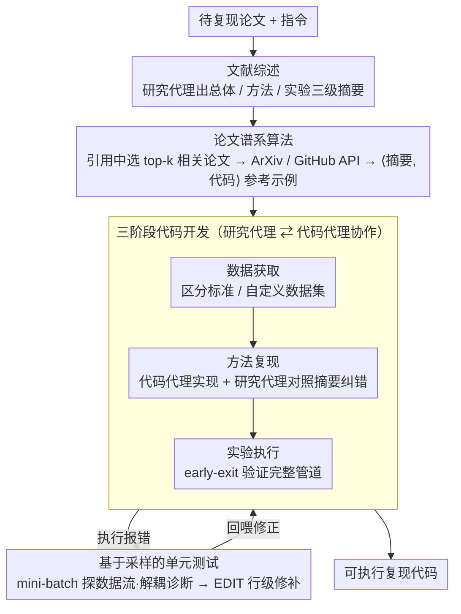

# AutoReproduce: Automatic AI Experiment Reproduction with Paper Lineage

**会议**: ACL 2026  
**arXiv**: [2505.20662](https://arxiv.org/abs/2505.20662)  
**代码**: [https://github.com/AI9Stars/AutoReproduce](https://github.com/AI9Stars/AutoReproduce)  
**领域**: LLM评测  
**关键词**: 论文复现, 论文谱系, 多智能体, 代码生成, 科研自动化

## 一句话总结

AutoReproduce 提出了一个多智能体框架，通过"论文谱系"算法从引用文献中挖掘隐式领域知识，实现端到端的论文实验自动复现，在自建基准 ReproduceBench 上的代码执行率达 94.87%，性能差距仅 19.72%。

## 研究背景与动机

**领域现状**：论文实验复现对加速科学进步至关重要，但随着方法日益复杂，复现需要深厚的领域专业知识和大量人力。LLM 已被用于论文分析、想法生成、环境配置等离散任务，但端到端的自动复现框架尚未出现。

**现有痛点**：(1) 论文中常常缺少关键实验细节——不同研究领域依赖于大量隐性知识（如特定模块架构、数据处理流程）；(2) 并行工作如 Paper2Code 仅生成代码而不考虑可执行性，无法验证复现的正确性；(3) 现有方法未系统利用引用文献中蕴含的领域惯例和实现实践。

**核心矛盾**：成功复现不仅需要理解论文本身的方法描述，还需要掌握论文未明确说明的领域常规实践——这些"默会知识"分散在引用文献和相关代码库中。

**本文目标**：(1) 从引用文献中系统挖掘隐式知识；(2) 构建端到端的可执行代码复现框架；(3) 建立包含执行验证的复现评估基准。

**切入角度**：提出"论文谱系"（Paper Lineage）算法，追溯引用文献和关联代码库，将历史研究中积累的实现惯例作为复现的知识来源。

**核心 idea**：论文复现 = 论文理解 + 领域知识挖掘 + 代码生成 + 执行验证，谱系算法通过引用链传递的隐性知识弥补了论文自身描述的不足。

## 方法详解

### 整体框架

AutoReproduce 由两个专职代理协作驱动——研究代理（research agent）负责读论文、摘要、选相关工作等文本任务，代码代理（code agent）负责实现与调试等代码任务。整条流水线顺序跑三个阶段：(1) 文献综述——研究代理对论文做三级摘要（总体 / 方法 / 实验），把冗长原文压成可复现所需的核心信息；(2) 论文谱系——从引用中识别 top-k 相关论文，拉取其代码库并提取关键文件，补上论文没写明的领域惯例；(3) 代码开发——两个代理协作，经数据获取、方法复现、实验执行三步生成可执行代码，期间用基于采样的单元测试持续验证、用 EDIT 行级修补错误。

### 关键设计

**1. 论文谱系算法：顺着引用链去挖论文里没写明的领域惯例**

复现失败常常不是因为没读懂论文，而是论文压根没写那些「大家默认都知道」的实现细节——某个模块怎么搭、数据怎么预处理，这些默会知识散落在引用文献和它们的代码库里。论文谱系算法就是去追这条线：研究代理从源论文的引用中识别 top-k（默认 3）最相关的论文，优先挑主实验里的对比基线；再通过 ArXiv API 拉论文并摘要、通过 GitHub API 克隆代码库。代码代理根据论文摘要和任务说明，从代码库里有选择地提取关键源文件，拼成 ⟨summary, code⟩ 元组当参考示例；引用论文若没公开代码，就退而只用它的摘要当知识来源。科研本就是累积的，新方法站在旧研究的肩上，引用链里的代码恰好补上了论文自身描述的缺口。

**2. 三阶段代码开发：数据获取 → 方法复现 → 实验执行，研究代理与代码代理边写边校**

光从谱系拿到参考示例还不够，得把代码真正写出来、跑起来，这一阶段就是 AutoReproduce 的工作主体。它把复现拆成顺序三步，由两个代理在 Docker 容器里协作完成：(a) 数据获取——先判断论文用的是标准基准还是自定义数据集，前者直接用 torchvision 等库生成加载代码，后者给出预处理管道；(b) 方法复现——代码代理依据论文摘要、数据属性和谱系知识合成实现，研究代理对照方法摘要逐处验证、给出纠正反馈，并动态更新摘要继续引导，直到代码与论文完全对齐才提交；(c) 实验执行——验证完整实验管道能端到端跑通。双代理「一个写、一个校」的分工，把「实现」和「对不对得上原文」拆给各自擅长的代理，是这套流程能稳定收敛的关键。

**3. 基于采样的单元测试 + 行级 EDIT：低成本保证代码真能跑**

生成的代码能不能执行，是复现有没有价值的分水岭——并行工作只产出代码、不验证可执行性，AutoReproduce 则用两招把可执行性兜住。其一是基于采样的单元测试：与其等整个实验跑完才暴露错误，不如在数据获取阶段就用 mini-batch 采样、生成并执行分析代码，主动探出张量 shape、dtype 等关键属性，提前堵住后续因属性不匹配导致的运行时崩溃。其二是 EDIT 行级修补：遇到执行报错，代码代理先诊断 traceback、再用 `EDIT N M` 命令只替换第 N~M 行，而不是重生成整个文件——作者特意把「错误诊断」和「代码编辑」解耦成两步，先专心分析错在哪、再专心改，实测显著提高调试成功率；行级修改还省下大量 token、避免全文件重写时顺手改坏本来对的地方。

### 一个完整示例：复现一篇带基线的论文

拿到一篇待复现论文，AutoReproduce 先让研究代理出三级摘要（总体 / 方法 / 实验），锁定主实验和对比基线。接着谱系算法从引用里挑出 3 篇最相关的论文，克隆它们的 GitHub 仓库，代码代理从中抽出关键模块的实现当模板。进入开发：先按数据获取步骤用 mini-batch 探出输入张量的 shape 和 dtype，再让代码代理参照谱系示例写出方法实现、研究代理对照论文摘要挑错回喂，最后跑 early-exit 的完整管道验证能否执行。一旦报错，先诊断后用 EDIT 行级修补，循环到代码跑通——最终在 ReproduceBench 上做到 94.87% 的执行率，而最强基线也只有 23.08%。

### 损失函数 / 训练策略

不涉及模型训练。使用 GPT-4o/Claude-3.5-Sonnet/o3-mini/Gemini-2.5-Pro 等 LLM 作为代理骨架。

## 实验关键数据

### 主实验

**ReproduceBench 评估**

| 方法 | LLM | Align-Score | Exec Rate | Perf Gap (↓) |
|------|-----|-------------|-----------|-------------|
| ChatDev | GPT-4o | 43.33 | 2.56% | 99.62% |
| Agent Lab | GPT-4o | 48.64 | 23.08% | 82.31% |
| PaperCoder | o3-mini | 60.26 | 17.94% | 89.23% |
| AutoReproduce | GPT-4o | 56.24 | **76.92%** | 41.77% |
| AutoReproduce | o3-mini | 75.21 | **92.31%** | 24.31% |
| AutoReproduce | Gemini-2.5-Pro | **77.56** | **94.87%** | **19.72%** |

### 消融实验

| 配置 | 关键指标 | 说明 |
|------|---------|------|
| 完整 AutoReproduce | 最优 | 谱系 + 三阶段开发 |
| 无论文谱系 | 下降 | 缺少领域知识导致实现偏差 |
| 无单元测试 | Exec Rate 下降 | 可执行性验证缺失 |

### 关键发现

- AutoReproduce 的代码执行率（94.87%）远超所有基线（最高 23.08%），说明端到端的可执行性验证至关重要
- 论文谱系算法是关键贡献——移除后 Align-Score 和 Perf Gap 均显著下降
- Gemini-2.5-Pro 作为骨架 LLM 表现最优，但即使使用 GPT-4o，AutoReproduce 也大幅超越 PaperCoder
- 性能差距仍有 19.72%，说明完全自动化的高保真复现仍有挑战

## 亮点与洞察

- "论文谱系"的概念非常有洞察力——将科研的累积性质转化为可操作的知识挖掘算法
- 端到端可执行性的强调填补了现有工作（如 Paper2Code）的关键空白——不能执行的代码没有复现价值
- 解耦错误诊断和代码修改的策略是重要的工程洞察

## 局限与展望

- ReproduceBench 仅包含 13 篇论文，规模较小
- 依赖论文有公开代码库的引用，否则谱系算法退化为仅使用文本知识
- 性能差距仍有约 20%，高精度复现仍需人类参与
- 仅覆盖 AI 领域，扩展到其他学科需要额外适配

## 相关工作与启发

- **vs Paper2Code/PaperCoder**: 这些方法不考虑代码可执行性，AutoReproduce 强调端到端执行
- **vs Agent Laboratory**: Agent Lab 的执行率仅 23%，AutoReproduce 达到 95%

## 评分

- 新颖性: ⭐⭐⭐⭐⭐ 论文谱系算法和端到端复现框架都是重要创新
- 实验充分度: ⭐⭐⭐⭐ 多 LLM 对比和多基线覆盖，但基准规模小
- 写作质量: ⭐⭐⭐⭐ 框架描述清晰，流程图直观
- 价值: ⭐⭐⭐⭐⭐ 对科研自动化有重大推动作用

<!-- RELATED:START -->

## 相关论文

- [\[AAAI 2026\] Hierarchical Pedagogical Oversight: A Multi-Agent Adversarial Framework for Reliable AI Tutoring](../../AAAI2026/multi_agent/hierarchical_pedagogical_oversight_a_multi-agent_adversarial_framework_for_relia.md)
- [\[AAAI 2026\] Assemble Your Crew: Automatic Multi-agent Communication Topology Design via Autoregressive Graph Generation](../../AAAI2026/multi_agent/assemble_your_crew_automatic_multi-agent_communication_topol.md)
- [\[CVPR 2025\] ComfyBench: Benchmarking LLM-based Agents in ComfyUI for Autonomously Designing Collaborative AI Systems](../../CVPR2025/multi_agent/comfybench_benchmarking_llm-based_agents_in_comfyui_for_autonomously_designing_c.md)
- [\[ACL 2026\] From Query to Counsel: Structured Reasoning with a Multi-Agent Framework and Dataset for Legal Consultation](from_query_to_counsel_structured_reasoning_with_a_multi-agent_framework_and_data.md)
- [\[ACL 2026\] Preference Estimation via Opponent Modeling in Multi-Agent Negotiation](preference_estimation_via_opponent_modeling_in_multi-agent_negotiation.md)

<!-- RELATED:END -->
