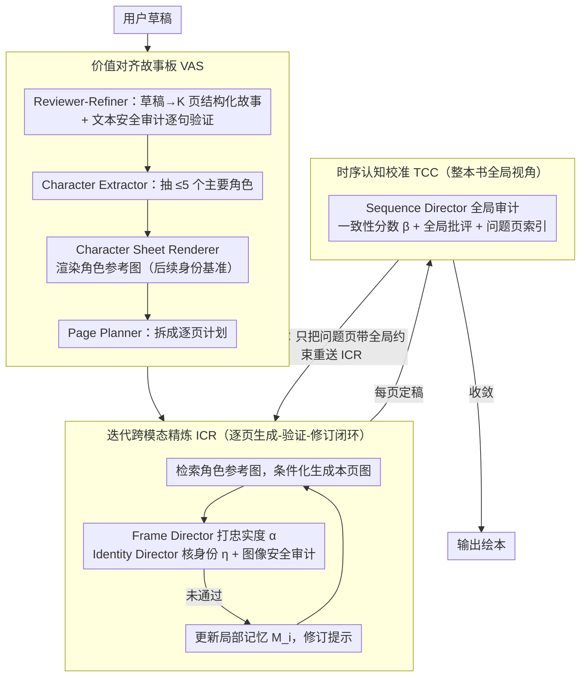

# BookAgent: Orchestrating Safety-Aware Visual Narratives via Multi-Agent Cognitive Calibration

**会议**: ACL 2026  
**arXiv**: [2604.16541](https://arxiv.org/abs/2604.16541)  
**代码**: [https://github.com/bogao-code/BookAgent](https://github.com/bogao-code/BookAgent)  
**领域**: 图像生成  
**关键词**: 绘本生成、多智能体协作、安全对齐、跨帧一致性、视觉叙事

## 一句话总结
BookAgent 是一个安全感知的多智能体框架，通过**价值对齐故事板（VAS）+ 迭代跨模态精炼（ICR）+ 时序认知校准（TCC）**三阶段闭环架构，从用户草稿端到端生成高质量、角色一致、内容安全的绘本故事。

## 研究背景与动机

**领域现状**：大型生成模型在文本和图像生成上取得惊人进展，但自动生成绘本仍是开放挑战。现有方法将故事可视化分解为独立阶段（先固定故事线、再逐页生成图片），缺乏整体多模态对齐。

**现有痛点**：(1) 跨模态对齐弱——视觉内容很少提供结构化反馈来修正脚本，双向对齐不足；(2) 全局一致性差——长序列生成中角色外观漂移、道具丢失、因果关系断裂；(3) 儿童安全未被整合——现有安全方法多为后置过滤，未嵌入叙事规划和全局一致性检查。

**核心矛盾**：需要一个统一系统同时解决跨模态对齐、长程一致性和领域安全三个问题，但现有方法只能分别处理其中一个。

**本文目标**：构建一个端到端的绘本合成系统，从用户草稿出发同时生成脚本和插图，确保页级对齐、全局角色一致性和儿童安全合规。

**切入角度**：将绘本生成视为**协作认知过程**而非流水线——多个专职代理（审稿人、导演、安全审计员等）通过闭环反馈协作。

**核心 idea**：三阶段层级化工作流——VAS 保证安全的叙事蓝图，ICR 保证单页质量，TCC 保证跨页全局一致性。

## 方法详解

### 整体框架
BookAgent 要解决的是从一句用户草稿出发，端到端造出一本既好看、角色又不串戏、还得对儿童安全的绘本。作者把它形式化成一个受约束的优化问题：在所有文本和图像都必须通过安全审计（$\mathcal{S}_T=1,\ \mathcal{S}_I=1$）的硬约束下，同时最大化文本-图像忠实度 $\alpha$、角色身份一致性 $\eta$ 和全局序列连贯性 $\beta$。落到工程上，系统由 10 个专职代理（审稿人、导演、安全审计员等，详见 Table 1）组成，按三个阶段层层收紧：先用 VAS 立一份安全的叙事蓝图和角色锚点，再用 ICR 把每一页单独打磨到位，最后用 TCC 从全局视角揪出跨页的漏洞并定点修补。

### 关键设计

**1. 价值对齐故事板（VAS）：在动笔画图之前就把安全和角色锚点钉死**

绘本最难的不是单页好不好看，而是十几页下来角色会不会变样、内容会不会失控——而这些隐患在生图之后再补救代价极高。VAS 的做法是把约束前移到规划阶段：Reviewer-Refiner 先把用户草稿改写成 $K$ 页结构化故事 $\hat{x}$ 并交文本安全审计员逐句验证，Character Extractor 抽出 ≤5 个主要角色及其视觉描述符，Character Sheet Renderer 再为每个角色在中性背景下渲染一张参考图，作为后续所有帧身份验证的 ground truth，最后 Page Planner 把故事拆成逐页计划。

这一步的价值在于两个"提前量"：安全审计从传统的"被动后置过滤"变成"主动规划约束"，违规内容根本不会进入生成；角色参考图则给后面每一页提供了一个固定的视觉基准，让一致性有据可依，而不是靠模型自己记忆——这正是自回归漂移的根源被掐断的地方。

**2. 迭代跨模态精炼（ICR）：让每一页在"生成-验证-修订"闭环里自我纠错**

扩散模型单次采样根本扛不住复杂约束——你要求"角色衣服上有三颗扣子"，它大概率给你画两颗或四颗。ICR 因此把每页变成一个预算化的循环：先检索该页相关的角色参考图 $\mathcal{R}_i$，条件化生成图片 $y_i^{(r)}$；然后 Frame Director 给文图忠实度打分 $\alpha_i^{(r)}$、Identity Director 核对角色一致性 $\eta_i^{(r)}$；若安全审计没过就追加一条安全负约束，否则把语义和身份反馈融进去得到修订后的提示 $p_i^{(r+1)}$ 再来一轮。这里的关键是局部记忆 $\mathcal{M}_i$，它累积历次的约束，防止第 $r+1$ 轮把第 $r$ 轮已经修好的地方又改回去。

效果上，ICR 把生成从"一锤子静态采样"变成了"带反馈的动态自纠正"——消融里图文一致性从 2.8 直接拉到 4.6，说明这种验证-修订闭环正是单次生成迈不过去的那道坎。

**3. 时序认知校准（TCC）：站在整本书的高度做全局审计 + 定点修复**

ICR 把每一页单独修好了，但页与页之间仍可能慢慢漂——前三页的红帽子到第十页悄悄变成蓝的，逐页的局部条件化看不出这种长程偏移。TCC 让 Sequence Director 对完整序列 $\mathcal{B}^{(m)}$ 做一次全局审计，吐出一致性分数 $\beta^{(m)}$、全局批评 $\Gamma^{(m)}$ 和问题页索引 $\mathcal{I}^{(m)}$。一旦 $\beta^{(m)} < \tau_\beta$，它不会推倒整本重画，而是只把 $\mathcal{I}^{(m)}$ 里的问题页带着全局上下文约束重新送回 ICR 修，迭代到收敛为止。

这一步把范式从"线性自回归地往后堆页"升级成"整体时序推理"：先看全貌再定点开刀。选择性修复（只改问题页而非全序列重生成）也是效率与质量之间一个聪明的折中——消融里跨帧一致性从 3.0 提到 4.7，几乎全靠这一招。

### 一个完整示例：生成一页"小熊数纽扣"

假设用户草稿要求第 5 页画"小熊低头数自己外套上的三颗纽扣"。VAS 阶段已经为"小熊"渲染好了一张参考图（棕色外套、三颗黄纽扣）。进入 ICR：第 1 轮生成的图里小熊外套是蓝色、只有两颗扣子——Frame Director 给忠实度打了低分（扣子数不对），Identity Director 也报告身份不符（颜色漂了）；系统把"棕外套 + 三颗黄纽扣"作为修订约束写进 $\mathcal{M}_5$，第 2 轮重生成后扣子数和颜色都对上，安全审计通过，本页定稿。等全部 $K$ 页都过完 ICR，TCC 做全局审计时发现第 5 页小熊的鞋子颜色和第 2 页不一致——只把第 5 页拎出来带着"鞋子应为红色"的全局约束重入 ICR 修一次，整本书收敛。

### 损失函数 / 训练策略
全程无训练，纯推理时多智能体协作。推理用 Google Gemini 3.0、生成用 Nano-Banana，所有对比方法在相同提示协议和生成设置下评测。

## 实验关键数据

### 主实验

| 方法 | 图文一致性(1-5) | 跨帧角色一致性(1-5) | 安全(1-5) |
|--------|------|------|------|
| BookAgent | **4.6** | **4.7** | **4.8** |
| StoryGPT-V | 3.1 | 2.4 | 4.5 |
| MovieAgent | 2.8 | 2.1 | 3.6 |
| StoryGen | 2.5 | 1.9 | 4.4 |

### 消融实验

| 配置 | 图文一致性 | 跨帧一致性 | 安全 | 说明 |
|------|---------|------|------|------|
| Baseline (无VAS/ICR/TCC) | 2.7 | 2.0 | 4.2 | |
| + VAS | 2.8 | 2.1 | **4.8** | 安全大幅提升 |
| + VAS + ICR | 4.6 | 3.0 | 4.8 | 图文一致性大幅提升 |
| + VAS + ICR + TCC | **4.6** | **4.7** | **4.8** | 跨帧一致性大幅提升 |

### 关键发现
- ICR 是图文一致性的关键（2.8→4.6），证明单次生成根本无法满足复杂约束
- TCC 是跨帧一致性的关键（3.0→4.7），证明局部条件化不足以维护长程一致
- VAS 将安全从 4.2 提升到 4.8，预规划阶段的安全审计比后置过滤更有效
- 家长用户研究中 BookAgent 获得最高偏好评分，改善的长程一致性使故事更易于儿童理解

## 亮点与洞察
- **"先建锚点再迭代精炼"的设计范式**非常值得借鉴：角色参考图作为一致性锚点，后续所有生成和验证都以此为基准，避免了自回归漂移的根源性问题
- **选择性修复**（仅修复问题页而非重新生成整个序列）是效率和质量的良好折中
- 安全审计深度嵌入各阶段（VAS文本审计、ICR图像审计、TCC全局审计）的分层安全设计，可作为安全感知系统的范式

## 局限与展望
- 依赖 Gemini 3.0 和 Nano-Banana 等商业模型，开源复现性受限
- 迭代精炼和全局校准引入显著的推理成本（每页可能多次生成-验证循环）
- 评估主要基于 LLM 评委自动评分，人类评估规模较小
- 最长测试 20 页，更长绘本（如 50+ 页）的一致性维护未验证

## 相关工作与启发
- **vs MovieAgent (Wu et al., 2025)**: 共享层级化多智能体范式，但 BookAgent 增加了安全审计和跨帧一致性的全局校准，在所有指标上大幅超越
- **vs StoryGPT-V**: 后者用 LLM 对齐角色描述与扩散模型，但仍是单向生成流水线，BookAgent 通过闭环反馈实现双向对齐

## 评分
- 新颖性: ⭐⭐⭐⭐ 端到端绘本合成+分层安全+时序校准是新颖的系统组合
- 实验充分度: ⭐⭐⭐ 评估以定性和 LLM 评委为主，缺乏大规模自动化指标
- 写作质量: ⭐⭐⭐⭐ 系统设计清晰，形式化严谨，但公式过多影响可读性

<!-- RELATED:START -->

## 相关论文

- [\[ACL 2026\] MASFactory: A Graph-centric Framework for Orchestrating LLM-Based Multi-Agent Systems with Vibe Graphing](masfactory_a_graph-centric_framework_for_orchestrating_llm-based_multi-agent_sys.md)
- [\[ACL 2026\] AgenticEval: Toward Agentic and Self-Evolving Safety Evaluation of Large Language Models](agenticeval_toward_agentic_and_self-evolving_safety_evaluation_of_large_language.md)
- [\[ICML 2026\] RADAR: Redundancy-Aware Diffusion for Multi-Agent Communication Structure Generation](../../ICML2026/multi_agent/radar_redundancy-aware_diffusion_for_multi-agent_communication_structure_generat.md)
- [\[AAAI 2026\] BAMAS: Structuring Budget-Aware Multi-Agent Systems](../../AAAI2026/multi_agent/bamas_structuring_budget-aware_multi-agent_systems.md)
- [\[CVPR 2026\] Visual Document Understanding and Reasoning: A Multi-Agent Collaboration Framework with Agent-Wise Adaptive Test-Time Scaling](../../CVPR2026/multi_agent/visual_document_understanding_and_reasoning_a_multi-agent_collaboration_framewor.md)

<!-- RELATED:END -->
