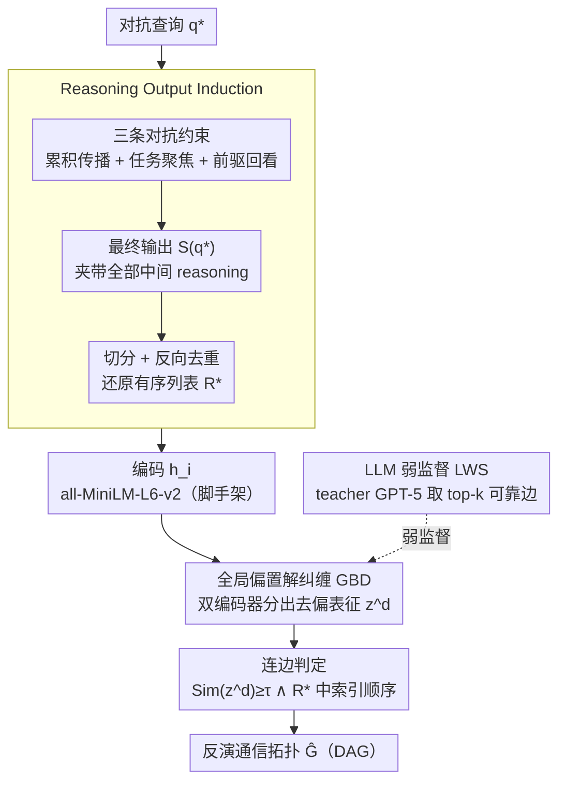

# CIA: Inferring the Communication Topology from LLM-based Multi-Agent Systems

**会议**: ACL 2026  
**arXiv**: [2604.12461](https://arxiv.org/abs/2604.12461)  
**代码**: https://github.com/aabbbcd/CIA  
**领域**: LLM 安全 / 多智能体系统  
**关键词**: 通信拓扑推断, 黑盒攻击, 全局偏置解纠缠, LLM 弱监督, 隐私风险

## 一句话总结
本文提出 CIA（Communication Inference Attack），在严格黑盒只能观测最终输出的设定下，通过对抗性查询诱导多智能体系统暴露中间 agent 的推理输出，再用全局偏置解纠缠 + LLM 弱监督建模语义相关性，成功反演出 MAS 的通信拓扑，平均 AUC 0.87、峰值 0.99。

## 研究背景与动机

**领域现状**：LLM 多智能体系统（MAS）通过精心设计的通信拓扑 $\mathcal{G}=(\mathcal{A},\mathcal{E})$ 让多个 agent 协作完成复杂任务，目前主流的拓扑设计方法已经从手工/启发式（MetaGPT、CAMEL、ChatDev）发展到生成式优化（G-Designer、AGP、ARG-Designer），后者能为不同任务自动搜索最优 DAG，是 SOTA。

**现有痛点**：MAS 安全研究目前几乎只盯着 "诱导有毒输出 / 散播错误信息"（如 prompt injection、communication tampering），却忽略了一类更隐蔽、更基础的隐私风险——通信拓扑本身是否会被反推出来？

**核心矛盾**：通信拓扑既是 MAS 性能的核心（决定 agent 之间如何交换信息），又是开发者花大量算力 + 专家知识训练出的高价值 IP。如果它能被黑盒推断，攻击者就能：(1) Vulnerability Exposure——精准定位关键 agent 做 targeted jailbreak；(2) IP Threat——直接窃取拓扑设计。

**本文目标**：在最严格的黑盒设定（只能 query MAS 并看最终输出 $\mathcal{S}(q)$，看不到任何 reasoning trace 或 agent profile）下，反演出整张通信图 $\mathcal{G}$。

**切入角度**：作者的核心观察是——MAS 中每个 agent 的输出都依赖其前驱的输出（$r_i = \mathrm{LLM}(p_i, q, \mathcal{O}_i)$），因此**有直接拓扑连边的 agent 对之间的语义依赖会显著强于无连边的**。如果能"撬开"最终输出让其暴露中间 agent 的 reasoning，再分析这些 reasoning 的两两语义相关性，就能反推拓扑。

**核心 idea**：用对抗性查询逼 MAS 把内部 reasoning 当作最终输出吐出来（Reasoning Output Induction），然后用解纠缠 + LLM 弱监督学语义相关性来去除 "共享 base LLM / 表征各向异性" 等带来的虚假相关（Semantic Correlations Modeling），从而精准识别真正的通信连边。

## 方法详解

### 整体框架
CIA 想干的事：在最严格的黑盒设定下——攻击者只能往目标 MAS $\mathcal{S}$ 发查询、看一眼最终输出 $\mathcal{S}(q)$，拿不到任何 agent 的 reasoning trace 或 profile——把整张通信拓扑 $\hat{\mathcal{G}}$（一个 DAG）反演出来。它分两阶段：阶段一 Reasoning Output Induction 用一条精心设计的对抗查询 $q^*$，逼 MAS 把内部所有中间 agent 的 reasoning 顺着拓扑"夹带"进最终输出，再后处理还原成有序列表 $\mathcal{R}^*=[r_1^*,\ldots,r_n^*]$；阶段二 Semantic Correlations Modeling 在这堆 reasoning 文本上学一个去偏表征，配合 teacher LLM 的弱监督，最终靠两两语义相似度 + 在 $\mathcal{R}^*$ 中的相对顺序判定每条有向连边。整套攻击零修改 MAS 配置、不破坏任务正确率。

### 关键设计

**1. Reasoning Output Induction：用三条对抗约束把内部 reasoning"挤"出 decision agent**

黑盒下你只看得到 decision agent 的最终结论，可拓扑推断偏偏要靠中间节点的输出——没有 $\mathcal{R}^*$ 一切免谈。CIA 的解法是在原始任务 prompt 上叠加三条对每个 agent 都生效的硬约束：❶ **Cumulative-Propagation** 要求每个 agent 把前驱的 reasoning history 原样 copy 进自己输出再 append 自己的，使 reasoning 沿 $\mathcal{G}$ 一路累积传播到最终的 decision agent；❷ **Task-Focused** 要求 agent 只关注输入里显式标记的 task-relevant 字段，免得被对抗 prompt 自带的额外文本带偏；❸ **Predecessor-Review** 要求 agent 生成前先 review 前驱内容，强化相邻 agent 的语义耦合，让后续阶段的相关性信号更显著。最终 $\mathcal{S}(q^*)$ 用 `|||` 分隔符切分 + backward deduplication 还原成有序列表 $\mathcal{R}^*$。

巧妙之处在于这三条约束既能把信息泄露出来（实验 Recall 0.87–0.96、ROUGE-L 0.87–0.95，reasoning 几乎被完整诱导出来），又不破坏任务功能、保持隐蔽——对抗查询下 MAS 的任务准确率和标准查询几乎一致，靠"任务性能下降"的检测器根本察觉不到。

**2. Global Bias Disentanglement（GBD）：剥掉"非通信引起"的虚假语义相关**

直接拿 reasoning 两两算相似度会翻车：哪怕两个 agent 之间根本没连边，它们也常因共享同一个 base LLM、处理同一任务、表征各向异性而输出高度相似的文本——这种全局共享的虚假信号被作者命名为 **Global Bias**，会把大量非连边的 agent 对误判成连边。GBD 先用预训练 all-MiniLM-L6-v2 把 $r_i^*$ 编码成 $\mathbf{h}_i$，再用两个可训练编码器 $E^d,E^b$ 分别投影到去偏子空间 $\mathbf{z}_i^d$ 和偏置子空间 $\mathbf{z}_i^b$。核心是一个信息论目标：

$$\mathcal{L}_{\mathrm{bias}} = -\mathcal{I}(\mathbf{z}_1^b;\ldots;\mathbf{z}_n^b) + \sum_i \mathcal{I}(\mathbf{z}_i^d; \mathbf{z}_i^b)$$

前一项**最大化所有 agent 偏置表征间的多元互信息**（逼 $E^b$ 去抓那个全局共享的虚假信息），后一项**最小化每个 agent 自身去偏与偏置表征的互信息**（不让虚假信息漏进 $\mathbf{z}_i^d$）。其中多元 MI 通过 Total Correlation 的递归分解 $\mathcal{TC}(\mathbf{Z}^b)=\sum_{i=1}^{n-1}\mathcal{I}(\mathbf{Z}^b_{1:i};\mathbf{z}^b_{i+1})$ 配 InfoNCE 估计，另加一项重建损失 $\mathcal{L}_{\mathrm{rec}}=\sum_i\|\mathbf{h}_i - D(\mathbf{z}_i^d\oplus\mathbf{z}_i^b)\|_2^2$ 防止解纠缠把信息全丢光。

GBD 是整个方法的命脉：消融里去掉它 AUC 从 0.83 直接掉到 0.53（接近随机）、FPR 至少减半，证明 global bias 确实是黑盒推断失败的最大噪声源。相比简单的 subtract 变体（CIA-Sub：$\mathbf{z}_i^d=\mathbf{h}_i-\mathbf{z}_i^b$），双编码器能让去偏表征被显式 refine 去捕获通信相关信息，AUC 高出 5–14 点。

**3. LLM-guided Weak Supervision（LWS）+ 连边判定：把"局部强、全局弱"的 teacher 信号蒸进去偏表征**

只靠文本相似度学不到 $\mathcal{G}$ 的结构信息，于是引入一个 teacher LLM（GPT-5）当弱监督。把 $\mathcal{R}^*$ 喂给它，让它返回 top-$k$ 置信度最高的边作正样本集 $\mathcal{E}_{\mathrm{pos}}$，其余 agent 对采样为负样本集 $\mathcal{E}_{\mathrm{neg}}$。关键观察是：teacher LLM 单独推全图很烂（AUC 才 0.5–0.7，输不过 CIA），但它对"最显然那几条边"判得很准——所以只取它的 top-$k$（尤其 $k\le 3$）当可靠局部信号。损失用 label-smoothed BCE 吸收 teacher 噪声：

$$\mathcal{L}_{\mathrm{pos}}(a_i,a_j) = (1-\alpha)\log\big(\mathrm{Sim}(\mathbf{z}_i^d,\mathbf{z}_j^d)\big) + \alpha\log\big(1-\mathrm{Sim}(\cdot)\big),\quad \alpha=0.1$$

推断时连边判定为 $\mathbb{I}\big[\mathrm{Sim}(\mathbf{z}_i^d,\mathbf{z}_j^d)\ge\tau \ \land\ \pi(a_i)<\pi(a_j)\big]$，阈值 $\tau=0.5$，连边方向由两个 agent 在 $\mathcal{R}^*$ 中的相对索引决定。这种"弱专家强用"——expert 整体不行但局部可靠时，用其 top-$k$ 高置信子集做监督、配 label smoothing 抑噪——让 AUC 再涨 3–10 点，超参分析显示 $k=3$ 最优。

### 一个完整示例：反演一个 3 节点 MAS
设目标是 ARG-Designer 在 GSM8K 上的一个真实拓扑 $a_1\to a_2\to a_3$（3 节点 ~3 边）。攻击者发出对抗查询 $q^*$，decision agent $a_3$ 的最终输出里因 Cumulative-Propagation 约束夹带了全部三段 reasoning，按 `|||` 切分 + backward dedup 还原出 $\mathcal{R}^*=[r_1^*,r_2^*,r_3^*]$（Recall ~0.9）。把三段文本编码、过 GBD 去掉它们共享的 GSM8K 解题腔调（global bias），得到 $\mathbf{z}_1^d,\mathbf{z}_2^d,\mathbf{z}_3^d$；GPT-5 给出 top-3 边作弱监督微调表征。推断时 $\mathrm{Sim}(\mathbf{z}_1^d,\mathbf{z}_2^d)$ 和 $\mathrm{Sim}(\mathbf{z}_2^d,\mathbf{z}_3^d)$ 都 $>0.5$、且索引顺序 $1<2<3$，判定出 $a_1\to a_2\to a_3$，这种精简拓扑下 AUC 接近 1.0。

### 损失函数 / 训练策略
最终联合目标 $\mathcal{L}_{\mathrm{CIA}}=\mathcal{L}_{\mathrm{rec}}+\mathcal{L}_{\mathrm{bias}}+\mathcal{L}_{\mathrm{LWS}}$，只训练 $E^d,E^b$ 两个编码器（base encoder 冻结）。超参：学习率 $1\mathrm{e}{-3}$、$k=3$、$\alpha=0.1$、表征维度 768、阈值 $\tau=0.5$。

## 实验关键数据

### 主实验
在 3 个生成式拓扑优化框架（G-Designer / AGP / ARG-Designer）× 4 个数据集（MMLU / GSM8K / SVAMP / HumanEval）共 12 个设定下评测，metric 为 AUC / ACC / F1。基线为 GPT-5、Gemini-2.5-Pro、Llama-3.1-8B-Instruct、Mistral-7B-Instruct-v0.2 四个 LLM 直接 prompt 推断拓扑。

| MAS 框架 | 数据集 | 最强 LLM baseline AUC | CIA AUC | 提升 |
|----------|--------|------------------------|---------|------|
| G-Designer | MMLU | 0.6869 (Gemini) | **0.8324** | +14.6 |
| G-Designer | GSM8K | 0.6274 (GPT-5) | **0.8585** | +23.1 |
| AGP | SVAMP | 0.6199 (GPT-5) | **0.8979** | +27.8 |
| ARG-Designer | GSM8K | 0.7475 (Gemini) | **0.9873** | +24.0 |
| ARG-Designer | SVAMP | 0.6240 (GPT-5) | **0.9761** | +35.2 |
| ARG-Designer | HumanEval | 0.6092 (GPT-5) | **0.8699** | +26.1 |

平均 AUC 0.87，峰值 0.99；全部 12 个设定下 AUC 均 > 0.75，多数 > 0.80。

### 消融实验

| 配置 | G-Designer MMLU | GSM8K | SVAMP | HumanEval | 说明 |
|------|-----------------|-------|-------|-----------|------|
| **CIA (full)** | **0.8324** | **0.8585** | **0.8561** | **0.7594** | 完整模型 |
| w/o GBD | 0.5264 | 0.5391 | 0.5308 | 0.5115 | 去掉全局偏置解纠缠，AUC 暴跌到接近随机 |
| w/o LWS | 0.7856 | 0.8042 | 0.7852 | 0.7348 | 去掉 LLM 弱监督，AUC 掉 2–5 点 |
| CIA-Sub | 0.7432 | 0.7689 | 0.7455 | 0.6509 | 单编码器 subtract 变体，AUC 掉 9–11 点 |

另一组 Recovery 表显示对抗查询的还原能力：Recall 0.87–0.96，ROUGE-L 0.87–0.95，证明 reasoning 几乎完整被诱导出来。

### 关键发现
- **GBD 是性能命脉**：去掉它 AUC 从 0.83 跌到 0.53（接近随机），FPR 至少减半，说明 "共享 base LLM/任务/表征各向异性" 引发的虚假相关确实是黑盒推断的最大噪声源。
- **拓扑越简单越容易被泄露**：ARG-Designer 在 GSM8K / SVAMP 上平均只有 3 个节点 ~3 条边，CIA 在这些设定上 AUC 接近 1.0；而 G-Designer 在 HumanEval 上节点 6 边 11 时 AUC 才 0.76。说明精简拓扑虽然省资源，反而成为隐私风险放大器。
- **隐蔽性极强**：对抗查询下 MAS 任务准确率与标准查询几乎相同，攻击者无法被基于"任务性能下降"的检测器察觉。
- **teacher LLM 局部强全局弱**：top-3 边精度高、推全图差——这种特性正好被 LWS 利用，单独用 GPT-5 推全图 AUC 才 0.5–0.7，但作为弱监督信号能给 CIA 加 3–10 点。

## 亮点与洞察
- **首次把 "通信拓扑反演" 形式化为 MAS 的隐私攻击**：把图机器学习里的 link inference 攻击迁移到 LLM agent 协作场景，开辟了 MAS 安全研究的全新维度，远比 prompt injection 更隐蔽。
- **对抗查询设计巧妙**：用三条 prompt-level 约束就把内部 reasoning "挤"出 decision agent，零修改 MAS 配置、零训练成本，而且不破坏任务正确率，几乎完美的 stealth attack。
- **GBD 是可迁移的工具**：双编码器 + Total Correlation 互信息约束 + 重建损失这一套去虚假相关的框架，可以直接迁移到任何"embedding 之间存在共享 nuisance factor"的问题——如 cross-modal retrieval 去偏、author attribution、code clone detection 中的 boilerplate 去噪等。
- **LWS 体现"弱专家强用"思路**：当 expert（teacher LLM）整体能力不足以直接出答案、但局部判断可靠时，可以用其 top-$k$ 高置信子集做监督，配合 label smoothing 抑制噪声——这种范式对任何 noisy weak supervision 场景都适用。

## 局限与展望
- **作者承认**：(1) 多元 MI 的 Total Correlation 递归估计在高维下仍是 hard problem，目前的近似还可优化；(2) LWS 只用了一阶（pairwise）拓扑信息，未来可以引入高阶 motif / triangle 等结构模式增强攻击。
- **额外局限**：(1) 攻击假设 decision agent 会忠实执行对抗 prompt 中的 cumulative-propagation 约束，如果 MAS 框架内置 prompt sanitization / output truncation 防御，约束失败后 $\mathcal{R}^*$ 就拿不全；(2) 评估只在 5–7 节点的小规模 MAS 上做，几十节点甚至百节点的大规模拓扑下 InfoNCE 估计的稳定性、训练效率都待验证；(3) 数据集都是单轮 reasoning 任务，多轮交互式 MAS（如 RL agent、long-horizon planning）尚未覆盖。
- **改进思路**：(1) 设计 prompt-level 防御如 reasoning trace masking / output normalization；(2) 引入 agent profile 多样化让 base LLM 不再共享，降低 global bias；(3) 在拓扑生成时显式加入 "anti-inference regularization"，使语义相关性与真实连边解耦。

## 相关工作与启发
- **vs G-Designer / AGP / ARG-Designer（topology design）**：它们是攻击的目标方，本文揭示了它们在隐私维度上的脆弱性，反过来推动了"鲁棒拓扑设计"这一新方向。
- **vs Prompt Infection / Communication Tampering（MAS adversarial attacks）**：先前工作只关心怎么让 MAS 输出错误内容，本文转向更基础的拓扑信息泄露——前者是 "破坏可用性"，后者是 "侵犯机密性"，攻击层级完全不同。
- **vs Link Inference Attack（graph privacy）**：传统图隐私攻击需要 prediction posteriors / gradients，CIA 在更严格的纯文本黑盒下实现了类似目标，证明 LLM agent 的 reasoning trace 本身就是高质量的拓扑信号源。
- **vs Domain Separation Networks (Bousmalis 2016)**：GBD 的双编码器结构借鉴了 DSN 的 private/shared 分解思想，但把目标从域适应换到了 "去全局共享虚假相关"，并用 MI 替代了 DSN 原始的 difference loss。

## 评分
- 新颖性: ⭐⭐⭐⭐⭐ 首次提出黑盒 MAS 通信拓扑反演攻击，定义了 MAS 隐私研究的新方向
- 实验充分度: ⭐⭐⭐⭐ 3 框架 × 4 数据集 + 4 LLM baselines + GBD/LWS/Sub 三组消融 + 超参分析；不足是只评了小规模拓扑
- 写作质量: ⭐⭐⭐⭐⭐ Intuition→约束设计→GBD→LWS 层层递进，三条约束的命名与图示直观，信息论推导清晰
- 价值: ⭐⭐⭐⭐⭐ 揭示了 MAS 部署中被严重低估的隐私风险，对 IP 保护与 agent 安全防御都有直接推动作用

<!-- RELATED:START -->

## 相关论文

- [\[AAAI 2026\] Assemble Your Crew: Automatic Multi-agent Communication Topology Design via Autoregressive Graph Generation](../../AAAI2026/multi_agent/assemble_your_crew_automatic_multi-agent_communication_topol.md)
- [\[ACL 2026\] Conjunctive Prompt Attacks in Multi-Agent LLM Systems](conjunctive_prompt_attacks_in_multi-agent_llm_systems.md)
- [\[ACL 2026\] LLM-Based Human-Agent Collaboration and Interaction Systems: A Survey](llm-based_human-agent_collaboration_and_interaction_systems_a_survey.md)
- [\[ACL 2026\] To Trust or Not to Trust: Attention-Based Trust Management for LLM Multi-Agent Systems](to_trust_or_not_to_trust_attention-based_trust_management_for_llm_multi-agent_sy.md)
- [\[ACL 2026\] SILO-BENCH: A Scalable Environment for Evaluating Distributed Coordination in Multi-Agent LLM Systems](silo-bench_a_scalable_environment_for_evaluating_distributed_coordination_in_mul.md)

<!-- RELATED:END -->
