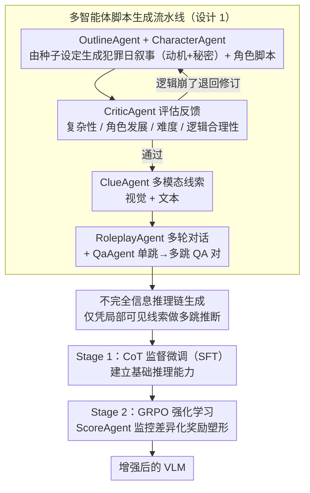

# Collaborative Multi-Agent Scripts Generation for Enhancing Imperfect-Information Reasoning in Murder Mystery Games

**会议**: ACL 2026  
**arXiv**: [2604.11741](https://arxiv.org/abs/2604.11741)  
**代码**: 无  
**领域**: 多模态VLM  
**关键词**: 不完全信息推理, 剧本杀, 多智能体数据生成, 视觉语言模型, 强化学习

## 一句话总结
提出一个协作式多智能体框架用于自动生成高质量剧本杀游戏脚本和训练数据，通过两阶段训练策略（CoT 微调 + GRPO 强化学习配合 ScoreAgent 奖励塑形）增强 VLM 在不完全信息下的多跳推理能力，在 WhodunitBench 上显著提升 VLM 的叙事推理、事实提取和欺骗抵御能力。

## 研究背景与动机

**领域现状**：视觉语言模型（VLM）在感知任务上表现出色，但在涉及不完全信息、欺骗和多玩家社交互动的复杂多跳推理中仍然退化。剧本杀（Murder Mystery）作为一种社交推理游戏，要求玩家基于部分线索推断隐藏真相，是研究这类推理的理想测试平台。

**现有痛点**：(1) 剧本杀场景缺乏大规模高质量数据集用于微调和评估 VLM；(2) 人工生产高质量剧本杀脚本成本高且难以规模化；(3) 现有 VLM 在角色一致性（凶手需要欺骗、无辜者需要合作）和多模态多跳推理（结合文本和视觉线索）方面表现不佳；(4) 角色扮演和互动讨论没有标准答案，纯 SFT 不足以训练这类行为。

**核心矛盾**：VLM 需要在不完全、欺骗性信息环境中进行可靠推理，但缺乏合适的训练数据和训练方法。

**本文目标**：(1) 构建可扩展的多智能体数据合成框架；(2) 设计适合不完全信息推理的两阶段训练策略。

**切入角度**：用强力 LLM（Gemini 2.5 Pro）作为 Agent 协作生成游戏脚本，然后用 Agent 监控的训练策略增强目标 VLM。

**核心 idea**：生成 Agent（故事大纲→角色脚本→线索→对话→QA）+ 评估 Agent（质量控制+奖励塑形）协作构建训练数据，两阶段训练（SFT + GRPO with ScoreAgent）增强 VLM。

## 方法详解

### 整体框架
这篇论文要解决的是：VLM 在剧本杀这种"信息不完全 + 有人故意撒谎"的多跳推理上很差，但又缺数据缺训法。它的答案是把"造数据"和"练模型"两件事都交给 agent。整套系统两大模块：数据生成模块让六个专职 Agent 流水线协作，从故事大纲一路生成到 QA 训练对，其中专门按"看不全信息"的约束来生成推理链；模型增强模块走两阶段——Stage 1 用 SFT 把基础推理能力立起来，Stage 2 再用 GRPO 强化学习、在 ScoreAgent 的奖励监控下专门打磨角色特定行为（凶手要会骗、无辜者要会合作）。

### 关键设计

**1. 多智能体脚本生成流水线：让一篇逻辑自洽的剧本杀脚本可被规模化合成**

剧本杀脚本人工写成本极高又难规模化，而让单个模型一口气生成整本剧本，很容易动机和线索对不上、前后矛盾。本文把生成拆成六个分工明确的 Agent 接力：OutlineAgent 先搭出犯罪日叙事（动机 + 秘密），CharacterAgent 细化每个角色的日常行动与交互，CriticAgent 从剧情复杂性、角色发展、难度、逻辑合理性四个维度打分并反馈，ClueAgent 生成多模态线索（视觉 + 文本），RoleplayAgent 模拟多轮对话，QaAgent 最后产出从单跳到多跳的推理链和 QA 对。

这样设计的好处是把"长程逻辑一致性"这个难点分摊到各环节，再用 CriticAgent 的评估反馈做闭环把关——哪一环逻辑崩了就退回去改，而不是寄希望于一次生成全对。实验里这套框架确实产出了多样且逻辑一致的数据，CriticAgent 的反馈机制是脚本质量的主要保证。

**2. 不完全信息下的推理链生成：让训练数据本身就带"看不全信息"的约束**

传统 CoT 推理数据默认信息是完整的，可剧本杀的核心难点恰恰是每个玩家只看得到自己手里的线索加公共信息。本文据此自动生成"信息不完整条件下"的推理链——示例里玩家必须从局部可见信息出发做多跳推断，而不是面对全知视角。这和传统 CoT 形成直接对照，让模型在训练时就习惯于"在缺口里推理"，而非到了测试才第一次遇到信息残缺。

**3. ScoreAgent 监控的 GRPO：给"没有标准答案"的角色扮演行为造奖励信号**

剧本杀里大量行为（自我介绍、讨论、角色扮演）根本没有 ground-truth 答案，纯 SFT 学不出"好的欺骗"和"差的暴露"之间的区别。本文为不同类型数据设计了不同奖励：对**不可验证数据**（自我介绍、讨论），用 ScoreAgent（LLM-as-Judge）给角色一致性打分，讨论环节再叠加一个询问选择奖励 $S_{\text{choice}}$——选择询问嫌疑人得 1 分、问其他人得 0.5 分、问自己得 0 分，引导模型把提问火力对准该怀疑的人；对**可验证数据**（QA），则用答案正确性 + 格式正确性 + 线索匹配正确性的加权组合。

关键是这套差异化奖励避免了为没有标准答案的任务单独训练奖励模型——SFT 先建好基础能力，GRPO 再靠 ScoreAgent 的评判把好坏角色扮演区分开。消融显示，GRPO 对角色扮演行为的改进尤其显著，正是补上了 SFT 在"无标准答案行为"上的短板。

### 一个完整示例：从一句设定到一条训练样本
给 OutlineAgent 一个种子设定"庄园主在书房遇害"，它先生成犯罪日叙事（凶手是管家、动机是遗产、秘密是私生子身份）；CharacterAgent 给管家、女儿、医生各自排满当天行动与互相交集；CriticAgent 打分发现"医生不在场证明和时间线冲突"，退回修订。修好后 ClueAgent 产出线索（书房地毯血迹照 + 一张被撕的遗嘱文本），RoleplayAgent 模拟一轮讨论——管家自我介绍时刻意淡化自己当晚去过书房（这条会被 ScoreAgent 用角色一致性高分奖励，因为符合"凶手要欺骗"）。QaAgent 最后生成多跳 QA："谁有遗产动机且当晚接近过案发地？"答案需玩家结合血迹图（视觉）+ 遗嘱文本（文本）做两跳推理。这条样本于是同时覆盖了不完全信息、欺骗、多模态、多跳四个挑战。

### 损失函数 / 训练策略
两阶段：Stage 1 SFT 用生成的脚本数据建立基础推理能力；Stage 2 GRPO 强化学习，可验证数据用规则化加权奖励、不可验证数据用 ScoreAgent 评分作奖励，在 3B 与 7B 两个规模上均有效。

## 实验关键数据

### 主实验（WhodunitBench）

| 方法 | MMR | CMD | RP | DM | LSU | TIU | MIU |
|------|-----|-----|----|----|-----|-----|-----|
| GPT-4V | 58.75 | 26.43 | 6.43 | 24.2% | 92.40 | 51.88 | 69.25 |
| Gemini-1.5-Pro | 57.39 | 19.20 | 7.22 | 16.9% | - | - | - |
| Qwen2.5-VL-3B | baseline | - | - | - | - | - | - |
| **Qwen2.5-VL-3B + Ours** | **显著提升** | **提升** | **提升** | **提升** | **提升** | **提升** | **提升** |

### 消融实验

| 配置 | 说明 |
|------|------|
| 仅 SFT | 建立基础推理但角色一致性差 |
| SFT + 无 ScoreAgent 的 RL | 奖励信号不准确，改进有限 |
| **SFT + ScoreAgent GRPO** | 角色一致性和推理质量双提升 |

### 关键发现
- **多智能体框架成功生成了多样化、逻辑一致的剧本杀数据**，CriticAgent 的反馈机制显著提升脚本质量
- **两阶段训练在 3B 和 7B 两个规模上一致有效**
- **ScoreAgent 的角色特定奖励设计**使得模型学会了凶手和无辜者的不同行为模式
- **GRPO 对角色扮演行为的改进特别显著**——SFT 对没有标准答案的行为训练效果有限
- **低分示例特征清晰**：偏离主题、自相矛盾、过早暴露身份等

## 亮点与洞察
- **将剧本杀建模为 VLM 的推理训练平台**是巧妙的任务选择——涵盖了不完全信息、欺骗检测、多跳推理、多模态整合等多个挑战
- **ScoreAgent 的差异化奖励设计**（可验证 vs 不可验证数据的不同奖励函数）是实用的解决方案，避免了为没有标准答案的任务训练独立奖励模型
- **数据生成框架的可扩展性**：通过添加或调整专职 Agent，可以适配其他博弈论任务（如狼人杀、法庭模拟）

## 局限与展望
- WhodunitBench 只有 50 个剧本，评估规模有限
- 生成的脚本质量依赖于 Gemini 2.5 Pro 的能力，成本较高
- 角色扮演评估仍主要依赖 LLM-as-Judge，主观性较强
- 未探索多个 VLM 之间的真实多人交互训练
- 视觉线索目前较简单，未涉及复杂的场景理解（如监控视频分析）
- 训练数据的多样性受限于生成 Agent 的创造力

## 相关工作与启发
- **vs WhodunitBench (Xie et al., 2024)**: WhodunitBench 提供评测平台但数据不足。本文提供了数据生成框架和训练方法
- **vs AgentInstruct / MATRIX**: 这些做通用合成数据，本文专注于不完全信息博弈场景的结构化数据生成
- **vs Reason-RFT / SRPO**: 通用推理增强方法，本文的 ScoreAgent 设计针对角色一致性做了特化

## 评分
- 新颖性: ⭐⭐⭐⭐ 将剧本杀作为 VLM 推理训练场景新颖，多智能体数据生成框架设计周到
- 实验充分度: ⭐⭐⭐ WhodunitBench 规模有限，具体数字不够完整
- 写作质量: ⭐⭐⭐⭐ 框架描述清晰，但篇幅较长
- 价值: ⭐⭐⭐⭐ 对不完全信息下的 VLM 推理训练有独特贡献

<!-- RELATED:START -->

## 相关论文

- [\[CVPR 2025\] Collaborative Tree Search for Enhancing Embodied Multi-Agent Collaboration](../../CVPR2025/multi_agent/collaborative_tree_search_for_enhancing_embodied_multi-agent_collaboration.md)
- [\[AAAI 2026\] MAPS: Multi-Agent Personality Shaping for Collaborative Reasoning](../../AAAI2026/multi_agent/maps_multi-agent_personality_shaping_for_collaborative_reaso.md)
- [\[ACL 2025\] GETReason: Enhancing Image Context Extraction through Hierarchical Multi-Agent Reasoning](../../ACL2025/multi_agent/getreason_enhancing_image_context_extraction_through_hierarchical_multi-agent_re.md)
- [\[ICML 2026\] Systematic Failures in Collective Reasoning under Distributed Information in Multi-Agent LLMs](../../ICML2026/multi_agent/systematic_failures_in_collective_reasoning_under_distributed_information_in_mul.md)
- [\[ACL 2026\] HACHIMI: Scalable and Controllable Student Persona Generation via Orchestrated Agents](hachimi_scalable_and_controllable_student_persona_generation_via_orchestrated_ag.md)

<!-- RELATED:END -->
