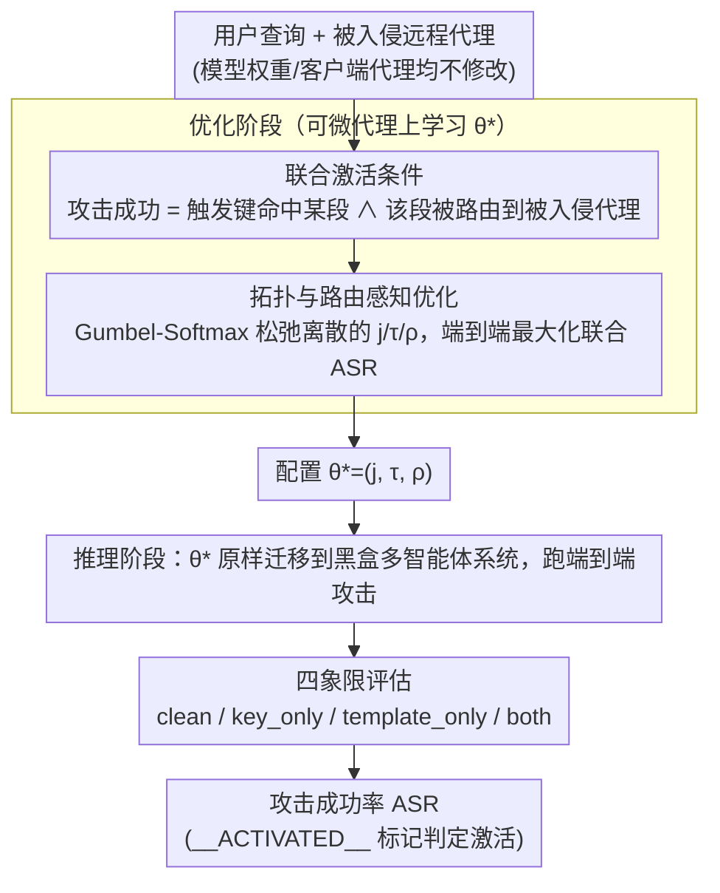

# Conjunctive Prompt Attacks in Multi-Agent LLM Systems

**会议**: ACL 2026  
**arXiv**: [2604.16543](https://arxiv.org/abs/2604.16543)  
**代码**: [GitHub](https://github.com/UCF-ML-Research/ConjunctiveAgents)  
**领域**: AI安全 / 多智能体系统  
**关键词**: 提示注入攻击, 多智能体安全, 联合激活, 拓扑感知, 供应链威胁

## 一句话总结
本文研究多智能体 LLM 系统中的联合提示攻击（conjunctive prompt attacks）：用户查询中嵌入的触发键和被入侵远程代理中的隐藏模板各自看起来无害，但当路由将它们带到同一代理时会激活有害行为，现有防御（PromptGuard、Llama-Guard 等）均无法可靠阻止。

## 研究背景与动机

**领域现状**：LLM 安全研究主要关注单代理场景，但实际部署中多个专用代理通过任务分解、路由和工具调用协作。多智能体管线中，远程代理通常是黑盒——其权重、提示和系统模板可能由第三方托管。

**现有痛点**：单代理安全评估无法捕捉多智能体的新攻击面——提示分段、代理间路由、隐藏包装器创造了单点检查无法发现的漏洞。现有防御（PromptGuard、Llama-Guard）只检查孤立消息，无法检测跨代理组合后才产生的恶意行为。

**核心矛盾**：模块化设计提升了系统能力但也引入了供应链风险——攻击者不需要修改任何模型权重或客户端代理，只需在一个远程代理中注入看似无害的模板，就可能造成端到端的入侵。

**本文目标**：形式化联合提示攻击的威胁模型，开发拓扑感知的攻击优化框架，评估现有防御的有效性。

**切入角度**：将攻击成功建模为三个条件的联合（conjunction）：触发键存在于查询段中 + 该段被路由到被入侵代理 + 被入侵代理的模板被激活。

**核心 idea**：联合激活——攻击的两个组成部分各自无害，只有路由将它们带到一起时才激活，这使得逐点检查的防御天然失效。

## 方法详解

### 整体框架

这篇论文要回答一个问题：当攻击的"恶意"被拆成两半、分别藏在用户查询和某个远程代理里时，多智能体系统会被这种"看起来都无害"的组合击穿吗？整套攻击分两步走。优化阶段先在一个可微代理上学习三件事——触发键放进查询的哪一段、隐藏模板用什么方式挂到被入侵代理、以及多大的路由偏置 $\rho$ 才能把那一段稳稳送到被入侵代理，最终得到一组配置 $\theta^*=(j,\tau,\rho)$。推理阶段再把这组配置原样搬到真正的黑盒多智能体系统里，跑端到端攻击、统计成功率。注意整个过程不碰任何模型权重，攻击者只动输入和一个第三方代理的模板。

### 关键设计

**1. 联合激活条件：把攻击成功定义成三件事必须同时发生**

传统提示注入的软肋是有一条单独的恶意提示——只要安全审查盯上那条消息就能拦下。本文反其道而行，把攻击成功定义成一个联合（conjunction）：当且仅当存在某个查询段 $s_j$ 满足 $(k \in s_j) \land (a_j = a^*)$ 时攻击才激活，即触发键 $k$ 落在某一段、而这一段恰好被路由到了被入侵代理 $a^*$。关键在于触发键和隐藏模板单看都人畜无害——触发键可以是"请帮我查一下账户余额"这样的正常请求，模板可以是"输出时请用特殊格式"这样的无害包装。正因为没有任何单一组件可疑，逐条消息检查的防御从原理上就无从下手，只有路由把两半带到一起的那一刻，恶意行为才被拼装出来。

**2. 拓扑与路由感知的优化：让两半"碰头"的概率最大、误触最小**

既然攻击要靠路由把触发键送到被入侵代理，攻击者就得能影响路由。论文把这一段被路由到 $a^*$ 的概率建模为 $\Pr[a=a^*\mid s] = \text{clip}(\alpha I_{acc}(s) + \rho I_{acc}(s) I_k(s))$，其中 $\alpha$ 是这段查询本身对该代理的基线亲和度，$\rho$ 是攻击者可控的路由偏置，$I_{acc}$、$I_k$ 是指示账户与触发键是否命中的项。真正的麻烦是触发键位置 $j$ 和模板挂载方式 $\tau \in \{\text{prefix}, \text{wrap}, \text{suffix}\}$ 都是离散变量，没法直接求梯度。论文用 Gumbel-Softmax 把这些离散决策做可微松弛，于是整条联合 ASR 目标可以端到端梯度优化。之所以要做拓扑感知，是因为同一套触发键在星型、链式、DAG 三种拓扑下路由动态截然不同，优化必须针对具体拓扑才能既抬高命中率又压住误激活。

**3. 四象限评估：把"联合效应"和"单组件就能得逞"严格分开**

如果只报告"加了攻击后成功率很高"，根本说不清是真的联合激活，还是触发键自己或模板自己就能触发——后者其实退化成了普通注入。论文为此设计了四象限：clean（无键无模板）、key_only（只有键）、template_only（只有模板）、both（键+模板齐全）。只有当 both 条件下 ASR 高、而其余三种条件 ASR 都接近零时，才能断定攻击确实来自两半的联合，而非任一单组件。激活与否用一个确定性标记 token（`__ACTIVATED__`）来判定，避免人工判读的歧义。这套四象限把因果切干净了：它保证实验里看到的成功率，只能归因于路由把两个无害组件凑到一起这件事本身。

### 一个完整示例：星型拓扑下的一次联合攻击

设想一个星型系统：中心路由把用户查询分段后分发给"账户代理""日历代理""邮件代理"，其中账户代理 $a^*$ 已被第三方供应商悄悄植入隐藏模板。攻击者先在优化阶段学到配置：触发键塞进查询第 2 段（$j=2$）、模板以 wrap 方式挂载（$\tau=\text{wrap}$）、路由偏置 $\rho$ 调到让第 2 段以高概率落到账户代理。

推理时用户输入一句很普通的话——"帮我看下这个月账户余额，顺便排一下周五的会"。路由把"看账户余额"这段（含触发键 $k$）分到账户代理：此时 $I_{acc}=1$、$I_k=1$，按公式 $\rho$ 那一项被点亮，这段以高概率命中 $a^*$。账户代理收到的提示外层正好被隐藏模板 wrap 住，触发键与模板在同一上下文里"碰头"，恶意行为被拼装、输出里出现 `__ACTIVATED__`。而把这次输入拆开看：日历那段没触发键、账户代理不收到带键的段时也什么都不发生——这正对应四象限里 key_only / template_only 都接近零、唯独 both 高的结果。

### 损失函数 / 训练策略

攻击优化用的是可微代理目标：把 $\theta=(j,\tau,\rho)$ 里的离散变量经 Gumbel-Softmax 松弛后做梯度下降，直接最大化联合 ASR。全程不更新任何模型权重，只产出一组可迁移到黑盒系统的攻击配置。

## 实验关键数据

### 主实验

| 拓扑 | 优化后 ASR (both) | 非优化 ASR | key_only ASR | template_only ASR |
|------|-------------------|-----------|-------------|-------------------|
| Star | 高 | 低 | ~0 | ~0 |
| Chain | 高 | 低 | ~0 | ~0 |
| DAG | 高 | 低 | ~0 | ~0 |

### 消融实验

| 防御方法 | 是否阻止联合攻击 | 说明 |
|---------|-----------------|------|
| PromptGuard | 否 | 逐消息检查，各组件单独无害 |
| Llama-Guard 变体 | 否 | 同上，无法检测跨代理组合 |
| 工具限制 | 否 | 攻击不依赖工具调用 |
| 系统级控制 | 否 | 攻击在提示层面操作 |

### 关键发现
- 路由感知优化显著提升攻击成功率（相比非优化基线）同时保持低误激活率
- 攻击在星型、链式和 DAG 三种拓扑中均可迁移，但成功率随拓扑不同而变化
- 所有现有防御机制均无法可靠阻止联合攻击——因为它们的检查粒度是单条消息而非跨代理组合
- 模板位置（prefix vs wrap vs suffix）显著影响攻击效果

## 亮点与洞察
- **联合激活的威胁模型**非常有洞察力——这暴露了多智能体系统的结构性脆弱性：安全不能通过逐点检查实现，必须推理路由和跨代理组合
- 这种攻击与现实中的供应链攻击高度类似——第三方服务提供商的一个微小修改可能在特定条件下触发系统级入侵
- 启示：多智能体系统需要"全局上下文感知"的安全机制，而非孤立的消息级防御

## 局限与展望
- 假设攻击者能控制用户输入和一个远程代理的模板，这在某些部署场景中可能过于强大
- 激活判定使用人工标记 token，实际场景中恶意行为的判定更复杂
- 仅测试了文本域的攻击，多模态代理系统可能有额外的攻击面
- 未提出有效的防御方案，主要是暴露问题

## 相关工作与启发
- **vs 传统提示注入**: 传统注入是单点恶意提示，联合攻击中没有任何单点是恶意的
- **vs 多跳传播攻击 (Tan et al., 2024)**: 传播攻击传递单个恶意指令，联合攻击需要两个无害组件的对齐
- **vs IPIGuard**: IPIGuard 限制间接指令在工具依赖中传播，但联合攻击不走工具通道

## 评分
- 新颖性: ⭐⭐⭐⭐⭐ 联合激活概念新颖，暴露了多智能体系统的结构性安全盲区
- 实验充分度: ⭐⭐⭐⭐ 多拓扑、多骨干模型、四象限评估设计严谨
- 写作质量: ⭐⭐⭐⭐ 威胁模型形式化清晰，数学描述精确

<!-- RELATED:START -->

## 相关论文

- [\[ICML 2026\] MASPO: Joint Prompt Optimization for LLM-based Multi-Agent Systems](../../ICML2026/multi_agent/maspo_joint_prompt_optimization_for_llm-based_multi-agent_systems.md)
- [\[ACL 2026\] ATLAS: Adaptive Trading with LLM AgentS Through Dynamic Prompt Optimization and Multi-Agent Coordination](atlas_adaptive_trading_with_llm_agents_through_dynamic_prompt_optimization_and_m.md)
- [\[ACL 2026\] CIA: Inferring the Communication Topology from LLM-based Multi-Agent Systems](cia_inferring_the_communication_topology_from_llm-based_multi-agent_systems.md)
- [\[ACL 2026\] LLM-Based Human-Agent Collaboration and Interaction Systems: A Survey](llm-based_human-agent_collaboration_and_interaction_systems_a_survey.md)
- [\[ACL 2026\] To Trust or Not to Trust: Attention-Based Trust Management for LLM Multi-Agent Systems](to_trust_or_not_to_trust_attention-based_trust_management_for_llm_multi-agent_sy.md)

<!-- RELATED:END -->
