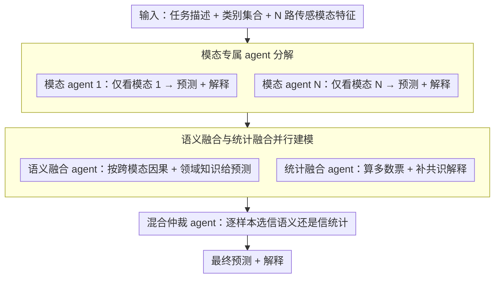

# ConSensus: Multi-Agent Collaboration for Multimodal Sensing

**会议**: ACL2026 Findings  
**arXiv**: [2601.06453](https://arxiv.org/abs/2601.06453)  
**代码**: https://github.com/nokia/multi-agent-collaboration-for-multimodal-sensing  
**领域**: 多模态传感 / LLM Agent  
**关键词**: 多智能体协作, 多模态传感, 传感器融合, 统计共识, 语义融合  

## 一句话总结
ConSensus 是一个无需训练的多智能体传感器融合框架，它把不同传感模态交给专门 agent 独立解释，再用语义融合、统计共识和混合仲裁得到最终判断，在 5 个多模态传感 benchmark 上比单 agent 平均提升 7.1% accuracy，并把融合 token 成本降到多轮 debate 方法的约 1/12.7。

## 研究背景与动机
**领域现状**：LLM 正在被用于解释现实世界传感器数据，例如运动识别、睡眠阶段识别、压力检测和健康监测。常见做法是把多个传感器的统计特征写进一个 prompt，让单个 LLM 一次性完成推理。

**现有痛点**：异构传感器之间信息密度、可靠性和语义含义都不同。单 agent 容易忽略某些模态，或者被某个显眼模态主导；而纯 LLM judge 又会受先验知识影响，例如过度相信医学上看似重要的 ECG；纯 majority voting 则在传感器缺失或噪声较强时容易崩掉。

**核心矛盾**：多模态传感需要语义理解，也需要统计鲁棒性。语义聚合能发现传感器失效和上下文线索，但有知识偏置；统计投票能抑制单个错误 agent，但依赖投票者可靠且独立。在真实传感环境里，这两个条件经常同时不成立。

**本文目标**：作者希望提出一个训练无关、模型无关、可部署到多种传感任务的协作协议，让 LLM 在不重新训练传感编码器的情况下更稳地融合异构传感模态。

**切入角度**：论文把一个“大而全”的多模态 prompt 拆成多个 modality-aware agent，每个 agent 只解释一个传感模态，再显式设置语义融合、统计融合和最终混合仲裁三类角色，让不同归纳偏置互相制衡。

**核心 idea**：让每个传感模态先独立说话，再让最终融合 agent 同时看到“语义解释”和“多数共识”，从而在知识偏置和投票脆弱性之间动态选择。

## 方法详解

ConSensus 的核心不是训练新模型，而是设计一个多智能体推理流程：给定任务描述和 $N$ 个传感模态，系统先为每个模态配一个专门 agent 输出该模态的预测和解释，再让三个融合 agent 依次完成语义聚合、统计共识和最终混合仲裁。

### 整体框架

输入是任务描述、类别集合和多模态传感器特征。第一层每个 modality agent 只拿到单个模态的特征和任务说明，输出该模态自己的预测 $\hat{y}_i$ 和 rationale $r_i$。这些单模态结论被同时送进两个并行的融合 agent：semantic fusion agent 综合跨模态语义证据给出知识驱动的预测，statistical fusion agent 围绕多数票给出共识驱动的解释。最后 hybrid fusion agent 同时读这两路，输出最终类别和解释。整条流程只靠 prompt 和 LLM 调用，不需要任何监督训练。主实验用 gpt-oss-20B、温度设为 0，在 5 个传感任务上用 accuracy 评估。

### 关键设计

**1. 模态专属 agent 分解：让每路弱信号都至少被独立解释一次**

单 agent 把所有传感器特征塞进一个大 prompt，最常见的两个毛病是 context overload（上下文太长顾此失彼）和 modality dominance（被某个显眼模态主导，弱信号被淹没）。ConSensus 干脆把这个"大而全"的 prompt 拆开：第 $i$ 个 agent 只看模态 $m_i$ 和任务 $T$，被迫显式说出本模态的证据，输出 $(\hat{y}_i, r_i)$。这样即使是信息密度低的模态，也能在被融合前先单独发一次声，而不是一开始就被强势模态盖过去。

**2. 语义融合与统计融合并行建模：把两种互斥的归纳偏置分别养出来**

融合这一步真正的难点是没有一种偏置永远对。语义聚合擅长发现传感器失效、读出上下文线索，但容易过度相信先验（比如医学上看着重要的 ECG 就盲信）；多数投票能压低单个错误 agent 的影响，但前提是投票者既可靠又独立——在传感器缺失或噪声大时这个前提常常崩。ConSensus 不让单个 judge 拍板，而是把两种偏置养成两个并行 agent：semantic fusion agent 读完所有 $(\hat{y}_i, r_i)$ 后按跨模态因果和领域知识给预测；statistical fusion agent 先算多数票 $\hat{y}_{vote}=\arg\max_c \sum_i \mathbf{1}[\hat{y}_i=c]$，再为这个投票结果补一段解释。两路各自的盲点正好错开，为下一步的样本级取舍准备好两种独立的证据源。

**3. 混合仲裁 agent：按样本动态决定该信语义还是该信统计**

真实传感任务没有一条固定最优的融合规则——不同样本、不同缺失模式、不同噪声水平下，最可靠的证据源会换。hybrid fusion agent 同时看到 $(\hat{y}_{sem}, r_{sem})$ 和 $(\hat{y}_{stat}, r_{stat})$，根据两份解释当下的可靠性给出最终预测 $\hat{y}$。它做的不是简单平均，而是让 LLM 逐样本判断这一例更该相信语义一致性还是统计稳定性。实验里也正是这一步带来收益：当统计确定性下降（如高缺失率）时，它会主动转向语义解释，从而避开纯投票在缺失模态下快速退化的陷阱。

### 一个完整示例：一条压力检测样本怎么走完三层

以 WESAD 上一条样本为例，假设有 ECG、EDA、加速度三路模态。第一层三个 modality agent 各自表态：ECG agent 因为信号被运动伪影污染，给出"压力"但 rationale 很勉强；EDA agent 读到皮电明显升高，自信地判"压力"；加速度 agent 看到大量走动，判"非压力"。第二层两路融合各执一词：statistical fusion agent 数票得到 2:1 多数票"压力"，并据此解释；semantic fusion agent 则注意到加速度暗示受试者在运动，怀疑 ECG/EDA 的升高来自体力活动而非心理压力，倾向"非压力"。第三层 hybrid agent 同时拿到这两份相反的解释，结合本例噪声不算极端、投票者尚算独立，判断统计共识在这里更稳，最终采纳"压力"。换一条加速度严重缺失的样本，投票者独立性被破坏，hybrid 就会转而采信语义那一路——这正是它优于任一固定分支的地方。

### 损失函数 / 训练策略

ConSensus 是 training-free 方法，没有参数更新和损失函数。所有模型以确定性推理运行，采用 1-shot in-context learning，把传感器特征写成结构化 text prompt。它的"训练策略"其实是推理时的协议设计：单轮 modality interpretation + 单轮 semantic/statistical/hybrid fusion，而不是 Self-Consistency 或多轮 debate。

## 实验关键数据

### 主实验
| 方法 | WESAD | SleepEDF | ActionSense | MMFit | PAMAP2 | Avg. | 融合额外 token |
|------|-------|----------|-------------|-------|--------|------|----------------|
| Single-Agent | 0.793 | 0.519 | 0.577 | 0.819 | 0.551 | 0.652 | 无 |
| Self-Consistency | 0.786 | 0.541 | 0.555 | 0.862 | 0.547 | 0.658 | 采样多路径 |
| Self-Refine | 0.747 | 0.551 | 0.566 | 0.822 | 0.563 | 0.650 | 两轮 refinement |
| Debate | 0.873 | 0.548 | 0.609 | 0.984 | 0.561 | 0.715 | 约 76K |
| ReConcile | 0.880 | 0.571 | 0.640 | 0.964 | 0.579 | 0.727 | 约 78.6K |
| Semantic Fusion | 0.825 | 0.580 | 0.605 | 0.964 | 0.559 | 0.707 | 约 6K |
| Statistical Fusion | 0.927 | 0.592 | 0.597 | 0.960 | 0.534 | 0.722 | 约 6K |
| ConSensus | 0.880 | 0.600 | 0.611 | 0.967 | 0.558 | 0.723 | 约 6K |

ConSensus 相比 Single-Agent 平均提升 7.1 个百分点。它的平均 accuracy 略低于 ReConcile 的 0.727，但只需单轮融合，聚合 token 从约 78.6K 降到 6K；相对于多智能体 debate 平均开销，论文报告融合 token 降低 12.7 倍。

### 消融实验
| 实验 | 关键结果 | 说明 |
|------|----------|------|
| 语义 vs 统计融合 | Statistical Fusion 平均 0.722，Semantic Fusion 平均 0.707 | 统计共识整体更强，但不同数据集最优策略不同 |
| Hybrid Fusion | SleepEDF、ActionSense、MMFit 上超过语义/统计单分支 | 混合 agent 能在样本级选择更可靠的偏置 |
| 缺失模态鲁棒性 | 统计融合在 50% missingness 下跌到 41.4%，语义融合仍有 59.9% | 纯投票在高缺失率下非常脆弱 |
| ConSensus vs 统计融合 | 在 30% 和 50% missingness 下分别高 9.1% 和 18.4% | hybrid 会在统计确定性下降时转向语义解释 |
| 小模型泛化 | Llama-3.1-8B 上 Single-Agent 为 0.293，ConSensus 为 0.456 | 小模型从 agent 分解中获得 +16.3 个点提升 |

### 关键发现
- 模态分解本身就很关键。即便没有 hybrid fusion，semantic/statistical fusion 都明显强于单 agent。
- ReConcile 的平均 accuracy 很高，但 token 成本很重；ConSensus 更像是用结构化单轮协议换取接近 debate 的效果。
- 统计投票在 WESAD 这类语义先验容易误导的任务上很有用，但在模态缺失时会快速退化。
- ConSensus 对小模型更有价值。Llama-3.1-8B 的单 agent 很弱，但多 agent 分解让它获得更大相对收益。

## 亮点与洞察
- 最有启发的是把“融合”显式拆成两种归纳偏置，而不是让一个 judge 直接决定。语义解释和统计共识各有盲点，混合 agent 的价值就在于让盲点互补。
- 论文没有训练传感模型，却能在多个数据集上提升，这是很适合现实部署的方向。许多传感任务缺少大规模标注，多智能体 prompt 协议比重新训练 encoder 更轻。
- 传感器融合里的“多数票”并不是天然可靠。缺失模态会破坏投票者独立可靠的假设，这一点对多模态 LLM 系统也同样适用。
- 这篇工作提示我们：在多模态任务中，与其把所有输入塞进一个上下文窗口，不如先建立中间解释层，让每个模态的证据都被显式保留下来。

## 局限与展望
- 实验规模受多智能体推理成本限制。作者为覆盖更多任务、模态和 baseline，只能在每个数据集上使用可计算的子集，而不是全量数据。
- 当前评测主要是分类任务，因为 LLM-based multimodal sensing 尚缺少覆盖更广任务类型的标准 benchmark；主观判断和开放生成式传感推理还没有被充分检验。
- ConSensus 没有把 Self-Consistency、Self-Refine 或更强 confidence-aware debate 叠加到自身之上，因此上限仍可能进一步提高。
- 未来可以显式建模传感器可靠性，例如置信度加权投票、用工具估计信号质量、利用历史传感流学习模态可靠性。

## 相关工作与启发
- **vs 单 agent 传感推理**: 单 agent 把所有特征拼进一个 prompt，容易遗漏模态证据；ConSensus 通过模态 agent 保证每路信号先被独立解释。
- **vs 多智能体 debate**: Debate、MAD 和 ReConcile 依赖多轮交互，效果强但 token 成本高；ConSensus 用固定融合角色实现一次性聚合，更适合资源受限部署。
- **vs 传统监督式传感融合**: 传统方法通常需要任务级训练数据；ConSensus 用预训练 LLM 的世界知识和 prompt 协议实现 training-free 推理，但也因此依赖 LLM 对传感特征的文本理解能力。
- **对其他任务的启发**: 医疗多模态、自动驾驶和机器人状态估计都可以借鉴“模态专属解释 + 统计锚点 + 语义仲裁”的范式。

## 评分
- 新颖性: ⭐⭐⭐⭐ 把多智能体协作具体落到异构传感器融合，并显式区分语义与统计偏置，设计清楚。
- 实验充分度: ⭐⭐⭐⭐ 覆盖 5 个数据集、12 类传感模态、多种 backbone 与缺失模态实验；受计算成本影响，仍不是全量评测。
- 写作质量: ⭐⭐⭐⭐ 动机和观察很连贯，表格信息丰富；部分百分比描述需要读者对照图表理解。
- 价值: ⭐⭐⭐⭐ 对 training-free 传感推理和多模态 agent 系统很有参考价值，尤其适合低标注和低训练预算场景。

<!-- RELATED:START -->

## 相关论文

- [\[ICLR 2026\] MMedAgent-RL: Optimizing Multi-Agent Collaboration for Multimodal Medical Reasoning](../../ICLR2026/multi_agent/mmedagent-rl_optimizing_multi-agent_collaboration_for_multimodal_medical_reasoni.md)
- [\[ACL 2025\] Voting or Consensus? Decision-Making in Multi-Agent Debate](../../ACL2025/multi_agent/voting_or_consensus_decision-making_in_multi-agent_debate.md)
- [\[ACL 2026\] PosterForest: Hierarchical Multi-Agent Collaboration for Scientific Poster Generation](posterforest_hierarchical_multi-agent_collaboration_for_scientific_poster_genera.md)
- [\[AAAI 2026\] LLandMark: A Multi-Agent Framework for Landmark-Aware Multimodal Interactive Video Retrieval](../../AAAI2026/multi_agent/llandmark_a_multi-agent_framework_for_landmark-aware_multimodal_interactive_vide.md)
- [\[ACL 2026\] Scaling External Knowledge Input Beyond Context Windows of LLMs via Multi-Agent Collaboration](scaling_external_knowledge_input_beyond_context_windows_of_llms_via_multi-agent_.md)

<!-- RELATED:END -->
