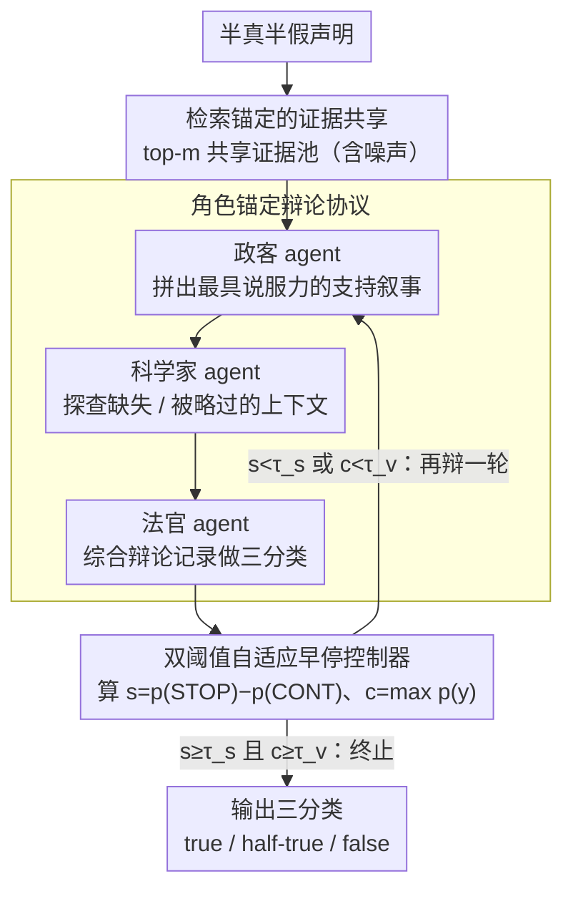

# Debating the Unspoken: Role-Anchored Multi-Agent Reasoning for Half-Truth Detection

**会议**: ACL 2026  
**arXiv**: [2604.19005](https://arxiv.org/abs/2604.19005)  
**代码**: [https://github.com/tangyixuan/RADAR](https://github.com/tangyixuan/RADAR)  
**领域**: 事实验证 / 虚假信息检测  
**关键词**: 半真半假检测, 多智能体辩论, 遗漏推理, 角色锚定, 自适应终止

## 一句话总结

提出RADAR框架，通过角色锚定（政客 vs 科学家）的多智能体辩论来检测基于遗漏上下文的半真半假信息，配合双阈值自适应早停机制，在噪声检索条件下一致超越单智能体和传统多智能体基线。

## 研究背景与动机

**领域现状**：事实验证系统在检测显式虚假信息上取得进展，但对半真半假（half-truth）——事实上正确但因遗漏关键上下文而具有误导性的声明——仍是盲区。例如"某政客减少了15%的国债"本身正确，但隐藏了同期先增加了20%的事实。

**现有痛点**：（1）单智能体方法（编码器分类器、指令LLM）执行单次推理，当关键上下文缺失时容易误判；（2）传统多智能体辩论（MAD）使用固定的正/反方角色，针对显式矛盾设计，不适合遗漏推理——核心问题是缺失的上下文而非对立的声明；（3）TRACER虽首次显式建模遗漏，但假设有黄金证据且为单智能体流水线。

**核心矛盾**：遗漏检测需要推理"什么没被说出来"，而非"什么是错的"——现有验证系统都在寻找矛盾而非缺失。

**本文目标**：在现实的噪声检索条件下，设计能发现缺失上下文的事实验证框架。

**切入角度**：将验证建模为互补角色间的结构化辩论——一方构建最佳叙事（暴露选择性框架的动机），另一方探查遗漏（揭示缺失的上下文）。

**核心 idea**：用"政客"和"科学家"的角色锚定替代正/反方辩论，将遗漏检测从矛盾寻找转化为缺失上下文的主动探查。

## 方法详解

### 整体框架

RADAR 要解决的是"半真半假"这种特殊谎言——声明本身事实正确，却靠遗漏关键上下文来误导。整套流程分两步：先在现实的噪声检索条件下为每条声明拉出一个共享证据池，再让三个角色锚定的智能体在这个证据池上多轮辩论，由一个自适应早停机制决定何时收手。三个智能体各司其职：政客负责把证据拼成最有说服力的支持叙事，科学家负责盯着同一份证据找哪里被略过了，法官负责裁决三分类（true/half-true/false）并控制辩论是否终止。

### 关键设计

**1. 检索锚定的证据共享：让分歧来自推理差异，而非各看各的资料**

如果各智能体依赖自己模型内部的知识，结论的差异就分不清是真在比推理，还是单纯信息不对称。RADAR 让所有智能体共享同一个证据池（top-m 检索结果），并要求辩论中的每个论点都引用检索证据、不得诉诸模型内部知识。这样一来不同结论只可能源于对同一份证据的推理差异，而非谁手里多了点料。相比依赖模型内部知识的传统 MAD（multi-agent debate），检索锚定显著提高了透明性和可追溯性，也让框架直接工作在现实的噪声检索设定下，而不是假设有黄金证据。

**2. 角色锚定辩论协议：用"政客 vs 科学家"取代正/反方，把找矛盾改成找缺失**

传统多智能体辩论用固定的正/反方角色，是冲着"显式矛盾"设计的——可半真半假的病根不是有人说错，而是有人故意没说全，正反对峙根本对不上焦。RADAR 改用一对互补的推理人格：政客 agent 从证据里构建最具说服力的支持叙事，天然倾向确认性推理、倾向选择性呈现；科学家 agent 审查同一份证据里缺失、薄弱或被选择性呈现的部分，天然倾向分析性质疑。辩论按开场陈述→反驳轮→结辩总结推进，法官综合整段辩论记录和证据做三分类判断。妙处在于政客这个角色本身就是半真半假的"制造者"，科学家则是它的"拆穿者"，两者对抗恰好把谎言的生成与检测机制同台演了一遍。

**3. 双阈值自适应早停控制器：同时卡"信息够了"和"判断稳了"才收手**

辩论轮数多了费算力，停早了又容易在最棘手的半真半假上误判。RADAR 让法官在每轮结束后算两个量：停止边际 $s = p(\text{STOP}) - p(\text{CONTINUE})$，以及最大标签置信度 $c = \max_y p(y)$。只有当 $s \geq \tau_s$ 且 $c \geq \tau_v$ 同时成立时才终止辩论，两个阈值都在开发集上校准。之所以要双阈值而非单阈值，是因为单看停止意愿可能在还没想清楚的不确定案例上过早收手——半真半假恰恰是最不确定的那一类。双阈值把"已经收集到足够信息"和"已经得出高置信判断"这两件事都要求满足，才放行终止。

### 一个完整示例：一条"减债"声明怎么被拆穿

以声明"某政客把国债减少了 15%"为例。检索锚定阶段先拉回 top-m 证据，里面既有"任内末期国债同比下降 15%"的报道，也有一篇提到"任内前期国债曾先上涨约 20%"。辩论开始：政客 agent 抓住前一条，构建出"该政客成功削减国债 15%"的支持叙事；科学家 agent 翻同一证据池，指出叙事完全略过了前期那 20% 的上涨，单看末段下降会严重误导。反驳轮里政客试图强调下降是事实、科学家则反问"为何不提同期净变化"。法官每轮算一次 $s$ 和 $c$：第一轮置信度还不够、$c<\tau_v$，继续辩；到科学家点出遗漏、证据齐整后，$s\geq\tau_s$ 且 $c\geq\tau_v$ 同时满足，终止辩论，判为 half-true。对照固定正/反方的做法，反方多半只会去否认"减了 15%"这个事实本身（而它是真的），反而判错——这正是角色锚定相对传统 MAD 的价值所在。

### 损失函数 / 训练策略

RADAR 是无监督推理框架，不涉及训练，唯一需要拟合的两个早停阈值 $\tau_s$、$\tau_v$ 在开发集上校准。

## 实验关键数据

### 主实验

在PolitiFact-Hidden基准上（检索证据条件下）：

| 方法 | Accuracy | F1_macro | F1_HalfTrue |
|------|----------|---------|-------------|
| FIRE | 60.3 | 46.9 | 34.1 |
| D2D (MAD) | 63.0 | 50.9 | 39.7 |
| RADAR_single | 58.4 | 51.0 | 41.5 |
| **RADAR_multi** | **77.7** | **63.3** | **56.5** |

### 消融实验

| 配置 | Accuracy | 说明 |
|------|----------|------|
| 黄金证据+RADAR | 83.6 | 完美检索的上限 |
| 检索证据+RADAR | 77.7 | 现实条件仍强 |
| 无早停 | ~76 | 轻微下降但成本增加 |
| 固定正反方 | ~65 | 角色设计关键 |

### 关键发现

- RADAR在检索条件下比最佳传统方法D2D提升14.7%准确率，尤其在半真半假检测（F1从39.7到56.5）上优势巨大
- 角色锚定是核心贡献：替换为传统正/反方角色后性能大幅下降，验证了互补推理设计的必要性
- 自适应早停在不损失性能的情况下平均减少约30%的辩论轮数
- 在黄金证据和检索证据两种设定下都一致优于基线，说明框架的鲁棒性

## 亮点与洞察

- "政客-科学家"角色隐喻非常巧妙：半真半假本身就是政治话语中的常见手法，用模拟这种话语策略的角色来检测它，形成了一种"以彼之道还施彼身"的设计理念。
- 双阈值早停机制是工程上的实用创新：在推理成本和质量之间取得了好的平衡，对半真半假这种本质上不确定的类别尤其重要。
- 从"寻找矛盾"转向"发现缺失"的范式转变，为事实验证领域开辟了新方向。

## 局限与展望

- 仅在政治事实验证数据集上测试，其他领域（科学、医疗）的半真半假检测有待验证
- 角色设计虽然有效但依赖手工定义的提示模板，可能限制了泛化性
- 检索质量仍是性能瓶颈——黄金证据和检索证据之间约6%的差距表明改善检索可带来进一步提升
- 三分类（true/half-true/false）可能过于粗糙，真实的半真半假程度应该是连续的

## 相关工作与启发

- **vs TRACER**: 首个遗漏检测框架但假设黄金证据且单智能体；RADAR在噪声检索下通过多智能体辩论实现更强性能
- **vs D2D/TED**: 传统MAD用固定正/反方针对显式矛盾；RADAR的角色锚定针对遗漏推理，F1提升12+个点
- **vs FIRE**: 迭代搜索-验证循环但仍为单智能体；RADAR通过结构化辩论实现更深层的推理

## 评分
- 新颖性: ⭐⭐⭐⭐⭐ 角色锚定+遗漏推理的新范式
- 实验充分度: ⭐⭐⭐⭐ 多基线对比+消融+效率分析
- 写作质量: ⭐⭐⭐⭐⭐ 动机清晰，角色设计直觉明了
- 价值: ⭐⭐⭐⭐⭐ 填补了半真半假检测的重要空白

<!-- RELATED:START -->

## 相关论文

- [\[ACL 2025\] CortexDebate: Debating Sparsely and Equally for Multi-Agent Debate](../../ACL2025/multi_agent/cortexdebate_debating_sparsely_and_equally_for_multi-agent_debate.md)
- [\[AAAI 2026\] Beyond Detection: Exploring Evidence-based Multi-Agent Debate for Misinformation Intervention and Persuasion](../../AAAI2026/multi_agent/beyond_detection_exploring_evidence-based_multi-agent_debate_for_misinformation_.md)
- [\[ACL 2026\] From Query to Counsel: Structured Reasoning with a Multi-Agent Framework and Dataset for Legal Consultation](from_query_to_counsel_structured_reasoning_with_a_multi-agent_framework_and_data.md)
- [\[CVPR 2026\] Agent4FaceForgery: Multi-Agent LLM Framework for Realistic Face Forgery Detection](../../CVPR2026/multi_agent/agent4faceforgery_multi-agent_llm_framework_for_realistic_face_forgery_detection.md)
- [\[ACL 2026\] When Identity Skews Debate: Anonymization for Bias-Reduced Multi-Agent Reasoning](when_identity_skews_debate_anonymization_for_bias-reduced_multi-agent_reasoning.md)

<!-- RELATED:END -->
