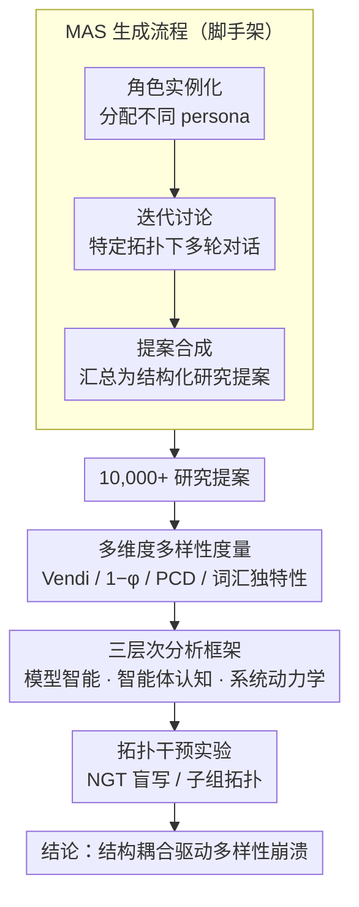

# Diversity Collapse in Multi-Agent LLM Systems: Structural Coupling and Collective Failure in Open-Ended Idea Generation

**会议**: ACL 2026 Findings  
**arXiv**: [2604.18005](https://arxiv.org/abs/2604.18005)  
**代码**: [https://github.com/Xtra-Computing/MAS_Diversity](https://github.com/Xtra-Computing/MAS_Diversity)  
**领域**: LLM Agent  
**关键词**: 多智能体系统, 多样性崩溃, 结构耦合, 创意生成, 协作拓扑

## 一句话总结

本文通过评估超过 10,000 个研究提案，从模型智能、智能体认知和系统动力学三个层次系统揭示了多智能体 LLM 系统中的"多样性崩溃"现象：更强的模型、权威驱动的角色分配和密集的通信拓扑都会抑制语义多样性，根本原因是交互结构而非模型能力不足。

## 研究背景与动机

**领域现状**：多智能体系统（MAS）越来越多地用于开放式创意生成（如科研假设提出、战略规划、创意设计），其背后的期望是多个智能体的集体交互能拓宽探索空间。MAS 框架通常给不同 agent 分配不同角色/视角，期望通过碰撞产生多样化的想法。

**现有痛点**：(1) MAS 是否真的比单模型生成更多样化？这一假设从未被系统验证；(2) 现有 MAS 框架通常基于同质的底层模型（共享预训练分布和对齐目标），多智能体交互可能只是放大了共享先验而非引入真正的多样性；(3) 什么条件下 MAS 会"适得其反"——不仅没有扩大解空间反而导致过早收敛？

**核心矛盾**：直觉上更多交互应该产生更多样化的结果，但实际上交互本身可能是多样性损失的根源。更多的协作导致更多的相互影响、轨迹同步化，最终触发多样性崩溃。

**本文目标**：从模型层、认知层、系统层三个自下而上的层次，系统诊断 MAS 创意生成中的多样性问题。

**切入角度**：以"科研提案生成"作为创意生成的标准化任务，因为它既有开放性又有结构约束，适合量化评估。设计了 20 个主题 × 50 个独立讨论 = 1000 个提案/配置。

**核心 idea**：多样性崩溃是一种由"结构耦合"（structural coupling）驱动的集体失败——交互结构无意中收缩了智能体的探索空间，而非模型能力不足。

## 方法详解

### 整体框架

构建通用的多智能体交互框架，包含三个阶段：角色实例化（给 agent 分配不同 persona）、迭代讨论（在特定拓扑下多轮对话）、提案合成（将讨论汇总为结构化研究提案），由此产出 10,000+ 条研究提案作为分析素材。在此之上，本文先用一套**多维度多样性度量**把提案的语义多样性量化到可比较，再通过**三层次分析框架**（模型智能、智能体认知、系统动力学）自下而上定位多样性崩溃的来源，最后以**拓扑干预实验**（NGT、子组拓扑）反证根因、给出可落地的缓解手段。

### 关键设计

**1. 多维度多样性度量体系：用四个互补指标把"语义多样性"量化到可比较**

判断 MAS 到底有没有变得更多样，绕不开"多样性怎么量"这个前提，而单一指标总会漏掉某一面。本文同时上四个角度互补的指标：Vendi Score 基于核矩阵的谱熵，衡量的是一组提案里有效独立的语义模式有多少个；结构无序度 $1-\phi$ 取个体与群体均值的平均余弦距离，值低说明大家都在向群体均值靠拢、出现了回声室效应；语义离散度 PCD 是成对余弦距离的均值，刻画分布的整体铺开程度；词汇独特性则用 IDF 加权的 n-gram 统计抓表面层的冗余。四个指标分别盯住有效模式数、分布形态、成对距离、表面重复，合起来才不至于一叶障目。这套度量并非纸上谈兵——经人工评估校验，Vendi Score 与人类对多样性的判断一致率达 87%，让后面所有"哪种结构更多样"的结论都有了可信的标尺。

**2. 三层次分析框架：自下而上把"多样性崩溃"归因到具体环节**

多智能体的动力学纠缠在一起，直接问"为什么不多样"很难有答案，本文把它拆成可以各自独立分析的三层。模型层揭示出一个"计算效率悖论"：对齐越强的模型单样本质量越高，但边际多样性递减——对齐本质上是一种全局语义正则化，把探索空间压扁了。认知层比较五种协作结构（朴素 / 领导驱动 / 水平 / 跨学科 / 垂直），发现权威驱动的结构系统性地抑制多样性，反倒是初级研究者主导的水平协作多样性最高（Vendi 8.08，而跨学科只有 4.65）。系统层则盯群体规模、轮次和拓扑：agent 越多边际回报越低（多样性利用率 Vendi/N 从 1.03 跌到 0.47），通信拓扑越密集，过早收敛来得越快。三层各自给出一块证据，最后共同指向同一个结论——问题出在交互结构，不在模型不够强。

**3. 拓扑干预实验（NGT / Subgroups）：用"改了交互方式就能缓解"反证根因**

前两个设计诊断出"结构耦合是病根"，但这只是相关性，还需要一个能立因果的检验：如果根子真在交互结构上，那么只动交互方式、不换模型，崩溃就该被缓解。本文据此设计三组对照——标准讨论、名义群体技术（NGT，让 agent 先各自"盲写"再进入讨论）、子组拓扑（把社交图切成若干局部子组）。结果是 NGT 在讨论初期把多样性顶到最高，子组拓扑则在后期维持住最高的建设性冲突密度。两种过程干预都奏效，正好从反面坐实了"多样性崩溃源于交互结构"这一核心主张，也顺手给出了可直接落地的缓解手段。

## 实验关键数据

### 主实验

| 认知结构 | Vendi Score | 语义离散度 | 结构无序度 | 整体质量 |
|----------|------------|-----------|-----------|---------|
| 水平协作 (初级) | **8.08** | **0.31** | **0.170** | 7.88 |
| 垂直协作 (混合) | 6.93 | 0.296 | 0.161 | 8.32 |
| 领导驱动 | 6.08 | 0.285 | 0.154 | 8.03 |
| 朴素协作 | 5.57 | 0.272 | 0.146 | 7.95 |
| 跨学科 | 4.65 | 0.25 | 0.19 | **8.50** |

### 消融实验

| 配置 | Vendi Score | 多样性利用率 | 说明 |
|------|-------------|------------|------|
| N=3 agents | ~3.1 | 1.03 | 基线，效率高 |
| N=5 agents | ~3.8 | 0.76 | 递减回报开始 |
| N=7 agents | ~3.3 | 0.47 | 严重递减 |
| 标准拓扑 | 低 | - | 多样性持续下降 |
| NGT 拓扑 | 初始高 | - | 盲写阶段有效 |
| 子组拓扑 | 后期高 | - | 保持建设性冲突 |

### 关键发现

- **计算效率悖论**：更强的对齐模型（如 GPT-5.1）单样本质量更高但多样性更低，对齐本质上是一种全局语义正则化，压缩了探索空间
- **权威抑制多样性**：初级研究者主导的水平协作比跨学科专家组多样性高 73%（Vendi 8.08 vs 4.65），但质量差距仅 0.6 分（10分制），说明权威导致"谄媚陷阱"
- **系统动态中的 Ringelmann 效应**：增加 agent 数量的边际多样性收益急剧下降，类似于人类群体中的"社会懈怠"
- **"共识内扩展"模式**：单次会话中多样性可以局部增加（讨论深化），但跨会话的多样性却在收缩（结构收敛）

## 亮点与洞察

- **"结构耦合"理论框架**：提出了一个统一的解释——多样性崩溃不是因为模型不够强，而是因为交互结构本身就会收缩探索空间。这一洞察对所有 MAS 设计者都有警示意义
- **质量-多样性的非对称关系**：跨学科团队质量最高但多样性最低，说明优化质量和优化多样性是不同的目标，需要显式权衡
- **实验规模和严谨性**：10,000+ 提案、20 个主题、多种拓扑/认知结构/模型的全面交叉实验，并经过人工验证，实证基础非常扎实
- **子组拓扑作为多样性保护策略**：通过创建"局部分歧口袋"来抵抗过早共识，可直接应用于现实 MAS 设计

## 局限与展望

- 仅以"科研提案生成"为任务，结论是否推广到代码生成、创意写作等其他开放式任务有待验证
- 所有 agent 共享相同的底层 LLM，异构模型集合的效果未充分探索
- 评估依赖嵌入空间的语义度量，可能遗漏某些类型的概念创新
- 论文较长（56 页），核心发现可以更简洁地呈现
- 未提出系统性的解决方案，更多是诊断问题

## 相关工作与启发

- **vs Du et al. (2024) 的多智能体辩论**: 辩论框架假设交互能改善推理，本文证明在创意任务中交互可能适得其反
- **vs Wang et al. (2025a) 的回声室效应**: 本文将回声室效应从社交媒体推广到 LLM 多智能体系统，并提供了定量分析
- **vs Moon et al. (2025)**: 同样关注 MAS 中的多样性问题，但本文的三层次分析更系统，实验规模更大

## 评分

- 新颖性: ⭐⭐⭐⭐⭐ 首次系统性地揭示 MAS 创意生成中的多样性崩溃问题，提出"结构耦合"理论
- 实验充分度: ⭐⭐⭐⭐⭐ 10,000+ 提案、20 主题、多维度交叉分析、人工验证，极为充分
- 写作质量: ⭐⭐⭐⭐ 分析深入，可视化优秀，但篇幅过长
- 价值: ⭐⭐⭐⭐⭐ 对 MAS 设计有重要指导意义，"更多协作不等于更多多样性"的结论具有广泛影响

<!-- RELATED:START -->

## 相关论文

- [\[ACL 2026\] Seeing the Whole Elephant: A Benchmark for Failure Attribution in LLM-based Multi-Agent Systems](seeing_the_whole_elephant_a_benchmark_for_failure_attribution_in_llm-based_multi.md)
- [\[ICML 2026\] EngiAgent: Fully Connected Coordination of LLM Agents for Solving Open-ended Engineering Problems with Feasible Solutions](../../ICML2026/multi_agent/engiagent_fully_connected_coordination_of_llm_agents_for_solving_open-ended_engi.md)
- [\[ACL 2026\] Memory-Augmented LLM-based Multi-Agent System for Automated Feature Generation on Tabular Data](memory-augmented_llm-based_multi-agent_system_for_automated_feature_generation_o.md)
- [\[ACL 2026\] Conjunctive Prompt Attacks in Multi-Agent LLM Systems](conjunctive_prompt_attacks_in_multi-agent_llm_systems.md)
- [\[ACL 2026\] ODUTQA-MDC: A Task for Open-Domain Underspecified Tabular QA with Multi-turn Dialogue-based Clarification](odutqa-mdc_a_task_for_open-domain_underspecified_tabular_qa_with_multi-turn_dial.md)

<!-- RELATED:END -->
