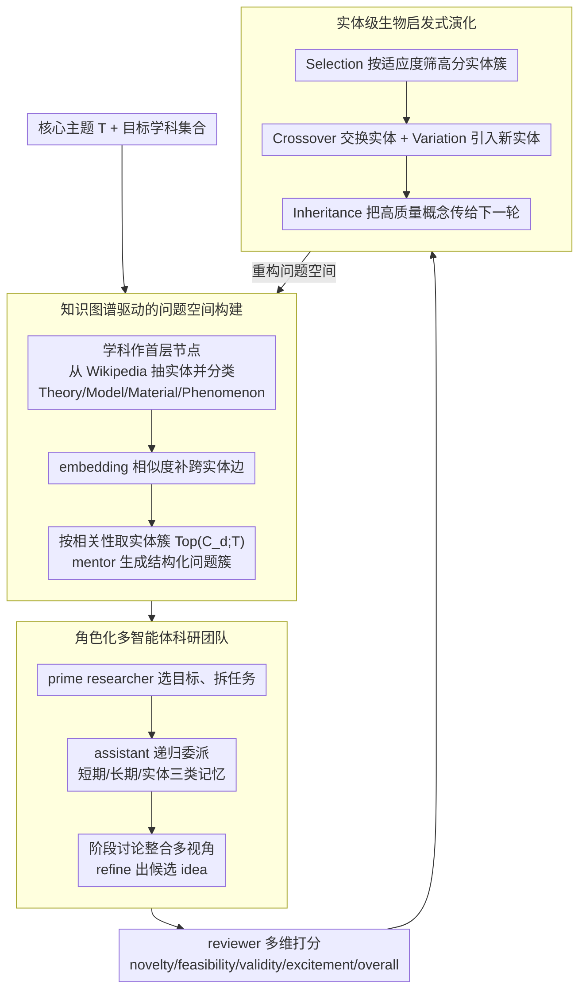

# EvoSci: A Bio-Inspired Multi-Agent Framework for the Evolution of Scientific Discovery

**会议**: ACL2026  
**arXiv**: [2605.24018](https://arxiv.org/abs/2605.24018)  
**代码**: 未在缓存中看到公开代码链接  
**领域**: LLM Agent / AI for Science / 多智能体科研发现  
**关键词**: scientific discovery, multi-agent collaboration, bio-inspired evolution, knowledge graph, idea generation

## 一句话总结
本文提出 EvoSci，把科研 idea 生成建模为多智能体协作和生物启发式演化循环，通过问题空间构建、团队式研究执行、评审反馈和实体级交叉/变异/选择，在 10 个科研主题上生成更有新颖性和整体质量的研究想法。

## 研究背景与动机
**领域现状**：LLM 已开始参与科学发现流程，包括文献挖掘、假设生成、实验设计、代码生成和论文写作。AI-Scientist、SciPIP、SciAgents、CoScientist 等系统已经展示了用 agent 或检索增强方法辅助科研的潜力。

**现有痛点**：很多系统仍把 LLM 当作固定 pipeline 中的一次性执行器：给定主题，检索文献，生成若干想法，评审结束。真实科研却是长程、迭代和协作的过程，研究问题会不断被重写，不同角色会围绕中间发现重新分工，好的 idea 也会在反馈中演化。

**核心矛盾**：科学发现需要开放探索和质量收敛同时发生。只追求发散会产生不切实际的奇想；只追求可行性又容易落入局部、保守的 incremental idea。现有 LLM agent 框架缺少一个机制，把跨学科探索、多角色协作和评审反馈组织成长期循环。

**本文目标**：构建一个能持续生成、评估、重组和改进研究 idea 的多智能体框架，让 LLM 模拟真实科研团队中的 mentor、researcher、reviewer，并用生物演化机制维护探索多样性。

**切入角度**：作者把科学发现从“题目到 idea”的一次性映射，改成“问题空间到研究团队到评审反馈到实体演化”的闭环。知识图谱负责提供跨学科实体，角色化 agent 负责研究执行，reviewer 反馈负责选择压力。

**核心 idea**：用多智能体科研协作产生候选 idea，再把高质量 idea 中的概念实体继承、交叉、变异和选择，驱动下一轮问题空间重构。

## 方法详解
EvoSci 由四个阶段组成：Problem Space Construction、Collaborative Research Execution、Research Idea Evaluation 和 Bio-Inspired Evolutionary Iteration。它不训练模型参数，而是通过工作流、角色分工、记忆和评审反馈组织 LLM 的长程科研探索。

### 整体框架
系统从一个核心研究主题 $T$ 和目标学科集合开始。首先构建多层知识图谱：学科作为第一层节点，实体从 Wikipedia summary 和 hyperlink 中抽取，经 LLM 分类为 Theory、Model、Material、Phenomenon 等类型，并通过 embedding 相似度添加跨实体边。

接着，mentor agent 将主题映射到核心学科，并组织来自真实科学家数据集的 domain expert agents 进行问答式讨论，补充领域实体和跨学科方向。系统围绕主题和目标学科选出相关实体簇，生成结构化问题 cluster。

在研究执行阶段，prime researcher 从问题 cluster 中选择目标，组建 assistant researchers，通过 CrewAI 风格的 lead-and-collaborate 机制进行任务分解、递归委派、阶段性整合和 idea refinement。最后 reviewer agent 按 novelty、feasibility、validity、excitement、overall 等维度评分并给出改进建议，反馈再进入演化循环。

### 关键设计

**1. 知识图谱驱动的问题空间构建：把模糊主题锚定成可探索的问题簇**

LLM 直接“给主题、出 idea”很容易要么发散成天马行空、要么反复重复同一类想法，缺的正是一个语义锚点。EvoSci 先围绕核心主题 $T$ 和目标学科建一张轻量知识图谱：学科作为第一层节点，实体从 Wikipedia summary 和 hyperlink 抽取、经 LLM 分成 Theory/Model/Material/Phenomenon 等类型，再用 embedding 相似度补上跨实体边。随后对每个学科 $d$ 按与主题的相关性挑出最有潜力的实体簇 $Top(\mathcal{C}_d;T)$，让 mentor 基于三元组 $\langle T,d,Top(\mathcal{C}_d;T)\rangle$ 生成结构化研究问题。这样探索被钉在具体实体上，既不漫无边际，又通过跨实体边保留了跨学科连接——后面的演化也正是在这个实体层上动刀。

**2. 角色化多智能体科研团队：用 mentor/researcher/reviewer 分工模拟真实科研协作**

单一视角很难产出既新又靠谱的 idea。EvoSci 让 prime researcher 从问题簇里选目标、拆任务，再分派给若干 assistant researcher，assistant 还能进一步递归委派；中间用短期、长期和实体三类记忆保存阶段性结果，并在阶段讨论里整合多视角输出，最后由 reviewer 按 novelty、feasibility、validity、excitement、overall 打分并给改进建议。团队规模不是越大越好——实验里 team_size=5 最优，到 7/9 反而因协调开销掉分，说明“适度多样性”才是甜点。

**3. 实体级生物启发式演化：把成功 idea 的概念线索遗传到下一轮**

如果只是“让模型看着反馈重写 idea”，好想法里的概念很容易在重写中丢失、或过早收敛到保守方案。EvoSci 把学科层固定、把实体层当作可演化的 population，对实体簇执行四个算子：Crossover（交换实体）、Variation（引入新实体）、Selection（按 reviewer 适应度筛出高分簇）、Inheritance（把高质量概念传给下一轮问题空间重构）。于是 reviewer 的反馈不再停留在文本层面，而是变成实体层的选择压力，既保住了成功概念、又靠变异维持探索多样性。

### 一个完整示例：从一个主题到一条演化后的 idea

举个示意性的例子。设核心主题 $T$ 是“高效 CO₂ 还原催化剂”，目标学科取化学、材料、AI。mentor 先把 $T$ 映射到这三个学科，知识图谱在材料学科下聚出一簇实体（如单原子催化剂、过渡金属、吸附能 descriptor），按相关性取出 $Top(\mathcal{C}_d;T)$ 后，mentor 据三元组生成问题“能否用图神经网络预测单原子位点的吸附能以加速筛选”。prime researcher 选中它，拆成“文献调研 / descriptor 设计 / 模型选型”三个子任务分给 assistant，整合出一版 idea。reviewer 打分发现 novelty 高但 feasibility 偏低。进入演化循环：Selection 保留这簇高分实体，Crossover 把“主动学习”实体交换进来，Variation 引入“不确定性估计”新实体，于是下一轮问题空间重构成“用主动学习+不确定性估计减少 DFT 标注量”——一条继承了原概念、又更可行的 idea。这就是实体级演化让反馈跨轮积累的画面。

### 损失函数 / 训练策略
EvoSci 没有参数训练损失，优化来自工作流中的评审反馈和演化选择。每个 idea 被 reviewer 评分为 $s=(s_{nov},s_{fea},s_{eff},s_{exc},s_{overall})$，并附带 rationale、confidence 和改进建议。实验评价采用两套机制：一是模拟 ICLR/NeurIPS peer review 的 multi-reviewer + meta-reviewer，二是 tournament-style pairwise ranking，让所有 idea 进行多轮两两比较。

## 实验关键数据

### 主实验
| Backbone | 指标 | EvoSci | 最强对照 | 结论 |
|--------|------|------|----------|------|
| GPT-4o | ICLR Overall / NeurIPS Overall | 4.45 / 3.44 | VirSci 4.28 / 3.26 | EvoSci 综合分最高 |
| DeepSeek-v3 | ICLR Overall / NeurIPS Overall | 4.90 / 3.95 | AI Scientist 4.68；CoI-Agent 3.72 | DeepSeek-v3 下优势最大 |
| Qwen3-max | ICLR Overall / NeurIPS Overall | 4.72 / 3.81 | SciPIP 4.54；CoI-Agent 3.62 | 跨 backbone 稳定领先 |
| DeepSeek-v3 | Novelty / Excitement | 5.71 / 5.15 | VirSci 5.48 / 5.11 | 创新相关维度领先 |
| Tournament | Avg Wins / Top-10 Count | GPT-4o: 4.27 / 54；DeepSeek-v3: 4.19 / 47；Qwen3-max: 4.25 / 50 | 各 backbone 其他方法更低 | 相对排序也支持主结论 |

### 消融实验
| 配置 | 关键指标 | 说明 |
|------|---------|------|
| w/ Problem Guidance | Novelty 4.78, ICLR 4.45, NeurIPS 3.44 | 结构化问题空间提升新颖性和整体质量 |
| w/o Problem Guidance | Novelty 4.22, ICLR 4.22, NeurIPS 3.28 | 直接从原始 prompt 探索更弱 |
| team_size sweep | team_size=5 最优 | 团队从 1 增到 5 提升，7/9 后因协调开销下降 |
| w/ Evo vs w/o Evo | NeurIPS 3.38→3.424；ICLR 4.334→4.364 | 演化带来小但系统性的平均提升 |
| Meta Review vs Single Review | 均值 3.44 vs 3.40，方差 0.018 vs 0.035 | meta-review 不明显抬分，但降低评价波动 |

### 关键发现
- EvoSci 在 Validity、Excitement 和 overall 指标上稳定领先，说明多智能体协作与演化反馈不只是让 idea 更“花”，也能提升可信度。
- 问题引导对 novelty 特别重要。没有 problem construction 时，新颖性从 4.78 降到 4.22，说明好的科研 idea 生成需要先构造可探索的问题空间。
- 演化模块的平均增益不大，但方向一致；同时 NeurIPS 模板下 within-topic Std 从 0.146 增到 0.176，说明 evolution 增强了探索动态，而不是简单重复已有 idea。
- meta-review 的方差更低，说明多 reviewer 聚合能让 LLM 评审更稳定，但评价机制本身仍是未来系统的关键瓶颈。

## 亮点与洞察
- 这篇论文最有意思的是把“生物演化”落到了实体层，而不是停留在比喻。实体簇的继承、交叉、变异和选择，让反馈可以作用到下一轮问题空间，而不只是重写上一轮文本。
- 多智能体团队 size 的结果很实用：更多 agent 不是越多越好，5 左右的适度多样性优于 7/9 的大团队。这对 agent workflow 设计很有参考价值。
- 问题空间构建比直接 idea generation 更关键。许多科研 agent 系统失败不是因为不会写 idea，而是因为没有把研究问题拆成可演化、可比较的子空间。
- tournament-style ranking 是对绝对打分的有益补充。LLM 评审绝对分可能漂移，两两比较更容易抓住相对质量。

## 局限与展望
- 作者承认 EvoSci 的广泛跨学科探索会带来 creativity 与 feasibility 的 trade-off，有些 idea 新颖但实践可行性较低。
- 评价仍主要依赖 LLM reviewer 和 meta-reviewer。虽然方差下降，但“好科研 idea”的客观评估仍很难，需要更多人类专家或后续实验验证。
- 10 个主题覆盖了一些 AI Scientist setting，但还不足以代表真实科学发现的复杂度；跨学科知识图谱也较轻量，可能漏掉深层领域约束。
- 未来可以加强结构化知识表示、因果推理、真实文献/数据/实验闭环，以及长期 autonomous discovery 中的记忆管理和质量控制。

## 相关工作与启发
- **vs AI Scientist**: AI Scientist 更接近端到端科研自动化，EvoSci 更强调问题空间构建、多角色协作和多轮演化，因此在 idea novelty/overall 上更强。
- **vs SciPIP**: SciPIP 通过检索增强假设生成，EvoSci 加入科研团队协作和实体层演化，探索过程更长程。
- **vs SciAgents / CoScientist**: 这些系统展示了多 agent 科学推理潜力，EvoSci 的差异在于把 reviewer feedback 显式转成选择压力，推动下一轮问题空间变化。
- **启发**：做科研 agent 时，不应只优化单次输出质量；更重要的是设计可继承的中间状态，让好的概念、失败反馈和跨学科连接能在多轮中积累。

## 评分
- 新颖性: ⭐⭐⭐⭐ 多智能体科研并非全新，但实体级演化闭环和问题空间构建结合得较完整。
- 实验充分度: ⭐⭐⭐⭐ 覆盖 10 个主题、3 个 backbone、主实验和多组消融；缺少真实专家长期验证。
- 写作质量: ⭐⭐⭐⭐ 框架叙述清楚，实验表格充分；生物演化机制仍有部分概念化表达。
- 价值: ⭐⭐⭐⭐ 对科研 agent、idea generation 和长期开放式探索系统都有较高参考价值。

<!-- RELATED:START -->

## 相关论文

- [\[ACL 2026\] PosterForest: Hierarchical Multi-Agent Collaboration for Scientific Poster Generation](posterforest_hierarchical_multi-agent_collaboration_for_scientific_poster_genera.md)
- [\[ACL 2026\] EvoSpark: Endogenous Interactive Agent Societies for Unified Long-Horizon Narrative Evolution](evospark_endogenous_interactive_agent_societies_for_unified_long-horizon_narrati.md)
- [\[ICLR 2026\] Auditing Cascading Risks in Multi-Agent Systems via Semantic–Geometric Co-evolution](../../ICLR2026/multi_agent/auditing_cascading_risks_in_multi-agent_systems_via_semanti-geometric_co-evolut.md)
- [\[ACL 2026\] A Multi-Agent Framework for Feature-Constrained Difficulty Control in Reading Comprehension Item Generation](a_multi-agent_framework_for_feature-constrained_difficulty_control_in_reading_co.md)
- [\[ACL 2026\] MATA: Multi-Agent Framework for Reliable and Flexible Table Question Answering](mata_multi-agent_framework_for_reliable_and_flexible_table_question_answering.md)

<!-- RELATED:END -->
