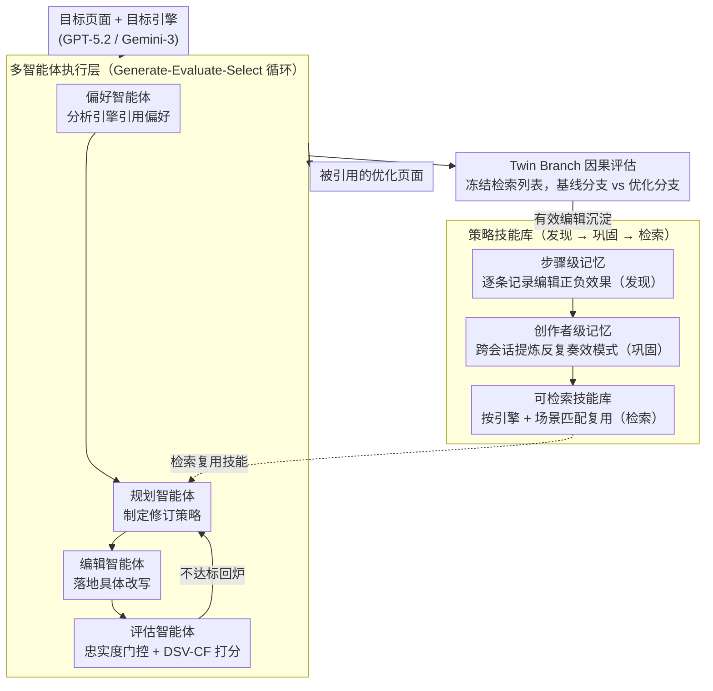

# MAGEO: From Experience to Skill — Multi-Agent Generative Engine Optimization via Reusable Strategy Learning

**会议**: ACL 2026  
**arXiv**: [2604.19516](https://arxiv.org/abs/2604.19516)  
**代码**: [https://github.com/Wu-beining/MAGEO](https://github.com/Wu-beining/MAGEO)  
**领域**: 模型压缩  
**关键词**: 生成引擎优化, 多智能体框架, 策略复用, 引文忠实度, 可见性优化

## 一句话总结

本文将生成引擎优化（GEO）从逐实例启发式优化重构为策略学习问题，提出 MAGEO 多智能体框架——执行层由偏好/规划/编辑/评估四个智能体协作，学习层将验证有效的编辑模式蒸馏为可复用的引擎特定策略技能，并引入 Twin Branch 因果评估协议和 DSV-CF 双轴指标，在三个主流引擎上显著优于启发式基线。

## 研究背景与动机

**领域现状**：生成引擎（如 ChatGPT、Gemini）正在用引文锚定的答案替代搜索链接列表，重塑信息获取方式。内容创作者需要优化页面以在生成答案中获得引用——即生成引擎优化（GEO）。

**现有痛点**：(1) 现有 GEO 方法逐实例独立优化，无法积累或迁移有效策略；(2) 评估混淆了表面可见性和语义影响，允许曝光提升伴随错误引用；(3) 引擎偏好建模粗糙，缺乏引擎特定的策略学习。

**核心矛盾**：当前 GEO 困在逐实例试错中，而非演化为累积性的、技能构建式的过程。每次优化从零开始，无法利用过往成功经验。

**本文目标**：(1) 将 GEO 重构为策略学习问题；(2) 构建能积累和复用策略的多智能体框架；(3) 设计因果可归因的评估方法。

**切入角度**：双层架构——执行层负责协作优化，学习层负责从成功经验中提炼可复用的策略技能。

**核心 idea**：将验证有效的编辑模式抽象为结构化的策略技能（包含适用条件、编辑操作和效果评估），存入技能库并在新任务中检索复用。

## 方法详解

### 整体框架

MAGEO 想解决的事很具体：内容创作者要让自己的页面被生成引擎（ChatGPT、Gemini）在作答时引用，但过去的 GEO 方法每碰到一个新页面就从零试错，攒不下经验。MAGEO 把它拆成上下两层来转。下面是**执行层**，一个 Generate-Evaluate-Select 的迭代循环：偏好智能体先分析目标引擎的引用偏好，规划智能体据此制定修订策略，编辑智能体落地具体改写，评估智能体再做质量检查和忠实度门控，不达标就回炉。上面是**学习层**，把执行层里被验证有效的编辑动作沉淀下来——单会话内用步骤级记忆，跨会话用创作者级记忆，最终汇成一座可检索的策略技能库。两层之间还垫了一个 Twin Branch 评估协议，专门负责把"编辑到底有没有用"从噪声里干净地分离出来。

### 关键设计

**1. 多智能体执行层：把"偏好建模—规划—改写—评估"拆给四个专职智能体协作迭代**

单 LLM 一把抓地做 GEO 优化时，偏好分析、策略规划、文本改写、质量把关全揉在一次生成里，既难控质量、又容易为了提升曝光而牺牲引用忠实度。MAGEO 的执行层把这条优化流水线拆给四个专职智能体，跑一个 Generate-Evaluate-Select 的迭代循环：偏好智能体先分析目标引擎的引用偏好，规划智能体据此（并检索技能库）制定修订策略，编辑智能体落地具体改写，评估智能体最后做忠实度门控和 DSV-CF 打分——不达标就退回规划重来。为什么有效：分工让每个智能体只对一件事负责、行为可控，而带门控的回环保证只有"既提升可见性、又通过忠实度检查"的编辑才会被接受，这也是上层技能库能沉淀到可靠经验的前提。

**2. DSV-CF 双轴评估指标：可见性必须和引文忠实度绑在一起算**

现有 GEO 指标要么只数曝光、要么只看质量，结果是优化器可以靠"误引用"刷高表面曝光而不被惩罚。评估智能体用的 DSV-CF 把两轴合进一个分数：

$$S_{DSV\text{-}CF} = \lambda \cdot \bar{S}_{SSV} + (1-\lambda) \cdot \bar{S}_{ISI} - \gamma(1-AA)$$

其中 SSV（表面语义可见性）聚合了词级可见性、位置权威、引用突出度和主观印象，ISI（内在语义影响）评估归因准确性、响应忠实度、关键点覆盖和答案主导性，而末项的 $\gamma$ 直接对错误归因（$1-AA$，$AA$ 为归因准确率）施加惩罚。这样一来，任何曝光提升若不伴随准确归因都会被扣分，堵死了"刷曝光不顾忠实度"的捷径。

**3. Twin Branch 评估协议：冻住检索列表，让你只看到编辑本身的因果效果**

黑盒引擎的麻烦在于检索和生成是交织的——你改完文档后引擎引用率变了，到底是"文档写得更好了"还是"它在候选里的检索排名碰巧变了"？分不清就没法归因。Twin Branch 的做法是把检索列表先冻住，然后开两个分支：基线分支保留原始文档，优化分支只把目标文档换成优化版，其余完全一致。同一检索列表下对比两个分支的引擎响应，差异就只能来自这次编辑本身，检索排名波动这个混淆变量被彻底控住了。这让 MAGEO 的每一次"有效/无效"判断都站得住脚，也是上层技能库能可靠积累经验的前提。

**4. 策略技能库（Skill Bank）：把一次性的成功编辑蒸馏成可复用的结构化技能**

逐实例优化最浪费的地方在于，同一个引擎上奏效的模式其实高度可复用，却每次都被丢掉。技能库给经验设计了三阶段生命周期：**发现**阶段由步骤级记忆逐条记录每次编辑的正/负效果；**巩固**阶段跨会话提取反复奏效的模式，固化成结构化技能（带上引擎类型、适用场景、编辑操作、效果指标四要素）；**检索**阶段在新任务到来时按"引擎+场景"匹配出可用技能直接套用。为了让库长期可扩展，还配了容量上限和按使用频率/新近度的淘汰策略。正是这一层把 GEO 从"逐实例试错"真正推进到了"从经验到技能"。

### 一个完整示例

拿一篇待优化的产品测评页、目标引擎 GPT-5.2 走一遍：**偏好智能体**先读出 GPT-5.2 偏好"有明确数据支撑、结构化小标题"的内容；**规划智能体**据此先去技能库检索——发现一条历史巩固的技能"GPT 场景下把核心结论前置 + 补一句来源标注，归因准确率显著提升"，直接命中并取出；**编辑智能体**按技能改写文档；**评估智能体**先做忠实度门控（确认没有为提升曝光而捏造来源），再算 DSV-CF。接着 **Twin Branch** 上场：冻住检索列表，基线分支用原文、优化分支用改写版，对比发现优化分支的 ISI 确实更高，确认这次编辑因果有效。这条成功记录回流到步骤级记忆，若后续在 GPT 上反复奏效，就会在巩固阶段升级为一条新的可复用技能。整个闭环就是"检索旧技能 → 改写 → 因果验证 → 沉淀新技能"。

### 损失函数 / 训练策略

MAGEO 是基于 LLM 的多智能体推理框架，不涉及神经网络训练，因此没有 loss，约束体现在评估智能体的忠实度门控和 DSV-CF 阈值上。实现上用 GPT-5.2 和 Gemini-3 Pro 作为基础引擎与评估引擎，并在 MSME-GEO-Bench（覆盖 5 大领域 15 个子类的真实查询）上验证。

> ⚠️ 原文使用的 GPT-5.2 / Gemini-3 Pro 等模型名及 arXiv 号以原文为准。

## 实验关键数据

### 主实验

**三个主流引擎上的 DSV-CF 性能**

| 方法 | GPT 5.2 SSV | GPT 5.2 ISI | Gemini-3 SSV | Gemini-3 ISI |
|------|------------|------------|-------------|-------------|
| 无优化 | 基线 | 基线 | 基线 | 基线 |
| GEO (启发式) | 中等提升 | 混合 | 中等提升 | 混合 |
| RAID | 提升 | 提升 | 提升 | 提升 |
| **MAGEO** | **最优** | **最优** | **最优** | **最优** |

### 消融实验

| 配置 | 效果 | 说明 |
|------|------|------|
| Full MAGEO | 最优 | 完整框架 |
| w/o 技能库 | 下降 | 策略复用贡献显著 |
| w/o 偏好智能体 | 下降 | 引擎特定建模重要 |
| w/o 评估智能体 | 下降+忠实度崩溃 | 忠实度门控不可或缺 |
| w/o Twin Branch | 无法因果归因 | 评估可靠性下降 |

### 关键发现

- 引擎特定偏好建模和策略复用是两个最关键的贡献组件
- 评估智能体的忠实度门控至关重要——没有它优化可能通过误引用来提升表面曝光
- 策略技能在同一引擎内跨场景有良好的迁移性，但跨引擎迁移效果有限
- 传统 SEO 策略（关键词密集化）在生成引擎上无效甚至有害

## 亮点与洞察

- 从"逐实例试错"到"策略学习"的范式转变是 GEO 领域的重要理论贡献
- Twin Branch 因果评估协议解决了黑盒引擎评估的根本难题
- 技能库的三阶段生命周期（发现→巩固→检索）设计可迁移到其他需要经验积累的智能体系统

## 局限与展望

- 策略技能的有效性可能随引擎更新而衰退
- 评估主要依赖 LLM-as-Judge，可能有系统性偏差
- MSME-GEO-Bench 的查询多样性有限
- 未来可探索技能的自动更新和跨引擎迁移学习

## 相关工作与启发

- **vs GEO/GEO-Bench**: 量化曝光但逐实例优化，无策略积累；MAGEO 增加学习层
- **vs RAID**: 意图感知但无策略复用；MAGEO 通过技能库实现经验迁移
- **vs AutoGEO**: 学习偏好规则但不积累跨实例策略；MAGEO 的技能库持续进化

## 评分

- 新颖性: ⭐⭐⭐⭐⭐ 将 GEO 重构为策略学习问题，技能库和 Twin Branch 评估都是新贡献
- 实验充分度: ⭐⭐⭐⭐ 多引擎评估，但实际场景验证有限
- 写作质量: ⭐⭐⭐⭐ 框架设计清晰，指标定义完整
- 价值: ⭐⭐⭐⭐ 为 GEO 领域提供了可扩展的学习驱动范式

<!-- RELATED:START -->

## 相关论文

- [\[AAAI 2026\] Conversational Learning Diagnosis via Reasoning Multi-Turn Interactive Learning](../../AAAI2026/multi_agent/conversational_learning_diagnosis_via_reasoning_multi-turn_interactive_learning.md)
- [\[ACL 2026\] ATLAS: Adaptive Trading with LLM AgentS Through Dynamic Prompt Optimization and Multi-Agent Coordination](atlas_adaptive_trading_with_llm_agents_through_dynamic_prompt_optimization_and_m.md)
- [\[AAAI 2026\] SafeSieve: From Heuristics to Experience in Progressive Pruning for LLM-based Multi-Agent Communication](../../AAAI2026/multi_agent/safesieve_from_heuristics_to_experience_in_progressive_pruning_for_llm-based_mul.md)
- [\[ICML 2026\] OMAC: A Holistic Optimization Framework for LLM-Based Multi-Agent Collaboration](../../ICML2026/multi_agent/omac_a_holistic_optimization_framework_for_llm-based_multi-agent_collaboration.md)
- [\[ICML 2026\] MASPO: Joint Prompt Optimization for LLM-based Multi-Agent Systems](../../ICML2026/multi_agent/maspo_joint_prompt_optimization_for_llm-based_multi-agent_systems.md)

<!-- RELATED:END -->
