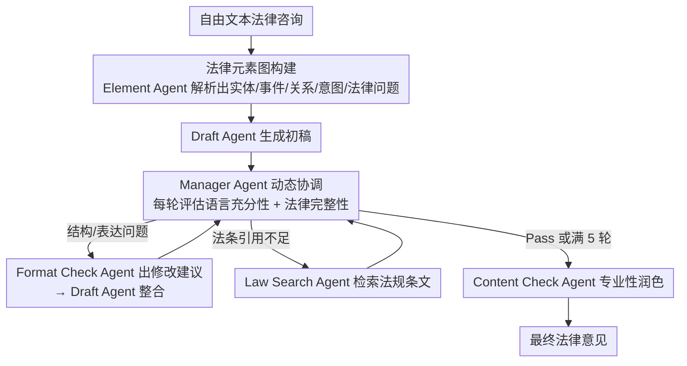

# From Query to Counsel: Structured Reasoning with a Multi-Agent Framework and Dataset for Legal Consultation

**会议**: ACL 2026  
**arXiv**: [2604.10470](https://arxiv.org/abs/2604.10470)  
**代码**: 无  
**领域**: LLM Agent / 法律NLP  
**关键词**: 法律咨询问答、多智能体、法律元素图、任务分解、中文法律

## 一句话总结
本文构建了JurisCQAD——一个包含43000+真实中文法律咨询的大规模数据集，并提出JurisMA多智能体框架，通过法律元素图进行结构化任务分解和动态多Agent协作（管理Agent+格式检查+法条检索），在LawBench上显著优于通用和法律专用LLM。

## 研究背景与动机

**领域现状**：法律咨询问答（Legal CQA）是法律AI的核心任务，需要从个性化的法律困境中生成有据可依、可执行的法律建议。现有方法主要通过在法律语料上继续预训练或通过检索法条辅助生成。

**现有痛点**：(1) 缺乏高质量的训练数据——现有法律LLM（如LawGPT）主要在人造数据上训练，与真实咨询场景存在领域偏移；(2) 法律CQA涉及复杂的任务组合——需要识别法律关系、判断因果、定位核心问题、匹配法条，端到端模型难以完全覆盖；(3) 高度上下文依赖——需要精确解读法律实体、关系和用户意图。

**核心矛盾**：真实法律咨询通常模糊、多方面，需要动态解释事实、主体和法律含义。而现有方法要么依赖粗糙的继续预训练（监督信号质量低），要么依赖句子级法条检索（容易混淆法律上不同但语言上相似的概念）。

**本文目标**：构建大规模真实法律咨询数据集，设计可解释的任务分解和多Agent协作框架。

**切入角度**：将法律咨询分解为结构化的法律元素图——提取实体、事件、关系、用户意图和法律问题，然后通过多Agent协作迭代优化法律意见。

**核心 idea**：元素图提供语义基础→管理Agent动态协调子任务→格式检查Agent和法条检索Agent迭代精炼→内容检查Agent做最终润色。

## 方法详解

### 整体框架
JurisMA 要处理的是真实法律咨询那种"模糊、多方面、上下文高度依赖"的查询，端到端模型很难一口气覆盖。它把流程拆成三段顺着走：先由 Element Agent 把自由文本查询解析成一张法律语义图（实体、事件、关系、用户意图、法律问题都落到图上），给下游推理提供全局上下文；再进入多 Agent 迭代优化，由 Manager Agent 动态评估当前草稿、按需调用 Format Check Agent 修结构、调用 Law Search Agent 补法条；最后由 Content Check Agent 做语言质量和专业性的收尾润色。整条链路模仿的是真实律所里"多角色协作修改一份法律意见书"的工作流。

### 关键设计

**1. 法律元素图构建：把自由文本查询变成结构化的法律语义表示**

法律推理本质上是围绕"关键事实、涉及主体、彼此的法律关系"展开的，而扁平文本很难把这些结构信息显式拎出来。Element Agent 因此把查询解析成图 $G=(V,E)$：节点 $V$ 涵盖法律实体（个人/组织，带角色、状态、时间属性）、法律事件、用户主张、关键事实，以及推断出的法律问题；边 $E$ 表示语义关系（如亲属关系、合同义务）。这张图序列化成 JSON 后与原查询拼接，作为生成的语义输入。设计上受 Hart 的初级/次级规则理论和 Kelsen 的规范层次模型启发——比起喂一段原始文本，图结构让模型一开始就握住了案情的骨架。

**2. Manager Agent 动态协调：按草稿的真实缺陷选择性激活子 Agent，而非固定全流程**

不是每份草稿都需要所有类型的修改，固定流程既慢又容易过度改写。Manager Agent 在每轮迭代里检查草稿两件事：语言充分性（清晰、简洁）和法律完整性（是否带权威法条引用）。一旦发现结构或表达问题，就调用 Format Check Agent 生成修改建议、交 Draft Agent 整合；一旦发现法律引用不足，就调用 Law Search Agent 去法规数据库检索相关条文。循环最多 5 轮，或在 Manager Agent 返回 "Pass" 时提前停止。这种动态路由只激活必要的子 Agent，在效率和可控性之间取得平衡，也直接对应了律所里"谁该出手改哪一段"的分工逻辑。

**3. JurisCQAD 数据集：用真实咨询的三元组替掉人造问答，补上高质量监督信号**

现有中文法律数据集多是人造问答或法条检索任务，反映不了真实咨询的复杂度和语言多样性，导致法律 LLM 普遍存在领域偏移。JurisCQAD 收了 43000+ 实例，每条组织成 (问题, 正回答, 负回答) 三元组：问题源自真实用户法律咨询，正回答经专业律师审核，负回答由模型生成但被标注为不充分/错误，覆盖高频法律领域。三元组格式不只是训练素材，还天然支持对比学习和偏好优化——既是这篇的基础设施贡献，也是 JurisMA 能跑出效果的数据底座。

### 一个完整示例
以一条"租客被房东无故扣押金"的咨询为例走一遍：**Element Agent** 先把它解析成图——节点抓出实体（租客、房东）、事件（租赁、扣押金）、关系（合同义务）、用户意图（要回押金）和推断出的法律问题（押金返还争议），序列化成 JSON 拼到查询后面。Draft Agent 据此写出初稿。**Manager Agent** 第一轮检查，发现草稿讲清了事实但没引任何法条（法律完整性不足），于是调用 **Law Search Agent** 去法规库检索押金返还相关条文补进来；第二轮再查，发现新版本结构松散（语言充分性不足），转而调用 **Format Check Agent** 出修改建议、交 Draft Agent 整合；第三轮 Manager Agent 判定语言和法律两条都达标，返回 "Pass" 跳出循环（总轮数在 5 轮上限内）。最后 **Content Check Agent** 做专业性润色定稿。整个过程里 Manager Agent 每轮只点名一个真正缺的能力，而不是把所有子 Agent 全跑一遍。

### 损失函数 / 训练策略
在 JurisCQAD 上做 SFT 训练，输入用元素图增强。评估使用修订后的 LawBench，涵盖多种词汇和语义指标。

## 实验关键数据

### 主实验

| 模型类别 | 代表模型 | LawBench性能 |
|---------|---------|-------------|
| 通用LLM | GPT-4, Qwen | 中等 |
| 法律LLM | LawGPT, ChatLaw | 中等偏低 |
| JurisMA | 基于JurisCQAD训练 | **显著最优** |

### 消融实验

| 配置 | 效果 | 说明 |
|------|------|------|
| Full JurisMA | 最优 | 完整框架 |
| w/o 元素图 | 下降 | 失去结构化语义基础 |
| w/o 多Agent迭代 | 下降 | 法律引用不完整 |
| w/o LawSearch Agent | 显著下降 | 法条接地能力丧失 |

### 关键发现
- 在JurisCQAD上训练的模型显著优于通用和法律专用LLM，验证了高质量数据的价值
- 元素图提供的结构化上下文比原始文本输入更有效
- 多Agent迭代平均在2-3轮收敛，说明管理Agent的质量判断有效
- 有趣的是，法律专用LLM有时不如通用LLM——可能因为预训练数据质量参差不齐

## 亮点与洞察
- **法律元素图的语义表示**：将自由文本查询转化为包含实体-关系-事件的图结构，为法律推理提供了可解释的语义基础。这个思路可推广到其他需要结构化理解的专业领域（如医学、金融）。
- **动态Agent路由**：Manager Agent按需激活子Agent而非固定流程，平衡了效率和质量。
- **真实数据的力量**：43000个真实法律咨询的高质量数据集是重要的基础设施贡献。

## 局限与展望
- 仅覆盖中国法律体系，跨法域适用性未验证
- 元素图的质量依赖于Element Agent的理解能力
- LawSearch Agent的法条检索范围可能不完整
- 多Agent系统的推理成本较高（多轮迭代+多Agent调用）

## 相关工作与启发
- **vs LawGPT**：在法律语料上继续预训练，但数据处理粗糙。JurisMA用结构化任务分解和高质量数据
- **vs LawLuo**：固定流程的法律多Agent系统。JurisMA的Manager Agent提供动态路由
- **vs RAG方法（LSIM等）**：句子级法条检索可能混淆语言相似但法律不同的概念。元素图提供更精确的上下文

## 评分
- 新颖性: ⭐⭐⭐⭐ 法律元素图+多Agent协作的组合在法律NLP中是新颖的设计
- 实验充分度: ⭐⭐⭐⭐ 多种基线对比、消融实验充分
- 写作质量: ⭐⭐⭐⭐ 方法描述系统化，法律概念的引用准确
- 价值: ⭐⭐⭐⭐ 数据集和框架对法律AI研究有直接贡献

<!-- RELATED:START -->

## 相关论文

- [\[AAAI 2026\] FinRpt: Dataset, Evaluation System and LLM-based Multi-agent Framework for Equity Research Report Generation](../../AAAI2026/multi_agent/finrpt_dataset_evaluation_system_and_llm-based_multi-agent_framework_for_equity_.md)
- [\[CVPR 2026\] MOTOR-Bench: A Real-world Dataset and Multi-agent Framework for Zero-shot Human Mental State Understanding](../../CVPR2026/multi_agent/motor-bench_a_real-world_dataset_and_multi-agent_framework_for_zero-shot_human_m.md)
- [\[ACL 2026\] Debating the Unspoken: Role-Anchored Multi-Agent Reasoning for Half-Truth Detection](debating_the_unspoken_role-anchored_multi-agent_reasoning_for_half-truth_detecti.md)
- [\[ACL 2026\] Multi-Agent Reasoning Improves Compute Efficiency: Pareto-Optimal Test-Time Scaling](multi-agent_reasoning_improves_compute_efficiency_pareto-optimal_test-time_scali.md)
- [\[AAAI 2026\] MedLA: A Logic-Driven Multi-Agent Framework for Complex Medical Reasoning with Large Language Models](../../AAAI2026/multi_agent/medla_a_logic-driven_multi-agent_framework_for_complex_medic.md)

<!-- RELATED:END -->
