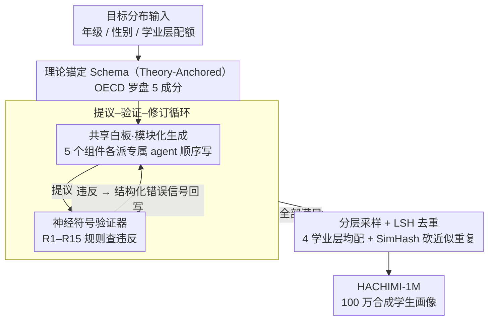

# HACHIMI: Scalable and Controllable Student Persona Generation via Orchestrated Agents

**会议**: ACL 2026  
**arXiv**: [2603.04855](https://arxiv.org/abs/2603.04855)  
**代码**: https://github.com/ZeroLoss-Lab/HACHIMI  
**领域**: LLM 评测 / 教育 / Agent  
**关键词**: 学生画像、Multi-Agent、神经符号验证、分层采样、群体一致性

## 一句话总结
HACHIMI 把"学生画像生成"形式化为 TAD-PG（理论对齐 + 分布可控）任务，用"提议–验证–修订"多智能体框架配合神经符号验证器和分层采样，产出 100 万条 1–12 年级合成学生画像；在 CEPS / PISA 2022 群体级评测中显示出明显的「保真梯度」——数学与好奇心相关构念高度对齐，而幸福感和家庭动态构念则只能弱对齐。

## 研究背景与动机

**领域现状**：教育大模型（个性化辅导、虚拟课堂、教师培训）越来越依赖大规模"合成学生"做对话仿真和效果评测。传统方法靠访谈/问卷/观察手工建少量典型画像（HCI personas），细致但根本无法扩展；近期改用 LLM「角色扮演 + 一次性生成」一键批量造画像，可扩展但质量塌方。

**现有痛点**：纯 prompt 化的 LLM 学生画像存在三类系统性缺陷——(1) **profile 内自相矛盾**：长上下文里前后描述打架；(2) **缺乏理论锚定**：随便起的"动机/性格"和真实教育学/发展心理学理论（Piaget、Erikson、OECD Learning Compass）几乎没有对应；(3) **群体分布不可控**：高/低成就、男/女、心理风险高/低等比例完全随机，无法服务于"按真实人口结构做评测"的需求。RAG、记忆框架等只缓解了一致性，没解决后两条。

**核心矛盾**：教育领域要的合成学生有三重硬约束——理论对齐、群体配额、个体内部一致——这三条彼此牵制（强一致 → 容易模式塌缩；强多样 → 容易破坏理论约束；强配额 → 容易稀释稀有群体）。一次性 prompt 无法同时满足。

**本文目标**：(1) 正式提出 Theory-Aligned and Distribution-Controllable Persona Generation (TAD-PG) 任务；(2) 设计一套框架让 LLM 在保多样性的同时严格满足教育理论和配额；(3) 用真实大型调查（中国 CEPS、国际 PISA 2022）做 group-level 外部验证。

**切入角度**：把生成拆成多个 agent 分别负责 schema 里不同维度，用 shared whiteboard 共享中间状态防止 profile 内矛盾；把教育学理论硬编码成可执行的逻辑谓词，让一个 "Symbolic Validator" 做"提议-验证-修订"循环；用 stratified sampling + LSH 去重双管齐下治模式塌缩。

**核心 idea**：把 prompt 工程的"软约束"变成"提议–验证–修订" + 神经符号谓词的硬约束，并把"配额调度"作为外层 scheduler 而非生成内部祈愿。

## 方法详解

### 整体框架
HACHIMI 流水线：(1) **目标分布输入**——指定年级/性别/学业层级的配额；(2) **Theory-Anchored Schema**——按 OECD Learning Compass 把画像分 5 个成分（人口与发展、学业画像、性格与价值、社会关系与创造力、心理健康与幸福感）；(3) **多 agent 模块化生成**——每个组件由独立 agent 写，共享一块 whiteboard 顺序条件；(4) **神经符号验证器**——按 R1–R15 可执行规则集（如年级↔Piaget/Erikson 阶段映射）查违反，违反就发结构化错误回 agent；(5) **分层采样 + LSH 语义去重**——固定 4 个学业层每层 25 万，再用 SimHash 砍近似重复。产出 HACHIMI-1M（100 万人，~3200 H100·h 用 Qwen2.5-72B 生成）。其中 (3)(4) 构成一个"提议–验证–修订"内循环，(5) 在外层调度，(1)(2) 与最终产出是脚手架。

### 关键设计

**1. Modular Generation via Shared Whiteboard（机制 I）：把一条画像拆给多个 agent 分写，又不让五个组件互相打架**

纯 prompt 一次性写完整条画像，最大的毛病是 intra-profile 矛盾——LLM 在长上下文里写到后面就忘了前面写过什么。HACHIMI 按 §3.2 把每条画像拆成 5 个组件（demographic / academic / personality-value / social-creativity / mental-health），每个组件交给专属 agent 生成，所有 agent 共享一块「白板」上下文：后续 agent 写自己负责的组件时，必须以前面 agent 已写入白板的中间产物为条件。这相当于把"长上下文一次性写完"换成"逐段累积、随时回读"，既把记忆显式外置、给后续 agent 强约束去对齐前文，又让每个 agent 能用更精细的 prompt 专精自己那块子任务，自相矛盾因此被压到接近零。

**2. Neuro-Symbolic Constraint Satisfaction（机制 II，Propose-Validate-Revise）：把"教育理论是否对齐"从 LLM 的玄学判断变成可执行规则的硬判定**

LLM 创作能力强但理论一致性差，纯符号系统理论严却写不出生动叙述——HACHIMI 让两者各司其职。它先把发展心理学和教育学公理形式化成 R1–R15 一组逻辑谓词，例如 grade=2 必须映射到 Piaget「具体运算期」且 Erikson「勤奋 vs 自卑」阶段、moral_stage 集合必须是 Kohlberg 六阶段的子集等。agent 生成完后，Symbolic Validator 跑这套规则，一旦违反就返回结构化 error signal（违反了哪条规则、错在哪个字段、期望值是什么）给对应 agent 改写，循环到全部满足才进入下一阶段。这正是 Madaan 等人 self-refine 思路的"神经创作 + 符号裁判"硬化版：让符号系统当"红线 checker"，而不是指望 LLM 一次性把所有事做对。

**3. Stratified Sampling + LSH 语义去重（机制 III）：批量生成时既防模式塌缩，又让稀有群体按配额而非随机出现**

随机抽样在 LLM 偏置下会自然过采样高频画像，结果是百万规模一跑就收敛到几个"平均学生"，低成就这类稀有群体还会被稀释。HACHIMI 在调度器外置一个 stratified sampler，按 4 个学业层 × 12 年级 × 2 性别等正交因子依目标配额均匀采样（HACHIMI-1M 强制每个学业层 ~25 万），而且这个"学业层"还作为 conditional variable 向下传播，影响 self-efficacy、help-seeking 等下游属性。生成完再用 SimHash 把长文本叙事映到二进制 hash 空间：

$$h(x)=\text{sign}\big(W\phi(x)\big)$$

按 Hamming 距离阈值砍掉近似重复。之所以不用传统 n-gram 重复检测，是因为它对 LLM 改头换面式的同质化叙事几乎失效，而 LSH 能在语义级而非字面级保证多样性；stratified sampling 则是统计学经典的反偏置武器，两者一前一后双管齐下。

### 损失函数 / 训练策略
本框架不训练新模型，全部用 Qwen2.5-72B 作生成 agent、DeepSeek-V3.2 作下游"学生 agent"答 shadow survey。重点是推理时的 Propose-Validate-Revise 循环 + 调度器，因此没有 loss，但有等价的"约束满足度"作为停机条件。

## 实验关键数据

### 主实验：CEPS Grade 8 群体级一致性
把 HACHIMI 画像实例化为学生 agent，在中国教育追踪调查（CEPS）8 年级上做 shadow survey，按 4 学业层 × 2 性别 × 2 心理风险 = 16 cohorts 比较 16 维均值向量。

| CEPS 目标构念 | Pearson $r$ | Spearman $\rho$ | 评级 |
|------|------|------|------|
| Educational aspirations (w2b18) | ≥ 0.86 | ≥ 0.90 | 高 |
| Parental achievement expectation (w2a27) | ≥ 0.86 | ≥ 0.90 | 高 |
| 数学/英语感知难度 (w2b02/04) | 0.86 / 0.85 | 0.81 / 0.80 | 高 |
| Teacher attention (聚合) | ≈ 0.86 | ≈ 0.90 | 高 |
| 母子关系 (w2a23) | 0.73 | 0.66 | 中 |
| Prosocial behaviour | — | ≈ 0.63 | 中 |
| Misbehaviour / parental pressure | — | 中 | 中 |
| School bonding / 抑郁症状 / 自评健康 | 弱或负 | 弱或负 | 低 |
| Parental strictness | 弱/负 | 弱/负 | 低 |

PISA 2022 跨 5 个区域（东亚、西欧、南欧、拉美、中东）×16 cohorts 验证 generality：MATHEFF 全部区域 $r>0.95$，CURIOAGR $r\gtrsim 0.85$，分类气候/归属感中等，心理健康/工作量约 0 甚至跨区域翻号。

### 消融：vs One-Shot Baseline（同 10K 样本同协议）

| 指标 | One-shot baseline | HACHIMI | $\Delta$ |
|------|------|------|------|
| Hard error rate ↓ | 12.03% | **0.00%** | −12.03 |
| Warning rate ↓ | 25.33% | **0.82%** | −24.51 |
| Distinct-1 ↑ | 0.2328 | **0.3285** | +0.0957 |
| Distinct-2 ↑ | 0.4589 | **0.7893** | +0.3304 |
| Near-duplicate 对数 ↓ | 157 | **0** | −157 |
| CEPS teacher-attention $\rho$ | base | +0.132 | +0.132 |
| PISA MATHEASE $r$ | 0.45–0.63 | +0.27–0.29 | +0.27 |

### 关键发现
- **保真梯度（fidelity gradient）**：无论 CEPS 还是 PISA，"学校面、可观察"的构念（数学效能、教师关注、学习兴趣）极高对齐；"潜在的、家庭/心理私密"的构念（抑郁、家庭严苛、幸福感）弱甚至反相关。说明从静态画像里推测心理隐变量的难度本质性更高。
- **多 agent + 神经符号验证 = 几乎零硬错**：从 12% 硬错直接降到 0%，且不靠后处理过滤，而是靠"提议-验证-修订"循环让 agent 自己改对，这条比简单 RAG/prompt 工程强一档。
- **Distinct-2 从 0.46 → 0.79**：单是加入 stratified sampling + LSH 去重就让短语级多样性差不多翻倍，证明 LLM 默认 sampling 严重模式塌缩。
- **跨数据集的稳定一致性**：CEPS 上的强项弱项排序在 PISA 五个区域几乎复现，说明这条保真梯度不是某个数据集 artifact 而是合成画像本身的能力边界。

## 亮点与洞察
- **把"理论对齐"形式化为可执行谓词集 R1–R15**：让"教育学是否被遵守"成为可机器判定、可调试的属性，而不是 reviewer 主观感觉。这种把领域知识硬编码到 validator 的做法在医学、法律 LLM 数据生成里都可直接套用。
- **Shared Whiteboard 是个轻量但有效的反矛盾武器**：不需要训练专门的 consistency model，只要让多个 agent 在同一片"草稿纸"上顺序写、互相能看到，就能把 long-context 内的自我矛盾压到接近 0。
- **保真梯度的发现本身就是一个独立贡献**：明确告诉学界"用合成学生评什么是可信的，评什么是危险的"——可信：数学效能、学业期望、教师关注；危险：抑郁、幸福感、家庭关系。这给后续教育 AI 评测立了一道"哪些 claim 不许做"的红线。

## 局限与展望
- **静态 vs 动态学生**：HACHIMI 画像是静态状态而非随时间演化的学习者，对长期学习轨迹和课堂互动微观因果都覆盖不到。
- **底模单一**：所有 agent 都基于 Qwen2.5-72B + DeepSeek-V3.2，换底模/解码策略可能改变对齐度，作者承认没做底模消融。
- **理论 schema 简化了复杂构念**：把心理健康/家庭关系折叠成有限标签 + 叙事，必然丢掉光谱式的连续差异——这或许就是"保真梯度"低端构念表现差的根本原因。
- **可改进方向**：把动态学习轨迹建模（episodic agent state）和多底模 ensemble 加入主框架；让低保真构念走"真实数据增广"而非纯合成。

## 相关工作与启发
- **vs MathDial / Book2Dial**：前作侧重对话数据，画像只是副产物；HACHIMI 把画像本身当一等公民，并显式做配额和理论约束，因此能直接被作为基准群体使用。
- **vs Generative Agents (Park 2023)**：那篇用 memory + reflection 维持长期一致，本文用 shared whiteboard + symbolic critic 解决批量生成的 intra-profile 矛盾，互补关系而非替代。
- **vs PPLM / GeDi**：可控解码也是为了配额/属性控制，但在 5 维复杂学生画像上无法 scale；HACHIMI 把"控制"上移到 agent 调度层，更可解释也更可扩展。

## 评分
- 新颖性: ⭐⭐⭐⭐ TAD-PG 任务形式化 + 神经符号 validator 在画像生成上首次系统化
- 实验充分度: ⭐⭐⭐⭐ CEPS + PISA 双层外部验证 + intrinsic schema 测试 + 受控 baseline 对照，相当完整
- 写作质量: ⭐⭐⭐⭐ 三大机制讲得很清楚，保真梯度结论一气呵成
- 价值: ⭐⭐⭐⭐ 100 万画像 + 评测框架直接是教育 LLM 社区的公共基础设施

<!-- RELATED:START -->

## 相关论文

- [\[AAAI 2026\] Scalable and Accurate Graph Reasoning with LLM-Based Multi-Agents](../../AAAI2026/multi_agent/scalable_and_accurate_graph_reasoning_with_llm-based_multi-agents.md)
- [\[ACL 2026\] SILO-BENCH: A Scalable Environment for Evaluating Distributed Coordination in Multi-Agent LLM Systems](silo-bench_a_scalable_environment_for_evaluating_distributed_coordination_in_mul.md)
- [\[ACL 2026\] Latent Agents: A Post-Training Procedure for Internalized Multi-Agent Debate](latent_agents_a_post-training_procedure_for_internalized_multi-agent_debate.md)
- [\[ACL 2026\] Memory-Augmented LLM-based Multi-Agent System for Automated Feature Generation on Tabular Data](memory-augmented_llm-based_multi-agent_system_for_automated_feature_generation_o.md)
- [\[ACL 2026\] ATLAS: Adaptive Trading with LLM AgentS Through Dynamic Prompt Optimization and Multi-Agent Coordination](atlas_adaptive_trading_with_llm_agents_through_dynamic_prompt_optimization_and_m.md)

<!-- RELATED:END -->
