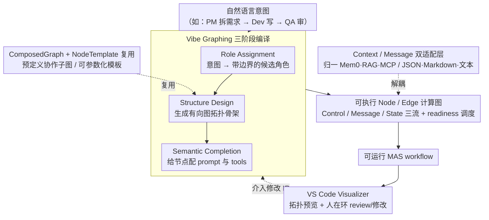

# MASFactory: A Graph-centric Framework for Orchestrating LLM-Based Multi-Agent Systems with Vibe Graphing

**会议**: ACL 2026  
**arXiv**: [2603.06007](https://arxiv.org/abs/2603.06007)  
**代码**: https://github.com/BUPT-GAMMA/MASFactory (有)  
**领域**: LLM 多智能体系统 / 图编排 / 工程框架  
**关键词**: 多智能体编排、Vibe Graphing、计算图、人机协同、上下文适配

## 一句话总结
MASFactory 把 LLM 多智能体系统建模成 Node / Edge 计算图，提出 "Vibe Graphing" 三阶段流水线（Role Assignment → Structure Design → Semantic Completion）把自然语言意图编译成可执行 MAS 工作流，并提供 Context/Message Adapter、ComposedGraph 模板复用与 VS Code 可视化；7 个 benchmark 上复现 5 个代表性 MAS 且效果持平甚至更好，端到端 Vibe Graphing 把 ChatDev 1511 行代码压到 45 行、API 成本比 Vibe Coding 低 1 个数量级。

## 研究背景与动机

**领域现状**：LLM-based 多智能体系统（MAS）通过角色分工 + 相互校验 + 迭代协作扩展单 agent 能力，代表系统如 AutoGen / MetaGPT / ChatDev / AgentVerse / CAMEL。主流编排抽象是有向计算图——LangGraph 把 workflow 建模为 stateful graph，Dify 提供 DAG canvas。

**现有痛点**：① 实现一个完整 MAS 工程成本极高，开发者要手写角色 prompt、连节点路由、定 inter-agent 通信协议；② 真实应用要接 memory（Mem0, MemGPT）、RAG（LlamaIndex, GraphRAG）、MCP 等异构 context source，现有框架靠 workflow-specific 胶水代码，可移植性差；③ MAS 里大量"全局相似、局部不同"的重复子图，现有框架对版本化、模板化复用支持有限；④ 即便用 LangGraph 这种图框架，写复杂 MAS 仍要上千行代码（ChatDev 原版 1511 行 Python）。

**核心矛盾**：用户的意图通常是自然语言（"我要一个写代码的 MAS, 先 PM 拆需求, 再 dev 写, QA 审"），但现有系统逼着开发者把意图翻译成 graph wiring + prompt + protocol 三件套，转换成本高、维护负担重。

**本文目标**：让用户写自然语言意图即可得到一个可运行、可编辑、可重用的 MAS workflow，同时保证与手工实现相当的性能。

**切入角度**：借鉴 "Vibe Coding" 思想但比 Vibe Coding 更结构化——不直接生成代码，而是生成一个 structured intermediate representation（图骨架 + 节点配置），让 LLM 只负责"图设计"，框架负责"图执行"，并在每一阶段插入 human-in-the-loop review。

**核心 idea**：把 MAS 构造重新表述为"intent → structured graph → executable workflow"的三阶段编译，配可复用 ComposedGraph 模板与 pluggable Context/Message Adapter。

## 方法详解

### 整体框架

底层是 Node / Edge 计算图骨架：Node 是计算单元（可扩展为 Graph / Loop / Agent / CustomNode / Interaction / Switch），Edge 表达依赖和消息通路。协作流被显式拆成三种：**Control flow**（推进调度）、**Message flow**（横向传输 node 输出）、**State flow**（沿父子 Graph 同步共享上下文）。Runtime 用 readiness-based 调度让多个就绪节点并发执行，原生支持串行 / 并行 / 分支 / 循环。Agent 节点遵循 Perception-Reasoning-Action 循环并通过 pluggable Message Adapter（JSON / Markdown / 自由文本）和 Context Adapter（适配 Mem0 / LlamaIndex / MCP / RAG）解耦。顶层提供三种 orchestration interface：(a) Vibe Graphing 自然语言驱动，(b) Imperative 手写 Python 代码，(c) Declarative 写配置文件。配套 VS Code 插件 Visualizer 做 topology preview、runtime tracing 和 human-in-the-loop 交互。

### 关键设计

**1. Vibe Graphing 三阶段编译流水线：把自然语言意图编译成可执行图，而不是直接吐代码**

直接让 LLM 写代码（Vibe Coding）经常生成逻辑错误、根本跑不起来的图，而且 API 成本高。MASFactory 的破法是把"意图 → 可执行 workflow"拆成三步编译，每步都产出可读可编辑的结构化中间表示（IR）：(i) Role Assignment 把 task intent 映射成一组带边界的候选 agent 角色；(ii) Structure Design 根据角色间的信息依赖和控制约束生成有向图拓扑骨架，定下连通性与 message/control 的传播方向；(iii) Semantic Completion 在骨架上做参数化实例化，给每个节点配 prompt 和 tools，产出可直接 compile/execute 的 workflow。

这样分阶段的本质，是把"图结构正确性"从 LLM 的自由生成里剥离出来——LLM 只负责填语义（角色、连法、prompt），框架负责保证可执行性，于是 LLM 面对的是一个空间受限得多、更不容易出错的任务。每个阶段的 structured IR 都能在 VS Code Visualizer 里被 human-in-the-loop 介入修改。工程上构造阶段用 gpt-5.2 生成 IR，执行时切到便宜的 gpt-4o-mini。

> ⚠️ gpt-5.2 等模型名以原文为准。

**2. Context Adapter / Message Adapter 双适配层：把异构外部依赖从协作图里解耦**

现实 MAS 高度依赖外部 context 源，但 Mem0 长期记忆、LlamaIndex RAG、Anthropic MCP 各有各的 API 和数据格式；过去要写一堆 workflow-specific 的胶水代码把它们缝进每个 agent，结果是拓扑强耦合于具体框架、几乎没法移植。本文用两层适配器把这件事抽象掉：Context Adapter 把不同 context 源切成标准化单元，对图节点暴露统一接口；Message Adapter 把 agent 的 IO 按指定协议（JSON Schema / Markdown 段 / 纯文本）格式化，并开放用户自定义协议接口。

解耦的直接收益是同一张 collaboration graph 可以无缝换 memory 后端或通信协议而不动拓扑——想把 Mem0 换成 LlamaIndex、或把 JSON 通信换成 Markdown，只改适配器配置，图结构原封不动。

**3. ComposedGraph + NodeTemplate 复用机制：让重复子图以模板形式被声明、复用、版本化**

MAS 里"review-critique-revise"、"propose-vote-merge"这类协作 pattern 反复出现，每次手写既费时又难统一风格。本文提供两级复用：NodeTemplate 让用户先声明结构模板再实例化，可以 clone 出多个全局相同、局部参数不同的图；ComposedGraph 则是一类预定义结构的特化 Graph，用户只需填 node 配置或激活特定分支就能 instantiate。框架自带常用协作子图（如 DyLan-style 动态调度模式），用户也能把自己的设计打包成 reusable 组件。

模板化既砍掉了重复代码量，也让子图能像软件库一样做版本管理与团队协作。一个有力的旁证是：把 ChatDev 用 ComposedGraph 复用后反而修掉了原版里的 routing bug，复现版在 HumanEval 上比原版高 22 个点——脏的工程实现被解耦进模板，方法论本身的效果才显露出来。

### 一个完整示例：把 ChatDev 编进 45 行

以"我要一个写代码的 MAS：先 PM 拆需求，再 dev 写，QA 审"这句自然语言意图为例，走一遍 Vibe Graphing：

- **Role Assignment** 把意图解析成三个带边界的角色——Product Manager（拆需求）、Developer（写代码）、QA（审查），并圈定各自职责边界。
- **Structure Design** 根据"需求 → 实现 → 审查"的信息依赖生成拓扑骨架：PM → Dev → QA 的有向链，并在 QA 不通过时连一条回 Dev 的 message/control 反馈边，形成 review-revise 循环。
- **Semantic Completion** 给三个节点分别填上 prompt（PM 的需求拆解模板、Dev 的编码指令、QA 的审查准则）与 tools，编译成可执行 workflow。

最终这条端到端的 Vibe Graphing 描述只用 **45 行**就替代了原版 **1511 行** Python 的 ChatDev，构造成本约 \$0.26（同等任务下 Vibe Coding 要 \$3 以上），性能与手工原版持平甚至更好。整个过程中用户可以在 VS Code Visualizer 里随时 review 三个阶段的 IR——比如手动改掉某个角色边界或调整反馈边，再继续编译。

### 损失函数 / 训练策略
- 框架无训练目标，所有 agent 用 LLM 推理（默认 gpt-4o-mini，T 默认）；Vibe Graphing 构造阶段用 gpt-5.2 做 IR 生成；评测时 5 个复现 MAS + 2 个 Vibe Graphing 变种（ChatDev 拆阶段版 + Task-Specific 端到端版）。

## 实验关键数据

### 主实验（百分制，"–" 表示编程框架不适用于通用推理 benchmark）

| 方法 | HumanEval | MBPP | BigCodeBench | SRDD | MMLU-Pro | GAIA | GPQA |
|---|---|---|---|---|---|---|---|
| ChatDev (orig) | 82.50 | 71.40 | 50.70 | 82.91 | – | – | – |
| ChatDev (MASFactory) | 81.30 | 74.20 | 53.30 | **84.23** | – | – | – |
| MetaGPT (orig) | 67.07 | 36.03 | 50.10 | 78.19 | – | – | – |
| MetaGPT (MASFactory) | **89.02** | **59.14** | 51.70 | 72.77 | – | – | – |
| AgentVerse (orig) | 85.00 | 74.54 | 65.92 | 87.55 | 64.64 | 12.12 | 38.39 |
| AgentVerse (MASFactory) | 85.00 | 75.15 | 64.12 | **91.06** | 64.16 | **12.73** | 37.50 |
| CAMEL (orig) | 62.20 | 60.60 | 63.51 | 89.42 | 50.08 | 9.70 | 32.59 |
| CAMEL (MASFactory) | **71.85** | 57.80 | **78.16** | 89.69 | **63.04** | **12.73** | 24.78 |
| HuggingGPT (orig) | 82.32 | 68.60 | 28.42 | 87.96 | 65.59 | 9.09 | 56.67 |
| HuggingGPT (MASFactory) | 80.49 | 64.40 | 29.91 | 83.26 | 63.66 | 10.91 | 47.32 |
| **Vibe Graphing-ChatDev** | 83.50 | 74.20 | 45.30 | 88.13 | – | – | – |
| **Vibe Graphing-Task Specific** | 84.76 | 72.37 | 51.67 | 90.71 | 51.73 | 12.12 | 39.51 |

复现版本与原版 broadly consistent or better（MetaGPT 在 HumanEval 上 +22 个点是因为 ComposedGraph 帮助修了原版的 routing bug），Vibe Graphing 自动生成的 workflow 在多数任务上达到甚至超越手工原版。

### 消融实验（代码量 + 成本）

| 实现方式 | 代码量 (lines) | 备注 |
|---|---|---|
| ChatDev 原版 | 1,511 | 手写 |
| MASFactory 复现 | 1,114 | ComposedGraph 复用 |
| Vibe Graphing-ChatDev (按阶段) | 203 | 每个阶段一个 VibeGraph 组件 |
| Vibe Graphing-Task Specific (端到端) | 45 | 单 VibeGraph 编译 |

| 工作流 | Vibe Graphing 成本 ($) | Vibe Coding low ($) | Vibe Coding medium ($) |
|---|---|---|---|
| ChatDev | **0.26** | 3.49 | 3.02 |
| AgentVerse | **0.59** | 4.43 | 6.08 |

Vibe Graphing 比 Vibe Coding 便宜约 10 倍，且 Vibe Coding 产物经常出图逻辑错误以致不可执行（作者直接放弃 Vibe Coding 的性能对比，只比成本）。

### 关键发现
- 用结构化 IR 而非直接生成代码，是 Vibe Graphing 既便宜又稳定的关键——LLM 只负责"图结构 + prompt 设计"这种空间更受限的任务，框架接管"可执行性"。
- ComposedGraph 帮助 MetaGPT 复现实际上超原版（HumanEval +22, MBPP +23），说明把脏的工程实现解耦到模板里，原本被噪声掩盖的方法论本质效果反而显出来。
- 在 GAIA / GPQA 这类通用推理任务上，Vibe Graphing 自动生成的 workflow 与手工 AgentVerse 持平甚至略好（GPQA 39.51 vs 38.39），证明该范式能泛化到非编程场景。
- HuggingGPT 复现略低（GPQA 47.32 vs 56.67），作者归因于工具调用接口的细节差异——这指出 Vibe Graphing 对"高度依赖外部工具语义"的 MAS 还需要更精细的 Context Adapter。

## 亮点与洞察
- 把 MAS 构造分解为 "intent → structure → semantics" 三阶段，等价于把"先想清楚要什么角色"、"再画清楚怎么连"、"最后写清楚每个角色干嘛"这条人类设计直觉显式编码——比 Vibe Coding 直接吐代码的"一次性魔法"更可控、更便宜。
- Context Adapter 这一层抽象非常工程化但极具复用价值：把 mem0/llamaindex/MCP/RAG 都归一到 standardized context unit，让 graph 拓扑与外部生态彻底解耦，未来切换或叠加 context source 时不必动核心。
- Three flow（control / message / state）的分离是个值得借鉴的 systems design：把"调度信号、数据、共享状态"三类信号显式拆开，让循环 / 分支 / 并发等复杂控制流都自然落到 readiness-based 调度上。
- 把 ChatDev 1511 行变成 45 行端到端 Vibe Graphing 描述，本身就是个有说服力的开发者体验广告——MAS 框架的未来确实可能是"少写代码、多写意图"。

## 局限与展望
- 不支持中断恢复（checkpointing），长 workflow 失败要重跑，对真实生产部署是硬伤。
- ComposedGraph 组件库还在持续构建，目前还没覆盖足够多的协作 pattern。
- Vibe Graphing 构造阶段强依赖 gpt-5.2（顶级模型），如果用小模型生成 IR 是否仍稳定没系统评测。
- 实验缺 latency / throughput 类系统指标，只看 quality 与代码行数；高并发场景下 readiness-based 调度的具体表现未知。
- HuggingGPT 在工具型任务上的复现差距说明 Context/Message Adapter 在工具协议侧还不够完整。
- 没有 RL 或学得的 routing policy，所有 control flow 决策还是 LLM/人工设定，遇到长链 dynamic decision 时可能成为瓶颈。

## 相关工作与启发
- **vs LangGraph / Dify**: 都用计算图建模 workflow，但 LangGraph/Dify 仍需手写所有节点逻辑，本文加 Vibe Graphing 自动生成图 + ComposedGraph 复用 + Context Adapter 三层抽象，开发者体验大幅简化。
- **vs AutoGen / MetaGPT / ChatDev / CAMEL**: 它们是 specific MAS 方法，本文是 meta-framework，能复现这些方法且代码更短；MetaGPT 复现还反超原版说明本框架抽象层级到位。
- **vs CrewAI / Google ADK**: 它们偏 code-first 编程式编排，本文走"图 + 自然语言"双驱动，可视化和 human-in-the-loop 更友好。
- **vs Vibe Coding（直接让 LLM 写代码）**: 本文证明结构化 IR + 阶段化编译比 end-to-end 代码生成在成本（10×）、正确率（Vibe Coding 经常 broken）上都明显占优——这条经验对所有 "LLM 生成软件" 的方向都有价值。

## 评分
- 新颖性: ⭐⭐⭐ 主要贡献是工程框架与 "结构化 IR + 三阶段编译" 这条 Vibe Graphing 流水线，单点创新不算大但组合得当
- 实验充分度: ⭐⭐⭐ 7 个 benchmark + 5 个复现 + 2 个 Vibe 变体 + 代码量/成本对比，覆盖面够但缺 latency 与失败模式分析
- 写作质量: ⭐⭐⭐⭐ 架构图 + 表格清晰，能让框架使用者快速上手
- 价值: ⭐⭐⭐⭐ 对 MAS 开发者而言，1511→45 行的开发者体验提升直接、可感、可复用，是真正能用上的框架

<!-- RELATED:START -->

## 相关论文

- [\[ACL 2026\] BookAgent: Orchestrating Safety-Aware Visual Narratives via Multi-Agent Cognitive Calibration](bookagent_orchestrating_safety-aware_visual_narratives_via_multi-agent_cognitive.md)
- [\[AAAI 2026\] A Graph-Theoretical Perspective on Law Design for Multiagent Systems](../../AAAI2026/multi_agent/a_graph-theoretical_perspective_on_law_design_for_multiagent_systems.md)
- [\[AAAI 2026\] Scalable and Accurate Graph Reasoning with LLM-Based Multi-Agents](../../AAAI2026/multi_agent/scalable_and_accurate_graph_reasoning_with_llm-based_multi-agents.md)
- [\[ACL 2026\] Conjunctive Prompt Attacks in Multi-Agent LLM Systems](conjunctive_prompt_attacks_in_multi-agent_llm_systems.md)
- [\[ACL 2026\] CIA: Inferring the Communication Topology from LLM-based Multi-Agent Systems](cia_inferring_the_communication_topology_from_llm-based_multi-agent_systems.md)

<!-- RELATED:END -->
