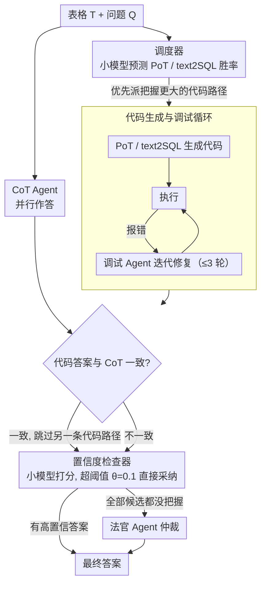

# MATA: Multi-Agent Framework for Reliable and Flexible Table Question Answering

**会议**: ACL 2026  
**arXiv**: [2602.09642](https://arxiv.org/abs/2602.09642)  
**代码**: [GitHub](https://github.com/AIDASLab/MATA)  
**领域**: LLM Agent  
**关键词**: 表格问答, 多Agent框架, 多推理路径, 模型无关, LLM效率

## 一句话总结
提出 MATA 多Agent表格问答框架，通过调度器优先选择推理路径（CoT/PoT/text2SQL）、置信度检查器筛选答案、法官Agent仲裁，实现模型无关的高效准确表格QA，在10个LLM上平均EM提升40.1%。

## 研究背景与动机

**领域现状**：LLM 显著推动了表格问答（TableQA）的发展，使自然语言与结构化表格的交互成为可能。现有方法通常利用 CoT、PoT（Program-of-Thought）或 text2SQL 等推理策略生成答案。

**现有痛点**：(1) 多数高性能方法依赖闭源 LLM（GPT-4o 等），在隐私敏感或成本受限场景下不适用，且在开源小模型上的可靠性未被充分验证；(2) 为提高答案可靠性，现有框架频繁调用 LLM 推理（如 Self-Consistency），导致计算成本高昂甚至因 over-prompting 反而降低准确率；(3) 大多数框架仅利用 CoT+PoT 两种推理路径，未能充分利用 CoT、PoT 和 text2SQL 三种互补推理策略的多样性。

**核心矛盾**：推理多样性与推理效率之间的权衡——增加推理路径可提升准确率，但每条路径都需要 LLM 推理开销，盲目执行所有路径既浪费又可能引入噪声。

**本文目标**：构建模型无关的 TableQA 框架，在多种开源/闭源 LLM 上都能保持高准确率，同时通过智能调度最小化 LLM 调用次数。

**切入角度**：推理多样性不需要固定的推理预算——通过轻量级控制器决定哪些推理分支是必要的、何时可以提前终止验证。

**核心 idea**：用轻量工具模型（Scheduler、Confidence Checker、Format Matcher）协调多个 LLM Agent 的推理路径选择和答案验证，实现推理多样性与效率的最优平衡。

## 方法详解

### 整体框架
MATA 接收表格 T 和问题 Q，通过三阶段流程产出最终答案：(1) Agent 选择阶段：调度器（Scheduler）决定 PoT 和 text2SQL 的执行优先级，同时 CoT Agent 并行执行；(2) 代码生成与调试阶段：PoT/text2SQL Agent 生成代码并由调试 Agent 迭代修复；(3) 最终答案决策阶段：置信度检查器（Confidence Checker）评估候选答案置信度，必要时调用法官 Agent（Judge Agent）仲裁。整条链路按"先调度、再生成调试、最后核验"的顺序推进，下面三个关键设计依次对应这三个阶段。

### 关键设计

**1. 调度器 (Scheduler)：用 24.65M 的小模型决定先跑哪条推理路径，避免盲目执行所有分支**

CoT、PoT、text2SQL 三条路径各有所长，但每跑一条都要一次 LLM 推理，全跑既费算力又可能引入噪声。调度器把"派谁上场"交给一个轻量分类器：以 MobileBERT 接两层 MLP（仅 24.65M 参数），输入表格的元特征（大小、schema、数据类型）和问题语义，输出 PoT 与 text2SQL 各自胜出的概率。系统让 CoT Agent 并行作答，同时按调度器给的概率优先执行更有把握的那条代码路径；一旦它的答案与 CoT 对上，就直接跳过另一条路径进入答案选择，省下一次 LLM 调用。它的训练标签来自 WikiTQ/TabMWP/TabFact 上三个 LLM 的真实推理结果——哪条路径在哪类问题上更对，调度器就学会优先派谁上。

**2. 代码生成与调试循环：只给代码路径配调试器，因为文本推理改了也没用**

PoT/text2SQL 生成的是可执行代码，天然容易出语法或逻辑错误。对这两条路径，生成的代码先执行，一旦报错就交给对应的调试 Agent（PDA 修 PoT、SDA 修 text2SQL），最多迭代 $N=3$ 轮；并设了提前终止：若新代码与上一版高度相似、执行结果又相同，就判定改不动了直接停。CoT 这条文本路径则不进调试循环——反复让模型自我修订文本收益甚微，只会徒增调用，所以调试预算全留给真正能修好的代码路径。

**3. 置信度检查器 (Confidence Checker)：先用小模型判断答案够不够稳，够稳就不惊动昂贵的法官**

把每个候选答案都丢给法官 Agent 仲裁，成本高得没必要。置信度检查器用一个微调过的 DeBERTaV3-large（~435M 参数）充当守门人：输入表格、问题和各路径的候选答案，输出每条路径的置信度分数。只要最高置信度超过阈值 $\theta=0.1$，就直接采纳该答案；只有当所有候选都拿不准时，才调用法官 Agent 综合裁决。这样大部分简单情形由几百兆的小模型秒解，法官 Agent 只在真正纠结的少数 case 上出手。

### 一个完整示例：一道数值类表格问题怎么走完 MATA

假设问题是"哪种企鹅体重最大"，表格带 schema 和若干数值列。Scheduler 读到这是结构化数值查询，判定 text2SQL 的胜出概率高于 PoT，于是优先派 text2SQL Agent，同时 CoT Agent 并行作答。text2SQL 生成的 SQL 第一次执行报列名错误，SDA 修正列名后重跑，得到答案与 CoT 给出的结果一致；此时 Scheduler 直接跳过 PoT，省下一次 LLM 调用。两个一致答案进入 Confidence Checker，最高置信度超过 $\theta=0.1$，于是不触发 Judge Agent，直接输出。整条链路只用了 text2SQL + CoT 两次推理（外加一次 debug），既没跑满三条路径，也没动用昂贵的 Judge。

### 损失函数 / 训练策略
Scheduler 和 Confidence Checker 分别在 173,664 条样本上训练。Scheduler 训练标签为 PoT 或 text2SQL 路径是否正确，CC 训练标签为三条路径各自的正确性。所有 LLM Agent 共享同一骨干模型，仅通过角色提示区分。

## 实验关键数据

### 主实验

| 基准 | 指标 | MATA | MixSC | SynTQA | TabLaP |
|------|------|------|-------|--------|--------|
| Penguins (平均) | EM | 0.881 | 0.626 | 0.810 | 0.524 |
| Penguins (平均) | F1 | 0.881 | 0.637 | 0.811 | 0.544 |
| TableBench (平均) | EM | 0.451 | 0.286 | 0.322 | 0.260 |
| TableBench (平均) | F1 | 0.482 | 0.331 | 0.362 | 0.307 |

### 消融实验

| 配置 | Penguins EM | TableBench EM | 说明 |
|------|------------|--------------|------|
| MATA (完整) | 0.881 | 0.451 | 完整框架 |
| w/o Scheduler | ~0.86 | ~0.43 | 执行所有路径，LLM 调用增加 |
| w/o CC (仅 JA) | ~0.85 | ~0.42 | 每次都调用 Judge Agent |
| w/o Debug | ~0.82 | ~0.38 | 不进行代码调试 |

### 关键发现
- MATA 在小模型（3B-7B）上的提升最为显著：qwen2.5-3b 从 TabLaP 的 0.163 EM 提升至 0.291，mistral-7b 从 0.036 提升至 0.294
- 在大模型上，MATA 仍然保持优势但差距缩小，因为大模型本身推理能力更强
- Scheduler 有效减少了约 30-40% 的 LLM 调用，同时保持甚至提升了准确率

## 亮点与洞察
- 轻量工具模型（总计不到 1B 参数）配合 LLM Agent 的设计非常实用——Scheduler 和 CC 作为"守门人"，避免了不必要的昂贵推理调用
- 三种推理路径的互补性被充分验证：CoT 擅长模糊/直觉性问题，PoT 擅长数值计算，text2SQL 在结构化查询上更精确
- 模型无关设计使框架可直接迁移到任何新 LLM，这在开源模型快速迭代的当下非常有价值

## 局限与展望
- Scheduler 和 CC 的训练依赖特定数据集（WikiTQ/TabMWP/TabFact），可能在领域差异较大的表格上泛化受限
- 当前仅支持单表推理，多表关联问答尚未涉及
- Debug 循环的最大迭代次数 N=3 是经验值，不同复杂度的任务可能需要自适应调整

## 相关工作与启发
- **vs MixSC**: MixSC 仅整合 CoT 和 Python 两种路径并用自一致性投票，缺少 text2SQL 和智能调度，MATA 的平均 EM 高出 25.5%
- **vs SynTQA**: SynTQA 集成 text2SQL 和 E2E TQA 但不支持模型切换，MATA 的模型无关设计使其在小模型上优势巨大
- **vs TabLaP**: TabLaP 依赖多个不同 LLM 协同且仅支持特定模型，MATA 统一用同一骨干实现更优效果

## 评分
- 新颖性: ⭐⭐⭐⭐ 轻量工具+多Agent协调的架构设计新颖实用
- 实验充分度: ⭐⭐⭐⭐⭐ 10个LLM、两个基准、三种指标，覆盖面极广
- 写作质量: ⭐⭐⭐⭐ 结构清晰，算法描述详细
- 价值: ⭐⭐⭐⭐ 模型无关框架对工业部署有直接参考价值

<!-- RELATED:START -->

## 相关论文

- [\[AAAI 2026\] Hierarchical Pedagogical Oversight: A Multi-Agent Adversarial Framework for Reliable AI Tutoring](../../AAAI2026/multi_agent/hierarchical_pedagogical_oversight_a_multi-agent_adversarial_framework_for_relia.md)
- [\[ACL 2026\] From Query to Counsel: Structured Reasoning with a Multi-Agent Framework and Dataset for Legal Consultation](from_query_to_counsel_structured_reasoning_with_a_multi-agent_framework_and_data.md)
- [\[ACL 2026\] MASFactory: A Graph-centric Framework for Orchestrating LLM-Based Multi-Agent Systems with Vibe Graphing](masfactory_a_graph-centric_framework_for_orchestrating_llm-based_multi-agent_sys.md)
- [\[ACL 2026\] EvoSci: A Bio-Inspired Multi-Agent Framework for the Evolution of Scientific Discovery](evosci_a_bio-inspired_multi-agent_framework_for_the_evolution_of_scientific_disc.md)
- [\[ACL 2026\] A Multi-Agent Framework for Feature-Constrained Difficulty Control in Reading Comprehension Item Generation](a_multi-agent_framework_for_feature-constrained_difficulty_control_in_reading_co.md)

<!-- RELATED:END -->
