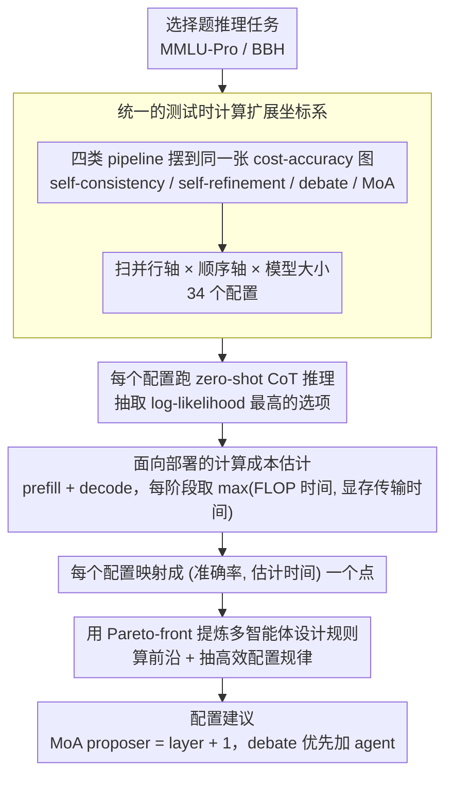

# Multi-Agent Reasoning Improves Compute Efficiency: Pareto-Optimal Test-Time Scaling

**会议**: ACL 2026  
**arXiv**: [2605.01566](https://arxiv.org/abs/2605.01566)  
**代码**: https://github.com/Multi-Agent-LLMs/lm-evaluation-harness  
**领域**: LLM推理  
**关键词**: 测试时计算, 多智能体推理, Pareto前沿, Mixture-of-Agents, 计算效率

## 一句话总结

这篇论文把 self-consistency、self-refinement、multi-agent debate 和 Mixture-of-Agents 放到统一计算预算下比较，发现多智能体推理尤其是 MoA 在 Pareto 前沿上更高效，最高可在约 20 倍 CoT 预算下把 MMLU-Pro 准确率从 64.3% 提升到 71.4%。

## 研究背景与动机

**领域现状**：LLM 推理能力的提升不再只依赖训练更大的模型，测试时计算也成为重要手段。常见做法包括 chain-of-thought、self-consistency、多轮 self-refinement、多智能体 debate，以及把多个候选答案逐层聚合的 Mixture-of-Agents (MoA)。这些方法的共同点是在推理阶段多花计算，换取更稳定或更强的答案。

**现有痛点**：很多工作只报告最终准确率，却没有把不同方法放在相同计算预算下比较。一个方法如果调用模型几十次，自然可能比一次 CoT 更强，但这不等于它更高效；真实部署更关心的是同样延迟、同样算力、同样预算下哪个 pipeline 能给出更高准确率。

**核心矛盾**：测试时计算存在明显的 accuracy-cost trade-off。并行采样可以增加候选路径，顺序 refinement 或 debate round 可以加深推理，但两者都会增加 FLOPs、显存读写和推理延迟。问题不是“多花计算有没有用”，而是“应该把计算花在更多样本、更多智能体、更多轮交互、还是更大模型上”。

**本文目标**：系统评估四类推理扩展策略在相同计算口径下的表现，回答三个实践问题：多智能体是否真的比单智能体更省算力；多智能体的并行规模和顺序深度该怎么配；小模型大量测试时扩展能否比大模型少量调用更划算。

**切入角度**：作者不只看 FLOPs，而是用同时考虑算术计算和模型权重内存传输的估计运行时间作为成本，再用 Pareto-front 找出“在给定成本下准确率最高”的配置。这样可以避免单纯按生成次数或 FLOPs 比较带来的偏差。

**核心 idea**：把测试时推理 pipeline 当作可调的计算分配问题，用 Pareto 最优前沿比较不同方法，并从前沿配置中总结多智能体推理的实用扩展规则。

## 方法详解

### 整体框架

论文的实验框架可以理解为三层扫描。第一层是 pipeline 选择：比较 self-consistency、self-refinement、debate 和 MoA。第二层是 pipeline 参数：self-consistency 改变采样条数，self-refinement 改变迭代轮数，debate 改变智能体数和讨论轮数，MoA 改变 proposer 数和聚合层数。第三层是模型大小：用同一模型家族的 Llama 3.1 70B 和 8B 区分“模型容量”与“测试时计算扩展”的影响。

所有方法都以 zero-shot CoT 风格求解选择题推理任务。模型被提示为推理专家，先逐步思考，再在结尾输出最终选项。每个 pipeline 结束后，作者用“Final answer of choices {choices}:”提示抽取候选选项，并选择 log-likelihood 最高的选项作为最终答案。

评估指标有两个：准确率和计算成本。准确率是在 MMLU-Pro、BBH 上的答对比例；计算成本不是简单调用次数，而是理论运行时间估计。作者把生成分为 prefill 和 decode 两阶段，分别估计 FLOPs 时间与内存传输时间，每阶段取二者较慢者，再相加得到总时间。这样做的原因是实际 GPU 推理常常受内存带宽影响，单看 FLOPs 会高估小模型大量调用的效率。

最终分析不是只找最高准确率，而是画出每个配置的 accuracy-cost 点，并计算 Pareto-front：如果某配置在更低或相同成本下还能取得更高或相同准确率，那么被支配的配置就不是高效选择。论文的大部分结论都来自这些 Pareto 最优点的形态。

### 关键设计

**1. 统一的测试时计算扩展坐标系：把四类结构迥异的推理方法摆到同一张 cost-accuracy 图上，逼它们在相同预算下竞争**

过去比较这些方法容易把"方法更好"和"单纯多花了计算"混为一谈——一个调用模型几十次的 pipeline 自然可能比一次 CoT 强，但那未必更高效。作者把所有扩展方式拆成并行扩展和顺序扩展两个轴：self-consistency 主要加并行 CoT 样本数，self-refinement 加顺序修正步数，debate 同时有智能体数和讨论轮数，MoA 同时有 proposer 数和聚合层数。每个配置都被映射成一个"准确率 + 估计时间成本"的点。统一坐标系之后，debate 和 MoA 这类多智能体方法必须和 self-consistency 在同样预算下同台比，得到的结论才贴近真实部署。

**2. 面向部署的计算成本估计：用比 FLOPs 更接近真实延迟的口径衡量预算，免得高估"小模型狂调用"的便宜**

只按 FLOPs 算成本会误导：小模型多次调用的算术量看着低，但真实推理每次都要反复搬运权重，常常受显存带宽而非算力限制。作者把生成拆成 prefill 和 decode 两阶段，分别估两类时间——计算时间由 $2 \cdot P \cdot T$ 形式的 FLOPs 决定，内存传输时间由参数量、量化精度、batch size、GPU 数和显存带宽决定——每阶段取 $\max(\text{FLOP time}, \text{memory time})$，再把两阶段相加得到总时间。把权重搬运计入成本后，"小模型多算几轮"和"大模型少算几轮"的取舍才能被公平地放在一起比。

**3. 用 Pareto-front 提炼多智能体设计规则：从上百次评估里抽出真正高效的参数组合，而不是只盯单点最高分**

多智能体的参数空间很大，盲目加 agent 或加 round 既可能浪费预算，又可能因噪声和错误扩散而降分。作者对 34 个配置、100 多次评估计算 Pareto 前沿——只要某配置能在更低或相同成本下取得更高或相同准确率，被它支配的配置就不算高效选择——再观察前沿上的参数规律。结果很干净：debate 的高效点主要来自增加 agent 数而非增加 round；MoA 的高效点几乎都满足 proposer 数比 layer 数多 1，例如 3 models/2 layers、4 models/3 layers、5 models/4 layers。这些从数据里浮现的规律直接变成了可执行的配置建议。

### 损失函数 / 训练策略

本文没有训练新模型，也没有引入额外损失函数，是纯测试时推理策略评估。主实验使用 4-bit 量化的 Llama 3.1 70B-Instruct，补充实验使用同家族 8B 模型；所有生成采用 temperature 0.7、top-p 0.95。为了控制计算成本，MMLU-Pro 和 BBH 都抽样 1000 道题进行评估，并在局限性中报告由样本量带来的置信区间。

## 实验关键数据

### 主实验

主结果集中在 MMLU-Pro。CoT 可以看作 self-consistency 只有 1 条样本的特例，准确率为 64.3%。在最多约 20 倍 CoT 预算范围内，MoA 的 Pareto-front 最强，debate 次之，self-consistency 更早饱和，self-refinement 甚至低于 CoT。

| 方法 / 配置 | MMLU-Pro准确率 | 相对CoT提升 | 与self-consistency同预算对比 | 主要结论 |
|-------------|----------------|-------------|------------------------------|----------|
| CoT / self-consistency 1 sequence | 64.3% | - | - | 基础单次推理基线 |
| Self-consistency / 10 sequences | 68.7% | +4.4 pp | 0 | 并行采样有效，但较早饱和 |
| Debate / 4 agents, 2 rounds | 70.0% | +5.7 pp | +1.3 pp | 多智能体交互比单纯采样更高效 |
| MoA / 5 models, 4 layers | 71.4% | +7.1 pp | +2.7 pp | 最高准确率且主导 Pareto 前沿 |
| Self-refinement / 多轮迭代 | 低于64.3% | 负提升 | 低于其他方法 | 顺序自我修正没有带来可靠收益 |

任务难度分析表明，额外测试时计算对困难题更有价值。作者先用 20 次 CoT 估计每道题的 solve rate，把 MMLU-Pro 题目分为 easy、medium、hard，再看不同预算区间下的平均准确率。

| 计算预算 | Easy准确率 | Medium准确率 | Hard准确率 | 观察 |
|----------|------------|---------------|------------|------|
| CoT | 94.4% | 53.0% | 8.4% | 单次 CoT 已能解决大多数简单题 |
| 1-5× CoT | 95.6% | 58.6% | 13.6% | 中等和困难题收益明显 |
| 5-10× CoT | 95.4% | 60.4% | 14.7% | 继续增加预算主要帮助非简单题 |
| 10-15× CoT | 96.0% | 62.1% | 14.2% | hard 有波动，但总体高于 CoT |
| 15-20× CoT | 96.6% | 61.5% | 17.4% | 困难题相对提升最大 |
| 总提升 | +2.2 pp | +8.5 pp | +9.0 pp | 应按题目难度自适应分配预算 |

### 消融实验

论文没有传统训练模块消融，而是通过参数扫描分析多智能体系统的扩展方向。最重要的结论是：debate 更应该扩展 agent 数，MoA 的高效点通常满足 proposer 数 = layer 数 + 1。

| 系统 | 参数变化 | 最优/推荐趋势 | 现象解释 |
|------|----------|----------------|----------|
| Debate | 增加 agents | 准确率提升到 4 agents 左右，之后下降 | 更多并行观点能增加答案多样性，但过多 agent 会带来噪声和成本 |
| Debate | 增加 rounds | 2 rounds 通常最好，更多轮不稳定甚至降分 | 讨论轮数增加会拉长上下文，已有错误也可能在多轮记忆中扩散 |
| MoA | 增加 proposer models | 与 layer 搭配到 models = layers + 1 时最稳 | 并行候选足够多时，后续聚合能更好综合证据 |
| MoA | 增加 layers | 在合适比例内有益，过深后收益下降 | MoA 不像 debate 那样累积完整讨论记忆，因此顺序聚合的副作用较小 |
| 模型大小 | 8B 大量扩展 vs 70B CoT | 70B CoT 仍显著更强 | 模型容量差距不能靠低质量小模型的多次推理完全弥补 |

作者还专门考察了 MoA 中 proposer 和 aggregator 的模型大小分配。固定 5 models / 4 layers 时，如果 proposer 都是 70B，即使用 8B aggregator 也还能有 69.6%；但如果 proposer 是 8B，即使 aggregator 是 70B 也只有 52.9%。这说明 MoA 的质量主要由前面大量 proposer 生成的候选证据决定，最后一次聚合很难弥补低质量候选。

| MoA配置 (5 models, 4 layers) | Aggregator 8B | Aggregator 70B | 关键解读 |
|-----------------------------|----------------|-----------------|----------|
| Proposers 8B | 51.2% | 52.9% | 弱 proposer 生成的证据质量太低，强 aggregator 难以补救 |
| Proposers 70B | 69.6% | 71.4% | 强 proposer 是主要质量来源，aggregator 变小只造成小幅下降 |

### 关键发现

- MoA 是最稳的 Pareto 最优方法：在 MMLU-Pro 上从 64.3% 提升到 71.4%，且比同预算 self-consistency 高 2.7 个百分点。
- Debate 的收益主要来自并行 agent，而不是更多 debate rounds；轮数过多会增加上下文成本，也可能放大错误观点。
- Self-refinement 在本实验中表现很差，说明“让模型自己反复修改”并不等价于更强推理，尤其是在没有外部反馈的选择题任务中。
- 测试时计算对 hard 和 medium 题更值得，easy 题只提升 2.2 个百分点，说明实际系统应先估计难度，再动态分配 MoA 或轻量 CoT。
- 小模型大量扩展没有击败大模型 CoT：在相同于 70B CoT 的预算下，最佳 8B 配置仍低约 13 个百分点。
- MoA 中 proposer 比 aggregator 更关键，因为 proposer 在前几层产生了大部分候选证据；最后 aggregator 只做一次聚合，计算占比也小。

## 亮点与洞察

- **把“准确率竞赛”改成“效率竞赛”**：论文的价值不在于发明新 pipeline，而在于用 Pareto-front 重新校准已有 test-time scaling 方法。这个视角对部署非常重要，因为真实应用中预算总是有限的。
- **MoA 的经验规则很实用**：proposer 数比 layer 数多 1 是一个简单可记的配置启发。它背后的直觉是先给聚合器足够多样的候选，再用有限层数逐步综合，而不是盲目加深或加宽。
- **内存传输成本提醒很关键**：很多测试时扩展论文只按 FLOPs 估计成本，但 LLM 推理经常受显存带宽限制。本文把权重搬运纳入成本后，对“小模型多次调用是否更划算”的判断更谨慎。
- **任务难度路由是自然下一步**：easy 题过度推理收益很小，hard 题收益最大。把本文结论和 adaptive routing 结合，可以设计“简单题 CoT、困难题 MoA”的预算分配器。
- **负结果同样有信息量**：self-refinement 在多个配置下不如 CoT，说明顺序扩展如果缺少可靠反馈，很可能只是增加冗余思考，而不是提升答案质量。

## 局限与展望

- **样本量有限**：由于多智能体评估很昂贵，主实验只从基准中抽取 1000 题。作者估计在 0.63-0.72 准确率区间内，95% 二项置信区间约为 0.028-0.03，因此相邻配置的单点差异需要谨慎解读。
- **成本仍是理论估计**：运行时间模型考虑了 FLOPs 和内存传输，但没有覆盖框架调度、batching、KV cache 管理、并行通信、服务端排队等系统因素。真实部署下 Pareto-front 可能随硬件和推理引擎改变。
- **模型范围偏窄**：实验主要使用 Llama 3.1 70B/8B 的 4-bit 量化版本，结论是否适用于闭源模型、MoE 模型、推理专用模型或更强的 reasoning model 仍需验证。
- **任务类型集中在选择题推理**：MMLU-Pro 和 BBH 覆盖面较广，但仍不同于开放生成、代码、工具调用、交互式 agent 等任务。多智能体在这些场景下的最优并行/顺序比例可能不同。
- **MoA 的同质模型设定较强**：论文为了控制变量，多数 MoA 配置使用同一模型作为 proposer 与 aggregator。现实系统常会混用不同厂商、不同能力模型，如何在异质模型间做成本最优分配仍是开放问题。

## 相关工作与启发

- **vs Self-Consistency**: Self-consistency 通过多条独立 CoT 路径投票提升稳定性，本文发现它确实有效但容易饱和；MoA 和 debate 在同等预算下更强，说明“候选之间的信息交互/聚合”比纯多数投票更有价值。
- **vs Self-Refine**: Self-refinement 依靠模型自我反馈和自我修改，本文实验中反而低于 CoT。这个结果呼应“LLM 不能可靠自我纠错”的相关发现，也提示顺序推理需要外部信号或验证器支持。
- **vs Multi-Agent Debate**: Debate 让多个 agent 轮流参考彼此回答，本文认为它比 self-consistency 更高效，但增加 round 的收益不稳定。实际使用时应优先扩展 agent 数，并限制讨论轮数。
- **vs Mixture-of-Agents**: MoA 通过多 proposer 逐层产生和聚合答案，本文验证它在 Pareto-front 上最强。与 debate 相比，MoA 不需要保留完整多轮讨论记忆，因此顺序层数的成本副作用更小。
- **vs Inference Scaling Laws / Best-of-N**: 这些工作强调测试时计算可以替代部分模型规模增长，本文则补充了更细的结构比较：同样是多花计算，花在 MoA 的并行候选与聚合上，比简单 best-of-n 更划算。
- **启发**：未来可以把本文的 Pareto-front 评估方法作为所有 test-time scaling 论文的标准报告项，同时加入任务难度估计器，实现按题分配 CoT、self-consistency、debate 或 MoA 的动态推理系统。

## 评分

- 新颖性: ⭐⭐⭐⭐ 主要贡献不是提出新算法，而是用统一预算和 Pareto-front 系统比较已有推理策略，并提炼出 MoA 配置规则。
- 实验充分度: ⭐⭐⭐⭐ 覆盖四类 pipeline、34 个配置、100 多次评估、两种 benchmark 和两种模型大小；但样本量和模型族仍有限。
- 写作质量: ⭐⭐⭐⭐⭐ 问题定义清楚，实验问题逐节展开，结论能转化为实践建议，局限性也写得比较诚实。
- 价值: ⭐⭐⭐⭐⭐ 对 test-time scaling 和多智能体部署很有参考价值，尤其适合指导有限预算下该选 self-consistency、debate 还是 MoA。

<!-- RELATED:START -->

## 相关论文

- [\[ACL 2026\] Scaling External Knowledge Input Beyond Context Windows of LLMs via Multi-Agent Collaboration](scaling_external_knowledge_input_beyond_context_windows_of_llms_via_multi-agent_.md)
- [\[ACL 2025\] Preventing Rogue Agents Improves Multi-Agent Collaboration](../../ACL2025/multi_agent/preventing_rogue_agents_improves_multi-agent_collaboration.md)
- [\[ACL 2026\] From Query to Counsel: Structured Reasoning with a Multi-Agent Framework and Dataset for Legal Consultation](from_query_to_counsel_structured_reasoning_with_a_multi-agent_framework_and_data.md)
- [\[ACL 2026\] Debating the Unspoken: Role-Anchored Multi-Agent Reasoning for Half-Truth Detection](debating_the_unspoken_role-anchored_multi-agent_reasoning_for_half-truth_detecti.md)
- [\[ACL 2026\] Collaborative Multi-Agent Scripts Generation for Enhancing Imperfect-Information Reasoning in Murder Mystery Games](collaborative_multi-agent_scripts_generation_for_enhancing_imperfect-information.md)

<!-- RELATED:END -->
