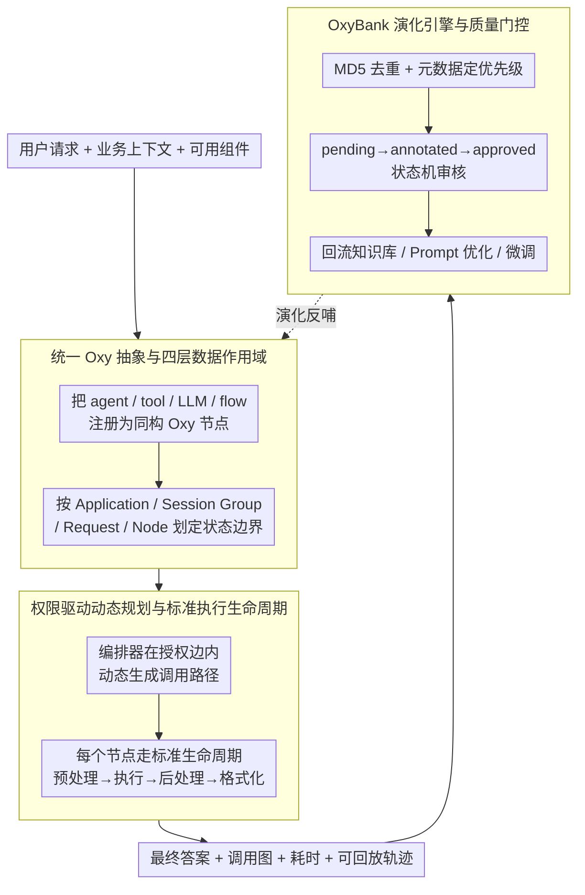

# OxyGent: Making Multi-Agent Systems Modular, Observable, and Evolvable via Oxy Abstraction

**会议**: ACL2026  
**arXiv**: [2604.25602](https://arxiv.org/abs/2604.25602)  
**代码**: https://github.com/jd-opensource/OxyGent  
**领域**: Agent / 多智能体系统  
**关键词**: 多智能体系统、Agent框架、可观测性、动态规划、持续演化

## 一句话总结
OxyGent 把 agent、工具、LLM 与推理流程统一封装成可插拔的 Oxy 原子组件，并用权限驱动的动态规划与 OxyBank 数据回流机制，让工业级多智能体系统更容易搭建、监控和持续演化。

## 研究背景与动机
**领域现状**：LLM agent 正在从单个聊天助手走向多智能体系统，典型应用包括智能客服、企业知识库、自动化办公、文件管理与复杂信息检索。主流框架通常会提供 agent 定义、工具调用、消息传递、流程编排和 tracing 能力，让开发者能把多个专门角色拼成一个任务求解系统。

**现有痛点**：论文指出，很多 MAS 框架在研究原型中好用，但进入工业部署后会暴露三个问题。第一，抽象层不统一，agent、tool、LLM、flow 往往是不同类型的对象，导致复用和热替换成本高。第二，固定 DAG 或预先写死的 plan-and-execute 流程难以应对真实环境中的分支、不确定性和失败恢复。第三，系统上线后缺少从执行轨迹到数据标注、评测、知识库更新和模型优化的闭环，agent 能力容易停在部署时刻。

**核心矛盾**：多智能体系统既需要足够灵活，允许运行时根据任务动态组合路径；又需要足够可控，能够让开发者看到每个节点为什么被调用、耗时在哪里、失败如何传播。如果只追求自由协作，系统会变成黑箱；如果只追求固定流程，又会牺牲 agent 的自适应能力。

**本文目标**：OxyGent 想解决的是生产级 MAS 的工程底座问题，而不是提出一个新的推理模型。它把目标拆成三件事：用统一抽象降低组件组合成本，用运行时可视化和生命周期钩子提高可观测性，用 OxyBank 把线上轨迹沉淀成可审计、可回流的 AI 资产。

**切入角度**：作者的观察是，MAS 的复杂性很多时候不是来自单个 agent 的能力，而是来自系统中不同实体之间的接口不一致、权限边界不清、状态共享混乱和执行过程不可追踪。因此，与其继续堆新的 planner，不如先把 agent 生态中的所有“能力单元”都变成同一种可管理的原子节点。

**核心 idea**：用统一的 Oxy 抽象把 agent、tool、LLM 和 flow 变成同构节点，再用权限关系在运行时生成执行图，并将执行轨迹回流到 OxyBank 中形成持续演化闭环。

## 方法详解
OxyGent 的方法可以理解为一个面向多智能体系统的操作系统层：它不替代具体 LLM，也不限定某一种固定 workflow，而是规定系统里的能力如何被封装、如何互相调用、如何记录轨迹，以及如何从历史轨迹中反哺系统。论文的技术主线由三部分组成：统一 Oxy 抽象、权限驱动动态规划、OxyBank 演化引擎。

### 整体框架
输入端是用户请求、业务上下文和一组可用的 agent/tool/LLM/flow 组件。开发者先把这些组件注册为 Oxy 节点，并给节点配置可访问的数据范围、可调用的下游节点和运行时权限。系统收到请求后，不是沿着一个预写死的 DAG 执行，而是由编排器根据权限关系、当前状态和任务需求动态生成调用路径。

执行过程中，每个 Oxy 节点都会经历标准生命周期：预处理、输入保存、核心执行、后处理、输出格式化等阶段。OxyGent 在这些生命周期 joinpoint 上注入监控、安全审计、耗时统计和可视化逻辑，因此业务代码保持相对干净，而 cross-cutting concern 可以统一管理。

输出端不仅包括最终答案，也包括完整调用图、每个节点的输入输出、耗时分布、失败点和可回放轨迹。这些轨迹进一步进入 OxyBank，经过去重、优先级排序、标注、审核和知识回流后，成为后续优化 prompt、更新知识库或微调模型的材料。

从系统形态看，OxyGent 不是一个只服务单轮推理的 agent runner，而是覆盖“构建-推理-观察-标注-演化”的闭环框架。论文中展示的文件管理助手、GAIA 任务求解系统和 2000+ agent 的电商分类系统，都是这个框架的不同实例化。

### 关键设计

**1. 统一 Oxy 抽象与四层数据作用域：把 agent、tool、LLM、flow 都降维成同一种可注册、可替换、可监控的原子节点，并用四层作用域显式划定状态边界**

真实 MAS 里最容易出错的不是单个 agent 的能力，而是 agent、工具、LLM、流程是四种不同类型的对象，复用和热替换成本高；再叠加状态边界不清——全局状态太多会权限泄漏、难复现，局部状态太多又让协作变贵。OxyGent 的做法是把这四类能力单元统一封装成 Oxy 节点，对外只暴露一致的接口、生命周期和状态访问方式；每个节点通过统一请求对象访问数据，并被限制在四个作用域内：Application 保存全局上下文，Session Group 保存一组相关会话的共享记忆，Request 保存单次推理轨迹的临时共享状态，Node 只保存当前节点的局部参数。

把"哪些数据能共享、共享到多大范围"显式写进作用域，系统既能复用上下文，又不会把所有数据混成一个不可控的大对象——这是在统一抽象之外，让工业系统真正可复现、可审计的那道闸门。

**2. 权限驱动动态规划与标准执行生命周期：用授权关系框定"能走哪些路"，把"实际走哪条路"交给运行时，同时让每一步都可观测**

固定 DAG 太脆弱，应付不了真实环境里的分支、不确定性和失败恢复；而完全自由的 agent 群聊又难以审计。OxyGent 不让开发者手写完整 DAG，而是为每个 Oxy 节点声明可调用关系和权限边界，执行时编排器只在这些被允许的边里选择下一步，得到一条动态但受约束的路径。每个节点执行都走标准生命周期 `_pre_process` → `_pre_save_data` → `_execute` → `_post_process` → `_format_output`，系统在这些 joinpoint 上以 AOP 方式统一注入日志、监控、安全检查和格式转换。

于是"能走哪些路"被提前限定、"走哪条"留给运行时决策，既保住自适应又不致失控；而调用图、耗时、资源拥塞、失败恢复都因为生命周期钩子自动可见，业务 agent 不必各自手写 tracing。

**3. OxyBank 演化引擎与质量门控：把线上轨迹沉淀成可审计的 AI 资产，再经去重、定优先级、标注、审核后才回流系统**

自演化 agent 最大的风险，是把低质量、幻觉或重复的轨迹直接喂回系统、让错误被放大。OxyBank 不喊"自动学习"的口号，而是把数据回流拆成一条可审计的资产流水线：先捕获 agent 的执行链路、沉淀为 memory assets，入库前用 MD5 去重以避免高频轨迹带来的频率偏差，再依据调用链元数据推断优先级（如端到端用户交互被标为更高优先级）；之后数据必须走 `pending -> annotated -> approved` 状态机，只有审核通过的样本才进入知识库或训练流程。系统另配 AI-driven Optimize Prompt 模块，从已验证轨迹中提取经验自动改写 agent prompt。

这样既保留了 human-in-the-loop 的可靠性，又用 LLM 自动总结轨迹来减少手工 prompt engineering，让"持续演化"落到一条可控、可回溯的数据通道上，而不是一个把日志直接吞进去的黑箱学习器。

### 一个完整示例：一个 GAIA 任务如何在 Oxy 节点间流转

以 GAIA 实验里的多层 agent 体系为例，可以看清这套抽象怎么协作。系统用 DeepSeek-R1、GPT-4o 和 Claude-3.5-Sonnet 组合搭建：用户请求进来后，Master Agent 负责总体调度，把任务交给 Task Agent 做高层分解；Task Agent 再委派 Coordinator Agent，由它在权限允许的范围内动态调用 Web、Document Processing、Reasoning Coding 等子 agent 完成检索、文档处理和推理编码；最后 Answerer Agent 合成答案，并在证据不足时拒答或重新委派回上游。整条路径不是预写死的 DAG，而是编排器按权限关系和当前状态临场生成的；每个节点的输入输出、耗时和失败点都被生命周期钩子记录下来，事后既能 trace replay，也能流进 OxyBank 成为下一轮优化的素材。这也说明 OxyGent 更像一个可配置的协作运行时——模型能力来自底层 LLM，系统收益来自抽象、规划、记忆和可观测性。

### 损失函数 / 训练策略
这篇论文不是训练新模型，因此没有传统意义上的端到端损失函数。它的"训练策略"主要体现在系统演化层：先在实际任务中收集多智能体执行轨迹，再通过 OxyBank 的去重、优先级排序、模板化标注和人工审核形成高质量样本，最后把这些样本用于知识库更新、prompt 优化或模型微调。

## 实验关键数据

### 主实验
论文的实验分为公开 benchmark 和工业案例两类。公开 benchmark 使用 GAIA，重点验证 OxyGent 是否能有效管理长链、多工具、多模态的复杂任务；工业案例使用电商客服分类系统，重点验证大规模 agent 拓扑在真实业务中的精度、扩展和成本权衡。

| 场景 | 基线 / 对照 | OxyGent 结果 | 提升或位置 | 说明 |
|------|-------------|--------------|------------|------|
| GAIA overall | Single agent 36.21% | 59.14% | +22.93 个百分点 | 通过多智能体、动态规划和记忆机制逐步提升复杂任务求解能力 |
| GAIA open-source leaderboard | OWL++ 60.80% | 59.14% | 当时开源方法第二 | 2025-07-22 排行榜结果，略低于当时最强开源方法 OWL++ |
| 电商客服分类 | RAG + DeepSeek-R1-Distill-Qwen-32B 61.3% | 85.6% | +24.3 个百分点 | 2000+ agents、2400+ labels 的超大规模少样本分类场景 |
| 类目自演化 | 手工发现新类目 | 平均每周 5.4 个新类目 | 自动发现并验证 | 体现动态拓扑和数据回流对业务 taxonomy 的帮助 |

GAIA 的结果有两个值得注意的点。第一，59.14% 并不是靠单一模型能力堆出来的，因为 ablation 显示从 single agent 到 memory 版本是逐步上升的。第二，论文没有宣称超过所有系统，而是强调在当时开源方法中接近 OWL++，主要想证明 OxyGent 作为框架有能力支撑复杂 agent 协作。

电商案例更能体现 OxyGent 的工业定位。该系统要把真实客服请求分到 2400 多个标签中，每个类别少的只有 10 个样本，单 agent + RAG 很难同时覆盖细粒度类别、长尾样本和动态新增类目。OxyGent 用分层多智能体拓扑把决策拆开，换来了明显精度提升，但代价是平均推理延迟达到单 agent 基线的 2.3 倍。

### 消融实验
GAIA 消融把系统能力从 single agent 开始逐步叠加，统一 Oxy 抽象作为不可移除底座，因此表中比较的是编排、规划和记忆回流带来的增益。

| 配置 | Avg | Level 1 | Level 2 | Level 3 | 说明 |
|------|-----|---------|---------|---------|------|
| Single agent | 36.21 | 61.29 | 29.56 | 10.20 | 单 agent 基线，复杂任务和高等级问题能力不足 |
| + Multi-agent | 42.19 | 62.37 | 35.85 | 24.49 | 多角色分工显著提升 Level 3，说明复杂任务需要专门 agent 协作 |
| + Planning | 52.16 | 62.37 | 54.09 | 26.53 | 动态规划主要提升 Level 2，说明路径选择和任务分解对中等难度问题最关键 |
| + Memory | 59.14 | 77.42 | 56.60 | 32.65 | 记忆回流显著提升 Level 1 和整体平均分，也继续改善高难度任务 |

### 关键发现
- 动态规划是 GAIA 中最明显的结构性增益来源之一，加入 planning 后整体从 42.19% 提升到 52.16%，Level 2 从 35.85% 提升到 54.09%。这说明在需要多步检索、文档处理或工具调用的任务中，能否动态选择下一步比简单堆多个 agent 更重要。
- Memory 机制让 overall 从 52.16% 进一步提升到 59.14%，尤其 Level 1 从 62.37% 提升到 77.42%。这表明历史轨迹和经验回流不仅服务复杂任务，也能减少简单任务中的重复错误和格式偏差。
- 工业案例展示了精度与延迟的明确 trade-off：分层 MAS 把分类精度从 61.3% 提高到 85.6%，但平均延迟提高到 2.3 倍。论文认为这在离线或高精度优先的业务场景中可以接受，但不一定适合强实时场景。
- 失败案例集中在语义高度模糊的查询上，系统可能进入重复 ReAct loop 或产生幻觉。作者主要依靠 trace replay 和人工审核缓解，说明可观测性是问题诊断的基础，但并不自动消除 agent 推理失败。

## 亮点与洞察
- 这篇论文的最大亮点是把 MAS 的“系统工程问题”写得很具体。它没有只说模块化、可观测、可演化这些抽象词，而是落到统一节点接口、四层数据作用域、生命周期钩子、实时调用图和 OxyBank 状态机等可实现机制上。
- 权限驱动动态规划是一个很实用的折中：它既不像固定 DAG 那样僵硬，也不像完全开放的 agent 群聊那样不可控。对企业系统来说，这种“可动态选择但只能在授权空间内选择”的设计比单纯追求自治更容易上线。
- OxyBank 的价值在于把 agent 运行日志升级成 AI 资产，而不是停留在 observability dashboard。很多框架能 trace，但 trace 看完就结束；OxyGent 试图把 trace 接到标注、审核、知识库和 prompt 优化，形成真正的反馈闭环。
- 论文中的 2000+ agent 电商分类案例很有启发性：多智能体不一定只用于开放式推理，也可以用于大规模 taxonomy 下的层级决策。这个思路可以迁移到医疗编码、售后工单、法律条款归类、金融风控原因归因等细粒度分类任务。
- AOP 式生命周期注入适合推广到其他 agent runtime。安全审计、权限校验、耗时统计、回放和可视化都不应该散落在每个 agent 的业务逻辑里，而应该作为统一运行时能力存在。

## 局限与展望
- 论文的实验更偏系统展示和案例验证，而不是严格的框架横向 benchmark。GAIA 结果说明 OxyGent 能跑出强系统，但没有与 LangGraph、AutoGen、CrewAI 等框架在同一模型、同一工具、同一实现成本下做系统性对比。
- OxyBank 的自演化仍然依赖人工资源配置和人工审核。作者也承认大规模训练目前需要手动配置资源，距离完全自动的 agent 构建、部署和优化生命周期还有距离。
- 工业案例的延迟代价不小，2.3 倍推理延迟在离线分类里可以接受，但在实时客服、交互式办公或在线交易风控中可能成为瓶颈。后续需要更细的路由策略，让简单请求走短路径，复杂请求才进入完整 MAS。
- 论文没有充分讨论安全边界被错误配置时的后果。权限驱动规划的前提是权限图本身可靠，一旦授权关系过宽，动态规划可能把敏感工具暴露给不该访问的 agent。
- 未来改进可以沿三条线推进：一是加入自动资源调度，降低 OxyBank 训练与部署成本；二是建立标准化 MAS observability benchmark；三是把权限图、数据作用域和轨迹回放接入形式化审计或策略验证。

## 相关工作与启发
- **vs LangGraph**: LangGraph 强调低层图编排和有状态 agent 运行时，适合开发者显式构建长期运行的流程图。OxyGent 更强调把 agent、tool、LLM 和 flow 统一成同一种 Oxy 节点，并用权限关系在运行时生成实际执行图，因此在动态拓扑和实时可视化上更突出。
- **vs CrewAI / MetaGPT**: CrewAI 和 MetaGPT 更偏角色分工或 SOP 驱动，让多个角色按预设流程协作。OxyGent 的不同点是把流程从固定脚本转成权限约束下的动态路径，同时用生命周期钩子统一接入监控和回放。
- **vs AutoGen**: AutoGen 以异步消息传递和 agent 对话为核心，适合构造灵活的多 agent 交互。OxyGent 更像生产运行时，额外强调数据作用域、权限边界、时间追踪、调用图可视化和数据回流资产管理。
- **vs OpenAI Agents SDK / Strands Agents**: 这些框架已经提供 tracing、guardrails 或 OpenTelemetry 友好的监控能力。OxyGent 的差异是把 observability 与动态规划、AOP 生命周期和 OxyBank 演化引擎合在一起，目标不只是 debug，而是让轨迹继续服务系统演化。
- **vs OWL / AWorld / EvoAgent**: OWL、AWorld、EvoAgent 更关注 agent 学习、经验生成或自动扩展。OxyGent 的启发是，学习闭环需要一个更基础的资产管理层，否则线上经验很难从日志稳定变成可审计、可复用的训练信号。

## 评分
- 新颖性: ⭐⭐⭐⭐ 统一抽象、权限驱动规划和 OxyBank 都是已有方向的系统化整合，但组合后面向工业 MAS 的问题定义很清晰。
- 实验充分度: ⭐⭐⭐⭐ GAIA 消融和真实业务案例有说服力，但缺少与主流框架在统一设置下的横向对比。
- 写作质量: ⭐⭐⭐⭐ 论文结构清楚，方法和案例都容易读懂；不足是部分系统特性依赖图示，文字中的实现细节还可以更深入。
- 价值: ⭐⭐⭐⭐⭐ 对正在搭建生产级 agent 系统的人很有参考价值，尤其是状态隔离、权限图、生命周期 tracing 和数据回流闭环这些设计。

<!-- RELATED:START -->

## 相关论文

- [\[ACL 2026\] Social Dynamics as Critical Vulnerabilities that Undermine Objective Decision-Making in LLM Collectives](social_dynamics_as_critical_vulnerabilities_that_undermine_objective_decision-ma.md)
- [\[ACL 2026\] Seeing the Whole Elephant: A Benchmark for Failure Attribution in LLM-based Multi-Agent Systems](seeing_the_whole_elephant_a_benchmark_for_failure_attribution_in_llm-based_multi.md)
- [\[ACL 2025\] Voting or Consensus? Decision-Making in Multi-Agent Debate](../../ACL2025/multi_agent/voting_or_consensus_decision-making_in_multi-agent_debate.md)
- [\[ACL 2026\] Diversity Collapse in Multi-Agent LLM Systems: Structural Coupling and Collective Failure in Open-Ended Idea Generation](diversity_collapse_in_multi-agent_llm_systems_structural_coupling_and_collective.md)
- [\[ACL 2026\] Conjunctive Prompt Attacks in Multi-Agent LLM Systems](conjunctive_prompt_attacks_in_multi-agent_llm_systems.md)

<!-- RELATED:END -->
