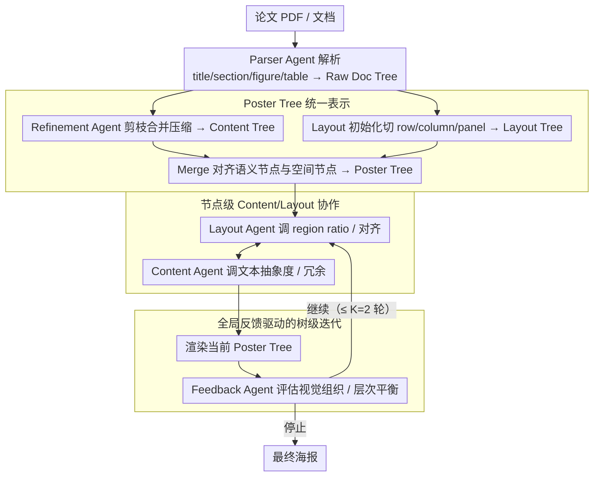

# PosterForest: Hierarchical Multi-Agent Collaboration for Scientific Poster Generation

**会议**: ACL2026  
**arXiv**: [2508.21720](https://arxiv.org/abs/2508.21720)  
**代码**: https://github.com/kaist-cvml/poster-forest  
**领域**: nlp_generation  
**关键词**: 科学海报生成、层次文档理解、多智能体协作、布局规划、Poster Tree

## 一句话总结
PosterForest 用一个同时编码论文层次语义和海报空间布局的 Poster Tree 作为中间表示，再让 Content Agent、Layout Agent 和 Feedback Agent 递归协同优化，训练-free 地生成科学海报，并在人评中获得 59.2% overall preference，明显优于 P2P 和 Paper2Poster。

## 研究背景与动机
**领域现状**：科学论文越来越长，结构越来越复杂，海报是快速传播技术内容的重要媒介。早期自动海报生成方法多依赖规则抽取和启发式排版，近年的 P2P、Paper2Poster 等方法引入 LLM/MLLM 多 agent pipeline，能完成解析、摘要、布局和渲染。

**现有痛点**：现有 SPG 方法常把论文看成线性文本或固定 section-to-panel 映射，缺少对 section、subsection、paragraph、figure/table 引用关系的层次建模。内容和布局也经常分开优化：先确定 panel，再塞文本和图，导致表格放错章节、段落过长、图片过大或过小、逻辑流断裂。

**核心矛盾**：科学海报生成既要压缩信息，又不能破坏论文逻辑；既要视觉平衡，又不能丢掉关键实验图表。单一 agent 或顺序 pipeline 很难同时处理 content fidelity、layout efficiency 和 visual coherence 这几个互相牵制的目标。

**本文目标**：作者希望构建一个不需要额外训练、能保留论文层次结构并联合优化内容与布局的框架，让自动生成的海报既信息完整，又有清晰视觉组织。

**切入角度**：论文提出 Poster Tree 作为统一中间表示：每个节点既有语义属性，也有空间属性；树结构从论文层次继承而来，又被布局树映射到海报 canvas。这样 agent 修改一个节点时，可以看到父节点约束、子节点内容和全局反馈。

**核心 idea**：把科学海报生成从“线性摘要后排版”改成“在层次语义-空间树上递归协同优化”。

## 方法详解
PosterForest 的核心是先造树，再改树。它不直接让 LLM 一口气输出 HTML 或图片，而是先把论文解析为 Raw Doc Tree，再经过 pruning、merging 和 asset matching 得到 Content Tree；随后根据内容层次初始化 Layout Tree，并把二者合并为 Poster Tree。最后，多 agent 在树上做局部和全局两层 refinement，直到得到最终海报。

### 整体框架
输入是一篇论文 PDF 或文档。Parser Agent 先抽取 title、section、subsection、paragraph、figure、table 等节点，形成 Raw Doc Tree。MLLM 作为 Refinement Agent 对这棵树剪枝、合并冗余节点、压缩长文本，并保留和图表的引用关系，得到 Content Tree。Layout initialization 根据内容统计把 canvas 分成 row/column/panel 层次，得到 Layout Tree。Merge 操作把语义节点和空间节点对齐，形成 Poster Tree。之后系统以最多 `K=2` 轮树级迭代进行 refined rendering。

### 关键设计

**1. Poster Tree 统一表示：把"显示什么"和"放在哪里"编码进同一棵层次树**

海报错误常常源自内容结构和空间结构脱节——先定 panel 再塞文本，结果表格放错章节、段落溢出、图片尺度失衡。PosterForest 把两套结构合进一棵树。Raw Doc Tree 记录论文原始层次；Content Tree 保留精简后的语义节点 $c=(t,s)$，其中 $t$ 是 paragraph/figure/table 等类型、$s$ 是摘要文本、caption 或视觉资产；Layout Tree 记空间节点 $l=(r,x)$，其中 $r$ 是 row/column/panel 类型、$x$ 是位置、宽高、比例等属性。Merge 操作把语义节点和空间节点对齐成 Poster Tree，使每个海报节点同时带着内容和布局。

这样系统既知道"这张结果表属于 Experiments 子树"，又知道它当前占着哪个 panel，从源头堵住错放和截断——agent 改一个节点时，父约束、子内容和空间位置都在同一个对象里可见。

**2. 节点级 Content/Layout 协作：让两个专职 agent 在同一棵树上联动调文本密度和空间比例**

只改内容会让版面失衡，只改布局又会让文本溢出、图片尺度不合适。PosterForest 让 Content Agent 和 Layout Agent 在 Poster Tree 上从 root 到 leaves 遍历、各管一摊但共享上下文。Layout Agent 优化 layout node 的 region ratio、对齐和空间分布，输入是当前节点、更新后的父节点信息和后代信息；Content Agent 调整 content node 的文本抽象程度和冗余，输入是父 layout 约束和相关后代的 layout context。两者的更新可写成

$$l_i^{t+1}=A_\text{layout}(l_i^t,\, P(l_i^t),\, D(l_i^t)),\qquad c_i^{t+1}=A_\text{content}(c_i^t,\, P(c_i^t),\, D(P(c_i^t)))$$

因为读写的是同一棵树，文本压缩和空间分配被绑在一起联动：内容一变窄，布局立刻能据父子约束重排，避免了"先摘要后排版"那种两头各自最优、合起来失衡的老问题。

**3. 全局反馈驱动的树级迭代：给局部修改套一道整体审美的复核闸门**

逐节点优化的盲区是看不到全局——每个节点局部合理，整张海报却可能拥挤、割裂或重点不突出。每完成一轮 node-level 遍历，系统就渲染当前 Poster Tree，交给 MLLM Feedback Agent 从视觉组织、文本结构、层次平衡等维度评估，输出结构化的全局反馈和一个"是否继续迭代"的二值信号。若继续，下一轮遍历会带着这份全局反馈更新；否则当前树即为最终海报。整个过程最多迭代 $K=2$ 轮。

Feedback Agent 在这里扮演的是海报审稿人的角色，把"局部正确但整体失衡"的版面拦下来重排，让递归优化收敛到既信息完整又视觉协调的结果。

### 一个完整示例：一篇论文如何长成一张海报

给定一篇 CVPR 论文的 PDF，Parser Agent 先抽出 title、各级 section/subsection、paragraph、figure、table，搭成 Raw Doc Tree。MLLM Refinement Agent 对它剪枝合并：删掉冗余的 related work 段落、把过长的方法描述压成摘要、同时保住每个结果表和它所属章节的引用关系，得到 Content Tree。Layout initialization 按内容统计把 canvas 切成 row/column/panel，形成 Layout Tree，再 merge 成 Poster Tree。进入第 1 轮树遍历：Layout Agent 发现 Experiments 那一栏挤了两张大表，调小 region ratio 并重排对齐；Content Agent 同步把对应段落的文字再抽象一层，避免 panel 溢出。渲染后 Feedback Agent 复核，指出方法图偏小、整体右重左轻，给出全局反馈并判定继续。第 2 轮带着反馈再走一遍遍历，放大方法图、平衡左右密度；这次 Feedback Agent 判定视觉质量稳定，输出二值信号停止，当前 Poster Tree 即为最终海报。

### 损失函数 / 训练策略
PosterForest 是 training-free 框架，没有梯度训练目标。它依赖 Docling/MLLM/API 完成解析、摘要、评价和渲染，主要“优化”来自 prompt 驱动的迭代修改。实验使用 GPT-4o 框架保证不同方法的底座一致；为了避免颜色和字体干扰评价，作者统一了海报配色和字体。树级最大迭代数设为 `K=2`，作者认为一轮额外 refinement 已能得到稳定视觉质量。

## 实验关键数据

### 主实验
定量评价使用 Paper2Poster benchmark 的 100 个 paper-poster pairs；定性和用户研究额外收集 15 个来自 NeurIPS、CVPR、ACL 等 AI 会议的 paper-poster pairs。MLLM-as-a-Judge 从 element quality、layout balance、engagement、clarity、content completeness、logical flow 六个维度打 1-5 分。

| 方法 | Training-free | Aesthetic Avg.↑ | Information Avg.↑ | Overall↑ | 主要观察 |
|------|---------------|-----------------|-------------------|----------|----------|
| Original Paper | - | 3.58 | 4.22 | 3.90 | 内容最完整但不是海报形式 |
| GT Poster | - | 3.56 | 3.98 | 3.77 | 人工海报质量上界之一 |
| 4o-HTML | 是 | 3.36 | 3.68 | 3.52 | 端到端 HTML 可用但结构一般 |
| P2P-4o | 否 | 3.91 | 3.94 | 3.72 | aesthetic 较强，信息流仍有限 |
| PosterAgent-4o | 否 | 3.58 | 3.86 | 3.72 | 专用 agent baseline 稳定 |
| PosterForest-Qwen | 是 | 3.62 | 3.82 | 3.72 | 开源底座下与强 baseline 接近 |
| PosterForest-4o | 是 | 3.65 | 3.87 | 3.76 | training-free 方法中整体最好，接近 GT |

人类评价更明显偏向 PosterForest。25 名 AI 研究生参与，10 组海报、40 个选择题，分别评估内容忠实、审美、结构清晰和整体质量。

| 方法 | Content preference↑ | Esthetics preference↑ | Structure preference↑ | Overall preference↑ |
|------|---------------------|-----------------------|------------------------|---------------------|
| 4o-HTML | 2.0% | 1.6% | 2.4% | 1.6% |
| P2P | 9.2% | 21.2% | 13.2% | 12.0% |
| Paper2Poster | 32.8% | 24.0% | 24.8% | 27.2% |
| PosterForest | 56.0% | 53.2% | 59.6% | 59.2% |

### 消融实验
论文的消融围绕两点：是否使用 hierarchical Content Tree，以及 Content Agent/Layout Agent 是否同时启用。虽然表格主要以图示呈现，但结论非常清楚：树结构负责逻辑与空间对齐，双 agent 负责同时解决冗余和版面平衡。

| 配置 | 关键现象 | 说明 |
|------|----------|------|
| w/o Hierarchical Content Tree | section/subsection 容易乱序或混放 | 结果表可能被放到 Introduction，图文对应弱 |
| w/ Hierarchical Content Tree | logical order 和 spatial coherence 更好 | 相关内容被同组展示，读者路径更清楚 |
| Only Content Agent | 冗余减少，文本更适配 panel | 但 panel 布局仍可能不平衡 |
| Only Layout Agent | 空间组织更整齐 | 缺少文本调整时仍有图像尺度和文字溢出问题 |
| Both Agents | 冗余、密度和布局同时改善 | 生成海报信息密度合适、视觉更和谐 |

### 关键发现
- PosterForest 最大优势不是单个分数大幅领先，而是在人类评价中显著更受偏好，说明结构清晰和信息完整对真实读者更重要。
- MLLM judge 的 overall 差距相对小，但 human preference 差距大，提示自动评审仍难完全捕捉海报的阅读体验。
- 层次结构对科学文档特别关键：没有 hierarchy，模型容易把实验表、方法图、结论文字错配到不合适 panel。
- training-free 是实用亮点：不用为每个领域训练指令模型或布局回归器，便于快速部署到新论文类型。

## 亮点与洞察
- Poster Tree 是一个很自然但有效的中间表示。科学海报本来就是树状信息压缩加二维布局映射，把这两个视角合并后，agent 的修改有了清晰操作对象。
- 多 agent 不是为了堆复杂度，而是对应真实设计流程中的不同角色：内容编辑、版式设计和整体审稿。这个 role decomposition 与任务结构匹配，所以比泛泛“多个 agent 讨论”更有说服力。
- training-free 的价值被低估了。对于学术海报这类样式、领域和数据分布变化很快的任务，少一个训练环节就少很多维护成本。
- 论文将 visual harmony 和 content fidelity 放在同一优化循环里，而不是先摘要后排版。这个思路可以迁移到 slides、technical reports、interactive paper cards 等文档生成任务。

## 局限与展望
- 生成海报的内容密度仍不一定最优，可能存在空间利用不足或局部信息过少的问题。
- 量化评价仍依赖 GPT-4o judge，人类偏好和 MLLM 分数存在差异，说明海报质量评测还缺少更稳健的 metric。
- 方法依赖 parser 和 asset matching 的准确性；如果原论文图表过多、引用关系复杂或 PDF 解析失败，Poster Tree 会从源头带错。
- 目前视觉设计统一字体和配色，减少了评价干扰，但也限制了真实海报的品牌风格、会议模板和设计多样性。
- Feedback Agent 只给有限轮次的全局反馈，尚未建模更细粒度的人类设计偏好，例如视觉焦点、阅读动线、figure-caption 距离和 audience-specific emphasis。

## 相关工作与启发
- **vs P2P**: P2P 依赖 instruction tuning 增强 pipeline 协作；PosterForest 不训练，而是通过树结构和 agent 迭代把层次信息注入生成过程。
- **vs Paper2Poster**: Paper2Poster 有 parser/planner/painter-commenter 等模块，但更偏顺序处理；PosterForest 强调 content/layout 在统一树上的联合修改。
- **vs 通用 GPT-4o-HTML**: 端到端 HTML 生成省事，但容易忽略科学文档结构；PosterForest 用显式中间表示换取可控性。
- **对文档生成的启发**: 对 slides、poster、图文摘要和知识卡片生成任务，都可以先构建“语义树 + 布局树”的中间表示，再让专门 agent 做节点级编辑。

## 评分
- 新颖性: ⭐⭐⭐⭐☆ Poster Tree 与层次多 agent 协作的组合很贴合科学海报任务，虽不复杂但很有效。
- 实验充分度: ⭐⭐⭐⭐☆ 有自动评价、人类评价、定性比较和关键消融；但量化消融数字还可以更完整。
- 写作质量: ⭐⭐⭐⭐☆ 图示清楚，方法流程容易理解；部分 baseline 命名和表格细节需要读者对应上下文。
- 价值: ⭐⭐⭐⭐☆ 对科学传播和文档自动排版非常实用，尤其适合训练-free 的研究工具场景。

<!-- RELATED:START -->

## 相关论文

- [\[ACL 2026\] EvoSci: A Bio-Inspired Multi-Agent Framework for the Evolution of Scientific Discovery](evosci_a_bio-inspired_multi-agent_framework_for_the_evolution_of_scientific_disc.md)
- [\[ACL 2026\] ConSensus: Multi-Agent Collaboration for Multimodal Sensing](consensus_multi-agent_collaboration_for_multimodal_sensing.md)
- [\[ACL 2026\] RoadMapper: A Multi-Agent System for Roadmap Generation of Solving Complex Research Problems](roadmapper_a_multi-agent_system_for_roadmap_generation_of_solving_complex_resear.md)
- [\[ICLR 2026\] HAMLET: A Hierarchical and Adaptive Multi-Agent Framework for Live Embodied Theatre](../../ICLR2026/multi_agent/hamlet_a_hierarchical_and_adaptive_multi-agent_framework_for_live_embodied_theat.md)
- [\[ACL 2026\] A Multi-Agent Framework for Feature-Constrained Difficulty Control in Reading Comprehension Item Generation](a_multi-agent_framework_for_feature-constrained_difficulty_control_in_reading_co.md)

<!-- RELATED:END -->
