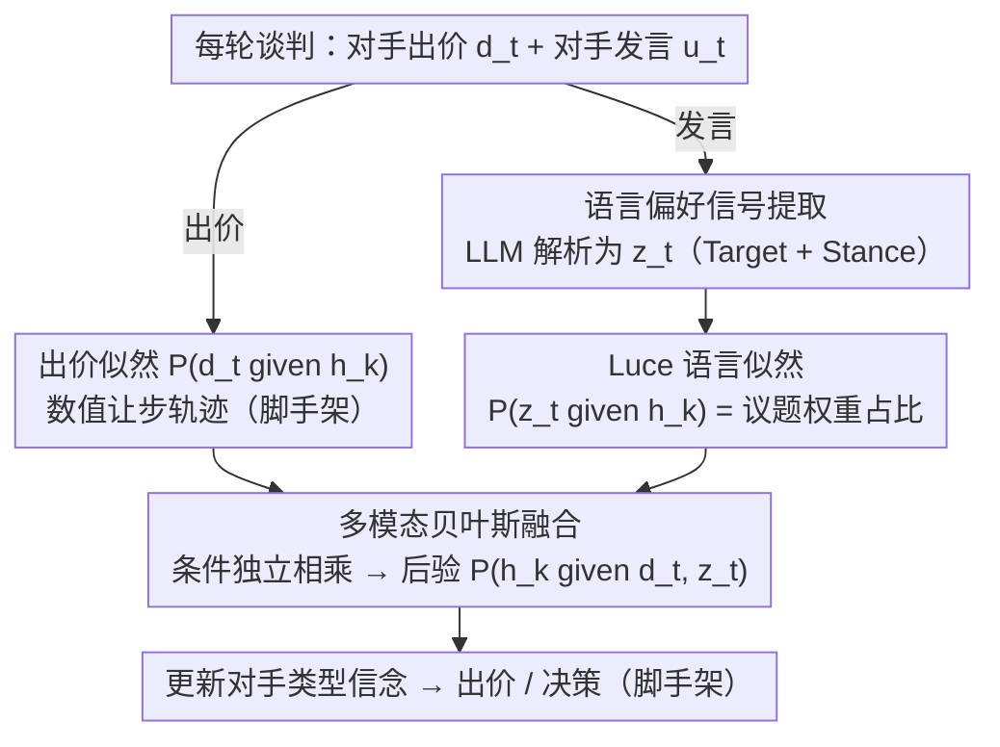

<!-- 由 src/gen_stubs.py 自动生成 -->
# Preference Estimation via Opponent Modeling in Multi-Agent Negotiation

**会议**: ACL 2026 Findings  
**arXiv**: [2604.15687](https://arxiv.org/abs/2604.15687)  
**代码**: 无  
**领域**: 视频理解  
**关键词**: 对手建模, 贝叶斯推理, 偏好估计, 多方谈判, LLM语言信号

## 一句话总结

提出将 LLM 提取的自然语言偏好信号与贝叶斯对手建模框架结合的偏好估计方法，在多方多议题谈判中通过语言似然函数融合定性线索和定量出价信息，将完全达成协议率从 37% 提升至 62%。

## 研究背景与动机

**领域现状**：自动化谈判在多方多议题场景中严重依赖准确的对手建模。传统方法基于 BOA 架构，通过贝叶斯学习从数值出价历史估计对手效用函数。

**现有痛点**：(1) 纯数值方法无法捕捉自然语言对话中的定性偏好信息，导致信息不完整；(2) LLM 虽能理解语义，但直接用 LLM 推理偏好缺乏战略一致性，在长时间谈判中不稳定；(3) 随着信息量增加，LLM 推理复杂度指数级增长。

**核心矛盾**：语言中的丰富定性信息（如"议题A对我更重要"）无法被传统数值模型利用，而 LLM 缺乏结构化的信念更新机制。

**本文目标**：设计一种将语言信号整合到结构化贝叶斯框架中的偏好估计方法，兼具语义理解和概率推理。

**切入角度**：用 LLM 从发言中提取结构化偏好信号（目标议题/选项 + 态度），然后通过 Luce 选择公理将其转化为概率似然函数，与出价似然融合进行贝叶斯更新。

**核心 idea**：语言似然 × 出价似然 → 贝叶斯后验更新，将定性和定量信息统一在概率框架中。

## 方法详解

### 整体框架

传统 BOA 架构只盯着对手的数值出价历史去反推效用函数，把对话里那句"议题 A 对我更重要"白白浪费掉。本文的做法是让贝叶斯框架同时吃进两路证据：每一轮谈判中，代理既收到对手的出价 $d_t$，也收到对手的发言 $u_t$；出价照旧走数值似然，发言则先被 LLM 解析成一个结构化的偏好信号 $z_t$，再转成语言似然。两路似然在同一个假设空间 $\{h_k\}$ 上相乘，更新后验 $P(h_k \mid d_t, z_t)$。LLM 只负责"读懂语义并结构化"，真正的信念更新留给概率框架，从而既拿到语言的丰富信息，又不被 LLM 推理的不稳定性拖累。

### 关键设计

**1. 语言偏好信号提取：把一句话翻译成可计算的结构化信号，而不是让 LLM 直接报数值**

直接让 LLM 输出对手效用的数值估计，在长谈判里会越漂越离谱、缺乏战略一致性。本文因此把 LLM 的职责收窄到一件它擅长的事：把发言 $u_t$ 解析成信号 $z_t$，只包含两个属性——Target（指向某个议题/选项，或两个议题/选项之间的比较）和 Stance（偏好、反对等态度）。这样 LLM 输出的是离散、可枚举的语义标签，而不是一个需要它"算"出来的连续值，后续所有概率运算都建立在这个干净的结构化输入之上。

**2. 基于 Luce 选择公理的语言似然：用经典选择模型把偏好标签换算成假设空间上的概率**

拿到信号 $z_t$ 之后，还得回答"如果对手真是假设 $h_k$ 那种类型，他说出这句话的概率有多大"。本文借用选择理论里的 Luce 选择公理来填这个空：对"偏好议题 $i_x$"这类信号，似然就是该议题在 $h_k$ 下的权重占总权重的比例

$$P(z_t \mid h_k) = \frac{w_x^{(k)}}{\sum_m w_m^{(k)}},$$

比较类信号（$i_x$ 比 $i_y$ 更重要）和反对类信号按同样的相对权重思路构造。Luce 公理的好处是它本身就是把一组评估值映射成选择概率的标准模型，权重越高的议题被"挑出来表态"的概率越大，语言线索到似然函数的转换因此有了现成的理论支撑，不用临时拍一个打分规则。

**3. 多模态贝叶斯融合：假设出价与语言条件独立，让两路互补证据在后验里相乘**

出价透露的是定量的让步轨迹，语言透露的是定性的优先级，两者本来各说各话。本文用一个朴素贝叶斯假设把它们接起来——认定出价 $d_t$ 与语言信号 $z_t$ 在给定假设下条件独立，于是后验正比于两路似然与先验之积

$$P(h_k \mid d_t, z_t) \propto P(d_t \mid h_k)\cdot P(z_t \mid h_k)\cdot P(h_k).$$

条件独立显然是简化，但它让融合变成一次乘法、计算可行；而且出价和语言确实承载互补信息，一路把另一路没覆盖的维度补上，实验里 MSE 从仅用出价的 189 降到 159 正是这种互补的体现。

### 损失函数 / 训练策略

无模型训练，底层直接用 GPT-4.1 充当发言解析器，贝叶斯更新全程在线进行。

## 实验关键数据

### 主实验

6 方 5 议题体育设施建设谈判场景（500 次实验取平均）：

| 方法 | FAR（全员同意率） | PAR（部分同意率） | LAR（潜在同意率） |
|------|-----------------|-----------------|-----------------|
| Base-LLM | 0.37 | 0.76 | 0.97 |
| Base-OM (all) | 0.56 | 0.92 | 0.99 |
| LLM-PE (all) | 0.32 | 0.69 | 0.93 |
| **Proposed (all)** | **0.62** | **0.89** | **0.98** |

### 消融实验

| 方法 | 偏好估计 MSE (Avg) | 说明 |
|------|-------------------|------|
| Proposed | **159** | 语言+数值融合 |
| Base-OM | 189 | 仅数值出价 |
| LLM-PE | 163 | LLM直接推理 |

### 关键发现

- 相互建模（all）比单方建模（p1）提升显著（FAR 0.46→0.62），说明多方协同效应
- LLM-PE 直接推理反而不如纯数值方法（FAR 0.32 < 0.56），验证了结构化框架的必要性
- 语言信号融合使 MSE 从 189 降至 159，估计更准确且分布更均衡

## 亮点与洞察

- **"LLM 提取 + 贝叶斯推理"的混合范式**非常有启发——利用 LLM 的语义能力但不依赖其推理一致性，用数学框架保证结构化更新
- **Luce 选择公理的巧妙应用**——将偏好权重自然映射为选择概率，为语言信号到似然函数的转换提供了理论支撑

## 局限与展望

- 假设对手发言真诚，未考虑欺骗/虚张声势
- 仅在单一场景下验证，多样场景泛化性待测
- 假设空间随议题数增长呈阶乘增长，需要近似算法

## 相关工作与启发

- **vs Base-LLM**: 纯 LLM 谈判缺乏结构化偏好追踪，在长时间谈判中策略不一致
- **vs LLM-PE**: LLM 直接推理数值偏好不可靠（FAR 仅 0.32），需要概率框架约束

## 评分

- 新颖性: ⭐⭐⭐⭐ 语言信号 + 贝叶斯框架的融合思路新颖
- 实验充分度: ⭐⭐⭐ 仅单一场景500次实验，场景多样性不足
- 写作质量: ⭐⭐⭐⭐ 形式化清晰，图示直观
- 价值: ⭐⭐⭐⭐ 为 LLM 在结构化决策中的应用提供了有价值的范式

<!-- RELATED:START -->

## 相关论文

- [\[NeurIPS 2025\] MetaMind: Modeling Human Social Thoughts with Metacognitive Multi-Agent Systems](../../NeurIPS2025/multi_agent/metamind_modeling_human_social_thoughts_with_metacognitive_multi-agent_systems.md)
- [\[ACL 2026\] Towards Self-Improving Error Diagnosis in Multi-Agent Systems](towards_self-improving_error_diagnosis_in_multi-agent_systems.md)
- [\[ACL 2026\] MATA: Multi-Agent Framework for Reliable and Flexible Table Question Answering](mata_multi-agent_framework_for_reliable_and_flexible_table_question_answering.md)
- [\[ACL 2026\] MAGEO: From Experience to Skill — Multi-Agent Generative Engine Optimization via Reusable Strategy Learning](from_experience_to_skill_multi-agent_generative_engine_optimization_via_reusable.md)
- [\[ACL 2026\] Collaborative Multi-Agent Scripts Generation for Enhancing Imperfect-Information Reasoning in Murder Mystery Games](collaborative_multi-agent_scripts_generation_for_enhancing_imperfect-information.md)

<!-- RELATED:END -->
