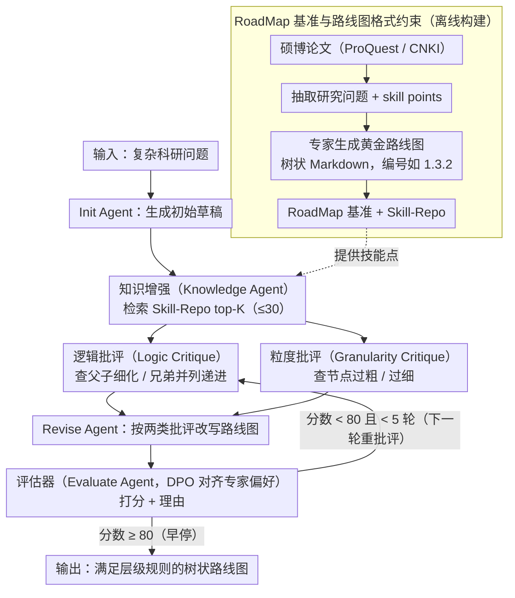

# RoadMapper: A Multi-Agent System for Roadmap Generation of Solving Complex Research Problems

**会议**: ACL2026  
**arXiv**: [2604.27616](https://arxiv.org/abs/2604.27616)  
**代码**: https://github.com/BUPT-Reasoning-Lab/RoadMapper  
**领域**: LLM评测 / 多智能体系统 / 科研辅助  
**关键词**: 研究路线图生成, 多智能体, DPO评估器, 结构化内容生成, RoadMap基准

## 一句话总结
本文提出 RoadMap 研究路线图生成基准和 RoadMapper 多智能体系统，用知识检索、逻辑/粒度批评、修订与 DPO 评估器组成闭环，在中英文复杂科研问题上比直接提示平均提升约 7-9 分，并显著降低专家设计路线图的时间成本。

## 研究背景与动机
**领域现状**：科研人员常用表格、流程图、知识图谱或思维导图来组织复杂知识，但这些结构化内容多服务于信息展示，而不是把一个研究问题拆成可执行、层次清晰的解决路线。现有 LLM 可以写方案、列步骤，也可以做长文本问答，但针对“如何一步步解决复杂研究问题”的路线图生成还缺少专门任务定义和评价基准。

**现有痛点**：人工路线图需要专家查阅大量专业知识并反复修改，成本高、周期长；直接让 LLM 生成路线图时，又容易出现三个问题：专业知识不足、任务分解不合理、节点之间逻辑关系混乱。尤其在科研场景中，路线图不是普通清单，而是要兼顾知识深度、知识广度、执行顺序和关键步骤覆盖。

**核心矛盾**：路线图生成既要求像专家一样掌握领域知识，又要求像项目管理一样保持结构一致和逻辑递进。单次提示很难同时处理知识补全、层次拆解、逻辑校验、粒度控制和停止判断，因此需要把复杂生成过程拆成多个可协作的子角色。

**本文目标**：作者首先定义研究路线图生成任务，并构建 RoadMap 基准；然后基于该基准设计 RoadMapper，让 LLM 在知识增强后进入“批评-修订-评估”的迭代闭环；最后用自动指标、消融和专家评价验证路线图质量与效率。

**切入角度**：论文观察到高质量路线图往往来自专家对研究生论文的抽象：论文天然包含研究问题、关键技术和解决路径。因此作者从硕博论文中抽取研究问题与 skill points，再由专家引导生成黄金路线图，形成兼具专业深度和结构约束的数据来源。

**核心 idea**：用多智能体把路线图生成拆成“初稿、知识增强、逻辑批评、粒度批评、修订、评估”六个角色，并用 DPO 训练评估器学习专家偏好，从而让系统在有限迭代内生成更像专家路线图的结构化答案。

## 方法详解
RoadMapper 的关键不是简单套一个 agent 框架，而是把“研究路线图”先形式化成可检验的树状 Markdown，再围绕这个格式设计数据、检索、评估和迭代机制。整个流程可以看成两层：离线层构建 RoadMap 和 Skill-Repo，在线层用 RoadMapper 对新研究问题生成路线图。

### 整体框架
输入是一个复杂科研问题，输出是一个满足 Markdown 层级规则的树状路线图。系统先由 Init Agent 生成初始草稿，再由 Knowledge Agent 从 Skill-Repo 检索相关技能点并补充路线图。随后进入最多 5 轮迭代：Logic Critique Agent 检查父子与兄弟节点逻辑，Granularity Critique Agent 检查节点是否过粗或过细，Revise Agent 根据两类批评意见改写路线图，Evaluate Agent 判断是否达到通过标准。若评估器给出接受结果，则提前停止；否则继续下一轮。

RoadMap 基准来自 ProQuest 和 CNKI 的硕博论文。作者按发表时间、作者身份和高校实力筛选论文，用 Gemini 2.5 Flash 抽取核心研究问题和 skill points，再由专家结合领域知识和模型草稿生成黄金路线图。最终数据包含 1,705 个黄金路线图、8,436 个 skill points、10 个研究领域和 5 种研究类型，且覆盖中英文。

### 关键设计
**1. RoadMap 基准与路线图格式约束：先把"科研路线图"钉成可评价的树状结构，任务才立得住**

如果不给强格式约束，模型很容易把路线图写成一份普通建议清单，结构好坏根本没法比较。本文因此规定每个路线图都用 Markdown 树表示：每行带层级、编号和标题，编号要满足类似 `1.3.2` 的层次关系，父子之间是细化、兄弟之间是并列或递进。这套格式不是为了好看——它让 DegreeScore（出度）、DepthScore（深度）这类结构指标变得可计算，评价时既看文本内容，也看深度、出度和关键步骤覆盖。基准数据本身则来自 ProQuest 和 CNKI 的硕博论文：作者按发表时间、作者身份和高校实力筛论文，用 Gemini 2.5 Flash 抽出核心研究问题和 skill points，再由专家结合领域知识和模型草稿生成黄金路线图，最终得到 1,705 个黄金路线图、8,436 个 skill points、覆盖 10 个研究领域、5 种研究类型且中英文兼备。把路线图绑定到论文，是因为一篇硕博论文天然就含"研究问题—关键技术—解决路径"，专业深度和结构约束都现成。

**2. 知识增强与双批评智能体：路线图会犯三种不同的错，就配三种不同视角的诊断**

路线图的典型毛病不是同一回事——专业知识不足、节点逻辑混乱、粒度过粗或过细，根因各异，硬塞给一个批评器只会得到笼统反馈。本文据此把诊断拆开：Knowledge Agent 先按研究问题从 Skill-Repo 检索 top-K 技能点（推理时上限 30 个），把初稿扩成更专业的版本，补的是"知识深度和广度"；Logic Critique Agent 专查父子节点是不是直接细化关系、兄弟节点是不是真并列或递进，盯的是"逻辑";Granularity Critique Agent 专查节点有没有被过度拆分或信息过密，管的是"颗粒度"。逻辑和粒度被刻意拆成两个独立的 critique agent，正是为了让每条反馈都聚焦在一个轴上，而不是混成一句"这里不太好"。

**3. DPO 训练的 Evaluate Agent 与早停闭环：让系统学会"什么时候该收手"，避免越改越多却没更好**

多智能体迭代的老问题是改得停不下来——轮数堆上去，结构反而被过度修订破坏。本文给 Evaluate Agent 装了一个对齐专家偏好的停止判断：先用 Qwen3-32B 生成候选评估，再让 7 名专家投票选出最优和次优评价，构造 818 组偏好对，用 DPO 让评估器偏向专家认可的标准。推理时评估器输出分数与理由，达到阈值 80 就提前停止、否则进下一轮（最多 5 轮）。一个值得注意的细节是负样本选"第二高票"而不是最差候选——因为它离正确答案更近，逼着模型去学最优与次优之间那点细微的专业判断，而不是只会区分明显的好坏。实测下来早停平均只要约 1.64 / 1.51 轮就收敛，相比 ReConcile 省了 36.5% 时间和 45.8% token。

### 一个完整示例：一道科研问题怎么走完闭环

以一道"如何在低资源语言上构建可靠的命名实体识别系统"这类复杂研究问题为例，走一遍 RoadMapper 的在线流程，可以看清这些角色是怎么串起来、状态怎么逐轮收敛的：

1. **Init Agent** 先出一版初始草稿，可能只是粗粒度的几条："收集数据 → 训练模型 → 评估"，结构浅、缺专业步骤。
2. **Knowledge Agent** 拿着研究问题去 Skill-Repo 检索相关技能点（最多 30 个），把"跨语言迁移""数据增强""远程监督"等专业节点补进树里，路线图从清单变得有知识深度。
3. **Logic Critique Agent** 检查节点关系，比如发现"评估"被错挂在"数据收集"下面（父子不是细化关系），给出逻辑批评；**Granularity Critique Agent** 同时指出某个节点把"预处理"和"标注规范"糊成一团、粒度过粗。
4. **Revise Agent** 同时吃下这两类批评，重排父子关系、拆分过粗节点，产出新一版路线图。
5. **Evaluate Agent** 给修订版打分：若结构分数达到阈值 80，闭环提前结束；否则带着理由回到第 3 步再修一轮，最多 5 轮。

得益于早停，这道题平均约 1.6 轮就被判定"够好"而停下，而不会为了凑满 5 轮把已经合理的结构改坏——这正是 DPO 评估器学到的"该收手就收手"。

### 损失函数 / 训练策略
训练只针对 Evaluate Agent。给定专家偏好样本中的优选评价和次优评价，作者采用 DPO，使评估器相对参考模型提高优选输出的概率、降低次优输出概率。负样本特意选“第二高票”而不是最差候选，因为它更接近正确答案，能迫使模型学习细粒度评估标准。推理时，最大迭代轮数设为 5，评估通过分数设为 80，Knowledge Agent 最多检索 30 个 skill points。

## 实验关键数据

### 主实验
论文在 11 个开源和闭源模型上比较 Direct Prompting、Best-of-N、CoT、ReConcile、DyLAN 与 RoadMapper，并使用 StepScore、LogicScore、DegreeScore、DepthScore 与平均分评估。下面摘取最能说明趋势的模型结果。

| 基座模型 | 方法 | 英文Avg | 中文Avg | Overall Avg | 主要结论 |
|--------|------|--------|--------|-------------|----------|
| Llama 3.1 8B | Direct Prompting | 61.24 | 60.01 | 60.62 | 小模型直接生成路线图结构和内容都弱 |
| Llama 3.1 8B | RoadMapper | 67.68 | 67.95 | 67.82 | Overall 提升 7.20 分 |
| Llama 3.3 70B | Direct Prompting | 63.16 | 61.04 | 62.10 | 中文 split 的 StepScore 仅 38.16 |
| Llama 3.3 70B | RoadMapper | 70.69 | 70.20 | 70.45 | 英文提升 7.53，中文提升 9.16 |
| DeepSeek-V3.2 | Direct Prompting | 71.03 | 73.20 | 72.12 | 强模型仍受限于直接提示 |
| DeepSeek-V3.2 | RoadMapper | 79.14 | 80.08 | 79.61 | 英文提升 8.11，中文提升 6.88 |

### 消融实验

| 配置 | StepScore | LogicScore | DegreeScore | DepthScore | Avg. | 说明 |
|------|----------|------------|-------------|------------|------|------|
| w/o Knowledge Agent | 45.44 | 59.60 | 73.11 | 88.76 | 66.73 | 去掉知识增强，StepScore 下降 5.84 |
| w/o Logic Critique Agent | 48.29 | 56.94 | 74.17 | 88.46 | 66.97 | LogicScore 下降最明显 |
| w/o Granularity Critique Agent | 47.51 | 58.74 | 74.80 | 87.37 | 67.11 | 粒度控制缺失会影响整体结构 |
| w/o DPO | 49.83 | 60.20 | 74.67 | 88.25 | 68.24 | DPO 平均贡献约 2.21 分 |
| DPO-14B | 49.77 | 60.69 | 75.30 | 88.87 | 68.66 | 小一些的评估器仍有效但低于 32B |
| RoadMapper | 51.28 | 62.37 | 77.37 | 90.77 | 70.45 | 完整系统四项指标均最高 |

### 关键发现
- Knowledge Agent 对关键步骤覆盖最重要，去掉后 StepScore 从 51.28 降到 45.44，说明路线图不是只靠结构模板就能写好，必须引入专业技能点。
- Logic Critique Agent 对 LogicScore 贡献最大，去掉后 LogicScore 降到 56.94，验证了父子与兄弟关系检查的必要性。
- 早停机制平均只需约 1.64 轮和 1.51 轮迭代，就能达到较好质量；相比 ReConcile，RoadMapper 节省 36.5% 时间和 45.8% token。
- 7 名专家的成对评价显示 GPT-4o mini 与专家有 93% 匹配率，RoadMapper 在 86% 的案例中优于对比方法。

## 亮点与洞察
- 最有价值的贡献是把一个新任务做成了“任务定义 + 基准 + 方法 + 评测指标”的完整闭环。很多 agent 论文只展示系统效果，而这篇先定义了路线图结构和评价维度，使后续研究有可复用的比较对象。
- 双 critique agent 的拆分很实用：逻辑关系和颗粒度是路线图质量的两个不同轴，合并成一个批评器会让反馈变得笼统。这个思路可以迁移到课程大纲生成、实验计划生成和综述大纲生成。
- DPO 评估器选择“第二高票”作为负例很巧妙，因为路线图评价往往不是明显对错，而是细微的专业判断。训练模型区分最优和次优评价，比区分好坏悬殊样本更贴近真实评审。
- 论文没有把多智能体当成纯 prompt engineering，而是围绕评估器早停、知识库检索和结构指标做系统设计，这让方法比普通 round-table agent 更可控。

## 局限与展望
- RoadMap 主要来自硕博论文，质量和专业深度较高，但也可能偏向学位论文的叙事方式；真实科研项目、工业研发和跨学科问题的路线图形态可能不同。
- 内容指标 StepScore 和 LogicScore 依赖 GPT-4o mini 评估，虽然专家匹配率较高，但仍可能继承 LLM judge 的偏好和稳定性问题。
- RoadMapper 的计算成本高于直接提示；早停降低了多轮开销，但复杂系统仍不适合对低价值、短问题批量调用。
- 实验模型覆盖 11 个 LLM，但作者也承认受资源限制没有覆盖所有昂贵模型；未来可研究更小评估器、蒸馏版 RoadMapper 或针对不同领域的轻量工作流。

## 相关工作与启发
- **vs 结构化内容生成**: 早期 text-to-table、mindmap、procedural graph 更偏信息展示，RoadMapper 强调“指导解决问题”的可执行路线图，评价也从表面格式扩展到关键步骤与逻辑关系。
- **vs 普通多智能体讨论**: ReConcile、DyLAN 通过多个 agent 讨论来改进答案，但缺少任务专用的逻辑/粒度分工和专家对齐评估器；RoadMapper 的优势是把 agent 角色绑定到路线图错误类型。
- **vs Long-form QA 评测**: 本文借鉴 LLM-as-judge 评估长答案，但进一步引入结构指标和关键步骤标注，说明复杂生成任务需要内容与结构双重评价。
- **启发**: 对科研辅助系统而言，“生成答案”不一定是最优目标，更有价值的是生成可检查、可迭代、可由专家接管的中间结构。路线图、实验计划和审稿 checklist 都可以沿用这种设计。

## 评分
- 新颖性: ⭐⭐⭐⭐☆ 任务定义和基准很新，多智能体组件本身较常见，但组合得比较贴近科研路线图场景。
- 实验充分度: ⭐⭐⭐⭐☆ 主实验、消融、效率和专家评价较完整，不过自动内容评价仍依赖单一强 judge。
- 写作质量: ⭐⭐⭐⭐☆ 论文结构清楚，数据构建流程和 agent 角色说明充分，表格较多但能支持主张。
- 价值: ⭐⭐⭐⭐⭐ 对科研辅助、教育路线规划和复杂任务分解都有直接启发，RoadMap 基准本身也有后续使用价值。

<!-- RELATED:START -->

## 相关论文

- [\[AAAI 2026\] FinRpt: Dataset, Evaluation System and LLM-based Multi-agent Framework for Equity Research Report Generation](../../AAAI2026/multi_agent/finrpt_dataset_evaluation_system_and_llm-based_multi-agent_framework_for_equity_.md)
- [\[ICML 2026\] EngiAgent: Fully Connected Coordination of LLM Agents for Solving Open-ended Engineering Problems with Feasible Solutions](../../ICML2026/multi_agent/engiagent_fully_connected_coordination_of_llm_agents_for_solving_open-ended_engi.md)
- [\[ACL 2026\] Memory-Augmented LLM-based Multi-Agent System for Automated Feature Generation on Tabular Data](memory-augmented_llm-based_multi-agent_system_for_automated_feature_generation_o.md)
- [\[AAAI 2026\] AgentODRL: A Large Language Model-based Multi-agent System for ODRL Generation](../../AAAI2026/multi_agent/agentodrl_a_large_language_model-based_multi-agent_system_fo.md)
- [\[ACL 2026\] PosterForest: Hierarchical Multi-Agent Collaboration for Scientific Poster Generation](posterforest_hierarchical_multi-agent_collaboration_for_scientific_poster_genera.md)

<!-- RELATED:END -->
