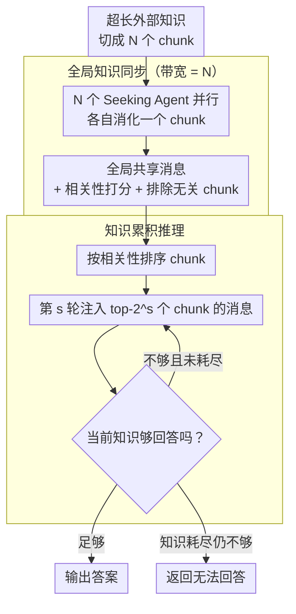

# Scaling External Knowledge Input Beyond Context Windows of LLMs via Multi-Agent Collaboration

**会议**: ACL 2026  
**arXiv**: [2505.21471](https://arxiv.org/abs/2505.21471)  
**代码**: [GitHub](https://github.com/THUNLP-MT/ExtAgents)  
**领域**: LLM Agent  
**关键词**: 上下文窗口扩展, 多智能体协作, 外部知识扩展, 多跳问答, 知识同步

## 一句话总结

提出 ExtAgents 多智能体框架，通过全局知识同步（所有Seeking Agent间交换信息）和知识累积推理（逐步向Reasoning Agent注入筛选后的知识）两个机制，解决现有多智能体方法在扩展外部知识输入超出上下文窗口时性能不升反降的瓶颈，在多跳QA和长综述生成任务上显著提升。

## 研究背景与动机

**领域现状**：随着后训练推理和信息检索技术的进步，LLM在上下文窗口内可整合更多检索知识来解决复杂任务，且更多知识通常带来更好的效果。

**现有痛点**：当外部知识量超出上下文窗口时，直接截断导致信息丢失；RAG受限于排序误差会遗漏关键证据；上下文压缩丢弃细微线索。多智能体分布式方法（如LLM×MapReduce）是新范式，但实验发现它们在知识量增加时性能不升反降。

**核心矛盾**：现有多智能体编排存在两个瓶颈——（1）知识同步带宽小，每个Agent仅能访问邻居的2个消息，需要多轮才能同步全局信息；（2）推理上下文冗余，把所有消息都塞入推理Agent导致信息过载。

**本文目标**：设计一个可扩展的多智能体框架，使任务性能随外部知识输入量持续提升，即使超出上下文窗口。

**切入角度**：简化Agent角色为两类（Seeking + Reasoning），针对两个瓶颈分别设计全局同步和累积推理机制。

**核心idea**：Seeking Agent全局交换并评分chunk相关性（带宽=N），Reasoning Agent通过多轮逐步增加top-k知识进行累积推理，避免一次性信息过载。

## 方法详解

### 整体框架

ExtAgents 要解决的是「外部知识量超出上下文窗口时性能不升反降」这个反常现象。它把超长输入切成 $N$ 个 chunk，每个 chunk 交给一个 Seeking Agent，再把多智能体角色精简成两类。整条流水线先做一轮**全局知识同步**：所有 Seeking Agent 并行消化各自的 chunk、互相共享消息、并给自己负责的 chunk 与查询打相关性分数。随后进入**知识累积推理**：Reasoning Agent 不一次性吞下全部消息，而是按相关性从最高分的 chunk 开始，每轮翻倍注入知识量，边读边判断「现在够不够回答」，直到能给出答案或知识耗尽。因为 Seeking 阶段彼此独立，整个框架高度可并行。

### 关键设计

**1. 全局知识同步（带宽 = N）：让每个 Agent 一步看到全局，而不是层层接力**

现有多智能体编排的第一个瓶颈是同步带宽太小——Chain of Agents 是序列式接力、带宽只有 2，LLM×MapReduce 也只有 $O(L/|m|)$，每个 Agent 只能看到邻居的少数消息，要把全局信息同步开来需要多轮传递，而信息在层层转述中会逐步退化。ExtAgents 让所有 Seeking Agent 的消息在一个全局空间里共享，带宽直接等于 Agent 数 $N$：每个 Agent 消化自己负责的本地 chunk，同时对它与查询的相关性打分，还可以顺手把明显无关的 chunk 标记排除。这样真正的全局信息交换一轮就完成，省掉了多轮接力带来的退化。

**2. 知识累积推理：按相关性逐步加码，避免一次性信息过载**

第二个瓶颈是推理上下文冗余——像 LLM×MapReduce 那样把所有消息一股脑塞给推理 Agent，关键证据反而会被大量无关内容淹没。ExtAgents 让 Reasoning Agent 按相关性排序逐步接收 chunk：第 $s$ 轮只读 top-$2^s$ 个 chunk 的消息（第 0 轮 1 个、第 1 轮 2 个、第 2 轮 4 个……），每轮推理完判断当前知识是否足以回答，不够就翻倍扩展继续读，足够就停下，最终输出答案或显式给出「无法回答」。这种渐进注入让推理 Agent 在每一轮都聚焦在当前最相关的少量信息上，不必在第一时间消化全部噪声。

**3. ∞Bench+ 增强基准：剔除「截断也能答对」的样本，让评测真正考验长上下文**

作者发现原始 ∞Bench 里有大量问题其实只需扫描 8k token 窗口就能回答，根本测不出跨文档聚合能力，会让简单截断方法虚高、掩盖真正的瓶颈。∞Bench+ 把这类「8k 窗口内可答」的样本过滤掉，只保留真正需要跨文档信息聚合的多跳问题：En.QA 从 351 个样本筛到 157 个、再补上大文档样本共 294 个；Zh.QA 从 189 个筛到 56 个、补足后共 184 个。基准本身的这次净化，是后面「只有 ExtAgents 随知识量持续涨分」结论可信的前提。

### 一个例子：256k 知识下的一次累积推理

设输入约 256k token、切成 8 个 chunk，对应 8 个 Seeking Agent。全局同步阶段，8 个 Agent 并行读各自 chunk、互相共享消息，并对自己的 chunk 打出相关性分数，假设排序后第 3、第 6 号 chunk 最相关。进入累积推理：Reasoning Agent 第 0 轮只读 top-1（第 3 号），判断证据不足；第 1 轮扩到 top-2（再加第 6 号），两段证据拼起来已能完成多跳推理，于是直接给出答案，剩下 6 个 chunk 的冗余信息根本没进推理上下文。如果到知识耗尽仍拼不出答案，框架就如实返回「无法回答」，而不是强行编造。

## 实验关键数据

### 主实验（∞Bench+ En.QA, gpt-4o-mini）

| 方法 | 8k input | 32k input | 128k input | 256k+ input |
|------|---------|----------|-----------|------------|
| 截断 | ~30 | ~35 | ~38 | N/A |
| LLM×MapReduce | ~32 | ~33 | ~34 | ~32 |
| ExtAgents | ~33 | ~38 | ~43 | **~46** |

### 关键发现
- ExtAgents是唯一在知识量增加时性能持续提升的方法，即使超出128k上下文窗口
- LLM×MapReduce在超出上下文窗口后性能反而低于截断，暴露了瓶颈
- ExtAgents在HotpotQA（大知识库多跳QA）上同样有效，验证泛化性
- 在长综述生成任务上也展现优势
- 高并行性保证了效率——Seeking Agent完全可并行

## 亮点与洞察
- **问题定义清晰有价值**：首次明确提出"扩展外部知识输入超出上下文窗口"的问题并构建评测框架
- **瓶颈分析精准**：将现有方法的失败归因到同步带宽和推理冗余两个具体瓶颈
- **设计简洁有效**：仅两类Agent + 两个机制，易于理解和实现
- **∞Bench+的构建有独立价值**：消除了现有长上下文基准的测量偏差

## 局限与展望
- **依赖LLM API**：需要多次调用LLM，成本较高
- **chunk分割策略简单**：仅用简单分割，未探索更智能的语义分块
- **评测覆盖有限**：主要在QA和综述生成上验证，其他长上下文任务未测试
- 未来方向：更智能的chunk策略、与RAG结合、后训练Agent协作能力

## 相关工作与启发
- **vs LLM×MapReduce**：SOTA多智能体方法但在扩展知识时性能不升反降；ExtAgents通过全局同步和累积推理克服
- **vs Chain of Agents**：带宽=2的序列式方法，扩展性差
- **vs RAG**：受限于检索排序误差，不能保证关键证据被选中

## 评分
- 新颖性: ⭐⭐⭐⭐ 问题定义有价值，全局同步+累积推理的双重设计针对性强
- 实验充分度: ⭐⭐⭐⭐ 多任务多模型验证，有∞Bench+构建和效率分析
- 写作质量: ⭐⭐⭐⭐ 形式化定义清晰，瓶颈分析系统
- 价值: ⭐⭐⭐⭐ 为LLM超长上下文推理提供了实用的无训练方案

<!-- RELATED:START -->

## 相关论文

- [\[AAAI 2026\] KDR-Agent: A Multi-Agent LLM Framework for Multi-Domain Low-Resource In-Context NER via Knowledge Retrieval](../../AAAI2026/multi_agent/a_multi-agent_llm_framework_for_multi-domain_low-resource_in-context_ner_via_kno.md)
- [\[ACL 2026\] Multi-Agent Reasoning Improves Compute Efficiency: Pareto-Optimal Test-Time Scaling](multi-agent_reasoning_improves_compute_efficiency_pareto-optimal_test-time_scali.md)
- [\[ACL 2025\] Beyond Frameworks: Unpacking Collaboration Strategies in Multi-Agent Systems](../../ACL2025/multi_agent/beyond_frameworks_multi_agent_collaboration.md)
- [\[ACL 2026\] ConSensus: Multi-Agent Collaboration for Multimodal Sensing](consensus_multi-agent_collaboration_for_multimodal_sensing.md)
- [\[ACL 2026\] PosterForest: Hierarchical Multi-Agent Collaboration for Scientific Poster Generation](posterforest_hierarchical_multi-agent_collaboration_for_scientific_poster_genera.md)

<!-- RELATED:END -->
